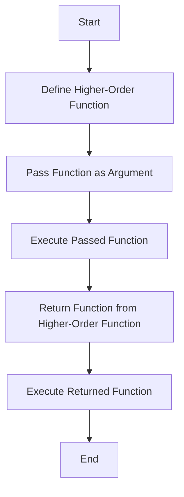

## 7.3. Higher-Order Functions

In the realm of functional programming, higher-order functions (HOFs) are a fundamental concept that elevates the way we think about and write code. By treating functions as first-class citizens, we gain the ability to pass functions as arguments, return them from other functions, and store them in data structures. This flexibility leads to more expressive, modular, and reusable code. In this section, we will delve deep into higher-order functions, exploring their mechanics, benefits, and practical applications.

### Functions as First-Class Citizens

Before we dive into higher-order functions, it's crucial to understand what it means for functions to be first-class citizens. In programming languages where functions are first-class citizens, they can be:

- **Assigned to variables**: Just like any other data type, functions can be assigned to variables.
- **Passed as arguments**: Functions can be passed as parameters to other functions.
- **Returned from functions**: Functions can return other functions as their result.
- **Stored in data structures**: Functions can be stored in arrays, lists, or any other data structure.

This concept is pivotal in functional programming, as it allows for the creation of more abstract and flexible code structures.

### Understanding Higher-Order Functions

A higher-order function is a function that either takes one or more functions as arguments or returns a function as its result. This capability allows developers to create more abstract and reusable code. Let's break down the two main aspects of higher-order functions:

#### Passing Functions as Arguments

One of the most common uses of higher-order functions is passing functions as arguments. This allows for the creation of generic functions that can operate on a variety of behaviors. Consider the following pseudocode example:

```pseudocode
function applyOperation(x, y, operation):
    return operation(x, y)

function add(a, b):
    return a + b

function multiply(a, b):
    return a * b

// Usage
result1 = applyOperation(5, 3, add) // Returns 8
result2 = applyOperation(5, 3, multiply) // Returns 15
```

In this example, `applyOperation` is a higher-order function that takes two numbers and a function (`operation`) as arguments. By passing different functions (`add` and `multiply`), we can easily change the behavior of `applyOperation`.

#### Returning Functions

Higher-order functions can also return other functions. This is particularly useful for creating function factories or for implementing currying. Here's an example:

```pseudocode
function createMultiplier(factor):
    function multiplier(x):
        return x * factor
    return multiplier

// Usage
double = createMultiplier(2)
triple = createMultiplier(3)

result1 = double(5) // Returns 10
result2 = triple(5) // Returns 15
```

In this example, `createMultiplier` is a higher-order function that returns a new function (`multiplier`). Each time `createMultiplier` is called with a different `factor`, it returns a new function that multiplies its input by that factor.

### Practical Applications of Higher-Order Functions

Higher-order functions are not just a theoretical concept; they have practical applications that can greatly enhance the flexibility and readability of your code. Let's explore some common use cases.

#### Map, Filter, and Reduce

These three functions are staples in functional programming and are often implemented as higher-order functions.

- **Map**: Transforms a list by applying a function to each element.

```pseudocode
function map(list, transformFunction):
    result = []
    for element in list:
        result.append(transformFunction(element))
    return result

// Usage
numbers = [1, 2, 3, 4, 5]
squaredNumbers = map(numbers, function(x) { return x * x }) // Returns [1, 4, 9, 16, 25]
```

- **Filter**: Creates a new list containing only the elements that satisfy a predicate function.

```pseudocode
function filter(list, predicateFunction):
    result = []
    for element in list:
        if predicateFunction(element):
            result.append(element)
    return result

// Usage
numbers = [1, 2, 3, 4, 5]
evenNumbers = filter(numbers, function(x) { return x % 2 == 0 }) // Returns [2, 4]
```

- **Reduce**: Reduces a list to a single value by iteratively applying a function to an accumulator and each element.

```pseudocode
function reduce(list, reducerFunction, initialValue):
    accumulator = initialValue
    for element in list:
        accumulator = reducerFunction(accumulator, element)
    return accumulator

// Usage
numbers = [1, 2, 3, 4, 5]
sum = reduce(numbers, function(acc, x) { return acc + x }, 0) // Returns 15
```

These functions demonstrate the power of higher-order functions in processing collections of data in a concise and expressive manner.

#### Event Handling

In event-driven programming, higher-order functions are often used to handle events. Consider a simple event handler system:

```pseudocode
function onEvent(eventType, handlerFunction):
    // Register the handlerFunction for the given eventType
    eventRegistry[eventType] = handlerFunction

function triggerEvent(eventType, eventData):
    // Call the registered handlerFunction with the eventData
    if eventType in eventRegistry:
        eventRegistry[eventType](eventData)

// Usage
onEvent("click", function(data) { print("Clicked at " + data.position) })
triggerEvent("click", { position: "x:100, y:200" }) // Outputs: Clicked at x:100, y:200
```

In this example, `onEvent` is a higher-order function that registers a handler function for a specific event type. When the event is triggered, the appropriate handler function is called with the event data.

### Visualizing Higher-Order Functions

To better understand how higher-order functions work, let's visualize the process of passing and returning functions using a flowchart.



**Caption:** This flowchart illustrates the process of defining a higher-order function, passing a function as an argument, executing it, returning a function, and executing the returned function.

### Key Benefits of Higher-Order Functions

Higher-order functions offer several benefits that make them a valuable tool in functional programming:

- **Code Reusability**: By abstracting common patterns into higher-order functions, you can reuse code across different parts of your application.
- **Modularity**: Higher-order functions promote modular code by separating the logic of iteration or transformation from the specific operations being performed.
- **Expressiveness**: Code written with higher-order functions is often more concise and expressive, making it easier to read and understand.
- **Flexibility**: Higher-order functions allow you to easily change behavior by passing different functions as arguments.

### Design Considerations

When using higher-order functions, keep the following considerations in mind:

- **Performance**: While higher-order functions can make code more readable, they may introduce overhead due to additional function calls. Consider the performance implications in performance-critical sections of your code.
- **Debugging**: Debugging code that heavily uses higher-order functions can be challenging, as it may not be immediately clear which function is being executed at any given time.
- **Readability**: While higher-order functions can make code more concise, they can also make it harder to understand for developers unfamiliar with the functional programming paradigm.

### Try It Yourself

To solidify your understanding of higher-order functions, try modifying the examples provided:

1. **Modify the `applyOperation` function** to accept a third number and perform operations on three numbers instead of two.
2. **Create a higher-order function** that takes a list of numbers and a function, and applies the function to each number, returning a new list.
3. **Implement a debounce function** as a higher-order function that limits how often a given function can be called.

### Differences and Similarities with Other Patterns

Higher-order functions share similarities with other design patterns, such as the Strategy Pattern, which also involves passing functions or objects to change behavior. However, higher-order functions are more flexible, as they can operate on functions directly, while the Strategy Pattern typically involves objects.

### Further Reading

For more information on higher-order functions and functional programming, consider the following resources:

- [MDN Web Docs: Functions](https://developer.mozilla.org/en-US/docs/Web/JavaScript/Guide/Functions)
- [Eloquent JavaScript: Higher-Order Functions](https://eloquentjavascript.net/05_higher_order.html)

### Knowledge Check

Before moving on, take a moment to reflect on what you've learned:

- Can you explain what it means for functions to be first-class citizens?
- How do higher-order functions promote code reusability and modularity?
- What are some common use cases for higher-order functions?

### Conclusion

Higher-order functions are a powerful tool in the functional programming toolkit. By treating functions as first-class citizens, we can create more abstract, reusable, and expressive code. As you continue your journey in mastering design patterns, remember that higher-order functions are just one piece of the puzzle. Keep experimenting, stay curious, and enjoy the journey!

## Quiz Time!



### What is a higher-order function?

- [x] A function that takes other functions as arguments or returns a function as a result
- [ ] A function that only performs arithmetic operations
- [ ] A function that is defined inside another function
- [ ] A function that cannot be passed as an argument

> **Explanation:** A higher-order function is one that can take other functions as arguments or return a function as its result, allowing for more abstract and flexible code.

### Which of the following is NOT a characteristic of first-class functions?

- [ ] Can be passed as arguments
- [ ] Can be returned from functions
- [ ] Can be assigned to variables
- [x] Can only be used in loops

> **Explanation:** First-class functions can be passed as arguments, returned from functions, and assigned to variables, but they are not limited to use in loops.

### What is the primary benefit of using higher-order functions?

- [x] They promote code reusability and modularity
- [ ] They make code run faster
- [ ] They eliminate the need for variables
- [ ] They simplify syntax

> **Explanation:** Higher-order functions promote code reusability and modularity by allowing functions to be passed as arguments and returned as results, enabling more abstract and flexible code structures.

### In the context of higher-order functions, what does "map" do?

- [x] Transforms a list by applying a function to each element
- [ ] Filters elements based on a condition
- [ ] Reduces a list to a single value
- [ ] Sorts a list in ascending order

> **Explanation:** The "map" function transforms a list by applying a given function to each element, creating a new list with the transformed elements.

### How does a higher-order function differ from a regular function?

- [x] It can take functions as arguments or return functions
- [ ] It is always recursive
- [ ] It must be defined globally
- [ ] It cannot return a value

> **Explanation:** A higher-order function differs from a regular function in that it can take functions as arguments or return functions, allowing for more abstract and flexible code.

### What is a common use case for higher-order functions in event-driven programming?

- [x] Handling events by passing handler functions
- [ ] Sorting event data
- [ ] Storing event logs in a database
- [ ] Generating random events

> **Explanation:** In event-driven programming, higher-order functions are commonly used to handle events by passing handler functions that define the behavior when an event occurs.

### Which of the following is a potential drawback of using higher-order functions?

- [x] They can introduce performance overhead
- [ ] They make code impossible to debug
- [ ] They require more lines of code
- [ ] They cannot be used with arrays

> **Explanation:** While higher-order functions offer many benefits, they can introduce performance overhead due to additional function calls, which may impact performance in critical sections of code.

### What does the "reduce" function do in the context of higher-order functions?

- [x] Reduces a list to a single value by applying a function iteratively
- [ ] Filters elements based on a condition
- [ ] Transforms a list by applying a function to each element
- [ ] Sorts a list in descending order

> **Explanation:** The "reduce" function reduces a list to a single value by iteratively applying a given function to an accumulator and each element in the list.

### True or False: Higher-order functions can only be used in functional programming languages.

- [ ] True
- [x] False

> **Explanation:** Higher-order functions can be used in any programming language that supports first-class functions, not just functional programming languages.

### What is the role of a "predicate function" in the context of higher-order functions?

- [x] To determine whether an element should be included in a filtered list
- [ ] To transform each element in a list
- [ ] To accumulate values in a reduction
- [ ] To sort elements in a specific order

> **Explanation:** A predicate function is used in the context of higher-order functions to determine whether an element should be included in a filtered list, typically returning a boolean value.


