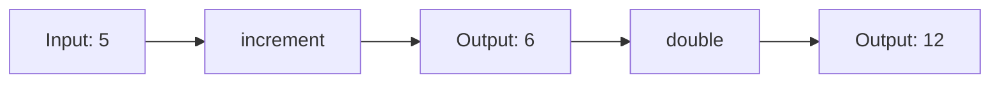
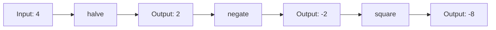

## 7.4. Function Composition

In the realm of functional programming, **Function Composition** is a fundamental concept that allows developers to build complex operations by combining simpler functions. This approach not only enhances code readability and maintainability but also promotes reusability and modularity. In this section, we will delve into the intricacies of function composition, exploring its principles, applications, and benefits through detailed pseudocode examples and visual diagrams.

### Understanding Function Composition

**Function Composition** is the process of combining two or more functions to produce a new function. The output of one function becomes the input of the next, creating a pipeline of operations. This concept is akin to the mathematical notion of composing functions, where if you have functions `f` and `g`, the composition `f(g(x))` applies `g` to `x` and then `f` to the result.

#### Key Concepts

- **Pure Functions**: Functions that have no side effects and return the same output for the same input.
- **Higher-Order Functions**: Functions that take other functions as arguments or return them as results.
- **Immutability**: Ensuring that data remains unchanged throughout the function composition process.

### Benefits of Function Composition

- **Modularity**: Break down complex operations into smaller, manageable functions.
- **Reusability**: Reuse existing functions in different compositions.
- **Readability**: Enhance code clarity by expressing operations in a declarative manner.
- **Testability**: Simplify testing by isolating individual functions.

### Basic Function Composition

Let's start by exploring a simple example of function composition. Consider two functions, `double` and `increment`, which we will compose to create a new function.

```pseudocode
function double(x):
    return x * 2

function increment(x):
    return x + 1

function compose(f, g):
    return function(x):
        return f(g(x))

composedFunction = compose(double, increment)
result = composedFunction(5)  // Output: 12
```

In this example, the `compose` function takes two functions, `f` and `g`, and returns a new function that applies `g` to its input and then `f` to the result. When `composedFunction` is called with `5`, it first increments `5` to `6` and then doubles it to `12`.

### Visualizing Function Composition

To better understand function composition, let's visualize the flow of data through the composed functions using a diagram.



This diagram illustrates how the input `5` is transformed through the `increment` and `double` functions to produce the final output `12`.

### Advanced Function Composition

Function composition can be extended to more complex scenarios involving multiple functions and data transformations. Let's consider a scenario where we have three functions: `square`, `negate`, and `halve`.

```pseudocode
function square(x):
    return x * x

function negate(x):
    return -x

function halve(x):
    return x / 2

function composeMultiple(*functions):
    return function(x):
        for f in reversed(functions):
            x = f(x)
        return x

composedFunction = composeMultiple(square, negate, halve)
result = composedFunction(4)  // Output: -8
```

In this example, the `composeMultiple` function takes a variable number of functions and returns a new function that applies them in sequence. The input `4` is halved to `2`, negated to `-2`, and then squared to `-8`.

### Real-World Applications

Function composition is widely used in functional programming languages and paradigms to build complex data processing pipelines, event handling systems, and more. Here are some common applications:

- **Data Transformation Pipelines**: Process and transform data through a series of functions.
- **Middleware in Web Servers**: Compose middleware functions to handle HTTP requests and responses.
- **Reactive Programming**: Combine streams of data and events using functional operators.

### Function Composition in Different Paradigms

While function composition is a staple of functional programming, its principles can be applied across different programming paradigms, including object-oriented and procedural programming.

#### Object-Oriented Programming

In object-oriented programming, function composition can be achieved through method chaining and the decorator pattern. By designing classes with methods that return the instance itself, we can create a fluent interface for composing operations.

```pseudocode
class Calculator:
    def __init__(self, value):
        self.value = value

    def add(self, x):
        self.value += x
        return self

    def multiply(self, x):
        self.value *= x
        return self

calc = Calculator(5).add(3).multiply(2)
result = calc.value  // Output: 16
```

#### Procedural Programming

In procedural programming, function composition can be implemented using procedural abstractions and modular functions. By organizing code into reusable functions, we can achieve similar benefits.

```pseudocode
function add(x, y):
    return x + y

function multiply(x, y):
    return x * y

function calculate(value):
    value = add(value, 3)
    value = multiply(value, 2)
    return value

result = calculate(5)  // Output: 16
```

### Design Considerations

When implementing function composition, consider the following design considerations:

- **Function Signature Compatibility**: Ensure that the output type of one function matches the input type of the next.
- **Error Handling**: Handle errors gracefully within composed functions to prevent cascading failures.
- **Performance**: Be mindful of the performance implications of composing a large number of functions.

### Differences and Similarities

Function composition is often compared to other design patterns, such as the decorator pattern and the chain of responsibility pattern. While these patterns share similarities in terms of combining operations, function composition is more focused on the mathematical and functional aspects of combining functions.

### Try It Yourself

To deepen your understanding of function composition, try modifying the examples provided:

1. **Add New Functions**: Create additional functions, such as `subtract` or `divide`, and compose them with existing functions.
2. **Experiment with Order**: Change the order of functions in the composition to observe how the output changes.
3. **Handle Edge Cases**: Implement error handling within composed functions to manage unexpected inputs.

### Visualizing Complex Compositions

For more complex compositions, visualize the flow of data through multiple functions using a comprehensive diagram.



This diagram provides a clear representation of how the input `4` is transformed through the `halve`, `negate`, and `square` functions to produce the final output `-8`.

### Further Reading

For more information on function composition and functional programming, consider exploring the following resources:

- [Functional Programming Concepts](https://www.geeksforgeeks.org/functional-programming-paradigm/)
- [Higher-Order Functions](https://developer.mozilla.org/en-US/docs/Web/JavaScript/Guide/Functions/Higher_order_functions)
- [Immutability in Functional Programming](https://www.freecodecamp.org/news/immutability-in-functional-javascript-9f5dcb4c1a1f/)

### Knowledge Check

To reinforce your understanding of function composition, consider the following questions and exercises:

1. **What is function composition, and how does it differ from method chaining?**
2. **How can function composition improve code readability and maintainability?**
3. **Implement a function composition pipeline for processing a list of numbers.**

### Embrace the Journey

Remember, mastering function composition is a journey. As you explore and experiment with different compositions, you'll gain a deeper understanding of functional programming principles and their applications. Keep experimenting, stay curious, and enjoy the journey!

---

## Quiz Time!



### What is function composition?

- [x] Combining two or more functions to produce a new function
- [ ] A method of chaining functions in object-oriented programming
- [ ] A technique for optimizing recursive functions
- [ ] A pattern for handling errors in functional programming

> **Explanation:** Function composition involves combining two or more functions to create a new function, where the output of one function is the input to the next.

### Which of the following is a benefit of function composition?

- [x] Modularity
- [x] Reusability
- [ ] Increased complexity
- [ ] Reduced readability

> **Explanation:** Function composition enhances modularity and reusability by breaking down complex operations into smaller, manageable functions.

### In function composition, what is the role of higher-order functions?

- [x] They take other functions as arguments or return them as results
- [ ] They are used to optimize performance
- [ ] They handle errors in composed functions
- [ ] They are specific to object-oriented programming

> **Explanation:** Higher-order functions are functions that take other functions as arguments or return them as results, playing a crucial role in function composition.

### How does function composition improve testability?

- [x] By isolating individual functions for easier testing
- [ ] By reducing the number of test cases needed
- [ ] By automatically generating test data
- [ ] By eliminating the need for unit tests

> **Explanation:** Function composition improves testability by isolating individual functions, making it easier to test each function independently.

### Which diagramming tool is used in this guide to visualize function composition?

- [x] Mermaid.js
- [ ] UML
- [ ] Flowchart.js
- [ ] Graphviz

> **Explanation:** Mermaid.js is used in this guide to create diagrams that visualize function composition and data flow.

### What is a key design consideration when implementing function composition?

- [x] Function signature compatibility
- [ ] Using global variables
- [ ] Minimizing the number of functions
- [ ] Avoiding the use of pure functions

> **Explanation:** Ensuring function signature compatibility is crucial when implementing function composition to ensure that the output type of one function matches the input type of the next.

### Which of the following is NOT a common application of function composition?

- [ ] Data transformation pipelines
- [ ] Middleware in web servers
- [x] Direct database manipulation
- [ ] Reactive programming

> **Explanation:** Function composition is commonly used in data transformation pipelines, middleware, and reactive programming, but not typically for direct database manipulation.

### How can function composition be achieved in object-oriented programming?

- [x] Through method chaining and the decorator pattern
- [ ] By using global variables
- [ ] By avoiding the use of classes
- [ ] By implementing recursive functions

> **Explanation:** In object-oriented programming, function composition can be achieved through method chaining and the decorator pattern.

### True or False: Function composition is only applicable in functional programming.

- [ ] True
- [x] False

> **Explanation:** While function composition is a fundamental concept in functional programming, its principles can be applied across different programming paradigms, including object-oriented and procedural programming.

### What is the output of the composed function in the advanced example provided?

- [x] -8
- [ ] 8
- [ ] -16
- [ ] 16

> **Explanation:** The composed function in the advanced example takes the input `4`, halves it to `2`, negates it to `-2`, and then squares it to `-8`.


