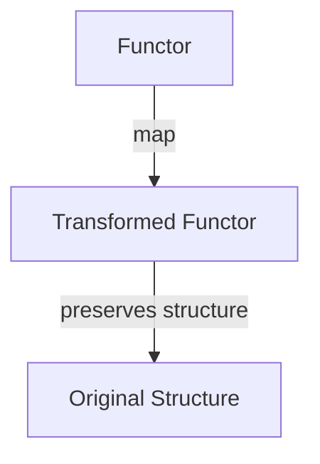
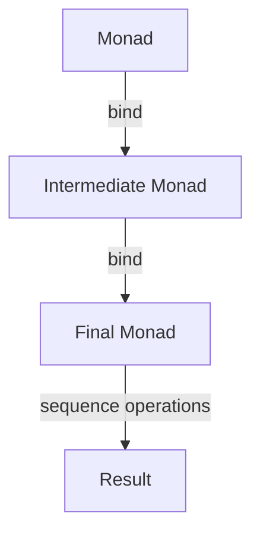

## 7.6. Functor and Monad Patterns

Welcome to the fascinating world of Functor and Monad patterns in functional programming. These patterns are pivotal in understanding how functional programming languages handle operations such as mapping and chaining. By mastering these concepts, you can write more expressive, concise, and maintainable code. Let's dive into the details and explore how these patterns work in practice.

### Introduction to Functors

**Functors** are one of the fundamental concepts in functional programming. They provide a way to apply a function to values wrapped in a context, such as a list, option, or any other data structure. The primary operation associated with functors is `map`, which allows you to transform the contents of the functor using a given function.

#### Key Characteristics of Functors

- **Mapping**: Functors allow you to apply a function to the wrapped values without altering the structure of the functor itself.
- **Preservation of Structure**: The structure of the functor remains unchanged after applying the function.
- **Abstraction**: Functors abstract the process of applying functions to values in a context, making the code more modular and reusable.

#### Functor Laws

To qualify as a functor, a data type must adhere to two laws:

1. **Identity Law**: Mapping the identity function over a functor should return the same functor.
   - `map(id, F) == F`
2. **Composition Law**: Mapping a composition of two functions should be the same as mapping one function and then the other.
   - `map(compose(f, g), F) == map(f, map(g, F))`

#### Functor Example in Pseudocode

Let's illustrate the concept of functors with a simple pseudocode example:

```pseudocode
// Define a Functor interface
interface Functor {
    function map(func)
}

// Implement a ListFunctor
class ListFunctor implements Functor {
    constructor(values) {
        this.values = values
    }

    function map(func) {
        result = []
        for each value in this.values {
            result.append(func(value))
        }
        return new ListFunctor(result)
    }
}

// Usage
list = new ListFunctor([1, 2, 3])
incremented = list.map(x => x + 1)
// incremented now contains [2, 3, 4]
```

### Introduction to Monads

**Monads** extend the concept of functors by adding the ability to chain operations. They provide a way to sequence computations, handling the complexities of combining multiple operations in a clean and manageable way.

#### Key Characteristics of Monads

- **Chaining**: Monads allow you to chain operations together, passing the result of one operation as the input to the next.
- **Context Management**: Monads manage the context in which computations occur, such as handling optional values, asynchronous operations, or side effects.
- **Abstraction**: Monads abstract the process of chaining operations, making the code more expressive and easier to reason about.

#### Monad Laws

To qualify as a monad, a data type must adhere to three laws:

1. **Left Identity**: Wrapping a value in a monad and then applying a function should be the same as applying the function directly.
   - `bind(unit(x), f) == f(x)`
2. **Right Identity**: Applying the unit function to a monad should return the same monad.
   - `bind(m, unit) == m`
3. **Associativity**: Chaining multiple functions should yield the same result regardless of how they are grouped.
   - `bind(bind(m, f), g) == bind(m, x => bind(f(x), g))`

#### Monad Example in Pseudocode

Let's illustrate the concept of monads with a simple pseudocode example:

```pseudocode
// Define a Monad interface
interface Monad {
    function bind(func)
    function unit(value)
}

// Implement a MaybeMonad
class MaybeMonad implements Monad {
    constructor(value) {
        this.value = value
    }

    function bind(func) {
        if (this.value == null) {
            return new MaybeMonad(null)
        } else {
            return func(this.value)
        }
    }

    static function unit(value) {
        return new MaybeMonad(value)
    }
}

// Usage
maybeValue = MaybeMonad.unit(5)
result = maybeValue.bind(x => MaybeMonad.unit(x * 2))
// result now contains 10
```

### Visualizing Functor and Monad Operations

To better understand how functor and monad operations work, let's visualize these concepts using Mermaid.js diagrams.

#### Functor Mapping Operation



**Caption**: This diagram illustrates the mapping operation in a functor, where a function is applied to the wrapped values, preserving the original structure.

#### Monad Chaining Operation



**Caption**: This diagram illustrates the chaining operation in a monad, where multiple operations are sequenced together, passing results between them.

### Understanding Monads in Practice

Monads are often considered a challenging concept in functional programming due to their abstract nature. However, understanding their practical applications can demystify them and reveal their power in simplifying complex operations.

#### Common Monad Use Cases

- **Error Handling**: Monads like `Maybe` or `Either` provide a way to handle errors gracefully without resorting to exceptions.
- **Asynchronous Programming**: Monads like `Promise` or `Future` allow you to work with asynchronous operations in a synchronous-like manner.
- **State Management**: Monads like `State` encapsulate stateful computations, making them easier to manage and reason about.

#### Practical Example: Error Handling with Maybe Monad

Let's explore a practical example of using the `Maybe` monad for error handling:

```pseudocode
// Define a function that may fail
function divide(a, b) {
    if (b == 0) {
        return MaybeMonad.unit(null) // Return a "Nothing" value
    } else {
        return MaybeMonad.unit(a / b)
    }
}

// Usage
result = MaybeMonad.unit(10).bind(x => divide(x, 0))
// result now contains null, indicating a division by zero error
```

### Try It Yourself

Now that we've explored the concepts of functors and monads, it's time to experiment with them. Try modifying the code examples to see how changes affect the behavior of functors and monads. For instance, you can:

- Implement a `Functor` for a different data structure, such as a tree or a graph.
- Create a new `Monad` for handling asynchronous operations or logging.
- Experiment with chaining multiple operations using monads to see how they simplify complex workflows.

### Design Considerations

When working with functors and monads, keep the following considerations in mind:

- **Understand the Laws**: Ensure that your implementations adhere to the functor and monad laws to maintain consistency and predictability.
- **Choose the Right Abstraction**: Use functors when you need to apply a function to wrapped values and monads when you need to chain operations.
- **Avoid Overuse**: While powerful, functors and monads can add complexity if overused. Use them judiciously where they provide clear benefits.

### Differences and Similarities

Functors and monads are often confused due to their similarities, but they serve different purposes:

- **Functors** focus on applying functions to wrapped values, preserving the structure.
- **Monads** extend functors by adding the ability to chain operations, managing context and sequencing computations.

### Further Reading

For more in-depth information on functors and monads, consider exploring the following resources:

- [Learn You a Haskell for Great Good!](http://learnyouahaskell.com/)
- [Functional Programming in Scala](https://www.manning.com/books/functional-programming-in-scala)
- [The Monad Tutorial You Never Asked For](https://www.youtube.com/watch?v=ZhuHCtR3xq8)

### Conclusion

Understanding functor and monad patterns is crucial for mastering functional programming. These patterns provide powerful abstractions for handling complex operations, making your code more expressive and maintainable. As you continue your journey in functional programming, remember to experiment, stay curious, and embrace the elegance of these patterns.

## Quiz Time!



### What is the primary operation associated with functors?

- [x] map
- [ ] bind
- [ ] unit
- [ ] compose

> **Explanation:** The primary operation associated with functors is `map`, which applies a function to values within a functor.

### Which law must a functor adhere to?

- [x] Identity Law
- [ ] Left Identity Law
- [ ] Right Identity Law
- [ ] Associativity Law

> **Explanation:** A functor must adhere to the Identity Law, which states that mapping the identity function over a functor should return the same functor.

### What additional capability do monads provide over functors?

- [x] Chaining operations
- [ ] Mapping functions
- [ ] Preserving structure
- [ ] Handling errors

> **Explanation:** Monads provide the additional capability of chaining operations, allowing you to sequence computations.

### Which monad law ensures that wrapping a value and applying a function is equivalent to applying the function directly?

- [x] Left Identity
- [ ] Right Identity
- [ ] Associativity
- [ ] Composition

> **Explanation:** The Left Identity law ensures that wrapping a value in a monad and then applying a function is equivalent to applying the function directly.

### What is a common use case for the Maybe monad?

- [x] Error handling
- [ ] Asynchronous programming
- [ ] State management
- [ ] Logging

> **Explanation:** A common use case for the Maybe monad is error handling, as it provides a way to handle errors gracefully without exceptions.

### Which of the following is NOT a characteristic of monads?

- [x] Preserving structure
- [ ] Chaining operations
- [ ] Context management
- [ ] Abstraction

> **Explanation:** Preserving structure is a characteristic of functors, not monads. Monads focus on chaining operations and managing context.

### What should you ensure when implementing functors and monads?

- [x] Adherence to laws
- [ ] Overuse of patterns
- [ ] Ignoring context
- [ ] Avoiding abstraction

> **Explanation:** When implementing functors and monads, ensure adherence to their respective laws to maintain consistency and predictability.

### Which pattern is often confused with monads due to their similarities?

- [x] Functors
- [ ] Decorators
- [ ] Observers
- [ ] Proxies

> **Explanation:** Functors are often confused with monads due to their similarities, but they serve different purposes.

### What is the key difference between functors and monads?

- [x] Functors apply functions; monads chain operations
- [ ] Functors handle errors; monads map functions
- [ ] Functors manage context; monads preserve structure
- [ ] Functors sequence computations; monads apply functions

> **Explanation:** The key difference is that functors apply functions to wrapped values, while monads chain operations and manage context.

### True or False: Monads can be used for asynchronous programming.

- [x] True
- [ ] False

> **Explanation:** True. Monads like Promise or Future are used for handling asynchronous operations in a synchronous-like manner.




