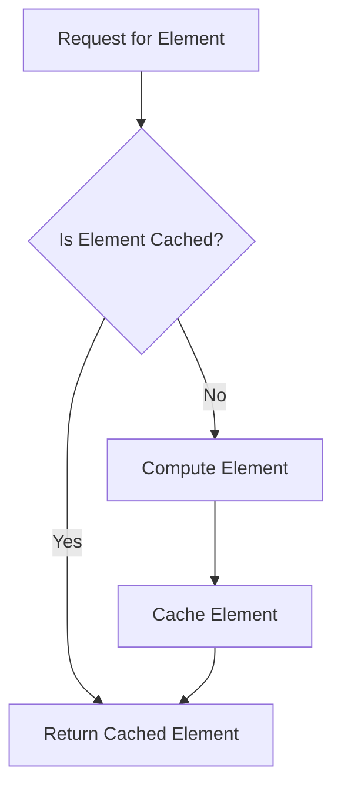

## 7.7. Lazy Evaluation

Lazy evaluation is a powerful concept in functional programming that allows the deferral of computations until their results are needed. This technique can lead to significant performance improvements, especially in scenarios involving large data sets or complex calculations. In this section, we will delve into the intricacies of lazy evaluation, exploring its benefits, implementation strategies, and practical applications through detailed pseudocode examples.

### Understanding Lazy Evaluation

Lazy evaluation, also known as call-by-need, is a strategy that delays the evaluation of an expression until its value is actually required. This contrasts with eager evaluation, where expressions are evaluated as soon as they are bound to a variable. Lazy evaluation can lead to performance optimizations by avoiding unnecessary calculations, reducing memory usage, and enabling the creation of infinite data structures.

#### Key Concepts of Lazy Evaluation

1. **Deferred Computation**: Computations are postponed until their results are needed.
2. **Memoization**: Once a deferred computation is performed, its result is cached for future use, preventing redundant calculations.
3. **Infinite Data Structures**: Lazy evaluation allows the creation of data structures that can conceptually be infinite, as only the necessary parts are computed.

### Benefits of Lazy Evaluation

- **Efficiency**: By deferring computations, lazy evaluation can reduce the number of calculations performed, leading to faster execution times and lower resource consumption.
- **Modularity**: Lazy evaluation enables the separation of data generation from data consumption, allowing for more modular and reusable code.
- **Infinite Structures**: It facilitates the creation of infinite lists or streams, which can be processed element by element without requiring the entire structure to be in memory.

### Pseudocode Implementation of Lazy Evaluation

Let's explore how lazy evaluation can be implemented using pseudocode. We'll start with a simple example of a lazy list, a data structure that generates its elements on demand.

#### Lazy List Example

```pseudocode
class LazyList:
    def __init__(self, generator_function):
        self.generator_function = generator_function
        self.cache = []
        self.index = 0

    def get(self, n):
        # Ensure the list is evaluated up to index n
        while self.index <= n:
            self.cache.append(self.generator_function(self.index))
            self.index += 1
        return self.cache[n]

def generate_numbers(index):
    return index * index

lazy_list = LazyList(generate_numbers)

print(lazy_list.get(5))  # Outputs: 25
print(lazy_list.get(3))  # Outputs: 9
```

In this example, `LazyList` uses a generator function to produce elements on demand. The `get` method ensures that the list is evaluated up to the requested index, caching results to avoid redundant calculations.

### Visualizing Lazy Evaluation

To better understand lazy evaluation, consider the following diagram illustrating the process of deferred computation and memoization.



**Diagram Description**: This flowchart depicts the lazy evaluation process. When an element is requested, the system checks if it is cached. If yes, it returns the cached element; if no, it computes the element, caches it, and then returns it.

### Practical Applications of Lazy Evaluation

Lazy evaluation is particularly useful in scenarios where computations are expensive or data sets are large. Here are some practical applications:

#### Infinite Sequences

Lazy evaluation allows the creation of infinite sequences, such as the Fibonacci sequence, without precomputing all elements.

```pseudocode
class LazyFibonacci:
    def __init__(self):
        self.cache = {0: 0, 1: 1}

    def get(self, n):
        if n not in self.cache:
            self.cache[n] = self.get(n - 1) + self.get(n - 2)
        return self.cache[n]

fib = LazyFibonacci()
print(fib.get(10))  # Outputs: 55
```

#### Stream Processing

Lazy evaluation is ideal for processing streams of data, where only a subset of the data is needed at any given time.

```pseudocode
class LazyStream:
    def __init__(self, data_source):
        self.data_source = data_source
        self.index = 0

    def next(self):
        if self.index < len(self.data_source):
            result = self.data_source[self.index]
            self.index += 1
            return result
        else:
            return None

stream = LazyStream([1, 2, 3, 4, 5])
print(stream.next())  # Outputs: 1
print(stream.next())  # Outputs: 2
```

### Design Considerations

When implementing lazy evaluation, consider the following:

- **Memory Usage**: While lazy evaluation can reduce computation time, it may increase memory usage due to caching.
- **Complexity**: Lazy evaluation can introduce complexity, making code harder to understand and maintain.
- **Debugging**: Deferred computations can complicate debugging, as the order of execution may not be immediately apparent.

### Differences and Similarities with Other Patterns

Lazy evaluation shares similarities with memoization, as both involve caching results to avoid redundant calculations. However, lazy evaluation specifically focuses on deferring computations, while memoization is a broader optimization technique.

### Try It Yourself

Experiment with the provided pseudocode examples by modifying the generator functions or data sources. Observe how changes affect the behavior and performance of the lazy evaluation.

### Knowledge Check

- What are the primary benefits of lazy evaluation?
- How does lazy evaluation enable the creation of infinite data structures?
- What are some potential drawbacks of using lazy evaluation?

### Embrace the Journey

Remember, mastering lazy evaluation is just the beginning. As you continue to explore functional programming, you'll discover even more powerful techniques for writing efficient, modular, and expressive code. Keep experimenting, stay curious, and enjoy the journey!

## Quiz Time!



### What is lazy evaluation?

- [x] A strategy that delays the evaluation of an expression until its value is needed
- [ ] A method of immediately executing all expressions
- [ ] A technique for optimizing memory usage by precomputing values
- [ ] A process of evaluating all elements in a data structure at once

> **Explanation:** Lazy evaluation defers computations until their results are required, optimizing performance by avoiding unnecessary calculations.

### Which of the following is a benefit of lazy evaluation?

- [x] It allows the creation of infinite data structures
- [ ] It increases memory usage
- [ ] It simplifies debugging
- [ ] It requires all data to be precomputed

> **Explanation:** Lazy evaluation enables infinite data structures by computing only the necessary parts, reducing resource consumption.

### How does lazy evaluation differ from eager evaluation?

- [x] Lazy evaluation defers computations until needed, while eager evaluation computes immediately
- [ ] Lazy evaluation computes immediately, while eager evaluation defers computations
- [ ] Both lazy and eager evaluation defer computations
- [ ] Both lazy and eager evaluation compute immediately

> **Explanation:** Lazy evaluation defers computations, whereas eager evaluation computes expressions as soon as they are bound to variables.

### What is memoization in the context of lazy evaluation?

- [x] Caching results of computations to avoid redundant calculations
- [ ] Delaying computations until their results are needed
- [ ] Precomputing values for faster access
- [ ] Evaluating all elements in a data structure at once

> **Explanation:** Memoization involves caching computation results, which is a key aspect of lazy evaluation to enhance performance.

### Which of the following is a potential drawback of lazy evaluation?

- [x] Increased memory usage due to caching
- [ ] Simplified code structure
- [ ] Improved debugging capabilities
- [ ] Immediate computation of all expressions

> **Explanation:** Lazy evaluation can increase memory usage because it caches computation results to avoid redundant calculations.

### What is a practical application of lazy evaluation?

- [x] Processing streams of data
- [ ] Precomputing all elements in a list
- [ ] Simplifying debugging
- [ ] Increasing memory usage

> **Explanation:** Lazy evaluation is ideal for stream processing, where only a subset of data is needed at any given time.

### How does lazy evaluation enable modular code?

- [x] By separating data generation from data consumption
- [ ] By precomputing all data
- [ ] By increasing memory usage
- [ ] By simplifying debugging

> **Explanation:** Lazy evaluation allows for modular code by deferring computations, enabling separation of data generation and consumption.

### What is a key concept of lazy evaluation?

- [x] Deferred computation
- [ ] Immediate computation
- [ ] Precomputed values
- [ ] Simplified debugging

> **Explanation:** Deferred computation is a fundamental concept of lazy evaluation, allowing computations to be postponed until needed.

### True or False: Lazy evaluation can lead to performance improvements by avoiding unnecessary calculations.

- [x] True
- [ ] False

> **Explanation:** Lazy evaluation optimizes performance by deferring computations until their results are required, reducing unnecessary calculations.

### What should be considered when implementing lazy evaluation?

- [x] Memory usage and debugging complexity
- [ ] Simplified code structure
- [ ] Immediate computation of all expressions
- [ ] Precomputed values for faster access

> **Explanation:** Implementing lazy evaluation requires consideration of memory usage due to caching and potential debugging complexity.


