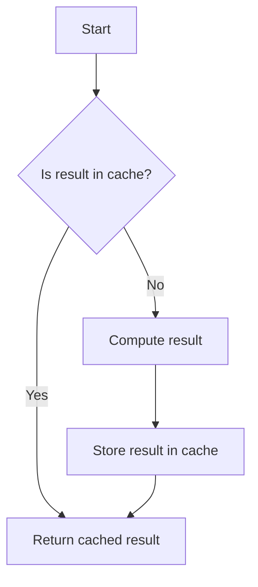

## 7.8. Memoization Pattern

In the realm of software development, performance optimization is a critical concern, especially when dealing with computationally expensive operations. The Memoization Pattern, a powerful technique in functional programming, addresses this challenge by caching the results of function calls. This section delves into the intricacies of the Memoization Pattern, providing a comprehensive understanding of its implementation, benefits, and applications across programming paradigms.

### Intent

The primary intent of the Memoization Pattern is to enhance performance by storing the results of expensive function calls and returning the cached result when the same inputs occur again. This technique is particularly useful in scenarios where functions are called repeatedly with the same arguments, such as in recursive algorithms or complex computations.

### Key Participants

1. **Function**: The core computational unit whose results are to be cached.
2. **Cache**: A data structure (often a dictionary or map) that stores the results of previous function calls.
3. **Memoized Function**: A wrapper around the original function that manages caching and retrieval of results.

### Applicability

The Memoization Pattern is applicable in the following scenarios:

- **Recursive Algorithms**: Functions like Fibonacci or factorial, where overlapping subproblems are common.
- **Expensive Computations**: Functions that involve complex calculations or data processing.
- **Repeated Function Calls**: Situations where the same function is called multiple times with identical arguments.

### Sample Code Snippets

Let's explore the Memoization Pattern through pseudocode examples. We'll start with a simple recursive function and then apply memoization to optimize it.

#### Recursive Fibonacci Function

Consider the classic example of calculating Fibonacci numbers using recursion:

```pseudocode
function fibonacci(n)
    if n <= 1
        return n
    else
        return fibonacci(n - 1) + fibonacci(n - 2)
```

This implementation is inefficient for large values of `n` due to repeated calculations of the same Fibonacci numbers.

#### Memoized Fibonacci Function

Now, let's apply memoization to optimize the Fibonacci function:

```pseudocode
function memoize(f)
    cache = {}

    return function(n)
        if n in cache
            return cache[n]
        else
            result = f(n)
            cache[n] = result
            return result

memoizedFibonacci = memoize(fibonacci)

function fibonacci(n)
    if n <= 1
        return n
    else
        return memoizedFibonacci(n - 1) + memoizedFibonacci(n - 2)
```

In this implementation, we introduce a `memoize` function that takes another function `f` as an argument and returns a new function with caching capabilities. The `cache` stores previously computed results, significantly reducing redundant calculations.

### Design Considerations

- **Cache Size**: Consider the size of the cache and its impact on memory usage. In some cases, a limited cache size with an eviction policy (e.g., Least Recently Used) may be necessary.
- **Cache Key**: Ensure that the cache key uniquely identifies function inputs. For functions with multiple arguments, a tuple or a string representation of the arguments can be used.
- **Thread Safety**: In concurrent environments, ensure that cache access is thread-safe to prevent race conditions.

### Differences and Similarities

Memoization is often confused with caching in general. While both involve storing data for future use, memoization specifically refers to caching the results of function calls based on their inputs. Unlike general caching, which can be applied to various data types and sources, memoization is tightly coupled with function execution.

### Visualizing Memoization

To better understand memoization, let's visualize the process using a flowchart:



**Figure 1: Memoization Flowchart** - This diagram illustrates the decision-making process in a memoized function, highlighting the role of the cache in optimizing performance.

### Try It Yourself

To deepen your understanding of memoization, try modifying the pseudocode examples:

1. **Implement Memoization for Factorial**: Adapt the memoization technique to optimize a recursive factorial function.
2. **Explore Cache Eviction Policies**: Implement a cache with a fixed size and an eviction policy, such as Least Recently Used (LRU).
3. **Test with Different Data Types**: Experiment with memoizing functions that take different types of arguments, such as strings or tuples.

### Practical Applications

Memoization is widely used in various domains, including:

- **Dynamic Programming**: Memoization is a key technique in dynamic programming, where it helps solve problems by breaking them down into overlapping subproblems.
- **Web Development**: In client-side applications, memoization can optimize rendering performance by caching component states or computed properties.
- **Data Science**: Memoization can speed up data processing tasks by caching intermediate results in complex data pipelines.

### Knowledge Check

Before we conclude, let's reinforce our understanding with a few questions:

1. **What is the primary benefit of memoization?**
2. **How does memoization differ from general caching?**
3. **What are some common use cases for memoization?**

### Conclusion

The Memoization Pattern is a powerful tool for optimizing performance in software applications. By caching the results of function calls, memoization reduces redundant computations, leading to significant performance gains. As you continue your journey in mastering design patterns, remember that memoization is just one of many techniques available to enhance the efficiency and scalability of your code.

### Further Reading

For more information on memoization and related topics, consider exploring the following resources:

- [Memoization on Wikipedia](https://en.wikipedia.org/wiki/Memoization)
- [Dynamic Programming and Memoization](https://www.geeksforgeeks.org/dynamic-programming/)
- [Functional Programming Concepts](https://www.freecodecamp.org/news/functional-programming-concepts/)

## Quiz Time!



### What is the primary purpose of memoization?

- [x] To cache function results for improved performance
- [ ] To reduce memory usage in applications
- [ ] To enhance security in software systems
- [ ] To simplify code readability

> **Explanation:** Memoization aims to cache the results of function calls to avoid redundant computations and improve performance.

### How does memoization differ from general caching?

- [x] Memoization caches function results based on inputs
- [ ] Memoization is used only in web applications
- [ ] General caching is specific to database queries
- [ ] Memoization requires a database backend

> **Explanation:** Memoization specifically involves caching the results of function calls based on their inputs, whereas general caching can apply to various data types and sources.

### Which scenario is ideal for applying memoization?

- [x] Recursive algorithms with overlapping subproblems
- [ ] Simple arithmetic operations
- [ ] Static HTML page rendering
- [ ] Database schema design

> **Explanation:** Recursive algorithms with overlapping subproblems benefit greatly from memoization as it reduces redundant calculations.

### What is a potential drawback of memoization?

- [x] Increased memory usage due to caching
- [ ] Slower execution time for all functions
- [ ] Incompatibility with modern programming languages
- [ ] Difficulty in understanding function logic

> **Explanation:** Memoization can lead to increased memory usage as it involves storing results in a cache.

### What is a common data structure used for caching in memoization?

- [x] Dictionary or map
- [ ] Linked list
- [ ] Stack
- [ ] Queue

> **Explanation:** A dictionary or map is commonly used to store cached results in memoization due to its efficient key-value lookup.

### What should be considered when implementing a cache for memoization?

- [x] Cache size and eviction policy
- [ ] The color scheme of the application
- [ ] The font style used in code comments
- [ ] The number of lines in the source code

> **Explanation:** Cache size and eviction policy are crucial considerations to manage memory usage effectively in memoization.

### Which programming paradigm commonly uses memoization?

- [x] Functional programming
- [ ] Procedural programming
- [ ] Object-oriented programming
- [ ] Assembly language programming

> **Explanation:** Memoization is a common technique in functional programming, where functions are treated as first-class citizens.

### What is a benefit of using memoization in web development?

- [x] Optimizing rendering performance by caching component states
- [ ] Reducing the number of HTML tags in a page
- [ ] Enhancing the visual design of a website
- [ ] Simplifying CSS stylesheets

> **Explanation:** Memoization can optimize rendering performance in web development by caching component states or computed properties.

### True or False: Memoization is only applicable to numerical computations.

- [ ] True
- [x] False

> **Explanation:** Memoization is not limited to numerical computations; it can be applied to any function with repeatable inputs and outputs.

### Which of the following is a key participant in the Memoization Pattern?

- [x] Cache
- [ ] Database
- [ ] User Interface
- [ ] Operating System

> **Explanation:** The cache is a key participant in the Memoization Pattern, as it stores the results of function calls for future use.



Remember, this is just the beginning. As you progress, you'll build more complex and interactive applications. Keep experimenting, stay curious, and enjoy the journey!
