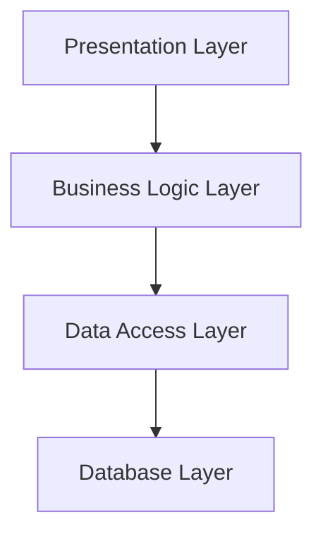
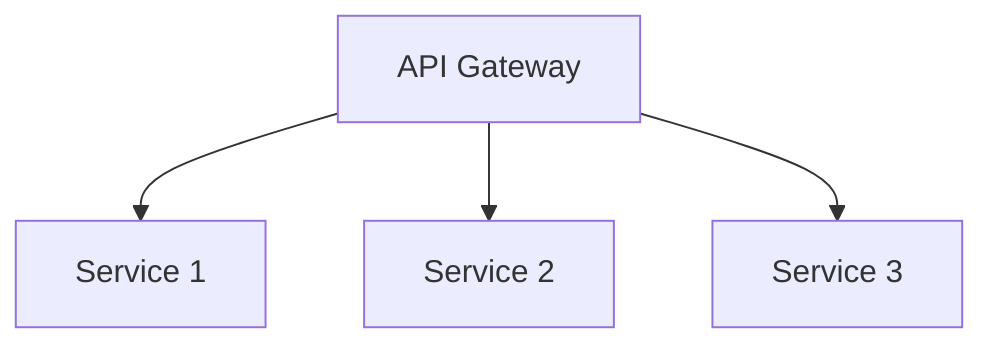
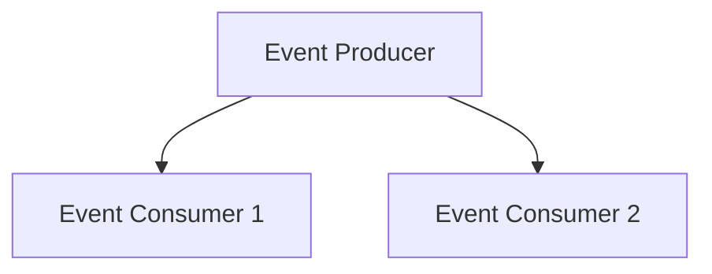

## 8.1. Introduction to Software Architecture

In the realm of software development, the term "software architecture" refers to the high-level structures of a software system, the discipline of creating such structures, and the documentation of these structures. Software architecture serves as a blueprint for both the system and the project developing it, defining the system's components and their relationships. This introduction will delve into the fundamental concepts of software architecture, including architectural styles and patterns, and their significance in designing large-scale systems.

### Understanding Software Architecture

Software architecture is the foundation upon which software systems are built. It involves making fundamental structural choices that are costly to change once implemented. These choices include selecting the appropriate architectural style, defining the system's components, and determining how these components interact with each other.

#### Key Concepts of Software Architecture

1. **Components**: These are the primary building blocks of a software system. Components can be classes, modules, or services that encapsulate a set of related functions or data.

2. **Connectors**: These define the interactions between components. Connectors can be method calls, shared data repositories, or network protocols.

3. **Configurations**: This refers to the arrangement of components and connectors in a system. Configurations define the topology of the system and how components are deployed and interact.

4. **Architectural Styles**: These are patterns for structuring software systems. They provide a set of predefined subsystems, specify their responsibilities, and include rules and guidelines for organizing the relationships between them.

5. **Architectural Patterns**: These are solutions to recurring design problems in a given context. Patterns provide a template for how to solve a problem that can be used in many different situations.

#### Importance of Software Architecture

Software architecture is crucial for several reasons:

- **Scalability**: A well-designed architecture allows a system to scale efficiently as the user base grows or as new features are added.

- **Maintainability**: Clear architectural boundaries make it easier to update and maintain the system over time.

- **Performance**: Architecture impacts the system's performance by influencing how data flows through the system and how components interact.

- **Security**: A robust architecture includes security measures to protect data and ensure privacy.

- **Cost Efficiency**: By making informed architectural decisions early in the development process, organizations can avoid costly redesigns and refactoring.

### Architectural Styles

Architectural styles define the structure and organization of a system. They provide a set of constraints and guidelines that help shape the system's architecture. Some common architectural styles include:

#### Layered Architecture

The layered architecture style organizes a system into layers, each with a specific responsibility. This style promotes separation of concerns, making it easier to manage and maintain the system.

- **Presentation Layer**: Handles user interface and user interaction.
- **Business Logic Layer**: Contains the core functionality and business rules.
- **Data Access Layer**: Manages data retrieval and storage.
- **Database Layer**: Stores and retrieves data from the database.

**Advantages**:
- Simplifies maintenance and testing.
- Promotes reusability of components.
- Facilitates separation of concerns.

**Disadvantages**:
- Can introduce performance overhead due to layer-to-layer communication.
- May lead to tight coupling between layers if not designed carefully.

#### Client-Server Architecture

In the client-server architecture, the system is divided into two main components: clients and servers. Clients request services, and servers provide them.

- **Client**: The user-facing component that interacts with the user.
- **Server**: The backend component that processes requests and provides responses.

**Advantages**:
- Centralized control and management.
- Easy to scale by adding more servers.
- Clients can be thin, reducing resource requirements.

**Disadvantages**:
- Single point of failure if the server goes down.
- Network latency can affect performance.

#### Microservices Architecture

Microservices architecture structures a system as a collection of loosely coupled services, each responsible for a specific business capability.

- **Service**: A self-contained unit that performs a specific function.
- **API Gateway**: Manages communication between clients and services.

**Advantages**:
- Enables independent deployment and scaling of services.
- Promotes flexibility and agility in development.
- Facilitates the use of different technologies for different services.

**Disadvantages**:
- Can lead to increased complexity in managing services.
- Requires robust monitoring and orchestration.

#### Event-Driven Architecture

Event-driven architecture is based on the production, detection, and consumption of events. It is highly decoupled and asynchronous.

- **Event Producer**: Generates events when a change occurs.
- **Event Consumer**: Responds to events and performs actions.

**Advantages**:
- Highly scalable and resilient.
- Supports real-time processing and responsiveness.
- Decouples producers and consumers, allowing for flexibility.

**Disadvantages**:
- Can be difficult to debug and trace events.
- Requires careful design to handle event ordering and consistency.

#### Service-Oriented Architecture (SOA)

SOA is a style that allows services to communicate over a network. Services are designed to be reusable and interoperable.

- **Service**: A discrete unit of functionality that can be accessed remotely.
- **Service Bus**: Facilitates communication between services.

**Advantages**:
- Encourages reuse of services across different applications.
- Supports integration with legacy systems.
- Provides flexibility in technology choices.

**Disadvantages**:
- Can lead to performance bottlenecks if not managed properly.
- Requires careful governance and management.

### Architectural Patterns

Architectural patterns provide solutions to common design problems. They are templates that can be adapted to fit specific needs. Some widely used architectural patterns include:

#### Model-View-Controller (MVC)

MVC separates an application into three interconnected components:

- **Model**: Manages the data and business logic.
- **View**: Displays the data to the user.
- **Controller**: Handles user input and updates the model.

**Advantages**:
- Promotes separation of concerns.
- Facilitates parallel development of components.
- Enhances testability and maintainability.

**Disadvantages**:
- Can lead to increased complexity in managing interactions.
- Requires careful synchronization between components.

#### Model-View-ViewModel (MVVM)

MVVM is a variation of MVC that introduces a ViewModel to manage the presentation logic.

- **Model**: Represents the data and business logic.
- **View**: Displays the data and interacts with the user.
- **ViewModel**: Acts as an intermediary between the view and the model.

**Advantages**:
- Supports data binding, reducing boilerplate code.
- Enhances testability by decoupling the view from the model.
- Facilitates separation of concerns.

**Disadvantages**:
- Can introduce complexity in managing the ViewModel.
- Requires a framework that supports data binding.

#### Layered Architecture Pattern

The layered architecture pattern organizes a system into layers with distinct responsibilities.

- **Presentation Layer**: Manages user interaction.
- **Application Layer**: Handles business logic and processes.
- **Data Layer**: Manages data access and storage.

**Advantages**:
- Simplifies maintenance and testing.
- Promotes reusability of components.
- Facilitates separation of concerns.

**Disadvantages**:
- Can introduce performance overhead due to layer-to-layer communication.
- May lead to tight coupling between layers if not designed carefully.

#### Microservices Pattern

The microservices pattern structures a system as a collection of loosely coupled services.

- **Service**: A self-contained unit that performs a specific function.
- **API Gateway**: Manages communication between clients and services.

**Advantages**:
- Enables independent deployment and scaling of services.
- Promotes flexibility and agility in development.
- Facilitates the use of different technologies for different services.

**Disadvantages**:
- Can lead to increased complexity in managing services.
- Requires robust monitoring and orchestration.

#### Event-Driven Pattern

The event-driven pattern is based on the production, detection, and consumption of events.

- **Event Producer**: Generates events when a change occurs.
- **Event Consumer**: Responds to events and performs actions.

**Advantages**:
- Highly scalable and resilient.
- Supports real-time processing and responsiveness.
- Decouples producers and consumers, allowing for flexibility.

**Disadvantages**:
- Can be difficult to debug and trace events.
- Requires careful design to handle event ordering and consistency.

### Importance of Architectural Patterns in Large Systems

Architectural patterns play a crucial role in the design and development of large-scale systems. They provide a structured approach to solving complex design problems and ensure that the system is scalable, maintainable, and efficient.

#### Scalability

Architectural patterns enable systems to scale efficiently by providing guidelines for distributing components and managing resources. For example, the microservices pattern allows for independent scaling of services, ensuring that the system can handle increased load without affecting performance.

#### Maintainability

By promoting separation of concerns and modularity, architectural patterns make it easier to maintain and update large systems. Patterns like MVC and MVVM facilitate parallel development and testing, reducing the time and effort required for maintenance.

#### Performance

Architectural patterns influence the performance of a system by defining how components interact and how data flows through the system. Patterns like event-driven architecture support real-time processing and responsiveness, ensuring that the system performs well under varying conditions.

#### Security

Architectural patterns incorporate security measures to protect data and ensure privacy. For example, the client-server pattern centralizes control and management, making it easier to implement security measures and monitor access.

#### Cost Efficiency

By providing reusable solutions to common design problems, architectural patterns reduce the time and effort required to design and develop large systems. This leads to cost savings and allows organizations to focus on delivering value to their users.

### Visualizing Architectural Styles and Patterns

To better understand architectural styles and patterns, let's visualize some of the key concepts using Mermaid.js diagrams.

#### Layered Architecture Diagram

*Figure 1: Layered Architecture Diagram*

This diagram illustrates the layered architecture style, where each layer has a specific responsibility and interacts with the layer below it.

#### Client-Server Architecture Diagram

*Figure 2: Client-Server Architecture Diagram*

This diagram shows the client-server architecture, where the client requests services from the server, and the server provides responses.

#### Microservices Architecture Diagram

*Figure 3: Microservices Architecture Diagram*

This diagram represents the microservices architecture, where the API gateway manages communication between clients and services.

#### Event-Driven Architecture Diagram

*Figure 4: Event-Driven Architecture Diagram*

This diagram depicts the event-driven architecture, where the event producer generates events, and event consumers respond to these events.

### Try It Yourself

To deepen your understanding of architectural styles and patterns, try modifying the diagrams above to represent different scenarios. For example, add additional layers to the layered architecture diagram or introduce new services to the microservices architecture diagram. Experimenting with these diagrams will help you grasp the flexibility and adaptability of architectural styles and patterns.

### Knowledge Check

1. **What are the key components of software architecture?**
   - Components, connectors, and configurations.

2. **Why is software architecture important?**
   - It impacts scalability, maintainability, performance, security, and cost efficiency.

3. **What are some common architectural styles?**
   - Layered architecture, client-server architecture, microservices architecture, event-driven architecture, and service-oriented architecture.

4. **How do architectural patterns benefit large systems?**
   - They provide scalable, maintainable, and efficient solutions to complex design problems.

5. **What is the role of an API gateway in microservices architecture?**
   - It manages communication between clients and services.

### Embrace the Journey

Remember, mastering software architecture is a journey. As you explore different architectural styles and patterns, you'll gain a deeper understanding of how to design scalable, maintainable, and efficient systems. Keep experimenting, stay curious, and enjoy the journey!

## Quiz Time!



### What are the key components of software architecture?

- [x] Components, connectors, and configurations
- [ ] Models, views, and controllers
- [ ] Layers, services, and databases
- [ ] Clients, servers, and gateways

> **Explanation:** The key components of software architecture are components, connectors, and configurations, which define the structure and organization of a system.

### Why is software architecture important?

- [x] It impacts scalability, maintainability, performance, security, and cost efficiency
- [ ] It only affects the user interface design
- [ ] It is only relevant for small systems
- [ ] It is not important in modern software development

> **Explanation:** Software architecture is crucial because it impacts various aspects of a system, including scalability, maintainability, performance, security, and cost efficiency.

### What are some common architectural styles?

- [x] Layered architecture, client-server architecture, microservices architecture, event-driven architecture, and service-oriented architecture
- [ ] MVC, MVVM, and MVP
- [ ] Singleton, factory, and observer
- [ ] Agile, waterfall, and scrum

> **Explanation:** Common architectural styles include layered architecture, client-server architecture, microservices architecture, event-driven architecture, and service-oriented architecture.

### How do architectural patterns benefit large systems?

- [x] They provide scalable, maintainable, and efficient solutions to complex design problems
- [ ] They only apply to small systems
- [ ] They are not relevant in modern software development
- [ ] They increase the complexity of the system

> **Explanation:** Architectural patterns benefit large systems by providing scalable, maintainable, and efficient solutions to complex design problems.

### What is the role of an API gateway in microservices architecture?

- [x] It manages communication between clients and services
- [ ] It stores data for the services
- [ ] It only handles user authentication
- [ ] It is not used in microservices architecture

> **Explanation:** In microservices architecture, an API gateway manages communication between clients and services, acting as a single entry point for requests.

### Which architectural style organizes a system into layers with distinct responsibilities?

- [x] Layered architecture
- [ ] Client-server architecture
- [ ] Microservices architecture
- [ ] Event-driven architecture

> **Explanation:** The layered architecture style organizes a system into layers with distinct responsibilities, promoting separation of concerns.

### What is a disadvantage of microservices architecture?

- [x] It can lead to increased complexity in managing services
- [ ] It is not scalable
- [ ] It does not support independent deployment
- [ ] It cannot use different technologies for different services

> **Explanation:** A disadvantage of microservices architecture is that it can lead to increased complexity in managing services, requiring robust monitoring and orchestration.

### Which architectural pattern separates an application into model, view, and controller components?

- [x] Model-View-Controller (MVC)
- [ ] Layered architecture
- [ ] Microservices pattern
- [ ] Event-driven pattern

> **Explanation:** The Model-View-Controller (MVC) pattern separates an application into model, view, and controller components, promoting separation of concerns.

### What is a key advantage of event-driven architecture?

- [x] It is highly scalable and resilient
- [ ] It is difficult to debug and trace events
- [ ] It requires synchronous communication
- [ ] It is not suitable for real-time processing

> **Explanation:** A key advantage of event-driven architecture is that it is highly scalable and resilient, supporting real-time processing and responsiveness.

### True or False: Architectural patterns are only applicable to small systems.

- [ ] True
- [x] False

> **Explanation:** False. Architectural patterns are applicable to systems of all sizes, providing scalable, maintainable, and efficient solutions to complex design problems.


