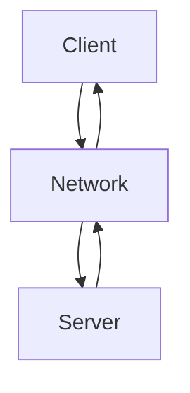
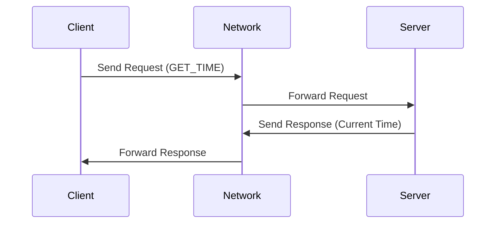

## 8.10. Client-Server Pattern

The Client-Server Pattern is a cornerstone of distributed systems architecture, enabling centralized resource management and efficient network communication. This pattern is prevalent in modern software design, underpinning everything from web applications to enterprise systems. In this section, we will delve into the intricacies of the Client-Server Pattern, exploring its intent, structure, key participants, applicability, and design considerations. We will also provide pseudocode examples and diagrams to illustrate the pattern's implementation and operation.

### Intent

The primary intent of the Client-Server Pattern is to separate concerns by dividing the system into two main components: the client and the server. This separation allows for centralized resource management, where the server provides services or resources, and the client requests and consumes these services. This architecture facilitates scalability, maintainability, and flexibility in software systems.

### Key Participants

1. **Client**: The client is the component that initiates requests to the server. It is responsible for presenting data to the user and handling user interactions. Clients can be thin (minimal processing, relying on the server for data processing) or thick (performing significant processing locally).

2. **Server**: The server is the component that provides services or resources to the client. It processes client requests, performs necessary computations, and returns the results to the client. The server is typically more powerful and resource-rich than the client.

3. **Network**: The network facilitates communication between the client and server. It can be a local network, the internet, or any other communication medium that supports data exchange.

### Applicability

The Client-Server Pattern is applicable in scenarios where:

- Centralized control and management of resources are required.
- Multiple clients need to access shared resources or services.
- Scalability is a concern, and the system needs to support a growing number of clients.
- Security and data integrity are important, and centralized management can enforce policies and controls.

### Structure

The Client-Server Pattern is characterized by a clear separation of roles and responsibilities between the client and server. The following diagram illustrates the basic structure of the Client-Server Pattern:



**Diagram Description**: This diagram represents the interaction between the client and server through a network. The client sends requests to the server, and the server processes these requests and sends responses back to the client.

### Sample Code Snippets

Let's explore a simple pseudocode example to demonstrate the Client-Server Pattern. We'll create a basic client-server application where the client requests the current time from the server.

#### Server Implementation

```pseudocode
// Server pseudocode
function startServer() {
    // Initialize server and listen for client connections
    server = createServer()
    server.onRequest(handleRequest)
    server.listen(port)
}

function handleRequest(request) {
    // Process client request and send response
    if request.type == "GET_TIME" {
        currentTime = getCurrentTime()
        response = createResponse(currentTime)
        sendResponse(response)
    }
}

function getCurrentTime() {
    // Return the current server time
    return new Date().toString()
}
```

#### Client Implementation

```pseudocode
// Client pseudocode
function startClient() {
    // Initialize client and connect to server
    client = createClient()
    client.connect(serverAddress, port)
    
    // Send request to server
    request = createRequest("GET_TIME")
    client.sendRequest(request)
    
    // Receive and display response
    response = client.receiveResponse()
    display(response.data)
}

function display(data) {
    // Display data to the user
    print("Current Server Time: " + data)
}
```

### Design Considerations

When implementing the Client-Server Pattern, consider the following:

- **Scalability**: Ensure that the server can handle multiple concurrent client requests. This may involve implementing load balancing or scaling the server infrastructure.
- **Security**: Implement authentication and authorization mechanisms to protect sensitive data and resources.
- **Reliability**: Design the system to handle network failures gracefully, ensuring that clients can reconnect and resume operations.
- **Performance**: Optimize network communication to minimize latency and maximize throughput.

### Differences and Similarities

The Client-Server Pattern is often compared to the Peer-to-Peer (P2P) Pattern. While both involve network communication, they differ in their approach to resource management:

- **Client-Server**: Centralized control with a clear distinction between clients and servers. The server manages resources and services.
- **Peer-to-Peer**: Decentralized control where each node can act as both a client and a server. Resources are distributed among peers.

### Visualizing Client-Server Communication

To further understand the Client-Server Pattern, let's visualize a typical client-server interaction using a sequence diagram:



**Diagram Description**: This sequence diagram illustrates the flow of a request from the client to the server and the corresponding response. The client sends a request to the network, which forwards it to the server. The server processes the request and sends a response back through the network to the client.

### Try It Yourself

To deepen your understanding of the Client-Server Pattern, try modifying the pseudocode examples provided:

1. **Add Authentication**: Implement a simple authentication mechanism where the client must provide a username and password to access the server's services.

2. **Handle Multiple Requests**: Extend the server to handle multiple types of requests, such as "GET_DATE" or "GET_UPTIME," and modify the client to choose which request to send.

3. **Implement Error Handling**: Introduce error handling in both the client and server to manage network failures or invalid requests gracefully.

### Knowledge Check

- What are the key components of the Client-Server Pattern?
- How does the Client-Server Pattern facilitate centralized resource management?
- What are some common challenges when implementing the Client-Server Pattern?

### Embrace the Journey

Remember, mastering the Client-Server Pattern is just the beginning of your journey into distributed systems architecture. As you explore more complex patterns and architectures, you'll gain a deeper understanding of how to design scalable, secure, and efficient software systems. Keep experimenting, stay curious, and enjoy the journey!

## Quiz Time!



### What is the primary intent of the Client-Server Pattern?

- [x] To separate concerns by dividing the system into client and server components.
- [ ] To decentralize resource management across multiple nodes.
- [ ] To eliminate the need for network communication.
- [ ] To enhance peer-to-peer interactions.

> **Explanation:** The Client-Server Pattern aims to separate concerns by dividing the system into client and server components, allowing for centralized resource management and efficient network communication.

### Which component initiates requests in the Client-Server Pattern?

- [x] Client
- [ ] Server
- [ ] Network
- [ ] Database

> **Explanation:** In the Client-Server Pattern, the client is responsible for initiating requests to the server.

### What is a key advantage of using the Client-Server Pattern?

- [x] Centralized control and management of resources.
- [ ] Decentralized resource distribution.
- [ ] Elimination of network latency.
- [ ] Increased complexity in communication.

> **Explanation:** The Client-Server Pattern provides centralized control and management of resources, making it easier to enforce policies and manage data integrity.

### In the Client-Server Pattern, what role does the network play?

- [x] Facilitates communication between the client and server.
- [ ] Stores and processes client data.
- [ ] Acts as a backup server.
- [ ] Manages client authentication.

> **Explanation:** The network facilitates communication between the client and server, enabling data exchange and request handling.

### How can scalability be achieved in a Client-Server architecture?

- [x] By implementing load balancing and scaling server infrastructure.
- [ ] By reducing the number of clients.
- [ ] By decentralizing server resources.
- [ ] By eliminating network communication.

> **Explanation:** Scalability in a Client-Server architecture can be achieved by implementing load balancing and scaling server infrastructure to handle increased client requests.

### What is a common challenge in the Client-Server Pattern?

- [x] Handling network failures gracefully.
- [ ] Eliminating the need for a server.
- [ ] Decentralizing resource management.
- [ ] Reducing client requests.

> **Explanation:** A common challenge in the Client-Server Pattern is handling network failures gracefully to ensure reliable communication between the client and server.

### Which pattern is often compared to the Client-Server Pattern?

- [x] Peer-to-Peer (P2P) Pattern
- [ ] Model-View-Controller (MVC) Pattern
- [ ] Singleton Pattern
- [ ] Observer Pattern

> **Explanation:** The Peer-to-Peer (P2P) Pattern is often compared to the Client-Server Pattern due to their different approaches to resource management and network communication.

### What is a key difference between Client-Server and Peer-to-Peer Patterns?

- [x] Client-Server has centralized control, while Peer-to-Peer is decentralized.
- [ ] Client-Server eliminates network communication, while Peer-to-Peer relies on it.
- [ ] Client-Server is used for small systems, while Peer-to-Peer is for large systems.
- [ ] Client-Server requires no server, while Peer-to-Peer requires multiple servers.

> **Explanation:** The key difference is that the Client-Server Pattern has centralized control with distinct client and server roles, while the Peer-to-Peer Pattern is decentralized, with nodes acting as both clients and servers.

### True or False: In the Client-Server Pattern, the server is typically less powerful than the client.

- [ ] True
- [x] False

> **Explanation:** False. In the Client-Server Pattern, the server is typically more powerful and resource-rich than the client, as it handles multiple client requests and performs significant processing.

### What is a typical use case for the Client-Server Pattern?

- [x] Web applications where multiple clients access a centralized server.
- [ ] Standalone desktop applications with no network communication.
- [ ] Peer-to-peer file sharing networks.
- [ ] Embedded systems with no user interface.

> **Explanation:** A typical use case for the Client-Server Pattern is web applications, where multiple clients access a centralized server for resources and services.


