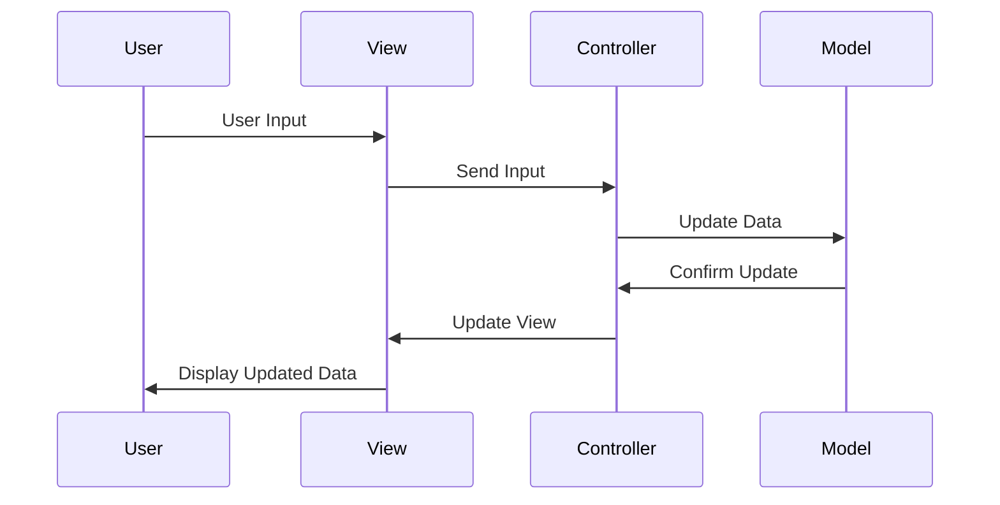

## 8.2. Model-View-Controller (MVC)

The Model-View-Controller (MVC) pattern is a fundamental architectural pattern that is widely used in software design to separate concerns and enhance modularity. This pattern divides an application into three interconnected components: the Model, the View, and the Controller. Each component has distinct responsibilities, which allows for more organized and maintainable code. In this section, we will delve into the MVC pattern, exploring its intent, key participants, applicability, and providing a pseudocode implementation to illustrate its use.

### Intent of the MVC Pattern

The primary intent of the MVC pattern is to separate an application into three main components, each responsible for a specific aspect of the application's functionality:

- **Model**: Represents the application's data and business logic. It is responsible for managing the data, responding to requests for information, and updating the data when necessary.
- **View**: Represents the user interface and displays data to the user. It is responsible for rendering the data provided by the Model in a format that is understandable to the user.
- **Controller**: Acts as an intermediary between the Model and the View. It receives user input from the View, processes it (often by invoking methods on the Model), and returns the results to the View for display.

### Key Participants

To better understand the MVC pattern, let's examine the roles and responsibilities of its key participants:

1. **Model**:
   - Encapsulates the application's data and business rules.
   - Notifies the View of any changes to the data.
   - Provides an interface for the Controller to interact with the data.

2. **View**:
   - Displays data to the user.
   - Receives updates from the Model and refreshes the display accordingly.
   - Sends user input to the Controller for processing.

3. **Controller**:
   - Handles user input and converts it into actions for the Model.
   - Updates the View with the results of the actions.
   - Acts as a mediator between the Model and the View.

### Applicability

The MVC pattern is applicable in scenarios where:

- There is a need to separate the user interface from the business logic.
- The application requires multiple views of the same data.
- The application needs to be easily testable and maintainable.
- There is a need to support multiple user interfaces (e.g., web, mobile).

### Pseudocode Implementation

Let's explore a pseudocode implementation of the MVC pattern. In this example, we will create a simple application that manages a list of tasks.

#### Model

The Model is responsible for managing the data and business logic. In our example, the Model will manage a list of tasks.

```pseudocode
class TaskModel:
    tasks = []

    function addTask(task):
        tasks.append(task)
        notifyObservers()

    function removeTask(task):
        tasks.remove(task)
        notifyObservers()

    function getTasks():
        return tasks

    function notifyObservers():
        // Notify all observers about the change
```

#### View

The View is responsible for displaying the data to the user. It will render the list of tasks and provide an interface for adding and removing tasks.

```pseudocode
class TaskView:
    function displayTasks(tasks):
        for task in tasks:
            print("Task:", task)

    function getUserInput():
        // Get user input for adding or removing tasks
```

#### Controller

The Controller handles user input and updates the Model and View accordingly.

```pseudocode
class TaskController:
    model = TaskModel()
    view = TaskView()

    function addTask(task):
        model.addTask(task)
        updateView()

    function removeTask(task):
        model.removeTask(task)
        updateView()

    function updateView():
        tasks = model.getTasks()
        view.displayTasks(tasks)

    function handleUserInput():
        input = view.getUserInput()
        if input.action == "add":
            addTask(input.task)
        elif input.action == "remove":
            removeTask(input.task)
```

### Design Considerations

When implementing the MVC pattern, consider the following:

- **Decoupling**: Ensure that the Model, View, and Controller are decoupled to allow for independent development and testing.
- **Observer Pattern**: Use the Observer pattern to notify the View of changes in the Model.
- **Multiple Views**: Support multiple Views by allowing them to subscribe to the Model's changes.
- **Complexity**: Be mindful of the complexity that can arise from managing the interactions between the Model, View, and Controller.

### Differences and Similarities

The MVC pattern is often confused with other architectural patterns, such as Model-View-Presenter (MVP) and Model-View-ViewModel (MVVM). Here are some key differences:

- **MVP**: In MVP, the Presenter takes on more responsibility than the Controller in MVC. It handles all user input and updates the View directly.
- **MVVM**: In MVVM, the ViewModel acts as an intermediary between the View and the Model, providing data binding capabilities that are not present in MVC.

### Visualizing MVC

To better understand the interactions between the Model, View, and Controller, let's visualize the MVC pattern using a sequence diagram.



### Try It Yourself

To gain a deeper understanding of the MVC pattern, try modifying the pseudocode examples provided. Here are some suggestions:

- Add a feature to edit existing tasks.
- Implement a search functionality to filter tasks.
- Create a graphical user interface (GUI) for the TaskView.

### References and Links

For further reading on the MVC pattern, consider exploring the following resources:

- [MVC Pattern on Wikipedia](https://en.wikipedia.org/wiki/Model%E2%80%93view%E2%80%93controller)
- [MDN Web Docs: MVC](https://developer.mozilla.org/en-US/docs/Glossary/MVC)

### Knowledge Check

To reinforce your understanding of the MVC pattern, consider the following questions:

- What are the main responsibilities of the Model, View, and Controller in the MVC pattern?
- How does the MVC pattern enhance modularity and maintainability in software design?
- What are some common challenges when implementing the MVC pattern?

### Embrace the Journey

Remember, mastering the MVC pattern is just the beginning of your journey in software design. As you progress, you'll encounter more complex patterns and architectures. Keep experimenting, stay curious, and enjoy the journey!

## Quiz Time!



### What is the primary intent of the MVC pattern?

- [x] To separate an application into three main components: Model, View, and Controller.
- [ ] To combine the user interface and business logic into a single component.
- [ ] To enhance the performance of an application.
- [ ] To simplify the database interactions.

> **Explanation:** The primary intent of the MVC pattern is to separate an application into three main components: Model, View, and Controller, each responsible for a specific aspect of the application's functionality.

### Which component in the MVC pattern is responsible for managing the application's data and business logic?

- [x] Model
- [ ] View
- [ ] Controller
- [ ] User Interface

> **Explanation:** The Model is responsible for managing the application's data and business logic in the MVC pattern.

### In the MVC pattern, which component acts as an intermediary between the Model and the View?

- [ ] Model
- [ ] View
- [x] Controller
- [ ] User

> **Explanation:** The Controller acts as an intermediary between the Model and the View, handling user input and updating the Model and View accordingly.

### What is a common challenge when implementing the MVC pattern?

- [x] Managing the interactions between the Model, View, and Controller.
- [ ] Ensuring the View directly updates the Model.
- [ ] Combining the Model and Controller into a single component.
- [ ] Eliminating the need for user input.

> **Explanation:** A common challenge when implementing the MVC pattern is managing the interactions between the Model, View, and Controller.

### Which pattern is often confused with MVC due to its similar structure?

- [x] MVP (Model-View-Presenter)
- [ ] Singleton
- [ ] Factory Method
- [ ] Observer

> **Explanation:** The MVP (Model-View-Presenter) pattern is often confused with MVC due to its similar structure, but the Presenter in MVP takes on more responsibility than the Controller in MVC.

### What is the role of the View in the MVC pattern?

- [x] To display data to the user and receive updates from the Model.
- [ ] To manage the application's data and business logic.
- [ ] To handle user input and update the Model and View.
- [ ] To act as an intermediary between the Model and the Controller.

> **Explanation:** The View is responsible for displaying data to the user and receiving updates from the Model in the MVC pattern.

### How does the MVC pattern support multiple views of the same data?

- [x] By allowing multiple Views to subscribe to the Model's changes.
- [ ] By combining all Views into a single component.
- [ ] By eliminating the need for a Controller.
- [ ] By directly updating the Model from the View.

> **Explanation:** The MVC pattern supports multiple views of the same data by allowing multiple Views to subscribe to the Model's changes.

### What is a key difference between MVC and MVVM?

- [x] MVVM provides data binding capabilities that are not present in MVC.
- [ ] MVC combines the View and Model into a single component.
- [ ] MVVM eliminates the need for a Controller.
- [ ] MVC directly updates the View from the Model.

> **Explanation:** A key difference between MVC and MVVM is that MVVM provides data binding capabilities that are not present in MVC.

### True or False: The Controller in MVC directly updates the Model and View.

- [x] True
- [ ] False

> **Explanation:** True. The Controller in MVC directly updates the Model and View by handling user input and converting it into actions for the Model, then updating the View with the results.

### Which pattern is used to notify the View of changes in the Model in the MVC pattern?

- [x] Observer Pattern
- [ ] Singleton Pattern
- [ ] Factory Method Pattern
- [ ] Strategy Pattern

> **Explanation:** The Observer Pattern is used to notify the View of changes in the Model in the MVC pattern.


