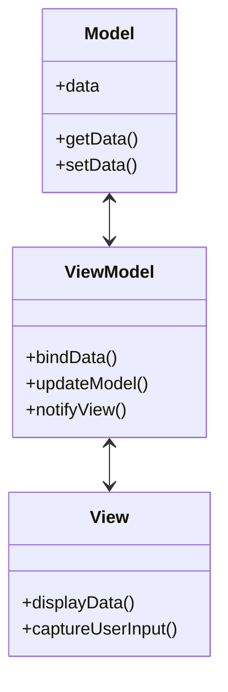
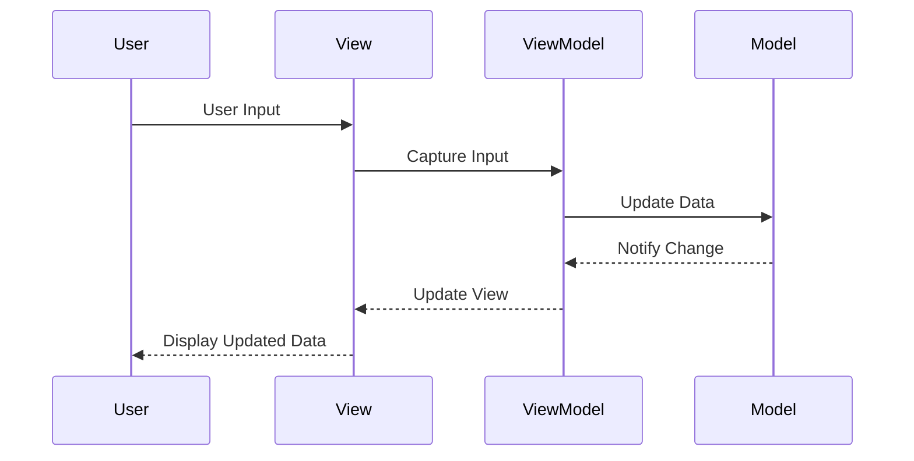

## 8.3. Model-View-ViewModel (MVVM)

The Model-View-ViewModel (MVVM) architectural pattern is a powerful design pattern that promotes a clear separation of concerns in software development. It is particularly popular in the development of user interfaces, especially in environments like WPF (Windows Presentation Foundation), Silverlight, and other frameworks that support data binding. This pattern facilitates a clean architecture by decoupling the user interface from the business logic, making it easier to manage, test, and extend.

### Intent

The primary intent of the MVVM pattern is to separate the development of the graphical user interface (GUI) from the business logic or back-end logic (the data model). This separation allows developers to work on the UI and the business logic independently, which can lead to more efficient development processes and cleaner, more maintainable code.

### Key Participants

1. **Model**: Represents the data and business logic of the application. It is responsible for managing the data and ensuring its integrity.

2. **View**: The user interface of the application. It displays data and sends user commands to the ViewModel.

3. **ViewModel**: Serves as an intermediary between the View and the Model. It handles the presentation logic and data binding, exposing data from the Model in a way that is easily consumable by the View.

### Applicability

The MVVM pattern is particularly applicable in scenarios where:

- You need to separate the user interface from the business logic.
- The application requires a dynamic and responsive UI.
- You want to facilitate unit testing of the business logic.
- The development team includes both designers and developers working on the same project.

### Diagrams

To better understand the MVVM pattern, let's visualize the relationships between the Model, View, and ViewModel using a class diagram.



**Diagram Explanation:** The diagram illustrates the interaction between the Model, View, and ViewModel. The ViewModel acts as a bridge between the Model and the View, facilitating data binding and communication.

### Data Binding Techniques

Data binding is a core feature of the MVVM pattern, enabling the synchronization of data between the View and the ViewModel. This synchronization ensures that any changes in the ViewModel are automatically reflected in the View and vice versa.

#### One-Way Data Binding

In one-way data binding, data flows from the ViewModel to the View. This is useful for displaying data that does not need to be updated by the user.

#### Two-Way Data Binding

Two-way data binding allows for data to flow both ways, from the ViewModel to the View and from the View to the ViewModel. This is essential for interactive applications where user input needs to be captured and processed.

#### Command Binding

Command binding is used to bind user actions, such as button clicks, to methods in the ViewModel. This allows the ViewModel to respond to user interactions without the View needing to know about the underlying logic.

### Pseudocode Implementation

Let's explore a pseudocode implementation of the MVVM pattern, focusing on data binding techniques.

```pseudocode
// Model
class Model {
    private data

    function getData() {
        return data
    }

    function setData(newData) {
        data = newData
    }
}

// ViewModel
class ViewModel {
    private model
    private view

    function ViewModel(model, view) {
        this.model = model
        this.view = view
        bindData()
    }

    function bindData() {
        view.displayData(model.getData())
    }

    function updateModel(newData) {
        model.setData(newData)
        notifyView()
    }

    function notifyView() {
        view.displayData(model.getData())
    }
}

// View
class View {
    function displayData(data) {
        // Code to update the UI with new data
    }

    function captureUserInput() {
        // Code to capture user input and send it to the ViewModel
    }
}

// Usage
model = new Model()
view = new View()
viewModel = new ViewModel(model, view)

// Simulate user input
view.captureUserInput()
```

**Code Explanation:** In this pseudocode, we define a simple MVVM architecture. The `Model` class manages the data, the `ViewModel` class acts as an intermediary, and the `View` class handles the user interface. The `ViewModel` binds data from the `Model` to the `View` and updates the `Model` based on user input.

### Design Considerations

When implementing the MVVM pattern, consider the following:

- **Complexity**: MVVM can introduce complexity, particularly in small applications where the separation of concerns may not be necessary.
- **Data Binding**: Ensure that data binding is efficient and does not lead to performance issues.
- **Testing**: MVVM facilitates testing, but ensure that your tests cover all aspects of the ViewModel logic.
- **Tool Support**: Use frameworks and tools that support MVVM and data binding to streamline development.

### Differences and Similarities

The MVVM pattern is often compared to the Model-View-Controller (MVC) pattern. While both patterns aim to separate concerns, MVVM is more suited for applications with complex data binding requirements. In contrast, MVC is more straightforward and may be more appropriate for simpler applications.

### Try It Yourself

To deepen your understanding of the MVVM pattern, try modifying the pseudocode example:

- Implement two-way data binding by allowing the `View` to update the `Model` through the `ViewModel`.
- Add command binding to handle user interactions, such as button clicks.
- Experiment with different data binding techniques and observe their effects on the application.

### Visualizing MVVM in Action

Let's visualize the flow of data and commands in an MVVM application using a sequence diagram.



**Diagram Explanation:** This sequence diagram illustrates the flow of data and commands in an MVVM application. The user interacts with the View, which communicates with the ViewModel to update the Model. The Model notifies the ViewModel of any changes, which then updates the View.

### References and Links

For further reading on the MVVM pattern and data binding techniques, consider the following resources:

- [Microsoft Docs on MVVM](https://docs.microsoft.com/en-us/dotnet/desktop/wpf/advanced/mvvm)
- [W3Schools on Data Binding](https://www.w3schools.com/)
- [MDN Web Docs on JavaScript Data Binding](https://developer.mozilla.org/en-US/docs/Web/JavaScript)

### Knowledge Check

To reinforce your understanding of the MVVM pattern, consider the following questions:

1. What are the main components of the MVVM pattern?
2. How does data binding facilitate communication between the View and the ViewModel?
3. What are the advantages of using MVVM in a complex application?
4. How does MVVM differ from MVC in terms of data binding?
5. What are some potential pitfalls of implementing the MVVM pattern?

### Embrace the Journey

Remember, mastering the MVVM pattern is a journey. As you continue to explore and experiment with different data binding techniques, you'll gain a deeper understanding of how to create clean, maintainable, and efficient software architectures. Keep experimenting, stay curious, and enjoy the journey!

## Quiz Time!



### What is the primary intent of the MVVM pattern?

- [x] To separate the user interface from the business logic.
- [ ] To merge the user interface with the business logic.
- [ ] To simplify the user interface design.
- [ ] To enhance the complexity of the application.

> **Explanation:** The primary intent of the MVVM pattern is to separate the user interface from the business logic, allowing for independent development and maintenance.

### Which component in MVVM acts as an intermediary between the View and the Model?

- [ ] Model
- [ ] View
- [x] ViewModel
- [ ] Controller

> **Explanation:** The ViewModel acts as an intermediary between the View and the Model, handling data binding and presentation logic.

### What type of data binding allows data to flow both ways between the ViewModel and the View?

- [ ] One-Way Data Binding
- [x] Two-Way Data Binding
- [ ] Command Binding
- [ ] Event Binding

> **Explanation:** Two-way data binding allows data to flow both ways between the ViewModel and the View, enabling interactive applications.

### In the MVVM pattern, which component is responsible for managing the data and business logic?

- [x] Model
- [ ] View
- [ ] ViewModel
- [ ] Controller

> **Explanation:** The Model is responsible for managing the data and business logic in the MVVM pattern.

### What is a potential pitfall of implementing the MVVM pattern?

- [x] Increased complexity in small applications.
- [ ] Simplified testing processes.
- [ ] Enhanced performance in all scenarios.
- [ ] Reduced separation of concerns.

> **Explanation:** MVVM can introduce complexity, particularly in small applications where the separation of concerns may not be necessary.

### Which pattern is often compared to MVVM due to its similar goal of separating concerns?

- [ ] Singleton
- [ ] Factory
- [x] MVC
- [ ] Observer

> **Explanation:** The MVC pattern is often compared to MVVM as both aim to separate concerns in application development.

### What is the role of the View in the MVVM pattern?

- [ ] To manage data and business logic.
- [x] To display data and capture user input.
- [ ] To act as an intermediary between the Model and ViewModel.
- [ ] To handle command execution.

> **Explanation:** The View is responsible for displaying data and capturing user input in the MVVM pattern.

### How does command binding benefit the MVVM pattern?

- [ ] It merges the View and Model components.
- [ ] It simplifies data management.
- [x] It binds user actions to methods in the ViewModel.
- [ ] It eliminates the need for a ViewModel.

> **Explanation:** Command binding allows user actions to be bound to methods in the ViewModel, enabling the ViewModel to respond to user interactions.

### Which of the following is NOT a key participant in the MVVM pattern?

- [ ] Model
- [ ] View
- [x] Controller
- [ ] ViewModel

> **Explanation:** The Controller is not a key participant in the MVVM pattern; it is part of the MVC pattern.

### True or False: MVVM is more suited for applications with complex data binding requirements than MVC.

- [x] True
- [ ] False

> **Explanation:** MVVM is more suited for applications with complex data binding requirements due to its focus on data binding and separation of concerns.


