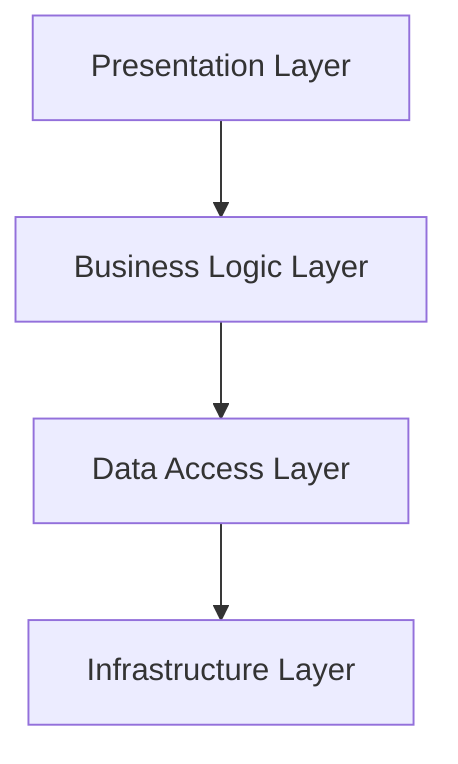

## 8.4. Layered Architecture

In the realm of software design, the **Layered Architecture** pattern stands as a fundamental approach to organizing code into distinct layers. This architectural style is pivotal in creating scalable, maintainable, and robust systems. By segmenting a system into layers, developers can manage complexity, enhance modularity, and facilitate easier maintenance and testing. In this section, we will delve into the intricacies of Layered Architecture, exploring its benefits, trade-offs, and practical implementation using pseudocode.

### Understanding Layered Architecture

Layered Architecture is an architectural pattern that divides a software system into layers, each with a specific responsibility. The primary goal is to separate concerns, allowing each layer to focus on a particular aspect of the application. This separation enhances the system's maintainability and scalability by enabling developers to modify or replace individual layers without affecting others.

#### Key Concepts

1. **Separation of Concerns**: Each layer in the architecture is responsible for a specific aspect of the application, such as presentation, business logic, or data access. This separation allows for more manageable and understandable code.

2. **Modularity**: By organizing code into layers, developers can achieve a modular design where each layer can be developed, tested, and maintained independently.

3. **Scalability**: Layered Architecture supports scalability by allowing individual layers to be scaled independently based on the system's needs.

4. **Reusability**: Common functionalities can be encapsulated within layers, promoting code reuse across different parts of the application.

5. **Testability**: With clear boundaries between layers, testing becomes more straightforward, as each layer can be tested in isolation.

### Typical Layers in Layered Architecture

A typical Layered Architecture consists of the following layers:

1. **Presentation Layer**: This layer is responsible for handling user interactions and presenting data to the user. It includes user interfaces, views, and controllers.

2. **Business Logic Layer**: Also known as the application layer, this layer contains the core functionality of the application. It processes data, applies business rules, and performs calculations.

3. **Data Access Layer**: This layer manages data retrieval and storage. It interacts with databases, file systems, or external services to fetch and persist data.

4. **Infrastructure Layer**: This optional layer provides support services such as logging, authentication, and network communication.

### Diagram: Visualizing Layered Architecture

To better understand the structure of Layered Architecture, let's visualize it using a diagram:



**Diagram Description**: The diagram illustrates the flow of data and control between the layers. The Presentation Layer interacts with the Business Logic Layer, which in turn communicates with the Data Access Layer. The Infrastructure Layer supports the other layers with cross-cutting concerns.

### Benefits of Layered Architecture

Layered Architecture offers several advantages that make it a popular choice for software design:

1. **Maintainability**: By isolating different concerns into separate layers, changes can be made to one layer without affecting others. This isolation simplifies maintenance and reduces the risk of introducing bugs.

2. **Scalability**: Layers can be scaled independently, allowing the system to handle increased load by distributing responsibilities across multiple servers or services.

3. **Flexibility**: The modular nature of Layered Architecture allows for easy integration of new features or technologies. Developers can replace or upgrade individual layers without impacting the entire system.

4. **Reusability**: Common functionalities encapsulated within layers can be reused across different applications or modules, reducing duplication and promoting consistency.

5. **Testability**: With clear boundaries between layers, testing becomes more straightforward. Each layer can be tested independently, ensuring that changes do not inadvertently affect other parts of the system.

### Trade-offs and Considerations

While Layered Architecture offers numerous benefits, it also comes with certain trade-offs and considerations:

1. **Performance Overhead**: The separation of concerns can introduce additional overhead due to inter-layer communication. This overhead may impact performance, especially in high-throughput systems.

2. **Complexity**: As the number of layers increases, the architecture can become more complex, requiring careful management to avoid unnecessary dependencies and coupling.

3. **Rigid Structure**: The predefined structure of layers may limit flexibility in certain scenarios, making it challenging to adapt to specific requirements or constraints.

4. **Over-Engineering**: In some cases, the use of Layered Architecture may lead to over-engineering, where the complexity of the architecture outweighs its benefits for simple applications.

### Sample Code Snippets

Let's explore how to implement a simple Layered Architecture using pseudocode. We'll create a basic application with three layers: Presentation, Business Logic, and Data Access.

#### Presentation Layer

```pseudocode
// Presentation Layer: Handles user interactions
class UserInterface {
    function displayData(data) {
        print("Displaying data: " + data);
    }

    function getUserInput() {
        return "User input data";
    }
}
```

#### Business Logic Layer

```pseudocode
// Business Logic Layer: Processes data and applies business rules
class BusinessLogic {
    private dataAccess;

    function BusinessLogic(dataAccess) {
        this.dataAccess = dataAccess;
    }

    function processData(input) {
        data = this.dataAccess.fetchData();
        // Apply business rules
        result = "Processed " + input + " with " + data;
        return result;
    }
}
```

#### Data Access Layer

```pseudocode
// Data Access Layer: Manages data retrieval and storage
class DataAccess {
    function fetchData() {
        return "Data from database";
    }
}
```

#### Main Application

```pseudocode
// Main Application: Integrates layers
function main() {
    dataAccess = new DataAccess();
    businessLogic = new BusinessLogic(dataAccess);
    userInterface = new UserInterface();

    input = userInterface.getUserInput();
    result = businessLogic.processData(input);
    userInterface.displayData(result);
}

main();
```

### Design Considerations

When implementing Layered Architecture, consider the following design considerations:

1. **Layer Communication**: Ensure that communication between layers is well-defined and follows a consistent protocol. Avoid direct dependencies between non-adjacent layers to maintain separation of concerns.

2. **Layer Granularity**: Determine the appropriate level of granularity for each layer. Too many layers can increase complexity, while too few may lead to tightly coupled code.

3. **Cross-Cutting Concerns**: Address cross-cutting concerns such as logging, authentication, and error handling in a separate infrastructure layer to avoid cluttering the core layers.

4. **Dependency Management**: Use dependency injection to manage dependencies between layers, promoting loose coupling and easier testing.

### Differences and Similarities with Other Patterns

Layered Architecture is often compared to other architectural patterns, such as:

- **Microservices Architecture**: Unlike Layered Architecture, which organizes code into layers, Microservices Architecture decomposes a system into independent services. Each service is responsible for a specific business capability and can be developed, deployed, and scaled independently.

- **Hexagonal Architecture**: Also known as Ports and Adapters, Hexagonal Architecture emphasizes the separation of the core application logic from external systems. It uses adapters to interact with external systems, promoting flexibility and testability.

- **Onion Architecture**: Similar to Hexagonal Architecture, Onion Architecture focuses on the separation of concerns by organizing code into concentric layers. The core of the application is surrounded by layers that handle infrastructure and external interactions.

### Try It Yourself

To deepen your understanding of Layered Architecture, try modifying the sample code snippets to add a new feature or layer. For example, you could:

- Add an Infrastructure Layer to handle logging and error handling.
- Implement a caching mechanism in the Data Access Layer to improve performance.
- Extend the Business Logic Layer to support additional business rules or calculations.

### Knowledge Check

1. **What is the primary goal of Layered Architecture?**
   - To separate concerns and organize code into distinct layers.

2. **What are the typical layers in a Layered Architecture?**
   - Presentation Layer, Business Logic Layer, Data Access Layer, and Infrastructure Layer.

3. **What are the benefits of using Layered Architecture?**
   - Maintainability, scalability, flexibility, reusability, and testability.

4. **What are some trade-offs of Layered Architecture?**
   - Performance overhead, complexity, rigid structure, and potential over-engineering.

5. **How does Layered Architecture differ from Microservices Architecture?**
   - Layered Architecture organizes code into layers, while Microservices Architecture decomposes a system into independent services.

### Conclusion

Layered Architecture is a powerful architectural pattern that provides a structured approach to organizing code into layers. By separating concerns and promoting modularity, it enhances maintainability, scalability, and testability. However, it is essential to consider the trade-offs and design considerations to ensure that the architecture aligns with the system's requirements and constraints. As you continue your journey in mastering design patterns, remember that Layered Architecture is just one of many tools in your toolkit. Embrace the flexibility and adaptability that comes with understanding and applying different architectural patterns to create robust and scalable software systems.

## Quiz Time!



### What is the primary goal of Layered Architecture?

- [x] To separate concerns and organize code into distinct layers.
- [ ] To increase the number of components in a system.
- [ ] To reduce the number of classes in a system.
- [ ] To eliminate the need for testing.

> **Explanation:** The primary goal of Layered Architecture is to separate concerns and organize code into distinct layers, enhancing maintainability and scalability.

### Which layer is responsible for handling user interactions in Layered Architecture?

- [x] Presentation Layer
- [ ] Business Logic Layer
- [ ] Data Access Layer
- [ ] Infrastructure Layer

> **Explanation:** The Presentation Layer is responsible for handling user interactions and presenting data to the user.

### What is a potential trade-off of using Layered Architecture?

- [x] Performance overhead
- [ ] Increased simplicity
- [ ] Reduced modularity
- [ ] Elimination of dependencies

> **Explanation:** A potential trade-off of using Layered Architecture is performance overhead due to inter-layer communication.

### How does Layered Architecture differ from Microservices Architecture?

- [x] Layered Architecture organizes code into layers, while Microservices Architecture decomposes a system into independent services.
- [ ] Layered Architecture focuses on external systems, while Microservices Architecture focuses on internal systems.
- [ ] Layered Architecture is always more scalable than Microservices Architecture.
- [ ] Layered Architecture eliminates the need for databases.

> **Explanation:** Layered Architecture organizes code into layers, while Microservices Architecture decomposes a system into independent services.

### What is the role of the Business Logic Layer in Layered Architecture?

- [x] To process data and apply business rules
- [ ] To handle user interactions
- [ ] To manage data retrieval and storage
- [ ] To provide support services like logging

> **Explanation:** The Business Logic Layer processes data and applies business rules, forming the core functionality of the application.

### What is a benefit of using Layered Architecture?

- [x] Enhanced maintainability
- [ ] Increased complexity
- [ ] Reduced testability
- [ ] Elimination of all bugs

> **Explanation:** Layered Architecture enhances maintainability by isolating different concerns into separate layers.

### Which layer in Layered Architecture is responsible for data retrieval and storage?

- [x] Data Access Layer
- [ ] Presentation Layer
- [ ] Business Logic Layer
- [ ] Infrastructure Layer

> **Explanation:** The Data Access Layer manages data retrieval and storage, interacting with databases or external services.

### What is a common similarity between Layered Architecture and Hexagonal Architecture?

- [x] Both emphasize separation of concerns.
- [ ] Both eliminate the need for a database.
- [ ] Both require a single layer for all functionality.
- [ ] Both are only applicable to web applications.

> **Explanation:** Both Layered Architecture and Hexagonal Architecture emphasize separation of concerns to enhance modularity and flexibility.

### What is a key consideration when implementing Layered Architecture?

- [x] Ensuring well-defined communication between layers
- [ ] Eliminating all layers to simplify the system
- [ ] Avoiding the use of any external libraries
- [ ] Ensuring all layers are tightly coupled

> **Explanation:** Ensuring well-defined communication between layers is crucial to maintaining separation of concerns and modularity.

### True or False: Layered Architecture is always the best choice for every software system.

- [ ] True
- [x] False

> **Explanation:** False. Layered Architecture is not always the best choice for every software system. The choice of architecture should be based on the specific requirements and constraints of the system.


