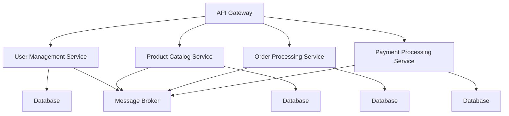

## 8.5. Microservices Architecture

Microservices Architecture has emerged as a powerful paradigm for designing distributed systems, enabling organizations to build scalable, flexible, and resilient applications. This section delves into the core concepts of microservices, focusing on service decomposition and the architectural principles that underpin this approach. We will explore how to implement microservices effectively using pseudocode examples and diagrams to illustrate key concepts.

### Introduction to Microservices Architecture

Microservices Architecture is an architectural style that structures an application as a collection of loosely coupled services. Each service is self-contained, with its own business logic and database, and communicates with other services through well-defined APIs. This approach contrasts with traditional monolithic architectures, where all components are tightly integrated into a single application.

#### Key Characteristics of Microservices

- **Decentralization**: Each microservice is developed, deployed, and scaled independently, allowing teams to work autonomously.
- **Resilience**: Microservices can fail independently without affecting the entire system, enhancing overall system reliability.
- **Scalability**: Services can be scaled individually based on demand, optimizing resource utilization.
- **Technology Agnosticism**: Different services can be built using different technologies, allowing teams to choose the best tools for each task.

### Designing Distributed Systems

Designing distributed systems with microservices involves several key considerations, including service decomposition, communication patterns, and data management. Let's explore these aspects in detail.

#### Service Decomposition

Service decomposition is the process of breaking down a monolithic application into smaller, independent services. This requires identifying the boundaries of each service and ensuring that they encapsulate specific business capabilities.

##### Principles of Service Decomposition

1. **Single Responsibility Principle**: Each service should have a single responsibility, focusing on a specific business capability.
2. **High Cohesion and Low Coupling**: Services should be highly cohesive, with related functionalities grouped together, and loosely coupled, minimizing dependencies between services.
3. **Domain-Driven Design (DDD)**: Use DDD principles to define service boundaries based on business domains and subdomains.

##### Steps for Service Decomposition

1. **Identify Business Capabilities**: Analyze the application to identify distinct business capabilities that can be encapsulated as services.
2. **Define Service Boundaries**: Determine the boundaries of each service based on business capabilities and data ownership.
3. **Design APIs**: Design APIs for each service, ensuring clear and consistent communication interfaces.
4. **Implement Services**: Develop each service independently, using appropriate technologies and frameworks.

##### Example of Service Decomposition

Consider an e-commerce application with the following business capabilities:

- User Management
- Product Catalog
- Order Processing
- Payment Processing

Each of these capabilities can be encapsulated as a separate microservice, with its own database and API.

```pseudocode
// Pseudocode for Service Decomposition

service UserManagement {
    // Handle user registration, authentication, and profile management
    function registerUser(userData) { ... }
    function authenticateUser(credentials) { ... }
    function updateUserProfile(userId, profileData) { ... }
}

service ProductCatalog {
    // Manage product listings and inventory
    function addProduct(productData) { ... }
    function updateProduct(productId, productData) { ... }
    function getProduct(productId) { ... }
}

service OrderProcessing {
    // Handle order creation, updates, and tracking
    function createOrder(orderData) { ... }
    function updateOrder(orderId, orderData) { ... }
    function trackOrder(orderId) { ... }
}

service PaymentProcessing {
    // Process payments and handle transactions
    function processPayment(paymentData) { ... }
    function refundPayment(transactionId) { ... }
    function getTransactionStatus(transactionId) { ... }
}
```

### Communication Patterns in Microservices

Microservices communicate with each other through well-defined APIs, using various communication patterns. These patterns can be broadly categorized into synchronous and asynchronous communication.

#### Synchronous Communication

In synchronous communication, services communicate in real-time, waiting for responses before proceeding. This is typically achieved using HTTP/REST or gRPC.

- **HTTP/REST**: A widely used protocol for synchronous communication, leveraging standard HTTP methods (GET, POST, PUT, DELETE) for CRUD operations.
- **gRPC**: A high-performance RPC framework that uses HTTP/2 for transport, providing features like streaming and multiplexing.

##### Example of Synchronous Communication

```pseudocode
// Pseudocode for Synchronous Communication using HTTP/REST

// User Management Service
function getUserProfile(userId) {
    // Call the User Management API to retrieve user profile
    response = http.get("http://usermanagement/api/users/" + userId)
    return response.data
}

// Order Processing Service
function createOrder(orderData) {
    // Call the Order Processing API to create a new order
    response = http.post("http://orderprocessing/api/orders", orderData)
    return response.data
}
```

#### Asynchronous Communication

In asynchronous communication, services communicate without waiting for immediate responses, allowing for more flexible and resilient interactions. This is typically achieved using message brokers like RabbitMQ or Kafka.

- **Message Brokers**: Facilitate asynchronous communication by decoupling message producers and consumers, enabling services to publish and subscribe to messages.
- **Event-Driven Architecture**: Services communicate by emitting and responding to events, promoting loose coupling and scalability.

##### Example of Asynchronous Communication

```pseudocode
// Pseudocode for Asynchronous Communication using Message Brokers

// Order Processing Service
function createOrder(orderData) {
    // Publish order creation event to the message broker
    messageBroker.publish("order.created", orderData)
}

// Payment Processing Service
function onOrderCreated(orderData) {
    // Subscribe to order creation events
    messageBroker.subscribe("order.created", (orderData) => {
        // Process payment for the order
        processPayment(orderData.paymentInfo)
    })
}
```

### Data Management in Microservices

Data management in microservices involves handling data consistency, storage, and retrieval across distributed services. Each service typically owns its own data, promoting autonomy and scalability.

#### Data Consistency

Ensuring data consistency across services is a critical challenge in microservices architecture. This can be addressed using patterns like eventual consistency and distributed transactions.

- **Eventual Consistency**: Accepts temporary inconsistencies, ensuring data consistency over time through asynchronous updates and reconciliation.
- **Distributed Transactions**: Use techniques like the Saga pattern to manage transactions across multiple services without locking resources.

##### Example of Eventual Consistency

```pseudocode
// Pseudocode for Eventual Consistency

// Product Catalog Service
function updateProductStock(productId, quantity) {
    // Update product stock in the local database
    database.update("products", productId, { stock: quantity })

    // Publish stock update event to the message broker
    messageBroker.publish("product.stockUpdated", { productId, quantity })
}

// Order Processing Service
function onProductStockUpdated(eventData) {
    // Subscribe to product stock update events
    messageBroker.subscribe("product.stockUpdated", (eventData) => {
        // Update order status based on stock availability
        updateOrderStatus(eventData.productId, eventData.quantity)
    })
}
```

### Security Considerations in Microservices

Security is a paramount concern in microservices architecture, requiring robust mechanisms for authentication, authorization, and data protection.

#### Authentication and Authorization

Implementing secure authentication and authorization mechanisms is crucial to protect microservices from unauthorized access.

- **OAuth2 and OpenID Connect**: Use these protocols for secure, token-based authentication and authorization.
- **API Gateway**: Centralize authentication and authorization logic at the API gateway, simplifying security management.

##### Example of Authentication and Authorization

```pseudocode
// Pseudocode for Authentication and Authorization

// API Gateway
function authenticateRequest(request) {
    // Validate OAuth2 token and retrieve user information
    userInfo = oauth2.validateToken(request.headers.authorization)
    if (!userInfo) {
        throw new Error("Unauthorized")
    }
    return userInfo
}

// User Management Service
function getUserProfile(userId, userInfo) {
    // Check if the user has permission to access the profile
    if (userInfo.userId !== userId && !userInfo.roles.includes("admin")) {
        throw new Error("Forbidden")
    }
    // Retrieve user profile from the database
    return database.get("users", userId)
}
```

### Monitoring and Observability

Monitoring and observability are essential for maintaining the health and performance of microservices, providing insights into system behavior and facilitating troubleshooting.

#### Key Components of Monitoring and Observability

- **Logging**: Capture detailed logs for each service, enabling traceability and debugging.
- **Metrics**: Collect and analyze metrics like response times, error rates, and resource utilization.
- **Distributed Tracing**: Track requests across services, identifying bottlenecks and performance issues.

##### Example of Monitoring and Observability

```pseudocode
// Pseudocode for Monitoring and Observability

// Logging Service
function logRequest(serviceName, request) {
    // Capture request details and log them
    logger.info(`[${serviceName}] Request: ${request.method} ${request.url}`)
}

// Metrics Service
function recordMetric(serviceName, metricName, value) {
    // Record and store metrics for analysis
    metrics.store(serviceName, metricName, value)
}

// Tracing Service
function traceRequest(requestId, serviceName, operation) {
    // Track request across services
    tracer.startSpan(requestId, serviceName, operation)
}
```

### Deployment and Scaling

Deployment and scaling are critical aspects of microservices architecture, enabling services to be deployed independently and scaled based on demand.

#### Deployment Strategies

- **Continuous Deployment**: Automate the deployment process, enabling rapid and frequent releases.
- **Blue-Green Deployment**: Maintain two identical environments (blue and green) to minimize downtime during deployments.

##### Example of Deployment Strategy

```pseudocode
// Pseudocode for Blue-Green Deployment

// Deployment Service
function deployNewVersion(serviceName, version) {
    // Deploy new version to the green environment
    environment.deploy("green", serviceName, version)

    // Switch traffic to the green environment
    loadBalancer.routeTraffic("green")

    // Monitor the new version for issues
    monitorService(serviceName, version)
}
```

#### Scaling Strategies

- **Horizontal Scaling**: Add more instances of a service to handle increased load.
- **Vertical Scaling**: Increase the resources (CPU, memory) of existing instances.

##### Example of Scaling Strategy

```pseudocode
// Pseudocode for Horizontal Scaling

// Scaling Service
function scaleService(serviceName, desiredInstances) {
    // Adjust the number of service instances
    orchestrator.scale(serviceName, desiredInstances)
}
```

### Visualizing Microservices Architecture

To better understand the structure and interactions within a microservices architecture, let's visualize the components and their relationships.



**Diagram Description**: This diagram illustrates a typical microservices architecture for an e-commerce application. The API Gateway routes requests to various services, each with its own database. Services communicate asynchronously through a message broker, promoting loose coupling and scalability.

### Try It Yourself

To deepen your understanding of microservices architecture, try implementing a simple microservices-based application. Start by decomposing a monolithic application into microservices, designing APIs, and implementing communication patterns. Experiment with different deployment and scaling strategies to see how they affect performance and resilience.

### Conclusion

Microservices Architecture offers a powerful approach to designing distributed systems, enabling organizations to build scalable, flexible, and resilient applications. By focusing on service decomposition, communication patterns, data management, and security, you can effectively implement microservices and reap the benefits of this architectural style. Remember, mastering microservices requires continuous learning and experimentation, so keep exploring and refining your skills.

## Quiz Time!



### What is a key characteristic of microservices architecture?

- [x] Decentralization
- [ ] Tight coupling
- [ ] Single database
- [ ] Monolithic design

> **Explanation:** Microservices architecture is characterized by decentralization, where each service is developed, deployed, and scaled independently.

### Which communication pattern is typically used for real-time interactions in microservices?

- [x] Synchronous communication
- [ ] Asynchronous communication
- [ ] Batch processing
- [ ] File transfer

> **Explanation:** Synchronous communication, such as HTTP/REST or gRPC, is used for real-time interactions in microservices.

### What is the purpose of service decomposition in microservices architecture?

- [x] To break down a monolithic application into smaller, independent services
- [ ] To combine multiple services into a single application
- [ ] To centralize data storage
- [ ] To increase coupling between services

> **Explanation:** Service decomposition involves breaking down a monolithic application into smaller, independent services, each focusing on a specific business capability.

### Which protocol is commonly used for asynchronous communication in microservices?

- [ ] HTTP/REST
- [ ] gRPC
- [x] Message brokers
- [ ] SOAP

> **Explanation:** Message brokers, such as RabbitMQ or Kafka, are commonly used for asynchronous communication in microservices.

### What is eventual consistency in microservices architecture?

- [x] Accepting temporary inconsistencies and ensuring consistency over time
- [ ] Ensuring immediate consistency across all services
- [ ] Using a single database for all services
- [ ] Locking resources during transactions

> **Explanation:** Eventual consistency accepts temporary inconsistencies and ensures consistency over time through asynchronous updates and reconciliation.

### Which deployment strategy involves maintaining two identical environments?

- [ ] Rolling deployment
- [x] Blue-Green deployment
- [ ] Canary deployment
- [ ] A/B testing

> **Explanation:** Blue-Green deployment involves maintaining two identical environments (blue and green) to minimize downtime during deployments.

### What is the role of an API Gateway in microservices architecture?

- [x] To centralize authentication and authorization logic
- [ ] To store data for all services
- [ ] To handle message brokering
- [ ] To manage distributed transactions

> **Explanation:** The API Gateway centralizes authentication and authorization logic, simplifying security management in microservices architecture.

### Which scaling strategy involves adding more instances of a service?

- [x] Horizontal scaling
- [ ] Vertical scaling
- [ ] Diagonal scaling
- [ ] Dynamic scaling

> **Explanation:** Horizontal scaling involves adding more instances of a service to handle increased load.

### What is a benefit of using microservices architecture?

- [x] Enhanced scalability and resilience
- [ ] Increased complexity and coupling
- [ ] Single point of failure
- [ ] Centralized data management

> **Explanation:** Microservices architecture enhances scalability and resilience by allowing services to be scaled and managed independently.

### True or False: Microservices architecture allows different services to be built using different technologies.

- [x] True
- [ ] False

> **Explanation:** Microservices architecture allows different services to be built using different technologies, enabling teams to choose the best tools for each task.


