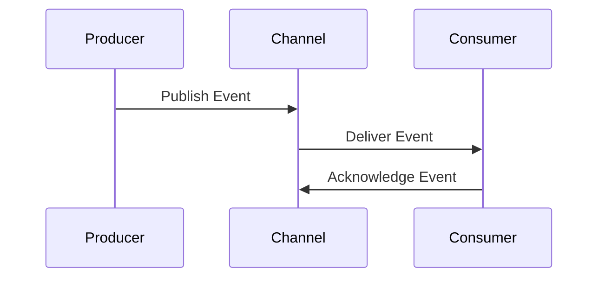

## 8.6. Event-Driven Architecture

Event-Driven Architecture (EDA) is a powerful design pattern that enables systems to react to events in real-time, making them more responsive and scalable. In this section, we will delve into the core concepts of EDA, explore its components, and provide pseudocode examples to illustrate how it can be implemented across different programming paradigms. By the end of this section, you will have a comprehensive understanding of how to leverage EDA to build robust and efficient systems.

### Introduction to Event-Driven Architecture

Event-Driven Architecture is a design paradigm where the flow of the program is determined by events. These events can be anything from user actions, sensor outputs, or messages from other programs. EDA is particularly useful in systems that require high scalability and responsiveness, such as real-time analytics, IoT applications, and microservices architectures.

#### Key Concepts

- **Event**: A significant change in state or occurrence that is of interest to the system.
- **Event Producer**: The component that generates events.
- **Event Consumer**: The component that processes events.
- **Event Channel**: The medium through which events are transmitted from producers to consumers.
- **Event Processing**: The logic that handles the event, which can include filtering, transforming, and routing.

### Benefits of Event-Driven Architecture

EDA offers several advantages:

1. **Scalability**: By decoupling event producers and consumers, systems can scale independently.
2. **Responsiveness**: Systems can react to events in real-time, improving user experience.
3. **Flexibility**: New event consumers can be added without impacting existing components.
4. **Resilience**: Systems can handle failures gracefully by rerouting or retrying events.

### Components of Event-Driven Architecture

#### Event Producers

Event producers are responsible for detecting changes in state and generating events. They can be anything from user interfaces to sensors or other software components.

#### Event Consumers

Event consumers listen for events and execute the appropriate response. They can perform actions such as updating a database, sending notifications, or triggering other processes.

#### Event Channels

Event channels are the pathways through which events travel from producers to consumers. They can be implemented using message brokers, such as Kafka or RabbitMQ, or through direct communication channels.

#### Event Processors

Event processors handle the logic of processing events. They can filter, transform, and route events to the appropriate consumers.

### Implementing Event-Driven Architecture

Let's explore how to implement EDA using pseudocode. We'll start with a simple example and gradually build complexity.

#### Basic Event-Driven System

In this example, we'll create a basic event-driven system with a producer, consumer, and event channel.

```pseudocode
// Define an Event class
class Event {
    string type
    string data
}

// Event Producer
class EventProducer {
    function generateEvent(type, data) {
        Event event = new Event(type, data)
        EventChannel.publish(event)
    }
}

// Event Consumer
class EventConsumer {
    function onEvent(Event event) {
        if event.type == "example" {
            print("Processing event: " + event.data)
        }
    }
}

// Event Channel
class EventChannel {
    static list<EventConsumer> consumers = []

    static function subscribe(EventConsumer consumer) {
        consumers.add(consumer)
    }

    static function publish(Event event) {
        for consumer in consumers {
            consumer.onEvent(event)
        }
    }
}

// Usage
EventConsumer consumer = new EventConsumer()
EventChannel.subscribe(consumer)

EventProducer producer = new EventProducer()
producer.generateEvent("example", "Hello, World!")
```

In this pseudocode, we define an `Event` class, an `EventProducer` that generates events, an `EventConsumer` that processes events, and an `EventChannel` that facilitates communication between producers and consumers.

### Advanced Event Processing

In more complex systems, events may need to be processed in specific ways, such as filtering or transforming data. Let's extend our example to include these features.

#### Filtering and Transforming Events

```pseudocode
// Event Processor with Filtering and Transformation
class EventProcessor {
    function process(Event event) {
        if event.type == "example" {
            event.data = transformData(event.data)
            EventChannel.publish(event)
        }
    }

    function transformData(string data) {
        return data.toUpperCase()
    }
}

// Usage with Processor
EventProcessor processor = new EventProcessor()
EventChannel.subscribe(processor)

producer.generateEvent("example", "Hello, World!")
```

In this example, we introduce an `EventProcessor` that filters events based on their type and transforms the data before republishing it.

### Event-Driven Architecture in Different Paradigms

EDA can be implemented in various programming paradigms, including Object-Oriented Programming (OOP) and Functional Programming (FP). Let's explore how EDA can be adapted to these paradigms.

#### Object-Oriented Programming

In OOP, EDA can be implemented using classes and objects, as demonstrated in the previous examples. The key is to encapsulate event logic within objects and use inheritance or interfaces to define event handling behavior.

#### Functional Programming

In FP, EDA can be implemented using functions and immutable data structures. Events are often represented as data streams, and event processing is achieved through function composition and higher-order functions.

```pseudocode
// Functional Programming Example
function eventProducer(type, data) {
    return { type: type, data: data }
}

function eventConsumer(event) {
    if event.type == "example" {
        print("Processing event: " + event.data)
    }
}

function eventChannel(producer, consumer) {
    let event = producer("example", "Hello, World!")
    consumer(event)
}

// Usage
eventChannel(eventProducer, eventConsumer)
```

In this FP example, we use functions to represent the producer, consumer, and channel. Events are processed by composing these functions.

### Visualizing Event-Driven Architecture

To better understand EDA, let's visualize the flow of events in a system using a sequence diagram.



This diagram illustrates the interaction between the producer, channel, and consumer. Events are published by the producer, delivered to the consumer via the channel, and acknowledged by the consumer.

### Design Considerations

When implementing EDA, consider the following:

- **Latency**: Ensure that event processing is fast enough to meet system requirements.
- **Reliability**: Implement mechanisms to handle event failures, such as retries or dead-letter queues.
- **Scalability**: Design the system to handle increasing event volumes without degradation in performance.
- **Consistency**: Ensure that events are processed in the correct order and that state changes are consistent.

### Differences and Similarities

EDA is often compared to other architectural patterns, such as:

- **Publish-Subscribe**: Both patterns involve decoupling producers and consumers, but EDA focuses on event processing, while publish-subscribe is more about message distribution.
- **Observer Pattern**: Similar to EDA, the observer pattern involves notifying subscribers of changes, but it is typically used within a single application rather than across distributed systems.

### Try It Yourself

Experiment with the pseudocode examples provided. Try modifying the event types, adding new consumers, or implementing additional processing logic. This hands-on approach will deepen your understanding of EDA.

### Conclusion

Event-Driven Architecture is a versatile and powerful design pattern that enables systems to react to events in real-time. By decoupling event producers and consumers, EDA enhances scalability, responsiveness, and flexibility. Whether you're working in an object-oriented or functional paradigm, EDA can be adapted to meet your needs. Keep experimenting, stay curious, and enjoy the journey of mastering event-driven systems.

## Quiz Time!



### What is the primary benefit of Event-Driven Architecture?

- [x] Scalability
- [ ] Simplicity
- [ ] Cost reduction
- [ ] Security

> **Explanation:** EDA enhances scalability by decoupling event producers and consumers, allowing systems to scale independently.

### Which component in EDA is responsible for generating events?

- [x] Event Producer
- [ ] Event Consumer
- [ ] Event Channel
- [ ] Event Processor

> **Explanation:** The Event Producer is responsible for generating events in an Event-Driven Architecture.

### What is the role of an Event Consumer in EDA?

- [ ] Generate events
- [x] Process events
- [ ] Transmit events
- [ ] Store events

> **Explanation:** The Event Consumer processes events by executing the appropriate response.

### How can events be transmitted from producers to consumers?

- [ ] Directly
- [ ] Through a database
- [x] Via an Event Channel
- [ ] Using a file system

> **Explanation:** Events are transmitted from producers to consumers via an Event Channel.

### In Functional Programming, how are events typically represented?

- [ ] As classes
- [x] As data streams
- [ ] As objects
- [ ] As databases

> **Explanation:** In Functional Programming, events are often represented as data streams.

### What is a common mechanism to handle event failures?

- [ ] Ignoring them
- [x] Implementing retries
- [ ] Deleting them
- [ ] Logging them

> **Explanation:** Implementing retries is a common mechanism to handle event failures.

### Which of the following is NOT a benefit of EDA?

- [ ] Flexibility
- [ ] Responsiveness
- [ ] Resilience
- [x] Cost reduction

> **Explanation:** While EDA offers flexibility, responsiveness, and resilience, cost reduction is not a direct benefit.

### What is a key design consideration in EDA?

- [ ] User interface design
- [x] Latency
- [ ] Color scheme
- [ ] Font choice

> **Explanation:** Latency is a key design consideration in EDA to ensure fast event processing.

### True or False: EDA is the same as the Observer Pattern.

- [ ] True
- [x] False

> **Explanation:** EDA is not the same as the Observer Pattern; EDA is used across distributed systems, while the Observer Pattern is typically used within a single application.

### Which diagram is useful for visualizing the flow of events in EDA?

- [ ] Class Diagram
- [x] Sequence Diagram
- [ ] State Diagram
- [ ] Activity Diagram

> **Explanation:** A Sequence Diagram is useful for visualizing the flow of events in Event-Driven Architecture.


