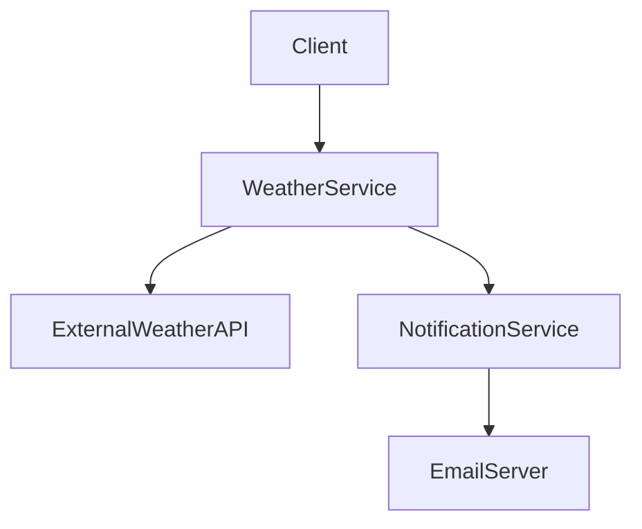

## 8.7. Service-Oriented Architecture (SOA)

Service-Oriented Architecture (SOA) is a design pattern that enables the creation of software systems composed of loosely coupled services. These services communicate over a network to provide functionality to other services or applications. SOA is a key architectural style that supports the development of scalable, flexible, and maintainable systems by promoting reusability and interoperability.

### Introduction to SOA

#### What is SOA?

SOA is an architectural pattern that organizes software components as services. Each service is a discrete unit of functionality that can be accessed remotely and can be independently deployed and managed. Services in SOA are designed to be reusable, interoperable, and loosely coupled, allowing them to be combined and reused across different applications and business processes.

#### Key Concepts of SOA

- **Service**: A self-contained unit of functionality that performs a specific task. Services are designed to be reusable and can be accessed over a network.
- **Loose Coupling**: Services are designed to minimize dependencies on each other, allowing them to evolve independently.
- **Interoperability**: Services can communicate with each other regardless of the underlying platform or technology.
- **Reusability**: Services can be reused across different applications and business processes.
- **Discoverability**: Services can be discovered and accessed dynamically at runtime.

#### Benefits of SOA

- **Scalability**: SOA allows for the distribution of services across multiple servers, enabling systems to scale horizontally.
- **Flexibility**: Services can be updated or replaced without affecting other parts of the system, allowing for greater flexibility in responding to changing business needs.
- **Maintainability**: The modular nature of SOA makes it easier to maintain and update individual services without impacting the entire system.
- **Reusability**: Services can be reused across different applications, reducing development time and costs.

### Implementing Services in SOA

Implementing services in SOA involves designing, developing, and deploying services that can be accessed over a network. This section will explore the key steps and considerations involved in implementing services in SOA.

#### Designing Services

Designing services in SOA involves identifying the functionality that needs to be exposed as a service and defining the service interface. The service interface specifies the operations that the service provides and the data that it consumes and produces.

**Key Considerations for Designing Services:**

- **Granularity**: Determine the appropriate level of granularity for each service. Services should be coarse-grained enough to provide meaningful functionality but fine-grained enough to be reusable.
- **Interface Design**: Define clear and consistent interfaces for each service. Use standard protocols and data formats to ensure interoperability.
- **Statelessness**: Design services to be stateless, meaning that they do not retain any state information between requests. This improves scalability and reliability.
- **Error Handling**: Implement robust error handling mechanisms to ensure that services can gracefully handle failures and provide meaningful error messages.

#### Developing Services

Developing services in SOA involves implementing the service logic and deploying the service to a runtime environment. This section will provide an overview of the key steps involved in developing services.

**Steps for Developing Services:**

1. **Define the Service Interface**: Specify the operations that the service provides and the data that it consumes and produces.
2. **Implement the Service Logic**: Develop the code that implements the service's functionality. This may involve accessing databases, calling other services, or performing business logic.
3. **Deploy the Service**: Deploy the service to a runtime environment where it can be accessed by other services or applications. This may involve deploying the service to a cloud platform, a container, or a traditional server.

#### Sample Pseudocode for a Simple Service

Below is a sample pseudocode for a simple service that provides weather information. This service exposes an operation to get the current weather for a given location.

```pseudocode
// Define the service interface
interface WeatherService {
    // Operation to get the current weather for a given location
    function getCurrentWeather(location: String): WeatherData
}

// Implement the service logic
class WeatherServiceImpl implements WeatherService {
    function getCurrentWeather(location: String): WeatherData {
        // Call an external weather API to get the current weather data
        weatherData = externalWeatherAPI.getWeather(location)
        
        // Return the weather data
        return weatherData
    }
}

// Deploy the service to a runtime environment
deployService(WeatherServiceImpl, "http://example.com/weather")
```

### Integration Techniques in SOA

Integration is a key aspect of SOA, as services need to communicate and interact with each other to provide functionality. This section will explore the key integration techniques used in SOA.

#### Synchronous vs. Asynchronous Communication

- **Synchronous Communication**: In synchronous communication, the client sends a request to the service and waits for a response. This is suitable for operations that require immediate feedback.
- **Asynchronous Communication**: In asynchronous communication, the client sends a request to the service and continues processing without waiting for a response. This is suitable for operations that can be processed in the background.

#### Messaging Protocols

SOA relies on standard messaging protocols to enable communication between services. Common messaging protocols used in SOA include:

- **HTTP/HTTPS**: A widely used protocol for synchronous communication between services.
- **SOAP (Simple Object Access Protocol)**: A protocol for exchanging structured information in web services.
- **REST (Representational State Transfer)**: An architectural style that uses HTTP for communication between services.
- **AMQP (Advanced Message Queuing Protocol)**: A protocol for asynchronous communication between services.

#### Service Orchestration and Choreography

- **Service Orchestration**: In service orchestration, a central coordinator controls the interactions between services. This is suitable for processes that require complex coordination.
- **Service Choreography**: In service choreography, services interact with each other directly without a central coordinator. This is suitable for processes that require loose coupling and flexibility.

#### Sample Pseudocode for Service Integration

Below is a sample pseudocode for integrating two services using synchronous communication. In this example, a `WeatherService` is integrated with a `NotificationService` to send weather alerts.

```pseudocode
// Define the NotificationService interface
interface NotificationService {
    // Operation to send a notification
    function sendNotification(recipient: String, message: String)
}

// Implement the WeatherService with integration
class WeatherServiceImpl implements WeatherService {
    // Reference to the NotificationService
    notificationService: NotificationService

    function getCurrentWeather(location: String): WeatherData {
        // Call an external weather API to get the current weather data
        weatherData = externalWeatherAPI.getWeather(location)
        
        // Check if there is a weather alert
        if (weatherData.alert) {
            // Send a notification using the NotificationService
            notificationService.sendNotification("user@example.com", weatherData.alertMessage)
        }
        
        // Return the weather data
        return weatherData
    }
}

// Deploy the services to a runtime environment
deployService(WeatherServiceImpl, "http://example.com/weather")
deployService(NotificationServiceImpl, "http://example.com/notification")
```

### Visualizing SOA

To better understand the structure and interactions in SOA, let's visualize a simple SOA system using a diagram. This diagram illustrates the interaction between different services in an SOA system.



**Diagram Description:** This diagram shows a client interacting with a `WeatherService`, which in turn interacts with an `ExternalWeatherAPI` to get weather data. If there is a weather alert, the `WeatherService` uses a `NotificationService` to send an email notification via an `EmailServer`.

### Design Considerations for SOA

When implementing SOA, it's important to consider various design aspects to ensure the system is scalable, maintainable, and efficient.

#### Key Design Considerations:

- **Service Granularity**: Determine the appropriate level of granularity for services to balance reusability and performance.
- **Security**: Implement security measures to protect services from unauthorized access and ensure data privacy.
- **Scalability**: Design services to scale horizontally by distributing them across multiple servers or containers.
- **Monitoring and Logging**: Implement monitoring and logging mechanisms to track service performance and diagnose issues.

#### Differences and Similarities with Microservices

SOA and microservices are often compared due to their similarities in promoting service-based architectures. However, there are key differences:

- **Granularity**: Microservices are typically more fine-grained than SOA services, focusing on a single business capability.
- **Technology Stack**: Microservices often use a diverse technology stack, while SOA may use a more uniform stack.
- **Deployment**: Microservices are independently deployable, while SOA services may be more tightly coupled in deployment.

### Try It Yourself

To deepen your understanding of SOA, try modifying the pseudocode examples provided. Experiment with different messaging protocols, service interfaces, and integration techniques. Consider implementing additional services and integrating them into the existing system.

### Knowledge Check

- **Question 1**: What are the key benefits of SOA?
- **Question 2**: How does service orchestration differ from service choreography?
- **Question 3**: What are the common messaging protocols used in SOA?

### Summary

Service-Oriented Architecture (SOA) is a powerful architectural pattern that enables the creation of scalable, flexible, and maintainable systems. By organizing software components as services, SOA promotes reusability, interoperability, and loose coupling. Understanding the key concepts, design considerations, and integration techniques of SOA is essential for implementing effective service-based systems.

### References and Further Reading

- [Service-Oriented Architecture on Wikipedia](https://en.wikipedia.org/wiki/Service-oriented_architecture)
- [RESTful Web Services](https://restfulapi.net/)
- [SOAP Web Services](https://www.w3schools.com/xml/xml_soap.asp)

## Quiz Time!



### What is a key benefit of SOA?

- [x] Scalability
- [ ] Complexity
- [ ] Tight Coupling
- [ ] High Latency

> **Explanation:** SOA allows for the distribution of services across multiple servers, enabling systems to scale horizontally.

### Which communication style is suitable for operations that require immediate feedback?

- [x] Synchronous Communication
- [ ] Asynchronous Communication
- [ ] Batch Processing
- [ ] Event-Driven

> **Explanation:** Synchronous communication involves the client waiting for a response, making it suitable for operations requiring immediate feedback.

### What is the role of a service interface in SOA?

- [x] To specify the operations and data of a service
- [ ] To manage service deployment
- [ ] To handle service errors
- [ ] To monitor service performance

> **Explanation:** The service interface defines the operations that the service provides and the data it consumes and produces.

### What is a common protocol used for synchronous communication in SOA?

- [x] HTTP/HTTPS
- [ ] AMQP
- [ ] SMTP
- [ ] FTP

> **Explanation:** HTTP/HTTPS is a widely used protocol for synchronous communication between services.

### How does service choreography differ from service orchestration?

- [x] Choreography involves direct service interactions without a central coordinator
- [ ] Orchestration involves direct service interactions without a central coordinator
- [x] Choreography is suitable for loose coupling
- [ ] Orchestration is suitable for loose coupling

> **Explanation:** In service choreography, services interact directly without a central coordinator, making it suitable for loose coupling.

### What is a key consideration when designing services in SOA?

- [x] Service Granularity
- [ ] Service Monolith
- [ ] Service Redundancy
- [ ] Service Obfuscation

> **Explanation:** Determining the appropriate level of granularity for services is crucial to balance reusability and performance.

### What is a difference between SOA and microservices?

- [x] Microservices are more fine-grained
- [ ] SOA uses a diverse technology stack
- [x] Microservices are independently deployable
- [ ] SOA focuses on a single business capability

> **Explanation:** Microservices are typically more fine-grained and independently deployable compared to SOA services.

### What is a key aspect of service orchestration?

- [x] Central coordinator controls interactions
- [ ] Services interact directly without coordination
- [ ] Services are tightly coupled
- [ ] Services are stateless

> **Explanation:** In service orchestration, a central coordinator controls the interactions between services.

### What is a common use case for asynchronous communication in SOA?

- [x] Background processing
- [ ] Real-time gaming
- [ ] Video streaming
- [ ] File transfer

> **Explanation:** Asynchronous communication is suitable for operations that can be processed in the background.

### True or False: SOA services should be designed to be stateful.

- [ ] True
- [x] False

> **Explanation:** SOA services should be designed to be stateless, meaning they do not retain any state information between requests.



Remember, this is just the beginning. As you progress, you'll build more complex and interactive systems using SOA. Keep experimenting, stay curious, and enjoy the journey!
