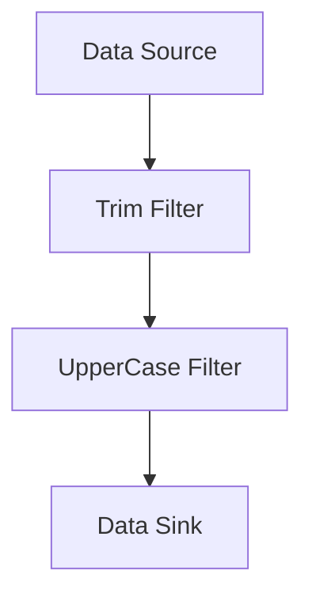

## 8.8. Pipe and Filter Architecture

In the realm of software design, the **Pipe and Filter Architecture** stands out as a versatile and powerful pattern for processing data streams. This architectural pattern is particularly effective in scenarios where data needs to be transformed, processed, or analyzed in a series of discrete steps. By utilizing a series of independent processing components, known as filters, connected by pipes, this pattern allows for the flexible and reusable composition of complex data processing workflows.

### Intent

The primary intent of the Pipe and Filter Architecture is to decompose a complex data processing task into a series of smaller, manageable steps. Each step, or filter, performs a specific transformation or computation on the data, and the output of one filter serves as the input to the next. This modular approach enhances the reusability, maintainability, and scalability of the system.

### Key Participants

1. **Filters**: Independent processing units that perform a specific transformation or computation on the data. Filters are designed to be reusable and composable.

2. **Pipes**: Connectors that transport data between filters. Pipes facilitate the flow of data from one filter to another, ensuring a seamless data processing pipeline.

3. **Data Source**: The origin of the data stream, which feeds data into the first filter in the pipeline.

4. **Data Sink**: The endpoint of the data stream, which collects the final output after processing through the pipeline.

### Applicability

The Pipe and Filter Architecture is applicable in a wide range of scenarios, including:

- **Data Transformation**: When data needs to be transformed through a series of steps, such as parsing, filtering, and formatting.
- **Data Analysis**: In analytical applications where data is processed through multiple stages to extract insights or generate reports.
- **Data Integration**: When integrating data from multiple sources, each requiring specific processing before merging.
- **Stream Processing**: In real-time systems where data streams are continuously processed and analyzed.

### Sample Code Snippets

Let's explore the Pipe and Filter Architecture through pseudocode examples. We'll demonstrate a simple data processing pipeline that reads data, applies a series of transformations, and outputs the result.

```pseudocode
// Define a Filter interface
interface Filter {
    function process(data): data
}

// Implement a Concrete Filter for data transformation
class UpperCaseFilter implements Filter {
    function process(data) {
        return data.toUpperCase()
    }
}

// Implement another Concrete Filter for data trimming
class TrimFilter implements Filter {
    function process(data) {
        return data.trim()
    }
}

// Define a Pipe to connect filters
class Pipe {
    private filters: List<Filter>

    function addFilter(filter: Filter) {
        filters.add(filter)
    }

    function execute(data) {
        for each filter in filters {
            data = filter.process(data)
        }
        return data
    }
}

// Example usage
dataSource = "   hello world   "
pipe = new Pipe()
pipe.addFilter(new TrimFilter())
pipe.addFilter(new UpperCaseFilter())
result = pipe.execute(dataSource)
print(result) // Output: "HELLO WORLD"
```

### Design Considerations

When implementing the Pipe and Filter Architecture, consider the following:

- **Filter Independence**: Ensure that filters are independent and do not rely on shared state. This enhances reusability and testability.
- **Error Handling**: Implement robust error handling within filters to manage exceptions and ensure the smooth flow of data.
- **Performance**: Consider the performance implications of data transformations, especially in real-time systems. Optimize filters for efficiency.
- **Scalability**: Design the pipeline to accommodate additional filters or changes in data flow without significant refactoring.

### Differences and Similarities

The Pipe and Filter Architecture shares similarities with other architectural patterns, such as:

- **Chain of Responsibility**: Both patterns involve a series of processing steps. However, in Chain of Responsibility, each step decides whether to pass the data to the next step, whereas in Pipe and Filter, data flows through all steps.
- **Decorator Pattern**: Both patterns involve adding functionality through composition. However, the Decorator Pattern focuses on enhancing object behavior, while Pipe and Filter focuses on data processing.

### Visualizing the Pipe and Filter Architecture

To better understand the Pipe and Filter Architecture, let's visualize the flow of data through a pipeline using a Mermaid.js diagram.



**Diagram Description:** This diagram illustrates a simple Pipe and Filter pipeline, where data flows from the Data Source through the Trim Filter and UpperCase Filter, finally reaching the Data Sink.

### Try It Yourself

To deepen your understanding of the Pipe and Filter Architecture, try modifying the pseudocode example:

1. **Add a New Filter**: Implement a new filter that replaces spaces with hyphens and add it to the pipeline.
2. **Change the Order**: Experiment with changing the order of filters in the pipeline and observe the effect on the output.
3. **Handle Errors**: Introduce error handling in one of the filters to manage invalid data inputs.

### References and Links

For further reading on the Pipe and Filter Architecture and related concepts, consider the following resources:

- [Design Patterns: Elements of Reusable Object-Oriented Software](https://en.wikipedia.org/wiki/Design_Patterns) by Erich Gamma, Richard Helm, Ralph Johnson, and John Vlissides
- [Enterprise Integration Patterns](https://www.enterpriseintegrationpatterns.com/patterns/messaging/PipesAndFilters.html) by Gregor Hohpe and Bobby Woolf

### Knowledge Check

Before we conclude, let's reinforce your understanding of the Pipe and Filter Architecture with a few questions:

- What are the key participants in the Pipe and Filter Architecture?
- How does the Pipe and Filter Architecture enhance reusability and maintainability?
- In what scenarios is the Pipe and Filter Architecture particularly useful?

### Embrace the Journey

Remember, mastering the Pipe and Filter Architecture is just one step in your journey to becoming a proficient software architect. As you continue to explore and experiment with design patterns, you'll gain the skills and confidence to tackle complex software design challenges. Keep learning, stay curious, and enjoy the journey!

## Quiz Time!



### What is the primary intent of the Pipe and Filter Architecture?

- [x] To decompose a complex data processing task into a series of smaller, manageable steps.
- [ ] To enhance the security of data processing systems.
- [ ] To simplify user interface design.
- [ ] To improve database query performance.

> **Explanation:** The Pipe and Filter Architecture is designed to break down complex data processing tasks into smaller, manageable steps, enhancing modularity and reusability.

### Which of the following is NOT a key participant in the Pipe and Filter Architecture?

- [ ] Filters
- [ ] Pipes
- [x] Controllers
- [ ] Data Source

> **Explanation:** Controllers are not a part of the Pipe and Filter Architecture. The key participants are Filters, Pipes, Data Source, and Data Sink.

### How does the Pipe and Filter Architecture enhance reusability?

- [x] By allowing filters to be independent and composable.
- [ ] By enforcing strict coupling between filters.
- [ ] By limiting the number of filters in a pipeline.
- [ ] By using a single filter for all data processing tasks.

> **Explanation:** Filters in the Pipe and Filter Architecture are designed to be independent and composable, which enhances their reusability.

### In what scenario is the Pipe and Filter Architecture particularly useful?

- [x] Data Transformation
- [ ] User Interface Design
- [ ] Static Website Development
- [ ] Database Schema Design

> **Explanation:** The Pipe and Filter Architecture is particularly useful in scenarios involving data transformation, where data needs to be processed through multiple stages.

### What is the role of a Pipe in the Pipe and Filter Architecture?

- [x] To transport data between filters.
- [ ] To store data temporarily.
- [ ] To validate data integrity.
- [ ] To generate data reports.

> **Explanation:** Pipes are responsible for transporting data between filters in the Pipe and Filter Architecture.

### Which pattern shares similarities with the Pipe and Filter Architecture?

- [x] Chain of Responsibility
- [ ] Singleton
- [ ] Factory Method
- [ ] Observer

> **Explanation:** The Chain of Responsibility pattern shares similarities with the Pipe and Filter Architecture, as both involve a series of processing steps.

### What is a key consideration when implementing the Pipe and Filter Architecture?

- [x] Ensuring filter independence and robust error handling.
- [ ] Limiting the number of filters to three.
- [ ] Using shared state between filters.
- [ ] Avoiding error handling to improve performance.

> **Explanation:** Ensuring filter independence and implementing robust error handling are key considerations when implementing the Pipe and Filter Architecture.

### How can performance be optimized in the Pipe and Filter Architecture?

- [x] By optimizing filters for efficiency.
- [ ] By increasing the number of filters.
- [ ] By using shared state between filters.
- [ ] By avoiding error handling.

> **Explanation:** Performance can be optimized by designing filters to be efficient and minimizing unnecessary data transformations.

### True or False: The Pipe and Filter Architecture is suitable for real-time systems.

- [x] True
- [ ] False

> **Explanation:** The Pipe and Filter Architecture is suitable for real-time systems, as it allows for continuous data processing and analysis.

### What is a common pitfall to avoid in the Pipe and Filter Architecture?

- [x] Relying on shared state between filters.
- [ ] Using too many filters.
- [ ] Implementing error handling.
- [ ] Designing filters to be independent.

> **Explanation:** Relying on shared state between filters is a common pitfall to avoid, as it reduces reusability and testability.


