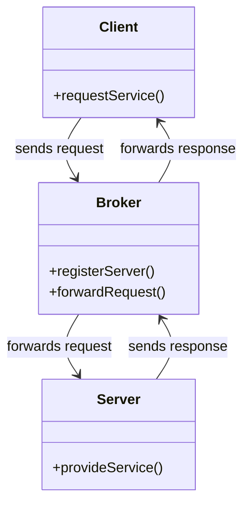
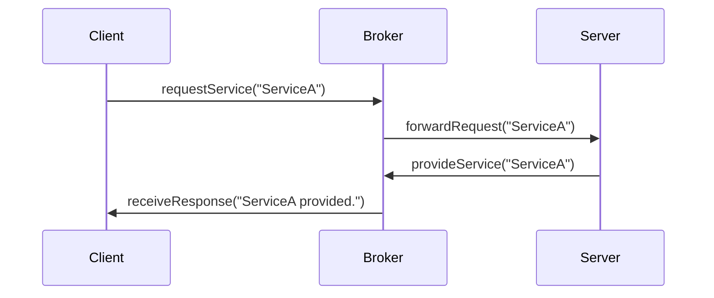

## 8.9. Broker Pattern

In the world of software architecture, the Broker Pattern stands as a fundamental design pattern that plays a crucial role in decoupling components. This pattern is particularly valuable in distributed systems, where it facilitates communication between disparate components by using message brokers. In this section, we will delve into the intricacies of the Broker Pattern, exploring its intent, structure, key participants, applicability, and providing pseudocode examples to illustrate its implementation.

### Intent

The primary intent of the Broker Pattern is to decouple components in a distributed system by introducing an intermediary, known as the broker, which manages communication between clients and servers. This pattern enables components to interact without having direct dependencies on each other, promoting flexibility, scalability, and maintainability.

### Diagrams

To better understand the Broker Pattern, let's visualize its structure using a Mermaid.js diagram:



**Diagram Description:** This class diagram illustrates the interaction between the Client, Broker, and Server. The Client sends a request to the Broker, which forwards it to the appropriate Server. The Server processes the request and sends a response back to the Broker, which then forwards it to the Client.

### Key Participants

1. **Client:** The entity that requests a service or resource.
2. **Broker:** The intermediary that manages communication between clients and servers. It is responsible for forwarding requests and responses.
3. **Server:** The entity that provides the requested service or resource.

### Applicability

The Broker Pattern is applicable in scenarios where:

- Components need to communicate without being tightly coupled.
- The system requires scalability and flexibility, allowing components to be added or removed without affecting others.
- There is a need to manage complex interactions between multiple components in a distributed environment.

### Sample Code Snippets

Let's explore a pseudocode implementation of the Broker Pattern to solidify our understanding.

```pseudocode
// Define the Client class
class Client {
    function requestService(serviceName) {
        // Send a request to the broker
        broker.forwardRequest(serviceName, this)
    }

    function receiveResponse(response) {
        // Handle the response from the server
        print("Received response: " + response)
    }
}

// Define the Broker class
class Broker {
    private servers = []

    function registerServer(server) {
        // Register a new server
        servers.append(server)
    }

    function forwardRequest(serviceName, client) {
        // Find the appropriate server and forward the request
        for server in servers {
            if server.canHandle(serviceName) {
                response = server.provideService(serviceName)
                client.receiveResponse(response)
                break
            }
        }
    }
}

// Define the Server class
class Server {
    private services = []

    function canHandle(serviceName) {
        // Check if the server can handle the requested service
        return serviceName in services
    }

    function provideService(serviceName) {
        // Provide the requested service
        return "Service " + serviceName + " provided."
    }
}

// Example usage
broker = new Broker()
server1 = new Server()
server1.services = ["ServiceA", "ServiceB"]
broker.registerServer(server1)

client = new Client()
client.requestService("ServiceA")
```

**Code Explanation:** In this pseudocode, we define three classes: `Client`, `Broker`, and `Server`. The `Client` requests a service by calling `requestService`, which sends a request to the `Broker`. The `Broker` maintains a list of registered `Server` instances and forwards the request to the appropriate `Server` that can handle the requested service. The `Server` processes the request and returns a response, which the `Broker` forwards back to the `Client`.

### Design Considerations

When implementing the Broker Pattern, consider the following:

- **Scalability:** The Broker Pattern inherently supports scalability by allowing new servers to be added without impacting clients.
- **Fault Tolerance:** Implement mechanisms for handling server failures, such as retry logic or failover strategies.
- **Performance:** The broker can become a bottleneck if not designed to handle high volumes of requests efficiently.
- **Security:** Ensure secure communication between clients, brokers, and servers to prevent unauthorized access.

### Differences and Similarities

The Broker Pattern is often compared to the Mediator Pattern. While both patterns involve an intermediary, the Broker Pattern is specifically designed for distributed systems and focuses on decoupling components through message brokers. In contrast, the Mediator Pattern is used to reduce direct dependencies between objects within a single application.

### Try It Yourself

To deepen your understanding of the Broker Pattern, try modifying the pseudocode example:

- **Add a new service** to the server and update the client to request this new service.
- **Implement a load balancing mechanism** within the broker to distribute requests evenly across multiple servers.
- **Introduce error handling** in the broker to manage scenarios where a server is unavailable.

### Visualizing the Broker Pattern in Action

To further illustrate the flow of communication in the Broker Pattern, let's use a sequence diagram:



**Diagram Description:** This sequence diagram depicts the interaction between the Client, Broker, and Server. The Client sends a request to the Broker, which forwards it to the Server. The Server processes the request and sends a response back to the Broker, which then forwards it to the Client.

### References and Links

For further reading on the Broker Pattern and its applications, consider the following resources:

- [Design Patterns: Elements of Reusable Object-Oriented Software by Erich Gamma, Richard Helm, Ralph Johnson, and John Vlissides](https://en.wikipedia.org/wiki/Design_Patterns)
- [Message Brokers and Middleware](https://www.redhat.com/en/topics/integration/what-is-a-message-broker)
- [Apache Kafka Documentation](https://kafka.apache.org/documentation/)

### Knowledge Check

To reinforce your understanding of the Broker Pattern, consider the following questions:

- What is the primary role of the broker in the Broker Pattern?
- How does the Broker Pattern enhance scalability in distributed systems?
- What are some potential challenges when implementing the Broker Pattern?

### Embrace the Journey

Remember, mastering design patterns is a journey that requires practice and exploration. The Broker Pattern is just one of many patterns that can enhance your software architecture skills. Keep experimenting, stay curious, and enjoy the process of learning and applying design patterns.

## Quiz Time!



### What is the primary intent of the Broker Pattern?

- [x] To decouple components in a distributed system
- [ ] To tightly couple components for efficiency
- [ ] To eliminate the need for communication between components
- [ ] To increase the complexity of the system

> **Explanation:** The Broker Pattern is designed to decouple components in a distributed system, allowing them to interact without direct dependencies.

### Which component in the Broker Pattern is responsible for forwarding requests?

- [ ] Client
- [x] Broker
- [ ] Server
- [ ] Database

> **Explanation:** The Broker is responsible for forwarding requests from the Client to the appropriate Server.

### What is a key benefit of using the Broker Pattern?

- [x] Scalability and flexibility
- [ ] Increased coupling between components
- [ ] Reduced system performance
- [ ] Elimination of communication

> **Explanation:** The Broker Pattern enhances scalability and flexibility by decoupling components and allowing them to interact through a broker.

### In the Broker Pattern, what is the role of the Server?

- [ ] To request services from the Client
- [ ] To forward requests to the Broker
- [x] To provide the requested service or resource
- [ ] To manage the communication between components

> **Explanation:** The Server provides the requested service or resource in the Broker Pattern.

### How does the Broker Pattern handle scalability?

- [x] By allowing new servers to be added without impacting clients
- [ ] By reducing the number of servers
- [ ] By tightly coupling clients and servers
- [ ] By eliminating the need for brokers

> **Explanation:** The Broker Pattern supports scalability by allowing new servers to be added without affecting clients.

### What is a potential challenge when implementing the Broker Pattern?

- [x] The broker can become a bottleneck
- [ ] The broker eliminates the need for communication
- [ ] The broker increases system complexity
- [ ] The broker reduces system security

> **Explanation:** The broker can become a bottleneck if not designed to handle high volumes of requests efficiently.

### How can the Broker Pattern enhance fault tolerance?

- [x] By implementing retry logic or failover strategies
- [ ] By eliminating the need for servers
- [ ] By tightly coupling components
- [ ] By reducing system performance

> **Explanation:** Implementing retry logic or failover strategies can enhance fault tolerance in the Broker Pattern.

### What is the difference between the Broker Pattern and the Mediator Pattern?

- [x] The Broker Pattern is designed for distributed systems
- [ ] The Mediator Pattern is used for distributed systems
- [ ] The Broker Pattern reduces direct dependencies within a single application
- [ ] The Mediator Pattern uses message brokers

> **Explanation:** The Broker Pattern is specifically designed for distributed systems, while the Mediator Pattern reduces direct dependencies within a single application.

### What is the role of the Client in the Broker Pattern?

- [x] To request a service or resource
- [ ] To forward requests to the Broker
- [ ] To provide the requested service
- [ ] To manage communication between components

> **Explanation:** The Client requests a service or resource in the Broker Pattern.

### True or False: The Broker Pattern eliminates the need for communication between components.

- [ ] True
- [x] False

> **Explanation:** The Broker Pattern facilitates communication between components by using a broker, but it does not eliminate the need for communication.




