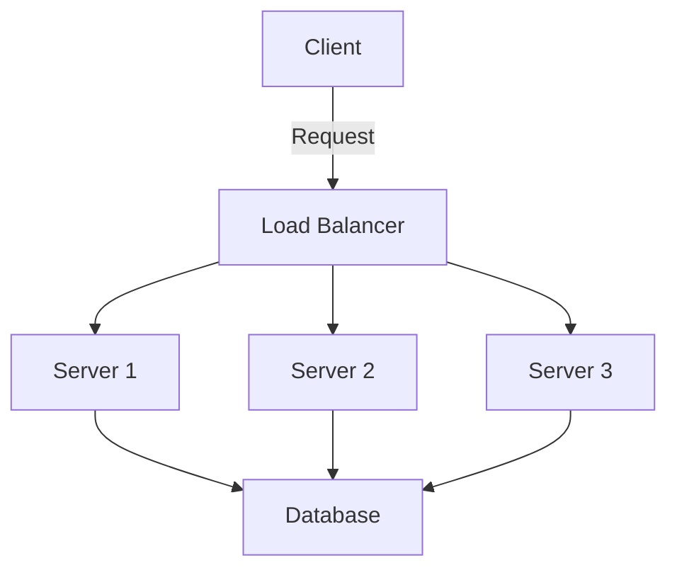

## 9.1. Introduction to Distributed Systems

Distributed systems are a cornerstone of modern computing, enabling applications to scale, remain resilient, and perform efficiently across multiple nodes and locations. In this section, we will delve into the core concepts of distributed systems, explore the challenges they present, and discuss key considerations such as scalability and fault tolerance. By the end of this section, you will have a solid understanding of how distributed systems operate and the design patterns that help address their inherent complexities.

### Understanding Distributed Systems

A distributed system is a collection of independent computers that appear to the users as a single coherent system. These systems are designed to share resources, provide redundancy, and enhance performance by distributing tasks across multiple nodes. 

#### Key Characteristics of Distributed Systems

1. **Concurrency**: Multiple components operate simultaneously, often interacting with each other to complete tasks.
2. **Lack of a Global Clock**: Each node operates independently, and there is no single clock that synchronizes all nodes.
3. **Independent Failures**: Nodes can fail independently, and the system must handle these failures gracefully.

#### Examples of Distributed Systems

- **Web Applications**: Applications like Google, Facebook, and Amazon, which serve millions of users simultaneously.
- **Cloud Computing Platforms**: Services like AWS, Azure, and Google Cloud that provide scalable computing resources.
- **Peer-to-Peer Networks**: Systems like BitTorrent and blockchain networks, where each node can act as both a client and a server.

### Challenges in Distributed Systems

Distributed systems introduce several challenges that must be addressed to ensure they function correctly and efficiently.

#### 1. **Network Latency and Bandwidth**

- **Latency**: The time it takes for a message to travel from one node to another. High latency can affect the performance of distributed systems.
- **Bandwidth**: The amount of data that can be transmitted over a network in a given time period. Limited bandwidth can lead to bottlenecks.

#### 2. **Fault Tolerance**

- **Node Failures**: Nodes can fail due to hardware issues, software bugs, or network problems. The system must continue to operate despite these failures.
- **Data Consistency**: Ensuring that all nodes have a consistent view of the data, even in the presence of failures, is a significant challenge.

#### 3. **Scalability**

- **Horizontal Scaling**: Adding more nodes to the system to handle increased load.
- **Vertical Scaling**: Increasing the resources of existing nodes (e.g., CPU, memory).

#### 4. **Security**

- **Data Privacy**: Protecting sensitive data from unauthorized access.
- **Authentication and Authorization**: Ensuring that only authorized users can access the system.

#### 5. **Concurrency and Synchronization**

- **Race Conditions**: Occur when multiple nodes attempt to access and modify shared data simultaneously.
- **Deadlocks**: Situations where two or more nodes are waiting for each other to release resources, causing the system to halt.

### Scalability in Distributed Systems

Scalability is the ability of a system to handle increased load by adding resources. In distributed systems, scalability is achieved through horizontal and vertical scaling.

#### Horizontal Scaling

Horizontal scaling involves adding more nodes to the system. This approach is often preferred because it allows for incremental growth and can provide redundancy. 

**Advantages of Horizontal Scaling**:

- **Cost-Effective**: Adding more nodes is often cheaper than upgrading existing hardware.
- **Redundancy**: More nodes mean more redundancy, which can improve fault tolerance.
- **Flexibility**: Nodes can be added or removed as needed, providing flexibility in resource allocation.

**Challenges of Horizontal Scaling**:

- **Data Consistency**: Ensuring that all nodes have a consistent view of the data.
- **Load Balancing**: Distributing the load evenly across all nodes.

#### Vertical Scaling

Vertical scaling involves increasing the resources (e.g., CPU, memory) of existing nodes. This approach can be simpler to implement but has limitations.

**Advantages of Vertical Scaling**:

- **Simplicity**: Easier to implement as it involves upgrading existing hardware.
- **Performance**: Can provide significant performance improvements for certain workloads.

**Challenges of Vertical Scaling**:

- **Cost**: Upgrading hardware can be expensive.
- **Limits**: There is a physical limit to how much a single node can be upgraded.

### Fault Tolerance in Distributed Systems

Fault tolerance is the ability of a system to continue operating in the presence of failures. In distributed systems, fault tolerance is achieved through redundancy, replication, and failover mechanisms.

#### Redundancy

Redundancy involves having multiple copies of critical components or data. If one component fails, another can take over.

**Example**: In a distributed database, data can be replicated across multiple nodes. If one node fails, another can provide the data.

#### Replication

Replication involves creating copies of data across different nodes. This ensures that data is available even if some nodes fail.

**Example**: A distributed file system might replicate files across multiple servers to ensure availability.

#### Failover Mechanisms

Failover mechanisms automatically switch to a backup component or system when a failure occurs.

**Example**: In a web application, if one server fails, traffic can be redirected to another server.

### Visualizing Distributed Systems

To better understand distributed systems, let's visualize a simple distributed architecture using a diagram.



**Diagram Description**: This diagram represents a basic distributed system architecture. Clients send requests to a load balancer, which distributes the requests to multiple servers. Each server can access a shared database.

### Sample Code Snippets

Let's explore some pseudocode examples to illustrate key concepts in distributed systems.

#### Pseudocode for a Simple Load Balancer

```pseudocode
class LoadBalancer:
    servers = []

    function addServer(server):
        servers.append(server)

    function getServer():
        index = random() % length(servers)
        return servers[index]

    function handleRequest(request):
        server = getServer()
        server.process(request)
```

**Explanation**: This pseudocode represents a simple load balancer. It maintains a list of servers and distributes incoming requests to a randomly selected server.

#### Pseudocode for Data Replication

```pseudocode
class DataNode:
    data = {}

    function replicateData(key, value):
        data[key] = value
        for node in otherNodes:
            node.replicateData(key, value)

    function getData(key):
        return data[key]
```

**Explanation**: This pseudocode demonstrates data replication across multiple nodes. When data is added to one node, it is replicated to other nodes.

### Design Considerations

When designing distributed systems, several considerations must be taken into account:

- **Consistency vs. Availability**: In distributed systems, there is often a trade-off between consistency and availability. The CAP theorem states that a distributed system can only guarantee two of the following three properties: Consistency, Availability, and Partition Tolerance.
- **Latency**: Minimizing latency is crucial for performance. Techniques such as caching and data locality can help reduce latency.
- **Security**: Implementing robust security measures is essential to protect data and ensure that only authorized users can access the system.

### Differences and Similarities with Other Patterns

Distributed systems share similarities with other architectural patterns, such as microservices and client-server architectures. However, they differ in their scale and complexity.

- **Microservices**: A microservices architecture is a type of distributed system where applications are composed of small, independent services. While both architectures involve distributed components, microservices focus on modularity and independent deployment.
- **Client-Server**: In a client-server architecture, clients request services from a central server. Distributed systems can include multiple servers and clients, providing greater scalability and redundancy.

### Try It Yourself

To deepen your understanding of distributed systems, try modifying the pseudocode examples provided. For instance, you can:

- Implement a round-robin load balancing strategy instead of random selection.
- Add error handling to the data replication pseudocode to simulate node failures.

### Knowledge Check

Before moving on, let's review some key concepts:

- What are the main challenges of distributed systems?
- How does horizontal scaling differ from vertical scaling?
- What is the CAP theorem, and how does it apply to distributed systems?

### Embrace the Journey

Remember, mastering distributed systems is a journey. As you continue to explore this fascinating field, you'll encounter new challenges and opportunities to innovate. Keep experimenting, stay curious, and enjoy the journey!

## Quiz Time!



### What is a distributed system?

- [x] A collection of independent computers that appear as a single coherent system.
- [ ] A single computer with multiple processors.
- [ ] A system that only operates on a local network.
- [ ] A system that cannot handle concurrent operations.

> **Explanation:** A distributed system consists of multiple independent computers that work together to appear as a single system to users.

### Which of the following is a key characteristic of distributed systems?

- [x] Concurrency
- [ ] Centralized control
- [ ] Single point of failure
- [ ] Lack of redundancy

> **Explanation:** Distributed systems are characterized by concurrency, where multiple components operate simultaneously.

### What is horizontal scaling?

- [x] Adding more nodes to a system to handle increased load.
- [ ] Increasing the resources of existing nodes.
- [ ] Reducing the number of nodes in a system.
- [ ] Decreasing the resources of existing nodes.

> **Explanation:** Horizontal scaling involves adding more nodes to a system to distribute the load and improve performance.

### What is the CAP theorem?

- [x] A principle stating that a distributed system can only guarantee two of the following: Consistency, Availability, Partition Tolerance.
- [ ] A theorem about the maximum number of nodes in a distributed system.
- [ ] A rule for optimizing network latency.
- [ ] A guideline for designing user interfaces.

> **Explanation:** The CAP theorem highlights the trade-offs in distributed systems between consistency, availability, and partition tolerance.

### What is a common challenge in distributed systems?

- [x] Network latency
- [ ] Unlimited bandwidth
- [ ] Centralized processing
- [ ] Single-threaded execution

> **Explanation:** Network latency is a common challenge in distributed systems, affecting communication between nodes.

### What is a benefit of redundancy in distributed systems?

- [x] Improved fault tolerance
- [ ] Increased network latency
- [ ] Reduced scalability
- [ ] Decreased availability

> **Explanation:** Redundancy improves fault tolerance by providing backup components or data in case of failures.

### What is an example of a distributed system?

- [x] Cloud computing platforms like AWS
- [ ] A single desktop computer
- [ ] A local area network (LAN)
- [ ] A standalone application

> **Explanation:** Cloud computing platforms like AWS are distributed systems that provide scalable resources across multiple nodes.

### What is a failover mechanism?

- [x] A system that automatically switches to a backup component when a failure occurs.
- [ ] A method for increasing network latency.
- [ ] A technique for reducing data redundancy.
- [ ] A process for centralizing control.

> **Explanation:** Failover mechanisms ensure continuity by switching to backup components in case of failures.

### What is the trade-off highlighted by the CAP theorem?

- [x] Consistency, Availability, Partition Tolerance
- [ ] Scalability, Security, Performance
- [ ] Redundancy, Latency, Bandwidth
- [ ] Modularity, Flexibility, Simplicity

> **Explanation:** The CAP theorem highlights the trade-off between consistency, availability, and partition tolerance in distributed systems.

### True or False: Vertical scaling involves adding more nodes to a system.

- [ ] True
- [x] False

> **Explanation:** Vertical scaling involves increasing the resources of existing nodes, not adding more nodes.


