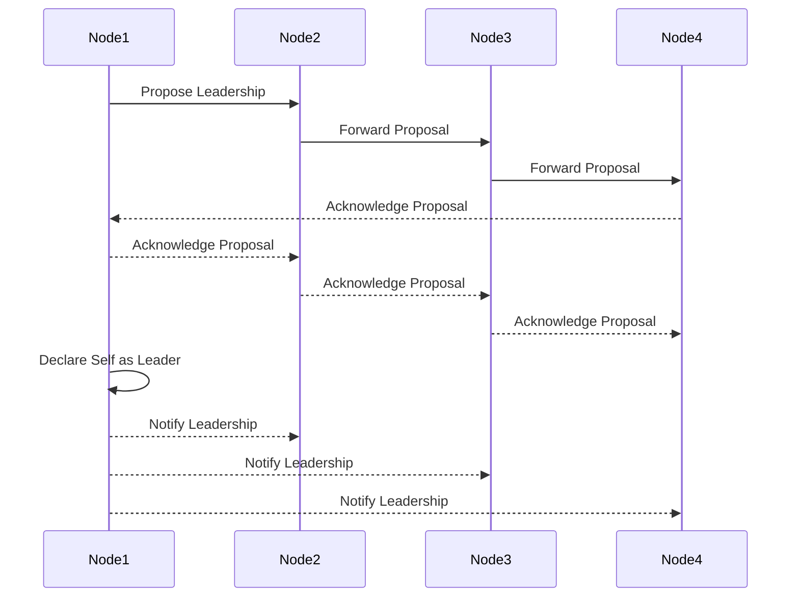
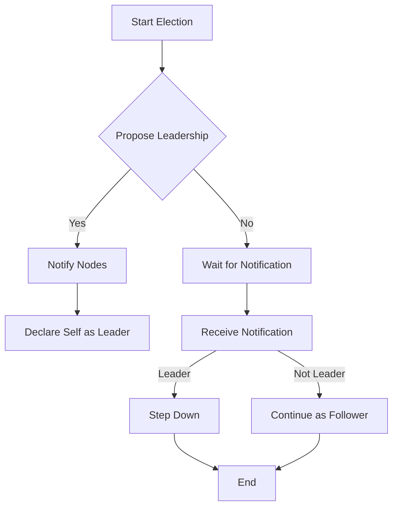

## 9.2. Leader Election Pattern

In the realm of distributed systems, the **Leader Election Pattern** plays a pivotal role in coordinating distributed nodes. This pattern is essential for achieving consensus and ensuring that a single node acts as the leader, orchestrating tasks and making decisions on behalf of the entire system. Let's delve into the intricacies of this pattern, its key participants, applicability, and how to implement it using pseudocode.

### Intent

The primary intent of the Leader Election Pattern is to ensure that in a distributed system, one node is elected as the leader to coordinate actions, manage resources, and make decisions. This pattern is crucial for maintaining consistency, fault tolerance, and efficient resource management across distributed nodes.

### Key Participants

1. **Nodes**: The individual entities in a distributed system that participate in the leader election process.
2. **Leader**: The node elected to coordinate tasks and make decisions on behalf of the system.
3. **Election Algorithm**: The mechanism used to determine which node becomes the leader.
4. **Consensus Protocol**: Ensures that all nodes agree on the elected leader.

### Applicability

The Leader Election Pattern is applicable in scenarios where:

- A distributed system requires a single point of coordination.
- Nodes need to agree on a leader to manage shared resources.
- Fault tolerance and high availability are critical.
- Tasks need to be synchronized across distributed nodes.

### Diagrams

To visualize the Leader Election Pattern, let's use a sequence diagram to illustrate the process of electing a leader among distributed nodes.



### Sample Code Snippets

Let's explore a pseudocode implementation of the Leader Election Pattern. We'll use a simple election algorithm where nodes propose themselves as leaders and the node with the highest ID becomes the leader.

```pseudocode
class Node:
    id: Integer
    isLeader: Boolean = False
    nodes: List[Node]

    function proposeLeadership():
        for each node in nodes:
            if node.id > self.id:
                return False
        self.isLeader = True
        notifyNodesOfLeadership()
        return True

    function notifyNodesOfLeadership():
        for each node in nodes:
            node.receiveLeadershipNotification(self.id)

    function receiveLeadershipNotification(leaderId: Integer):
        if leaderId > self.id:
            self.isLeader = False

// Example usage
nodes = [Node(1), Node(2), Node(3), Node(4)]
for node in nodes:
    if node.proposeLeadership():
        print("Node", node.id, "is the leader")
        break
```

### Design Considerations

- **Fault Tolerance**: Ensure that the system can recover from node failures by re-electing a leader.
- **Scalability**: The election algorithm should efficiently handle a large number of nodes.
- **Consensus**: Use a consensus protocol to ensure all nodes agree on the elected leader.
- **Network Latency**: Consider the impact of network latency on the election process.

### Differences and Similarities

The Leader Election Pattern is often compared to the **Consensus Pattern**, as both involve agreement among distributed nodes. However, the Leader Election Pattern specifically focuses on electing a single leader, while the Consensus Pattern may involve agreeing on any value or state.

### Try It Yourself

To experiment with the Leader Election Pattern, try modifying the pseudocode to use a different election algorithm, such as a random selection or a voting mechanism. Observe how these changes impact the election process and the system's behavior.

### Visualizing the Election Process

To further understand the Leader Election Pattern, let's visualize the election process using a flowchart.



### References and Links

For further reading on distributed systems and leader election algorithms, consider exploring the following resources:

- [Distributed Systems: Principles and Paradigms](https://www.distributed-systems.net/)
- [Paxos Made Simple](https://lamport.azurewebsites.net/pubs/paxos-simple.pdf)
- [Raft Consensus Algorithm](https://raft.github.io/)

### Knowledge Check

1. **What is the primary intent of the Leader Election Pattern?**
   - To ensure a single node coordinates tasks in a distributed system.

2. **What are the key participants in the Leader Election Pattern?**
   - Nodes, Leader, Election Algorithm, Consensus Protocol.

3. **When is the Leader Election Pattern applicable?**
   - When a distributed system requires a single point of coordination.

4. **What is a common election algorithm used in the Leader Election Pattern?**
   - The node with the highest ID becomes the leader.

5. **What should be considered when designing a leader election process?**
   - Fault tolerance, scalability, consensus, and network latency.

### Embrace the Journey

Remember, mastering the Leader Election Pattern is just the beginning. As you progress, you'll explore more complex patterns and algorithms that enhance the robustness and efficiency of distributed systems. Keep experimenting, stay curious, and enjoy the journey!

## Quiz Time!



### What is the primary intent of the Leader Election Pattern?

- [x] To ensure a single node coordinates tasks in a distributed system.
- [ ] To distribute tasks evenly among all nodes.
- [ ] To remove the need for a leader in a distributed system.
- [ ] To ensure all nodes have equal responsibilities.

> **Explanation:** The Leader Election Pattern aims to elect a single node as the leader to coordinate tasks and make decisions on behalf of the distributed system.

### Which of the following is a key participant in the Leader Election Pattern?

- [x] Nodes
- [x] Leader
- [ ] Database
- [x] Election Algorithm

> **Explanation:** The key participants in the Leader Election Pattern include Nodes, the Leader, and the Election Algorithm. A database is not a participant in this pattern.

### When is the Leader Election Pattern applicable?

- [x] When a distributed system requires a single point of coordination.
- [ ] When all nodes need to operate independently.
- [ ] When there is no need for fault tolerance.
- [ ] When tasks are static and do not require synchronization.

> **Explanation:** The Leader Election Pattern is applicable when a distributed system requires a single point of coordination to manage tasks and resources efficiently.

### What is a common election algorithm used in the Leader Election Pattern?

- [x] The node with the highest ID becomes the leader.
- [ ] Random selection of a node.
- [ ] Round-robin selection.
- [ ] Alphabetical order of node names.

> **Explanation:** A common election algorithm is to elect the node with the highest ID as the leader, ensuring a deterministic and straightforward selection process.

### What should be considered when designing a leader election process?

- [x] Fault tolerance
- [x] Scalability
- [ ] User interface design
- [x] Consensus

> **Explanation:** Important considerations for designing a leader election process include fault tolerance, scalability, and ensuring consensus among nodes.

### Which of the following is NOT a key participant in the Leader Election Pattern?

- [ ] Nodes
- [ ] Leader
- [x] User Interface
- [ ] Election Algorithm

> **Explanation:** The User Interface is not a key participant in the Leader Election Pattern, which focuses on Nodes, the Leader, and the Election Algorithm.

### What is the role of the Election Algorithm in the Leader Election Pattern?

- [x] To determine which node becomes the leader.
- [ ] To manage user interactions.
- [ ] To store data persistently.
- [ ] To handle network communication.

> **Explanation:** The Election Algorithm's role is to determine which node becomes the leader in the distributed system.

### How does the Leader Election Pattern contribute to fault tolerance?

- [x] By allowing re-election of a leader if the current leader fails.
- [ ] By preventing any node from becoming a leader.
- [ ] By ensuring all nodes operate independently.
- [ ] By eliminating the need for a leader.

> **Explanation:** The Leader Election Pattern contributes to fault tolerance by allowing the system to re-elect a leader if the current leader fails, ensuring continuous coordination.

### What is the significance of consensus in the Leader Election Pattern?

- [x] Ensures all nodes agree on the elected leader.
- [ ] Allows nodes to operate independently.
- [ ] Reduces the need for communication between nodes.
- [ ] Eliminates the need for a leader.

> **Explanation:** Consensus is significant in the Leader Election Pattern as it ensures all nodes agree on the elected leader, maintaining consistency across the system.

### True or False: The Leader Election Pattern eliminates the need for a leader in a distributed system.

- [ ] True
- [x] False

> **Explanation:** False. The Leader Election Pattern is specifically designed to elect a leader in a distributed system, not to eliminate the need for one.


