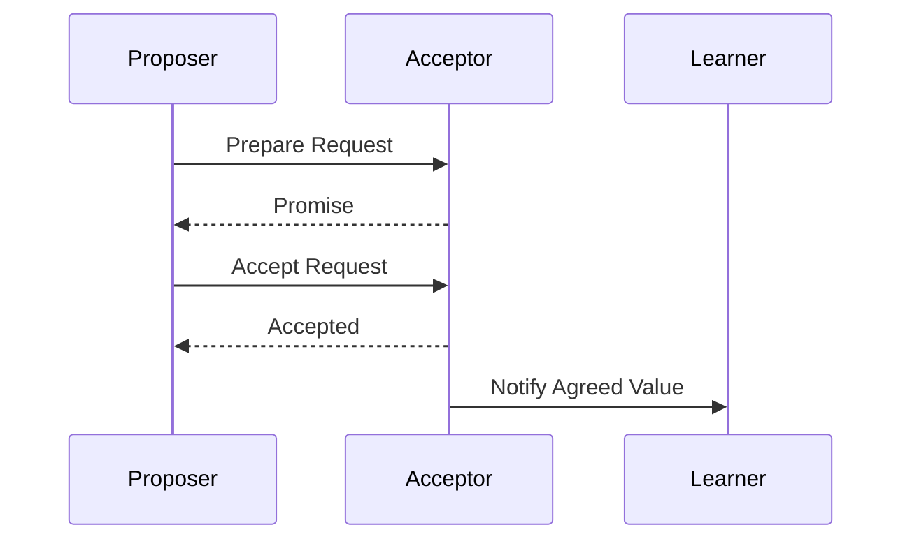
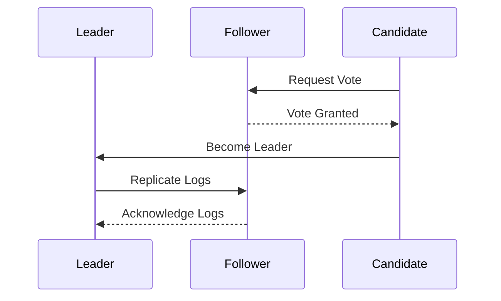

## 9.3. Consensus Algorithms

In the realm of distributed systems, achieving consensus is a fundamental challenge. Consensus algorithms are designed to help distributed systems agree on a single data value, which is crucial for maintaining consistency and reliability across nodes. This section delves into two of the most prominent consensus algorithms: Paxos and Raft. We will explore their mechanisms, applications, and how they ensure agreement in distributed environments.

### Introduction to Consensus Algorithms

Consensus algorithms are pivotal in distributed systems where multiple nodes must agree on a decision or value despite potential failures. These algorithms are essential for maintaining data consistency and ensuring that all nodes operate in harmony. Let's explore the key concepts and challenges associated with consensus in distributed systems.

#### Key Concepts

- **Agreement**: All non-faulty nodes must agree on the same value.
- **Validity**: If a node proposes a value, then the agreed value must be one of the proposed values.
- **Termination**: All non-faulty nodes eventually decide on a value.
- **Fault Tolerance**: The system can continue to operate correctly despite a certain number of node failures.

#### Challenges in Consensus

- **Network Partitions**: Nodes may become isolated, leading to communication breakdowns.
- **Node Failures**: Nodes can crash or behave unpredictably.
- **Asynchronous Communication**: Messages can be delayed, lost, or arrive out of order.

### Paxos Algorithm

Paxos is a family of protocols for solving consensus in a network of unreliable processors. It was introduced by Leslie Lamport and is known for its robustness and theoretical foundation. Paxos ensures that a single value is chosen and agreed upon by the majority of nodes, even in the presence of failures.

#### Key Participants

- **Proposers**: Propose values to be agreed upon.
- **Acceptors**: Vote on proposed values and help reach consensus.
- **Learners**: Learn the final agreed value.

#### Paxos Phases

Paxos operates in two main phases: the Prepare phase and the Accept phase.

1. **Prepare Phase**: A proposer selects a proposal number and sends a prepare request to a majority of acceptors. Acceptors respond with a promise not to accept any proposal with a lower number and may include the highest-numbered proposal they have accepted.

2. **Accept Phase**: If the proposer receives a majority of promises, it sends an accept request with the proposal number and value. Acceptors accept the proposal if they have not promised a higher number.

#### Pseudocode Implementation

```pseudocode
function propose(value):
    proposal_number = generate_unique_number()
    promises = send_prepare(proposal_number)
    
    if majority(promises):
        highest_value = extract_highest_value(promises)
        if highest_value is not None:
            value = highest_value
        send_accept(proposal_number, value)
```

#### Design Considerations

- **Complexity**: Paxos is complex to implement and understand, making it challenging for practical use.
- **Performance**: Paxos can be slow due to multiple rounds of communication required to reach consensus.

#### Differences and Similarities

- **Similarities**: Both Paxos and Raft aim to achieve consensus in distributed systems.
- **Differences**: Paxos is more theoretical and complex, while Raft is designed to be more understandable and practical.

### Raft Algorithm

Raft is a consensus algorithm designed to be more understandable than Paxos. It was developed by Diego Ongaro and John Ousterhout and is widely used in distributed systems for its simplicity and efficiency.

#### Key Participants

- **Leader**: Manages the consensus process and handles client requests.
- **Followers**: Respond to requests from the leader and participate in elections.
- **Candidates**: Compete to become the leader during elections.

#### Raft Phases

Raft operates in three main phases: Leader Election, Log Replication, and Safety.

1. **Leader Election**: A candidate node requests votes from other nodes to become the leader. The node with the majority of votes becomes the leader.

2. **Log Replication**: The leader replicates log entries to followers and ensures consistency.

3. **Safety**: Raft ensures that once a log entry is committed, it remains committed.

#### Pseudocode Implementation

```pseudocode
function start_election():
    increment_term()
    vote_for_self()
    votes = request_votes_from_peers()
    
    if majority(votes):
        become_leader()
        replicate_logs()
```

#### Design Considerations

- **Simplicity**: Raft is designed to be easier to understand and implement than Paxos.
- **Efficiency**: Raft's leader-based approach allows for efficient log replication and consistency.

#### Differences and Similarities

- **Similarities**: Both Raft and Paxos ensure consensus in distributed systems.
- **Differences**: Raft uses a leader-based approach, while Paxos relies on a more decentralized process.

### Visualizing Consensus Algorithms

To better understand the flow of Paxos and Raft, let's visualize their processes using Mermaid.js diagrams.

#### Paxos Process Flow



#### Raft Process Flow



### Try It Yourself

Experiment with the pseudocode examples provided for Paxos and Raft. Try modifying the proposal numbers, election terms, or the number of nodes to see how the algorithms behave under different conditions. This hands-on approach will deepen your understanding of consensus algorithms.

### References and Links

For further reading on consensus algorithms, consider exploring the following resources:

- [Paxos Made Simple by Leslie Lamport](https://lamport.azurewebsites.net/pubs/paxos-simple.pdf)
- [In Search of an Understandable Consensus Algorithm (Raft) by Diego Ongaro and John Ousterhout](https://raft.github.io/raft.pdf)
- [Distributed Systems: Principles and Paradigms by Andrew S. Tanenbaum and Maarten Van Steen](https://www.distributed-systems.net/)

### Knowledge Check

- **What are the key phases of the Paxos algorithm?**
- **How does Raft ensure log consistency across nodes?**
- **What are the main differences between Paxos and Raft?**

### Embrace the Journey

Remember, mastering consensus algorithms is a journey. As you explore Paxos and Raft, you'll gain insights into the complexities of distributed systems and the importance of achieving agreement. Keep experimenting, stay curious, and enjoy the journey!

## Quiz Time!



### What is the primary goal of consensus algorithms in distributed systems?

- [x] Achieving agreement among nodes
- [ ] Maximizing throughput
- [ ] Minimizing latency
- [ ] Reducing network traffic

> **Explanation:** Consensus algorithms are designed to ensure that all nodes in a distributed system agree on a single value or decision, which is crucial for consistency and reliability.

### Which of the following is a key participant in the Paxos algorithm?

- [x] Proposer
- [ ] Leader
- [ ] Follower
- [ ] Candidate

> **Explanation:** In Paxos, proposers are responsible for proposing values to be agreed upon by the acceptors.

### In the Raft algorithm, what is the role of the leader?

- [x] Manage the consensus process and handle client requests
- [ ] Vote for candidates during elections
- [ ] Replicate logs to other nodes
- [ ] Monitor network traffic

> **Explanation:** The leader in Raft is responsible for managing the consensus process, handling client requests, and replicating logs to followers.

### What is a key difference between Paxos and Raft?

- [x] Raft uses a leader-based approach, while Paxos is more decentralized
- [ ] Paxos is simpler to understand than Raft
- [ ] Raft is more theoretical than Paxos
- [ ] Paxos relies on a single leader for consensus

> **Explanation:** Raft uses a leader-based approach for consensus, making it more straightforward and practical compared to the decentralized nature of Paxos.

### Which phase is not part of the Raft algorithm?

- [ ] Leader Election
- [ ] Log Replication
- [x] Prepare Phase
- [ ] Safety

> **Explanation:** The Prepare phase is part of the Paxos algorithm, not Raft. Raft consists of Leader Election, Log Replication, and Safety phases.

### What is the purpose of the Prepare phase in Paxos?

- [x] To gather promises from acceptors before proposing a value
- [ ] To replicate logs across nodes
- [ ] To elect a leader
- [ ] To handle client requests

> **Explanation:** The Prepare phase in Paxos involves proposers gathering promises from acceptors to ensure that no lower-numbered proposals are accepted.

### How does Raft ensure safety in log replication?

- [x] By ensuring that once a log entry is committed, it remains committed
- [ ] By using a decentralized approach
- [ ] By minimizing network traffic
- [ ] By maximizing throughput

> **Explanation:** Raft ensures safety by maintaining that once a log entry is committed, it remains committed and consistent across all nodes.

### Which algorithm is known for its simplicity and understandability?

- [ ] Paxos
- [x] Raft
- [ ] Both Paxos and Raft
- [ ] Neither Paxos nor Raft

> **Explanation:** Raft is designed to be more understandable and simpler to implement compared to Paxos.

### What is a common challenge faced by consensus algorithms?

- [x] Network Partitions
- [ ] High throughput
- [ ] Low latency
- [ ] Increased scalability

> **Explanation:** Network partitions, where nodes become isolated, are a common challenge for consensus algorithms, affecting communication and agreement.

### True or False: Paxos and Raft both aim to achieve consensus in distributed systems.

- [x] True
- [ ] False

> **Explanation:** Both Paxos and Raft are consensus algorithms designed to achieve agreement among nodes in distributed systems.


