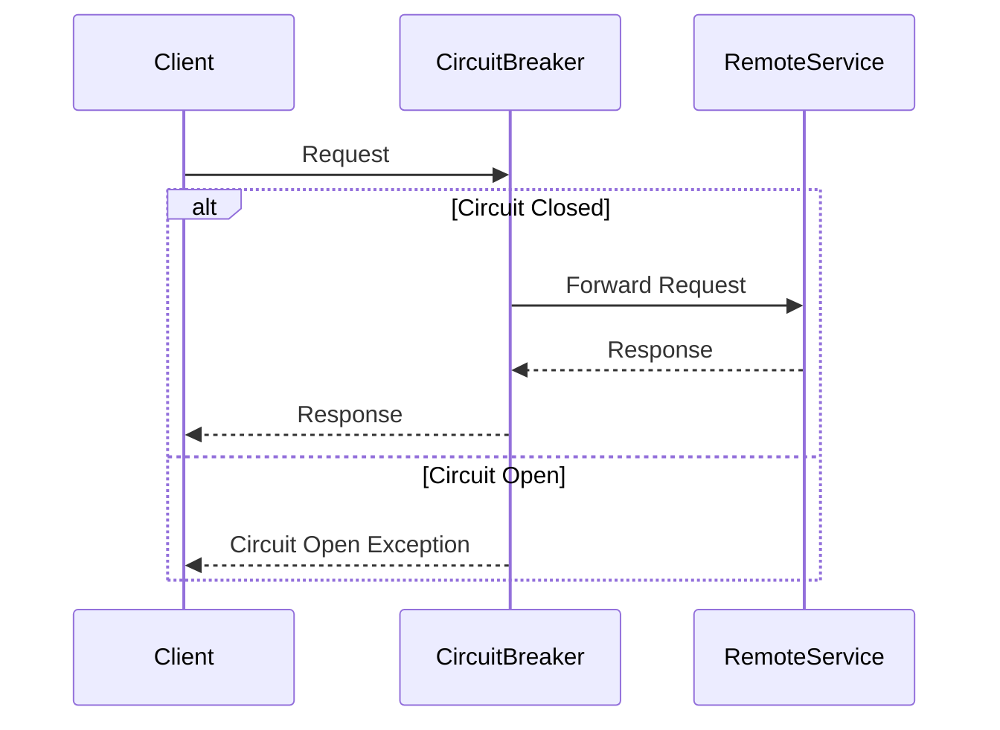

## 9.5. Circuit Breaker Pattern

In the realm of distributed systems, ensuring resilience and fault tolerance is paramount. The Circuit Breaker Pattern is a critical design pattern that helps in achieving these goals by isolating faults and handling failures gracefully. This pattern is particularly useful in systems where multiple services interact with each other, and a failure in one service can cascade and affect the entire system. 

### Intent

The primary intent of the Circuit Breaker Pattern is to prevent a system from repeatedly attempting an operation that is likely to fail. By doing so, it helps in avoiding unnecessary strain on the system and allows it to recover gracefully. The Circuit Breaker Pattern acts as a proxy for operations that might fail, such as network calls or database queries, and provides a mechanism to stop these operations if they are consistently failing.

### Key Participants

1. **Client**: The entity that initiates the request to a remote service.
2. **Circuit Breaker**: The component that monitors the success and failure of requests and decides whether to allow or block requests.
3. **Remote Service**: The service that the client is trying to access, which might fail or become unavailable.

### Applicability

The Circuit Breaker Pattern is applicable in scenarios where:

- There is a risk of a service becoming unavailable or failing.
- You want to prevent cascading failures in a distributed system.
- You need to provide a fallback mechanism when a service is down.
- You want to monitor the health of a service and take corrective actions.

### How It Works

The Circuit Breaker Pattern can be visualized as a state machine with three states: Closed, Open, and Half-Open.

```mermaid
stateDiagram-v2
    [*] --> Closed
    Closed --> Open: Failure Threshold Exceeded
    Open --> Half-Open: Timeout Expired
    Half-Open --> Closed: Success
    Half-Open --> Open: Failure
```

- **Closed State**: In this state, the circuit breaker allows requests to pass through. It monitors the success and failure of these requests. If the failure rate exceeds a predefined threshold, it transitions to the Open state.
  
- **Open State**: In this state, the circuit breaker blocks all requests to the service, preventing further failures. After a specified timeout period, it transitions to the Half-Open state to test if the service has recovered.
  
- **Half-Open State**: In this state, a limited number of requests are allowed to pass through. If these requests succeed, the circuit breaker transitions back to the Closed state. If they fail, it returns to the Open state.

### Sample Code Snippets

Let's explore the Circuit Breaker Pattern using pseudocode. We'll implement a simple circuit breaker that monitors the success and failure of requests to a remote service.

```pseudocode
class CircuitBreaker:
    def __init__(self, failure_threshold, timeout):
        self.failure_threshold = failure_threshold
        self.timeout = timeout
        self.failure_count = 0
        self.state = "CLOSED"
        self.last_failure_time = None

    def call(self, remote_service):
        if self.state == "OPEN":
            if self._timeout_expired():
                self.state = "HALF_OPEN"
            else:
                raise Exception("Circuit is open. Request blocked.")

        try:
            result = remote_service.execute()
            self._on_success()
            return result
        except Exception as e:
            self._on_failure()
            raise e

    def _on_success(self):
        self.failure_count = 0
        if self.state == "HALF_OPEN":
            self.state = "CLOSED"

    def _on_failure(self):
        self.failure_count += 1
        self.last_failure_time = current_time()
        if self.failure_count >= self.failure_threshold:
            self.state = "OPEN"

    def _timeout_expired(self):
        return current_time() - self.last_failure_time > self.timeout
```

### Design Considerations

When implementing the Circuit Breaker Pattern, consider the following:

- **Failure Threshold**: Determine the number of failures that should trigger the circuit breaker to open.
- **Timeout Period**: Decide how long the circuit breaker should remain open before transitioning to the Half-Open state.
- **Fallback Mechanism**: Implement a fallback mechanism to handle requests when the circuit breaker is open.
- **Monitoring and Logging**: Monitor the state of the circuit breaker and log transitions for analysis and debugging.

### Differences and Similarities

The Circuit Breaker Pattern is often compared to the Retry Pattern. While both patterns deal with failures, they have distinct differences:

- **Retry Pattern**: Focuses on retrying failed operations with a delay between attempts. It is useful when failures are transient and likely to succeed upon retry.
- **Circuit Breaker Pattern**: Focuses on preventing further attempts when failures are persistent. It is useful when failures are likely to continue and need time to recover.

### Try It Yourself

To better understand the Circuit Breaker Pattern, try modifying the pseudocode to:

- Adjust the failure threshold and observe how it affects the circuit breaker's behavior.
- Implement a fallback mechanism that returns a default value when the circuit breaker is open.
- Add logging to track the state transitions of the circuit breaker.

### Visualizing Circuit Breaker in Action

To further illustrate the Circuit Breaker Pattern, let's visualize a sequence diagram showing the interaction between the client, circuit breaker, and remote service.



This diagram shows how the circuit breaker intercepts requests from the client and decides whether to forward them to the remote service based on its current state.

### Real-World Applications

The Circuit Breaker Pattern is widely used in microservices architectures and cloud-based applications. It helps in maintaining the resilience of the system by preventing cascading failures and allowing services to recover gracefully. Some real-world applications include:

- **Netflix**: Uses the Circuit Breaker Pattern to manage service failures and ensure a smooth user experience.
- **Amazon**: Implements circuit breakers to handle failures in its distributed systems and maintain high availability.

### Knowledge Check

Before we wrap up, let's reinforce our understanding with a few questions:

1. What is the primary intent of the Circuit Breaker Pattern?
2. How does the Circuit Breaker Pattern differ from the Retry Pattern?
3. What are the three states of a circuit breaker?
4. Why is it important to implement a fallback mechanism in the Circuit Breaker Pattern?
5. How can logging and monitoring enhance the effectiveness of the Circuit Breaker Pattern?

### Summary

The Circuit Breaker Pattern is an essential design pattern for building resilient distributed systems. It helps in isolating faults, preventing cascading failures, and ensuring that systems can recover gracefully. By understanding and implementing this pattern, we can enhance the reliability and robustness of our applications.

Remember, mastering design patterns is a journey. As you continue to explore and apply these patterns, you'll gain deeper insights into building scalable and resilient software systems. Keep experimenting, stay curious, and enjoy the journey!

## Quiz Time!



### What is the primary intent of the Circuit Breaker Pattern?

- [x] To prevent a system from repeatedly attempting an operation that is likely to fail
- [ ] To retry failed operations with a delay
- [ ] To optimize system performance
- [ ] To enhance user interface design

> **Explanation:** The Circuit Breaker Pattern aims to prevent a system from repeatedly attempting an operation that is likely to fail, thereby avoiding unnecessary strain and allowing the system to recover gracefully.

### Which state does a circuit breaker transition to after a timeout expires?

- [ ] Closed
- [x] Half-Open
- [ ] Open
- [ ] Faulted

> **Explanation:** After a timeout expires, a circuit breaker transitions from the Open state to the Half-Open state to test if the service has recovered.

### What is a key difference between the Circuit Breaker Pattern and the Retry Pattern?

- [x] Circuit Breaker prevents further attempts when failures are persistent
- [ ] Retry Pattern prevents further attempts when failures are persistent
- [ ] Circuit Breaker focuses on retrying failed operations
- [ ] Retry Pattern focuses on blocking requests

> **Explanation:** The Circuit Breaker Pattern prevents further attempts when failures are persistent, while the Retry Pattern focuses on retrying failed operations with a delay.

### What should be considered when implementing a Circuit Breaker Pattern?

- [x] Failure Threshold
- [x] Timeout Period
- [x] Fallback Mechanism
- [ ] User Interface Design

> **Explanation:** When implementing a Circuit Breaker Pattern, consider the failure threshold, timeout period, and fallback mechanism to ensure effective fault isolation and graceful failure handling.

### What is the role of the Circuit Breaker in a distributed system?

- [x] To monitor the success and failure of requests
- [ ] To enhance data storage capabilities
- [ ] To optimize network bandwidth
- [ ] To design user interfaces

> **Explanation:** The Circuit Breaker monitors the success and failure of requests and decides whether to allow or block requests based on its current state.

### Which real-world company uses the Circuit Breaker Pattern to manage service failures?

- [x] Netflix
- [ ] Google
- [ ] Facebook
- [ ] Twitter

> **Explanation:** Netflix uses the Circuit Breaker Pattern to manage service failures and ensure a smooth user experience.

### What happens in the Half-Open state of a circuit breaker?

- [x] A limited number of requests are allowed to pass through
- [ ] All requests are blocked
- [ ] All requests are allowed
- [ ] The system shuts down

> **Explanation:** In the Half-Open state, a limited number of requests are allowed to pass through to test if the service has recovered.

### Why is logging important in the Circuit Breaker Pattern?

- [x] To track state transitions for analysis and debugging
- [ ] To enhance user interface design
- [ ] To optimize data storage
- [ ] To improve network bandwidth

> **Explanation:** Logging is important in the Circuit Breaker Pattern to track state transitions for analysis and debugging, helping to enhance the pattern's effectiveness.

### What is a fallback mechanism in the context of the Circuit Breaker Pattern?

- [x] A mechanism to handle requests when the circuit breaker is open
- [ ] A mechanism to optimize network bandwidth
- [ ] A mechanism to enhance user interface design
- [ ] A mechanism to store data

> **Explanation:** A fallback mechanism handles requests when the circuit breaker is open, providing an alternative response or action.

### True or False: The Circuit Breaker Pattern is only applicable in microservices architectures.

- [ ] True
- [x] False

> **Explanation:** False. While the Circuit Breaker Pattern is commonly used in microservices architectures, it is applicable in any distributed system where fault isolation and graceful failure handling are needed.


