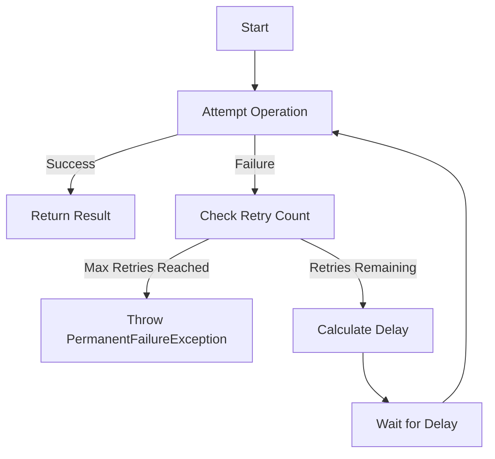

## 9.6. Retry and Backoff Patterns

In the world of distributed systems, temporary failures are an inevitable reality. Networks can be unreliable, services can become temporarily unavailable, and resources can be intermittently inaccessible. To build resilient systems that can gracefully handle these transient issues, we employ Retry and Backoff Patterns. These patterns are crucial for maintaining system stability and ensuring a seamless user experience even in the face of temporary disruptions.

### Understanding Retry and Backoff Patterns

**Retry Pattern** is a strategy that involves reattempting a failed operation, with the expectation that the operation might succeed if retried. This pattern is particularly useful in distributed systems where failures are often temporary and can be resolved by simply trying again.

**Backoff Pattern** complements the Retry Pattern by introducing a delay between retries. This delay can be constant, linear, or exponential. The purpose of the backoff is to prevent overwhelming the system with repeated requests, which could exacerbate the problem.

#### Key Concepts

- **Transient Failures**: These are temporary issues that can often be resolved by retrying the operation. Examples include network timeouts, temporary unavailability of a service, or brief resource contention.
  
- **Idempotency**: It is crucial that the operations being retried are idempotent, meaning that performing the operation multiple times has the same effect as performing it once. This ensures that retries do not cause unintended side effects.

- **Backoff Strategies**: These strategies determine how the delay between retries is calculated. Common strategies include fixed, linear, and exponential backoff.

### Implementing Retry and Backoff Patterns

Let's delve into the implementation of these patterns using pseudocode. We'll explore different backoff strategies and how they can be applied to handle temporary failures effectively.

#### Fixed Backoff

In a fixed backoff strategy, the delay between retries is constant. This is the simplest form of backoff but may not be the most efficient in all scenarios.

```pseudocode
function retryWithFixedBackoff(operation, maxRetries, fixedDelay):
    retries = 0
    while retries < maxRetries:
        try:
            return operation()
        except TemporaryFailureException:
            wait(fixedDelay)
            retries += 1
    throw PermanentFailureException("Operation failed after retries")
```

#### Linear Backoff

Linear backoff increases the delay linearly with each retry attempt. This can help reduce the load on the system gradually.

```pseudocode
function retryWithLinearBackoff(operation, maxRetries, initialDelay):
    retries = 0
    while retries < maxRetries:
        try:
            return operation()
        except TemporaryFailureException:
            wait(initialDelay * (retries + 1))
            retries += 1
    throw PermanentFailureException("Operation failed after retries")
```

#### Exponential Backoff

Exponential backoff is a widely used strategy that exponentially increases the delay between retries. This approach is particularly effective in distributed systems, as it reduces the likelihood of overwhelming the system with repeated requests.

```pseudocode
function retryWithExponentialBackoff(operation, maxRetries, initialDelay, maxDelay):
    retries = 0
    while retries < maxRetries:
        try:
            return operation()
        except TemporaryFailureException:
            delay = min(maxDelay, initialDelay * (2 ** retries))
            wait(delay)
            retries += 1
    throw PermanentFailureException("Operation failed after retries")
```

### Visualizing Exponential Backoff

To better understand how exponential backoff works, let's visualize the process using a flowchart.



**Caption**: This flowchart illustrates the process of implementing an exponential backoff strategy. The operation is attempted, and if it fails, the system checks if the maximum number of retries has been reached. If not, it calculates the delay, waits, and retries the operation.

### Design Considerations

When implementing Retry and Backoff Patterns, several considerations must be taken into account:

- **Idempotency**: Ensure that the operation being retried is idempotent to avoid unintended side effects.
  
- **Maximum Retries**: Define a sensible maximum number of retries to prevent infinite loops and resource exhaustion.

- **Backoff Cap**: Set a maximum delay to prevent excessively long wait times.

- **Jitter**: Introduce randomness (jitter) into the delay to prevent synchronized retries from multiple clients.

- **Monitoring and Logging**: Implement monitoring and logging to track retry attempts and failures, which can help in diagnosing issues and improving system resilience.

### Differences and Similarities with Other Patterns

Retry and Backoff Patterns are often confused with Circuit Breaker Patterns. While both are used to handle failures, they serve different purposes:

- **Retry and Backoff Patterns** focus on handling transient failures by retrying operations with delays.

- **Circuit Breaker Pattern** prevents the system from making repeated calls to a failing service by "breaking" the circuit after a certain number of failures, allowing time for recovery.

### Practical Applications

Retry and Backoff Patterns are applicable in various scenarios, including:

- **Network Communication**: Retrying failed network requests due to temporary connectivity issues.

- **Database Operations**: Retrying database transactions that fail due to transient errors like deadlocks or timeouts.

- **Microservices**: Handling inter-service communication failures in a microservices architecture.

### Try It Yourself

Experiment with the pseudocode examples provided. Try modifying the delay calculations or the maximum number of retries to see how it affects the system's behavior. Consider adding jitter to the backoff strategy to prevent synchronized retries.

### Knowledge Check

- What is the primary purpose of the Retry Pattern?
- How does exponential backoff differ from linear backoff?
- Why is idempotency important when implementing Retry and Backoff Patterns?
- What is the role of jitter in backoff strategies?

### Conclusion

Retry and Backoff Patterns are essential tools for building resilient distributed systems. By understanding and implementing these patterns, we can effectively handle temporary failures and ensure system stability. Remember, this is just the beginning. As you progress, you'll build more complex and robust systems. Keep experimenting, stay curious, and enjoy the journey!

## Quiz Time!



### What is the primary purpose of the Retry Pattern?

- [x] To handle transient failures by retrying operations
- [ ] To permanently fix failed operations
- [ ] To replace failed operations with alternatives
- [ ] To log failures without retrying

> **Explanation:** The Retry Pattern is designed to handle transient failures by retrying operations that might succeed if attempted again.

### How does exponential backoff differ from linear backoff?

- [x] Exponential backoff increases delay exponentially, while linear backoff increases delay linearly
- [ ] Exponential backoff decreases delay exponentially, while linear backoff decreases delay linearly
- [ ] Exponential backoff uses a constant delay, while linear backoff uses a random delay
- [ ] Exponential backoff and linear backoff are the same

> **Explanation:** Exponential backoff increases the delay exponentially with each retry, while linear backoff increases the delay linearly.

### Why is idempotency important in Retry and Backoff Patterns?

- [x] To ensure retries do not cause unintended side effects
- [ ] To increase the number of retries
- [ ] To decrease the delay between retries
- [ ] To ensure retries always succeed

> **Explanation:** Idempotency ensures that performing the operation multiple times has the same effect as performing it once, preventing unintended side effects during retries.

### What is the role of jitter in backoff strategies?

- [x] To introduce randomness in delay to prevent synchronized retries
- [ ] To increase the delay between retries
- [ ] To decrease the number of retries
- [ ] To ensure retries are always successful

> **Explanation:** Jitter introduces randomness in the delay to prevent synchronized retries from multiple clients, reducing the risk of overwhelming the system.

### Which pattern is often confused with Retry and Backoff Patterns?

- [x] Circuit Breaker Pattern
- [ ] Singleton Pattern
- [ ] Observer Pattern
- [ ] Factory Pattern

> **Explanation:** The Circuit Breaker Pattern is often confused with Retry and Backoff Patterns, but it serves a different purpose by preventing repeated calls to a failing service.

### What is a key consideration when implementing Retry and Backoff Patterns?

- [x] Ensuring the operation is idempotent
- [ ] Increasing the number of retries indefinitely
- [ ] Decreasing the delay between retries
- [ ] Ensuring retries always succeed

> **Explanation:** Ensuring the operation is idempotent is crucial to prevent unintended side effects during retries.

### What is the benefit of using exponential backoff in distributed systems?

- [x] It reduces the likelihood of overwhelming the system with repeated requests
- [ ] It ensures retries are always successful
- [ ] It increases the number of retries
- [ ] It decreases the delay between retries

> **Explanation:** Exponential backoff reduces the likelihood of overwhelming the system with repeated requests by increasing the delay exponentially.

### What is the purpose of setting a maximum delay in backoff strategies?

- [x] To prevent excessively long wait times
- [ ] To ensure retries always succeed
- [ ] To increase the number of retries
- [ ] To decrease the delay between retries

> **Explanation:** Setting a maximum delay prevents excessively long wait times, ensuring the system remains responsive.

### How can monitoring and logging help in implementing Retry and Backoff Patterns?

- [x] By tracking retry attempts and failures for diagnosing issues
- [ ] By increasing the number of retries
- [ ] By decreasing the delay between retries
- [ ] By ensuring retries always succeed

> **Explanation:** Monitoring and logging help track retry attempts and failures, aiding in diagnosing issues and improving system resilience.

### True or False: Retry and Backoff Patterns are only applicable in network communication scenarios.

- [ ] True
- [x] False

> **Explanation:** Retry and Backoff Patterns are applicable in various scenarios, including network communication, database operations, and microservices.


