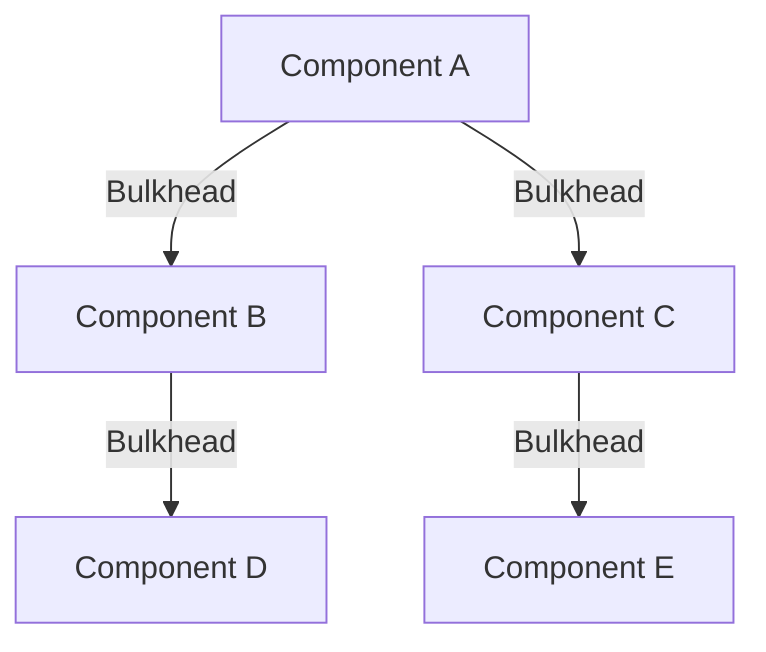
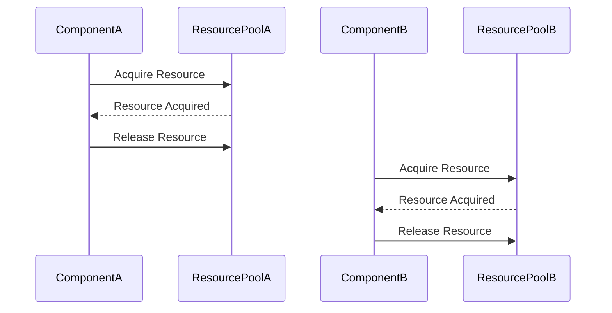

## 9.7. Bulkhead Pattern

In the realm of distributed systems, ensuring the resilience and reliability of applications is paramount. The Bulkhead Pattern is a design strategy that enhances system resilience by isolating resources, thereby preventing failures in one part of the system from cascading to others. This concept is inspired by the bulkheads used in ships, which compartmentalize sections to prevent water from flooding the entire vessel in case of a breach.

### Intent

The primary intent of the Bulkhead Pattern is to improve the overall resilience of a system by isolating failures. By compartmentalizing system components, the pattern ensures that a failure in one component does not lead to a complete system failure. This isolation allows the rest of the system to continue functioning, albeit with reduced capacity.

### Key Participants

1. **Component**: The individual units or services within a system that are isolated from each other.
2. **Bulkhead**: The mechanism or boundary that isolates components, preventing failures from spreading.
3. **Resource Pool**: A collection of resources allocated to each component, ensuring that they operate independently.

### Applicability

The Bulkhead Pattern is applicable in scenarios where:

- Systems are composed of multiple services or components that can fail independently.
- There is a need to maintain partial functionality even when some components fail.
- Resource allocation and management are critical to system performance and reliability.

### Diagrams

To better understand the Bulkhead Pattern, let's visualize it using a diagram that illustrates how components are isolated from each other.



**Diagram Description**: This diagram represents a system where each component is isolated by a bulkhead, ensuring that a failure in one component (e.g., Component A) does not affect others (e.g., Component B, C, D, E).

### Sample Code Snippets

Let's delve into some pseudocode to illustrate how the Bulkhead Pattern can be implemented. We'll focus on isolating components using resource pools.

```pseudocode
// Define a ResourcePool class to manage resources for each component
class ResourcePool {
    int maxResources
    int availableResources

    // Constructor to initialize the resource pool
    ResourcePool(int max) {
        maxResources = max
        availableResources = max
    }

    // Method to acquire resources
    bool acquire(int num) {
        if (availableResources >= num) {
            availableResources -= num
            return true
        }
        return false
    }

    // Method to release resources
    void release(int num) {
        availableResources += num
        if (availableResources > maxResources) {
            availableResources = maxResources
        }
    }
}

// Define a Component class that uses a ResourcePool
class Component {
    ResourcePool resourcePool

    // Constructor to initialize the component with a resource pool
    Component(ResourcePool pool) {
        resourcePool = pool
    }

    // Method to perform an operation
    void performOperation() {
        if (resourcePool.acquire(1)) {
            // Perform the operation
            // ...

            // Release resources after operation
            resourcePool.release(1)
        } else {
            // Handle resource acquisition failure
            print("Operation failed due to lack of resources.")
        }
    }
}

// Example usage
ResourcePool poolA = new ResourcePool(10)
Component componentA = new Component(poolA)

componentA.performOperation()
```

**Code Explanation**: In this pseudocode, we define a `ResourcePool` class to manage resources for each component. The `Component` class uses a `ResourcePool` to perform operations, acquiring and releasing resources as needed. This setup ensures that each component operates independently, preventing failures from affecting others.

### Design Considerations

When implementing the Bulkhead Pattern, consider the following:

- **Resource Allocation**: Determine the optimal number of resources to allocate to each component. This involves balancing resource availability with the need for isolation.
- **Failure Handling**: Implement robust failure handling mechanisms to manage resource acquisition failures gracefully.
- **Monitoring and Alerts**: Set up monitoring and alerting systems to detect and respond to component failures promptly.

### Differences and Similarities

The Bulkhead Pattern is often compared to the Circuit Breaker Pattern, another resilience pattern. While both patterns aim to prevent failures from cascading, they differ in their approaches:

- **Bulkhead Pattern**: Focuses on isolating components to contain failures within specific boundaries.
- **Circuit Breaker Pattern**: Prevents system overload by temporarily halting operations when failures are detected.

### Try It Yourself

To gain a deeper understanding of the Bulkhead Pattern, try modifying the pseudocode example:

- **Experiment with Different Resource Limits**: Adjust the `maxResources` value in the `ResourcePool` class to see how it affects component operations.
- **Simulate Component Failures**: Introduce failures in the `performOperation` method and observe how the system handles them.
- **Implement Additional Components**: Add more components to the system and explore how they interact with each other.

### Visualizing Resource Isolation

To further illustrate the concept of resource isolation, let's create a sequence diagram that demonstrates how components interact with resource pools.



**Diagram Description**: This sequence diagram shows how `ComponentA` and `ComponentB` interact with their respective resource pools. Each component acquires and releases resources independently, ensuring isolation.

### References and Links

For further reading on the Bulkhead Pattern and related resilience patterns, consider exploring the following resources:

- [Martin Fowler's Patterns of Enterprise Application Architecture](https://martinfowler.com/books/eaa.html)
- [Microsoft's Cloud Design Patterns](https://docs.microsoft.com/en-us/azure/architecture/patterns/)
- [Nginx Blog on Bulkhead Pattern](https://www.nginx.com/blog/bulkhead-pattern/)

### Knowledge Check

Before we conclude, let's pose a few questions to reinforce your understanding of the Bulkhead Pattern:

- **What is the primary goal of the Bulkhead Pattern?**
- **How does the Bulkhead Pattern differ from the Circuit Breaker Pattern?**
- **What are some key considerations when implementing the Bulkhead Pattern?**

### Embrace the Journey

Remember, mastering design patterns is a journey. As you explore the Bulkhead Pattern and other resilience strategies, you'll enhance your ability to design robust and reliable distributed systems. Keep experimenting, stay curious, and enjoy the process!

### Quiz Time!



### What is the primary intent of the Bulkhead Pattern?

- [x] To improve system resilience by isolating failures
- [ ] To enhance system performance by optimizing resource usage
- [ ] To simplify system architecture by reducing components
- [ ] To increase system scalability by distributing load

> **Explanation:** The Bulkhead Pattern aims to improve system resilience by isolating failures, ensuring that a failure in one component does not affect others.

### Which of the following is a key participant in the Bulkhead Pattern?

- [x] Component
- [ ] Circuit Breaker
- [ ] Load Balancer
- [ ] Cache

> **Explanation:** The Component is a key participant in the Bulkhead Pattern, representing the individual units isolated by bulkheads.

### How does the Bulkhead Pattern differ from the Circuit Breaker Pattern?

- [x] Bulkhead isolates components; Circuit Breaker prevents overload
- [ ] Bulkhead prevents overload; Circuit Breaker isolates components
- [ ] Both patterns isolate components
- [ ] Both patterns prevent overload

> **Explanation:** The Bulkhead Pattern isolates components to contain failures, while the Circuit Breaker Pattern prevents system overload by halting operations during failures.

### What is a Resource Pool in the context of the Bulkhead Pattern?

- [x] A collection of resources allocated to a component
- [ ] A mechanism for distributing load across components
- [ ] A system for caching frequently used data
- [ ] A strategy for balancing network traffic

> **Explanation:** A Resource Pool is a collection of resources allocated to a component, ensuring independent operation and isolation.

### When is the Bulkhead Pattern most applicable?

- [x] When systems have multiple independent components
- [ ] When systems require high throughput
- [ ] When systems need real-time processing
- [ ] When systems are monolithic

> **Explanation:** The Bulkhead Pattern is most applicable in systems with multiple independent components that can fail independently.

### What should be considered when implementing the Bulkhead Pattern?

- [x] Resource allocation and failure handling
- [ ] Data caching and retrieval
- [ ] Network latency and bandwidth
- [ ] User interface design

> **Explanation:** Resource allocation and failure handling are critical considerations when implementing the Bulkhead Pattern.

### What is the role of a Bulkhead in this pattern?

- [x] To isolate components and prevent failure propagation
- [ ] To optimize resource usage across components
- [ ] To manage network traffic between components
- [ ] To enhance data storage efficiency

> **Explanation:** A Bulkhead isolates components, preventing failures in one part of the system from affecting others.

### How can you experiment with the Bulkhead Pattern?

- [x] Adjust resource limits and simulate failures
- [ ] Optimize database queries
- [ ] Enhance user interface responsiveness
- [ ] Increase network bandwidth

> **Explanation:** Experimenting with resource limits and simulating failures helps understand the Bulkhead Pattern's impact on system resilience.

### True or False: The Bulkhead Pattern is only applicable to microservices architectures.

- [ ] True
- [x] False

> **Explanation:** The Bulkhead Pattern is applicable to various architectures, not just microservices, as it focuses on isolating components.

### Which of the following is NOT a benefit of the Bulkhead Pattern?

- [ ] Improved system resilience
- [ ] Isolation of failures
- [ ] Enhanced scalability
- [x] Simplified codebase

> **Explanation:** While the Bulkhead Pattern improves resilience and isolates failures, it does not necessarily simplify the codebase.


