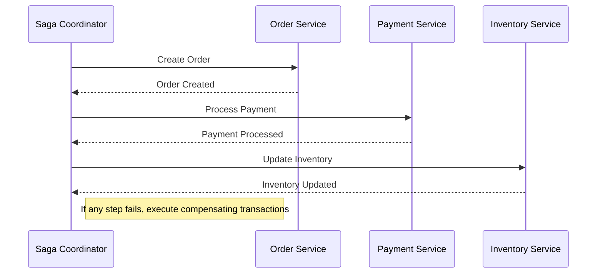

## 9.8. Saga Pattern

In the realm of distributed systems, managing transactions that span multiple services can be a daunting task. Traditional ACID transactions are not always feasible due to the need for high availability and scalability. This is where the Saga Pattern comes into play, offering a solution for managing distributed transactions and coordinating long-running processes. Let's delve into this pattern to understand its intent, applicability, and implementation.

### Intent

The Saga Pattern is designed to manage distributed transactions by breaking them into a series of smaller, isolated transactions that can be coordinated across multiple services. Each transaction in a saga is a local transaction that updates the database and publishes an event or message. If a transaction fails, the saga executes compensating transactions to undo the changes made by preceding transactions.

### Key Participants

1. **Saga Coordinator**: Manages the flow of the saga, ensuring that each step is executed in the correct order and handling any failures by triggering compensating actions.
2. **Participants**: Individual services or components that execute the local transactions and compensating transactions.
3. **Compensating Transactions**: Actions that reverse the effects of a previously completed transaction in case of failure.

### Applicability

The Saga Pattern is particularly useful in the following scenarios:

- **Microservices Architecture**: When dealing with multiple services that need to maintain data consistency without using distributed transactions.
- **Long-Running Processes**: For processes that span multiple transactions and require eventual consistency.
- **High Availability Systems**: Where locking resources for the duration of a transaction is not feasible due to performance constraints.

### Sample Code Snippets

Let's explore a pseudocode example of the Saga Pattern in action. We'll consider a simple e-commerce scenario where an order process involves multiple services: Order Service, Payment Service, and Inventory Service.

```pseudocode
// Define the Saga Coordinator
class SagaCoordinator {
    function executeSaga(orderId) {
        try {
            // Step 1: Create Order
            OrderService.createOrder(orderId)
            // Step 2: Process Payment
            PaymentService.processPayment(orderId)
            // Step 3: Update Inventory
            InventoryService.updateInventory(orderId)
        } catch (Exception e) {
            // Compensating Transactions
            InventoryService.revertInventory(orderId)
            PaymentService.revertPayment(orderId)
            OrderService.cancelOrder(orderId)
        }
    }
}

// Order Service
class OrderService {
    function createOrder(orderId) {
        // Logic to create order
        publishEvent("OrderCreated", orderId)
    }
    
    function cancelOrder(orderId) {
        // Logic to cancel order
        publishEvent("OrderCancelled", orderId)
    }
}

// Payment Service
class PaymentService {
    function processPayment(orderId) {
        // Logic to process payment
        publishEvent("PaymentProcessed", orderId)
    }
    
    function revertPayment(orderId) {
        // Logic to revert payment
        publishEvent("PaymentReverted", orderId)
    }
}

// Inventory Service
class InventoryService {
    function updateInventory(orderId) {
        // Logic to update inventory
        publishEvent("InventoryUpdated", orderId)
    }
    
    function revertInventory(orderId) {
        // Logic to revert inventory
        publishEvent("InventoryReverted", orderId)
    }
}
```

### Design Considerations

When implementing the Saga Pattern, consider the following:

- **Idempotency**: Ensure that each transaction and compensating transaction is idempotent, meaning it can be applied multiple times without changing the result beyond the initial application.
- **Failure Handling**: Design robust failure handling mechanisms to manage partial failures and ensure that compensating transactions are executed correctly.
- **Eventual Consistency**: Accept that the system will be in an inconsistent state temporarily and design for eventual consistency.
- **Monitoring and Logging**: Implement comprehensive monitoring and logging to track the progress of sagas and diagnose issues.

### Differences and Similarities

The Saga Pattern is often compared to the Two-Phase Commit (2PC) protocol. While both aim to ensure consistency across distributed systems, they differ significantly:

- **2PC**: A blocking protocol that locks resources until the transaction is complete, ensuring strong consistency.
- **Saga Pattern**: A non-blocking approach that allows for eventual consistency and is more suitable for high availability systems.

### Visualizing the Saga Pattern

Below is a sequence diagram illustrating the flow of a saga in an e-commerce order process:



### Try It Yourself

To better understand the Saga Pattern, try modifying the pseudocode example:

- Add a new service, such as a Shipping Service, and integrate it into the saga.
- Implement additional failure scenarios and compensating transactions.
- Experiment with different orderings of transactions and observe the impact on the saga's execution.

### Knowledge Check

Before we wrap up, let's reinforce what we've learned with a few questions:

1. What is the primary purpose of the Saga Pattern?
2. How does the Saga Pattern differ from the Two-Phase Commit protocol?
3. Why is idempotency important in the Saga Pattern?
4. What are compensating transactions, and why are they necessary?

### Embrace the Journey

Remember, mastering the Saga Pattern is just one step in your journey to becoming an expert in distributed systems. As you continue to explore and implement design patterns, you'll gain a deeper understanding of how to build robust, scalable, and maintainable systems. Keep experimenting, stay curious, and enjoy the journey!

## Quiz Time!



### What is the primary purpose of the Saga Pattern?

- [x] To manage distributed transactions by breaking them into smaller, isolated transactions.
- [ ] To ensure strong consistency across distributed systems.
- [ ] To lock resources until a transaction is complete.
- [ ] To provide a blocking protocol for distributed systems.

> **Explanation:** The Saga Pattern is designed to manage distributed transactions by breaking them into smaller, isolated transactions that can be coordinated across multiple services.

### How does the Saga Pattern differ from the Two-Phase Commit protocol?

- [x] The Saga Pattern allows for eventual consistency, while 2PC ensures strong consistency.
- [ ] The Saga Pattern locks resources, while 2PC does not.
- [ ] The Saga Pattern is a blocking protocol, while 2PC is non-blocking.
- [ ] The Saga Pattern is used for single-node transactions, while 2PC is for distributed transactions.

> **Explanation:** The Saga Pattern allows for eventual consistency and is non-blocking, making it more suitable for high availability systems compared to the Two-Phase Commit protocol, which ensures strong consistency and is blocking.

### Why is idempotency important in the Saga Pattern?

- [x] To ensure that transactions and compensating transactions can be applied multiple times without changing the result.
- [ ] To lock resources during transaction execution.
- [ ] To ensure strong consistency across all services.
- [ ] To prevent any transaction from being executed more than once.

> **Explanation:** Idempotency ensures that each transaction and compensating transaction can be applied multiple times without changing the result beyond the initial application, which is crucial for handling failures and retries.

### What are compensating transactions, and why are they necessary?

- [x] Actions that reverse the effects of a previously completed transaction in case of failure.
- [ ] Transactions that ensure strong consistency across distributed systems.
- [ ] Transactions that lock resources until completion.
- [ ] Actions that enhance the performance of distributed systems.

> **Explanation:** Compensating transactions are necessary to undo the changes made by preceding transactions in case of failure, ensuring that the system can recover to a consistent state.

### In which scenario is the Saga Pattern particularly useful?

- [x] Microservices architecture where data consistency is needed without using distributed transactions.
- [ ] Single-node systems with strong consistency requirements.
- [ ] Systems that require locking resources for transaction duration.
- [ ] Systems that do not involve long-running processes.

> **Explanation:** The Saga Pattern is particularly useful in microservices architecture where data consistency is needed without using distributed transactions, and for long-running processes requiring eventual consistency.

### What role does the Saga Coordinator play in the Saga Pattern?

- [x] Manages the flow of the saga and handles failures by triggering compensating actions.
- [ ] Executes all local transactions independently.
- [ ] Ensures strong consistency across all services.
- [ ] Locks resources until the saga is complete.

> **Explanation:** The Saga Coordinator manages the flow of the saga, ensuring that each step is executed in the correct order and handling any failures by triggering compensating actions.

### How does the Saga Pattern handle failures during transaction execution?

- [x] By executing compensating transactions to undo changes made by preceding transactions.
- [ ] By locking resources until the transaction is retried.
- [ ] By ensuring strong consistency across all services.
- [ ] By terminating the entire saga without any recovery.

> **Explanation:** The Saga Pattern handles failures by executing compensating transactions to undo changes made by preceding transactions, allowing the system to recover to a consistent state.

### What is a key benefit of using the Saga Pattern in distributed systems?

- [x] It allows for eventual consistency and high availability.
- [ ] It ensures strong consistency and resource locking.
- [ ] It simplifies single-node transaction management.
- [ ] It eliminates the need for compensating transactions.

> **Explanation:** A key benefit of using the Saga Pattern is that it allows for eventual consistency and high availability, making it suitable for distributed systems where traditional ACID transactions are not feasible.

### Which of the following is NOT a participant in the Saga Pattern?

- [ ] Saga Coordinator
- [x] Two-Phase Commit Manager
- [ ] Participants
- [ ] Compensating Transactions

> **Explanation:** The Two-Phase Commit Manager is not a participant in the Saga Pattern. The key participants are the Saga Coordinator, Participants, and Compensating Transactions.

### True or False: The Saga Pattern is a blocking protocol that locks resources until a transaction is complete.

- [ ] True
- [x] False

> **Explanation:** False. The Saga Pattern is a non-blocking approach that allows for eventual consistency without locking resources, making it suitable for high availability systems.


