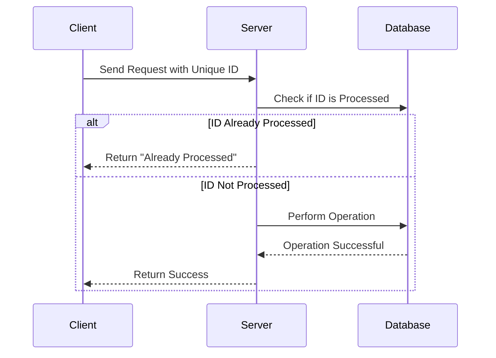

## 9.9. Idempotency Patterns

In the realm of distributed systems, ensuring consistency and reliability is paramount. One of the key concepts that aid in achieving these goals is **idempotency**. This section delves into idempotency patterns, exploring their significance, techniques for implementation, and practical applications in distributed systems.

### Understanding Idempotency

**Idempotency** is a property of certain operations that can be applied multiple times without changing the result beyond the initial application. In simpler terms, an idempotent operation produces the same outcome regardless of how many times it is executed. This characteristic is crucial in distributed systems where network failures, retries, and duplicate requests are common.

#### Key Characteristics of Idempotency

- **Repeatability**: The operation can be repeated multiple times without altering the final state.
- **Consistency**: Ensures that the system remains in a consistent state even when operations are repeated.
- **Fault Tolerance**: Enhances the system's ability to handle failures gracefully.

### Importance of Idempotency in Distributed Systems

In distributed systems, idempotency plays a critical role in maintaining data integrity and reliability. Here are some reasons why idempotency is essential:

1. **Handling Retries**: Network failures or timeouts often necessitate retrying operations. Idempotency ensures that these retries do not lead to inconsistent states.

2. **Duplicate Requests**: In distributed environments, duplicate requests can occur due to network issues or client-side retries. Idempotent operations prevent these duplicates from causing unintended side effects.

3. **Error Recovery**: Idempotency simplifies error recovery by allowing operations to be re-executed safely.

4. **Improved User Experience**: Users can safely retry actions without worrying about adverse effects, leading to a smoother experience.

### Techniques for Achieving Idempotency

Implementing idempotency requires careful consideration of the operation's logic and state management. Here are some common techniques used to achieve idempotency:

#### 1. Using Unique Identifiers

One of the simplest ways to ensure idempotency is by associating each operation with a unique identifier. This identifier is used to track whether the operation has already been processed.

```pseudocode
function processRequest(request):
    if request.id in processedRequests:
        return "Request already processed"
    else:
        performOperation(request)
        processedRequests.add(request.id)
        return "Operation successful"
```

In this pseudocode, each request is checked against a set of processed requests. If the request has already been processed, it is ignored.

#### 2. State-Based Idempotency

Another approach is to design operations that are inherently idempotent by focusing on the desired state rather than the operation itself.

```pseudocode
function updateUserProfile(userId, newProfileData):
    currentProfile = getProfile(userId)
    if currentProfile != newProfileData:
        saveProfile(userId, newProfileData)
    return "Profile updated"
```

Here, the operation only proceeds if the new data differs from the current state, ensuring that repeated updates have no effect.

#### 3. Conditional Updates

Conditional updates involve checking the current state before performing an operation. This technique is particularly useful for operations that modify data.

```pseudocode
function transferFunds(accountFrom, accountTo, amount):
    if getBalance(accountFrom) >= amount:
        debit(accountFrom, amount)
        credit(accountTo, amount)
    return "Transfer completed"
```

In this example, funds are only transferred if the source account has sufficient balance, preventing duplicate transfers.

#### 4. Using Versioning

Versioning involves associating a version number with each resource or operation. Operations are only performed if the version matches the expected value.

```pseudocode
function updateResource(resourceId, newData, version):
    currentResource = getResource(resourceId)
    if currentResource.version == version:
        saveResource(resourceId, newData, version + 1)
    return "Resource updated"
```

This technique ensures that updates are only applied to the correct version, preventing conflicts.

### Implementing Idempotency in Real-World Scenarios

Let's explore some real-world scenarios where idempotency patterns are applied to ensure reliable operations in distributed systems.

#### Scenario 1: Payment Processing

In payment processing systems, ensuring that a transaction is processed only once is crucial. Idempotency can be achieved by associating each transaction with a unique identifier, such as a transaction ID.

```pseudocode
function processPayment(transactionId, amount):
    if transactionId in processedTransactions:
        return "Transaction already processed"
    else:
        debitAccount(amount)
        processedTransactions.add(transactionId)
        return "Payment successful"
```

By tracking processed transactions, the system prevents duplicate charges.

#### Scenario 2: Order Management

In e-commerce platforms, order creation is an operation that must be idempotent to avoid duplicate orders. This can be achieved by using unique order IDs.

```pseudocode
function createOrder(orderId, orderDetails):
    if orderId in createdOrders:
        return "Order already created"
    else:
        saveOrder(orderDetails)
        createdOrders.add(orderId)
        return "Order created"
```

This approach ensures that each order is created only once, even if the request is repeated.

#### Scenario 3: Inventory Management

In inventory management systems, updating stock levels must be idempotent to prevent discrepancies. This can be achieved using state-based idempotency.

```pseudocode
function updateStock(itemId, newStockLevel):
    currentStockLevel = getStockLevel(itemId)
    if currentStockLevel != newStockLevel:
        setStockLevel(itemId, newStockLevel)
    return "Stock updated"
```

By comparing the current and new stock levels, the system ensures that updates are only applied when necessary.

### Visualizing Idempotency in Distributed Systems

To better understand how idempotency works in distributed systems, let's visualize the process using a sequence diagram.



**Diagram Description**: This sequence diagram illustrates the interaction between a client, server, and database in an idempotent operation. The server checks if the request ID has already been processed before performing the operation, ensuring idempotency.

### Design Considerations for Idempotency Patterns

When implementing idempotency patterns, several design considerations should be taken into account:

1. **Storage of Identifiers**: Ensure that the storage mechanism for tracking processed identifiers is reliable and scalable.

2. **Performance Impact**: Consider the performance implications of checking identifiers or state before performing operations.

3. **Consistency Models**: Choose an appropriate consistency model that aligns with the system's requirements.

4. **Error Handling**: Implement robust error handling to manage failures gracefully.

5. **Security**: Protect against unauthorized access to idempotency-related data, such as transaction IDs.

### Differences and Similarities with Other Patterns

Idempotency patterns share similarities with other design patterns, such as:

- **Retry Patterns**: Both patterns deal with handling retries, but idempotency focuses on ensuring consistent outcomes.

- **State Patterns**: Idempotency often involves managing state to ensure repeatable actions.

- **Transaction Patterns**: Idempotency can be seen as a lightweight form of transaction management, ensuring consistency without full transaction overhead.

### Try It Yourself

To deepen your understanding of idempotency patterns, try modifying the provided pseudocode examples. Experiment with different scenarios, such as handling network failures or simulating duplicate requests. Observe how idempotency ensures consistent outcomes.

### Knowledge Check

- **Question**: Why is idempotency important in distributed systems?
- **Challenge**: Implement an idempotent operation for a hypothetical e-commerce platform's order creation process.

### Conclusion

Idempotency patterns are a vital tool in the design of distributed systems, ensuring reliability and consistency in the face of network failures and retries. By understanding and implementing these patterns, developers can build robust systems that handle failures gracefully and provide a seamless user experience.

Remember, mastering idempotency patterns is just one step in your journey to becoming an expert in distributed systems. Keep exploring, experimenting, and learning to enhance your skills and build resilient software solutions.

## Quiz Time!



### What is the primary characteristic of an idempotent operation?

- [x] It can be applied multiple times without changing the result beyond the initial application.
- [ ] It must be executed exactly once.
- [ ] It requires a unique identifier for each execution.
- [ ] It always returns the same output regardless of input.

> **Explanation:** An idempotent operation can be applied multiple times without changing the result beyond the initial application, ensuring consistency.

### Which technique involves associating a version number with each resource to achieve idempotency?

- [ ] Using Unique Identifiers
- [ ] State-Based Idempotency
- [x] Using Versioning
- [ ] Conditional Updates

> **Explanation:** Using versioning involves associating a version number with each resource or operation to ensure updates are only applied to the correct version.

### In the context of idempotency, what is the purpose of using unique identifiers?

- [x] To track whether an operation has already been processed.
- [ ] To ensure operations are executed in order.
- [ ] To provide a unique output for each execution.
- [ ] To enhance performance by reducing processing time.

> **Explanation:** Unique identifiers are used to track whether an operation has already been processed, preventing duplicate executions.

### What is a common use case for idempotency in distributed systems?

- [ ] Enhancing user interface design.
- [x] Handling retries and duplicate requests.
- [ ] Improving data compression.
- [ ] Reducing memory usage.

> **Explanation:** Idempotency is commonly used to handle retries and duplicate requests, ensuring consistent outcomes in distributed systems.

### Which of the following is NOT a technique for achieving idempotency?

- [ ] Using Unique Identifiers
- [ ] State-Based Idempotency
- [ ] Conditional Updates
- [x] Data Encryption

> **Explanation:** Data encryption is not a technique for achieving idempotency; it is used for securing data.

### How does state-based idempotency ensure consistent outcomes?

- [ ] By encrypting data before processing.
- [ ] By using unique identifiers for each request.
- [x] By focusing on the desired state rather than the operation itself.
- [ ] By executing operations in parallel.

> **Explanation:** State-based idempotency ensures consistent outcomes by focusing on the desired state rather than the operation itself, preventing unnecessary updates.

### What is a potential design consideration when implementing idempotency patterns?

- [x] Storage of Identifiers
- [ ] Data Compression
- [ ] User Interface Design
- [ ] Color Scheme Selection

> **Explanation:** Storage of identifiers is a potential design consideration when implementing idempotency patterns, ensuring reliable tracking of processed operations.

### Which pattern shares similarities with idempotency patterns in handling retries?

- [ ] Singleton Pattern
- [x] Retry Patterns
- [ ] Observer Pattern
- [ ] Factory Pattern

> **Explanation:** Retry patterns share similarities with idempotency patterns in handling retries, although idempotency focuses on ensuring consistent outcomes.

### True or False: Idempotency patterns are only applicable to financial transactions.

- [ ] True
- [x] False

> **Explanation:** False. Idempotency patterns are applicable to various scenarios in distributed systems, not just financial transactions.

### What is the primary goal of implementing idempotency patterns in distributed systems?

- [ ] To enhance user interface design.
- [ ] To reduce data storage requirements.
- [x] To ensure reliability and consistency in operations.
- [ ] To improve network bandwidth.

> **Explanation:** The primary goal of implementing idempotency patterns in distributed systems is to ensure reliability and consistency in operations, handling retries and duplicate requests gracefully.


