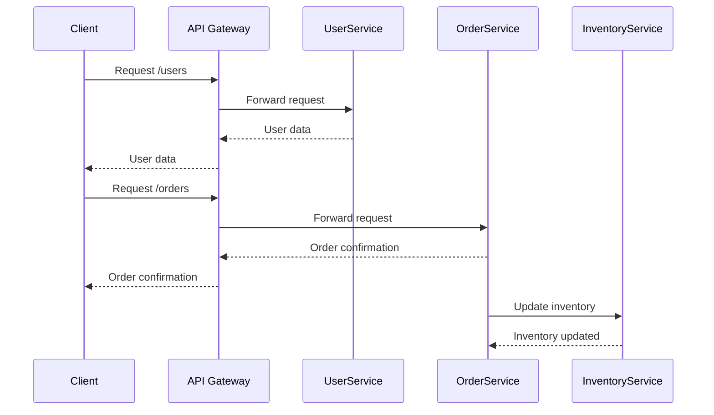

## 1.1. What Are Microservices?

Microservices architecture is a modern approach to software development that structures an application as a collection of loosely coupled services. This section will delve into the definition, key characteristics, history, evolution, benefits, and challenges of microservices. We will also provide pseudocode examples to illustrate complex interactions and system designs.

### Definition and Key Characteristics

**Microservices Defined**

Microservices, also known as the microservices architecture, is a style of software design where a system is divided into small, independent services that communicate over a network. Each service is self-contained, focusing on a specific business function, and can be developed, deployed, and scaled independently.

**Key Characteristics of Microservices**

1. **Single Responsibility Principle**: Each microservice is designed to perform a specific task or business function. This aligns with the Single Responsibility Principle, ensuring that each service has a focused purpose.

2. **Decentralized Data Management**: Unlike monolithic architectures where a single database is shared, microservices often have their own databases. This allows for data encapsulation and autonomy.

3. **Inter-Service Communication**: Microservices communicate with each other using lightweight protocols such as HTTP/REST or messaging queues. This communication can be synchronous or asynchronous.

4. **Scalability**: Microservices can be scaled independently, allowing for efficient resource utilization. This is particularly beneficial for services with varying loads.

5. **Resilience**: The failure of one service does not necessarily affect the entire system. Microservices can be designed to handle failures gracefully, often using patterns like circuit breakers.

6. **Continuous Delivery and Deployment**: Microservices support agile development practices, enabling frequent updates and deployments without affecting the entire system.

7. **Polyglot Programming**: Different services can be developed using different programming languages or technologies, allowing teams to choose the best tools for each task.

#### Pseudocode Example: Basic Microservice Structure

```pseudocode
// Define a simple microservice for user management
service UserService {
    // Endpoint for creating a new user
    endpoint POST /users {
        input: UserData
        output: UserResponse
        action: createUser
    }

    // Function to create a new user
    function createUser(UserData data) {
        // Validate user data
        if (isValid(data)) {
            // Save user to database
            userId = database.save(data)
            return UserResponse(success=true, userId=userId)
        } else {
            return UserResponse(success=false, error="Invalid data")
        }
    }
}
```

### History and Evolution of Microservices

**From Monolithic to Service-Oriented Architecture (SOA) to Microservices**

The journey to microservices began with monolithic architectures, where all components of an application are tightly integrated into a single unit. While monolithic systems are straightforward to develop and deploy initially, they become cumbersome as they grow. Changes to one part of the system often require redeploying the entire application, leading to longer development cycles and increased risk of failure.

**Service-Oriented Architecture (SOA)** emerged as a solution to these challenges by promoting the use of services to encapsulate business logic. However, SOA implementations often suffered from complexity due to heavyweight protocols and centralized governance.

Microservices architecture builds on the principles of SOA but emphasizes lightweight communication, decentralized governance, and independent deployment. This evolution reflects a shift towards more agile and scalable systems.

#### Visualizing the Evolution


### Benefits of Microservices Architecture

1. **Scalability**: Microservices allow for horizontal scaling, where individual services can be scaled independently based on demand. This ensures optimal resource utilization and cost efficiency.

2. **Flexibility**: Teams can choose the best technology stack for each service, enabling innovation and experimentation. This polyglot approach allows for the integration of diverse tools and frameworks.

3. **Faster Development Cycles**: By decoupling services, development teams can work on different parts of the application simultaneously. This parallel development accelerates delivery and reduces time-to-market.

4. **Resilience and Fault Isolation**: The failure of one service does not bring down the entire system. Microservices can be designed to handle failures gracefully, improving overall system reliability.

5. **Continuous Delivery and Deployment**: Microservices support agile practices, allowing for frequent updates and deployments. This reduces the risk associated with large releases and enables rapid iteration.

#### Pseudocode Example: Independent Scaling

```pseudocode
// Define a scalable microservice for order processing
service OrderService {
    // Endpoint for processing an order
    endpoint POST /orders {
        input: OrderData
        output: OrderResponse
        action: processOrder
    }

    // Function to process an order
    function processOrder(OrderData data) {
        // Validate order data
        if (isValid(data)) {
            // Process order asynchronously
            async process(data)
            return OrderResponse(success=true, message="Order is being processed")
        } else {
            return OrderResponse(success=false, error="Invalid order data")
        }
    }
}

// Scale OrderService based on demand
scaleService(OrderService, instances=calculateInstances(load))
```

### Challenges of Microservices Architecture

1. **Complexity**: Managing a distributed system with multiple services introduces complexity in terms of deployment, monitoring, and debugging. Effective orchestration and management tools are essential.

2. **Data Consistency**: Ensuring data consistency across services can be challenging, especially in distributed systems. Techniques like eventual consistency and distributed transactions are often employed.

3. **Operational Overhead**: Microservices require robust infrastructure for service discovery, load balancing, and fault tolerance. This can increase operational overhead and require specialized skills.

4. **Security**: Securing inter-service communication and data storage is critical. Implementing consistent security measures across services can be complex.

5. **Network Latency**: Communication between services over a network can introduce latency. Optimizing inter-service communication is crucial for maintaining performance.

#### Pseudocode Example: Handling Data Consistency

```pseudocode
// Define a microservice for inventory management
service InventoryService {
    // Endpoint for updating inventory
    endpoint POST /inventory/update {
        input: InventoryData
        output: InventoryResponse
        action: updateInventory
    }

    // Function to update inventory
    function updateInventory(InventoryData data) {
        // Begin distributed transaction
        transaction {
            // Update inventory database
            database.update(data)
            // Publish inventory update event
            eventBus.publish("InventoryUpdated", data)
        }
        return InventoryResponse(success=true, message="Inventory updated")
    }
}
```

### Try It Yourself

Experiment with the pseudocode examples provided. Try modifying the `UserService` to add a new endpoint for retrieving user details or enhance the `OrderService` to include order cancellation functionality. This hands-on approach will deepen your understanding of microservices architecture.

### Visualizing Microservices Architecture



### References and Links

- [Martin Fowler's Microservices](https://martinfowler.com/articles/microservices.html)
- [AWS Microservices](https://aws.amazon.com/microservices/)
- [Google Cloud Microservices](https://cloud.google.com/microservices)

### Knowledge Check

- What are the key characteristics of microservices?
- How do microservices differ from monolithic architectures?
- What are the benefits of using microservices?
- What challenges might you face when implementing microservices?

### Embrace the Journey

Remember, understanding microservices is just the beginning. As you progress, you'll explore more complex patterns and architectures. Keep experimenting, stay curious, and enjoy the journey!

## Quiz Time!



### What is a defining characteristic of microservices architecture?

- [x] Each service is independently deployable.
- [ ] All services share a single database.
- [ ] Services are tightly coupled.
- [ ] Services must be written in the same programming language.

> **Explanation:** A defining characteristic of microservices is that each service is independently deployable, allowing for flexibility and scalability.

### Which principle does microservices architecture align with?

- [x] Single Responsibility Principle
- [ ] Open/Closed Principle
- [ ] Liskov Substitution Principle
- [ ] Interface Segregation Principle

> **Explanation:** Microservices architecture aligns with the Single Responsibility Principle, as each service is designed to perform a specific task or business function.

### What is a benefit of microservices architecture?

- [x] Faster development cycles
- [ ] Increased monolithic complexity
- [ ] Centralized data management
- [ ] Single point of failure

> **Explanation:** Microservices architecture allows for faster development cycles by enabling parallel development and independent deployment.

### What challenge is associated with microservices architecture?

- [x] Data consistency
- [ ] Easy debugging
- [ ] Simplified deployment
- [ ] Reduced operational overhead

> **Explanation:** Ensuring data consistency across distributed services is a challenge in microservices architecture.

### How do microservices communicate with each other?

- [x] Using lightweight protocols like HTTP/REST
- [ ] Through direct database access
- [ ] Via shared memory
- [ ] Using heavyweight protocols like SOAP

> **Explanation:** Microservices communicate using lightweight protocols such as HTTP/REST or messaging queues.

### What is a common tool used for service discovery in microservices?

- [x] Consul
- [ ] MySQL
- [ ] Apache Kafka
- [ ] Jenkins

> **Explanation:** Consul is a common tool used for service discovery in microservices environments.

### Which of the following is a benefit of decentralized data management in microservices?

- [x] Services can choose the best database for their needs.
- [ ] All services must use the same database schema.
- [ ] Data is stored in a central repository.
- [ ] Services are tightly coupled to a single database.

> **Explanation:** Decentralized data management allows services to choose the best database for their specific needs, enhancing flexibility and autonomy.

### What is a potential drawback of microservices architecture?

- [x] Increased complexity
- [ ] Simplified scaling
- [ ] Reduced network latency
- [ ] Centralized governance

> **Explanation:** Microservices architecture can lead to increased complexity due to the need to manage multiple independent services.

### What is the purpose of an API Gateway in microservices?

- [x] To manage client interactions and route requests to appropriate services
- [ ] To store all service data centrally
- [ ] To compile code for all services
- [ ] To enforce a single programming language across services

> **Explanation:** An API Gateway manages client interactions, routing requests to the appropriate services and often handling cross-cutting concerns like authentication.

### True or False: Microservices architecture allows for polyglot programming.

- [x] True
- [ ] False

> **Explanation:** Microservices architecture supports polyglot programming, allowing different services to be developed using different programming languages or technologies.


