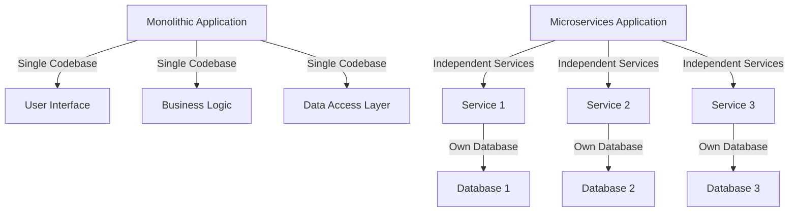

## 1.2. Comparing Monolithic and Microservices Architectures

In the world of software development, choosing the right architectural style is crucial for the success of a project. Two predominant architectural styles are Monolithic and Microservices architectures. Each has its own set of characteristics, benefits, and challenges. In this section, we will explore these two architectures in detail, compare their features, and discuss when to use each approach.

### Monolithic Architecture Overview

Monolithic architecture is a traditional model of software design where an application is built as a single, unified unit. This architecture is characterized by its simplicity and ease of deployment, but it also comes with certain limitations.

#### Features of Monolithic Architecture

1. **Unified Codebase**: All components of the application are tightly integrated and share a single codebase. This includes user interface, business logic, and data access layers.

2. **Single Deployment Unit**: The entire application is packaged and deployed as a single unit. This simplifies the deployment process as there is only one artifact to manage.

3. **Tight Coupling**: Components within a monolithic application are often tightly coupled, meaning changes in one part of the application can impact others.

4. **Centralized Data Management**: Typically, a monolithic application uses a single database to manage all its data, which can simplify data management but also create bottlenecks.

5. **Ease of Development**: For small applications, monolithic architecture can be easier to develop and manage because everything is in one place.

#### Limitations of Monolithic Architecture

1. **Scalability Challenges**: Scaling a monolithic application can be difficult because it requires scaling the entire application, even if only one part needs more resources.

2. **Limited Flexibility**: The tight coupling of components makes it difficult to adopt new technologies or make significant changes without affecting the entire system.

3. **Deployment Bottlenecks**: Any change, no matter how small, requires the entire application to be redeployed, which can lead to longer deployment cycles and increased risk of downtime.

4. **Complexity in Large Applications**: As the application grows, the codebase can become unwieldy, making it difficult to manage and understand.

5. **Risk of Single Points of Failure**: Since everything is integrated, a failure in one part of the application can potentially bring down the entire system.

### Microservices Architecture Overview

Microservices architecture is a modern approach to software design that structures an application as a collection of loosely coupled services. Each service is responsible for a specific business capability and can be developed, deployed, and scaled independently.

#### Features of Microservices Architecture

1. **Decoupling and Modularity**: Services are decoupled and modular, allowing teams to work on different parts of the application independently.

2. **Independent Deployment**: Each service can be deployed independently, enabling more frequent and reliable deployments.

3. **Scalability**: Services can be scaled independently based on demand, allowing for more efficient use of resources.

4. **Technology Diversity**: Teams can choose the best technology stack for each service, allowing for greater flexibility and innovation.

5. **Resilience**: The failure of one service does not necessarily impact the entire system, as services are designed to handle failures gracefully.

#### Benefits of Microservices Architecture

1. **Improved Scalability**: By allowing individual services to be scaled independently, microservices architecture can handle increased load more efficiently.

2. **Faster Time to Market**: Independent deployment and development cycles enable teams to deliver new features and updates more quickly.

3. **Enhanced Flexibility**: Teams can experiment with new technologies and approaches without affecting the entire system.

4. **Better Fault Isolation**: Issues in one service are less likely to affect others, improving overall system reliability.

5. **Organizational Alignment**: Microservices can align with business capabilities, allowing teams to be organized around specific business functions.

#### Challenges of Microservices Architecture

1. **Increased Complexity**: Managing multiple services can be complex, requiring robust infrastructure and tooling.

2. **Data Management**: Ensuring data consistency across services can be challenging, especially in distributed systems.

3. **Operational Overhead**: More services mean more deployments, monitoring, and management, which can increase operational overhead.

4. **Inter-Service Communication**: Services need to communicate with each other, which can introduce latency and complexity.

5. **Security Concerns**: Each service needs to be secured individually, increasing the attack surface.

### When to Use Microservices

Deciding whether to use microservices depends on several factors, including organizational readiness, application needs, and the specific challenges you are facing.

#### Assessing Organizational Readiness

1. **Team Structure**: Microservices require cross-functional teams that can manage the entire lifecycle of a service. Ensure your organization is ready for this shift.

2. **DevOps Culture**: A strong DevOps culture is essential for managing the complexity of microservices. Ensure your organization has the necessary skills and tools.

3. **Infrastructure**: Microservices require robust infrastructure for deployment, monitoring, and management. Ensure your organization has the necessary resources.

#### Application Needs

1. **Scalability Requirements**: If your application needs to handle varying loads efficiently, microservices may be a good fit.

2. **Rapid Development and Deployment**: If you need to deliver new features quickly and reliably, microservices can enable faster development cycles.

3. **Complex Business Logic**: If your application has complex business logic that can be divided into distinct services, microservices can help manage this complexity.

4. **Technology Diversity**: If you want to leverage different technologies for different parts of your application, microservices provide the flexibility to do so.

### Visualizing the Differences

To better understand the differences between monolithic and microservices architectures, let's visualize them using a diagram.



**Diagram Description**: The diagram illustrates the monolithic architecture as a single block with tightly integrated components, while the microservices architecture is depicted as a collection of independent services, each with its own database.

### Code Examples

To further illustrate the differences, let's look at some pseudocode examples.

#### Monolithic Architecture Example

```pseudocode
// Monolithic Application
class Application {
    function start() {
        // Initialize components
        initializeUI();
        initializeBusinessLogic();
        initializeDataAccess();
    }

    function initializeUI() {
        // Set up user interface
    }

    function initializeBusinessLogic() {
        // Set up business logic
    }

    function initializeDataAccess() {
        // Set up data access
    }
}

app = new Application();
app.start();
```

**Explanation**: In this monolithic example, the application initializes all components together, reflecting the tight coupling and single deployment unit characteristic of monolithic architecture.

#### Microservices Architecture Example

```pseudocode
// Microservices Application
class Service {
    function start() {
        // Initialize service-specific components
        initializeService();
    }

    function initializeService() {
        // Set up service logic
    }
}

service1 = new Service();
service2 = new Service();
service3 = new Service();

service1.start();
service2.start();
service3.start();
```

**Explanation**: In this microservices example, each service is initialized independently, reflecting the decoupling and modularity of microservices architecture.

### Try It Yourself

To better understand these architectures, try modifying the pseudocode examples:

1. **Monolithic Example**: Add a new component to the monolithic application and observe how it affects the entire application.

2. **Microservices Example**: Add a new service to the microservices application and see how it can be developed and deployed independently.

### Knowledge Check

To reinforce your understanding, consider the following questions:

1. What are the main features of monolithic architecture?
2. How does microservices architecture improve scalability?
3. What are the challenges of managing data in a microservices architecture?
4. When might a monolithic architecture be more appropriate than microservices?

### Conclusion

In conclusion, both monolithic and microservices architectures have their own strengths and weaknesses. Monolithic architecture is simple and easy to manage for small applications, but it can become unwieldy as the application grows. Microservices architecture offers greater flexibility and scalability, but it also introduces complexity and requires robust infrastructure and processes.

Choosing the right architecture depends on your specific needs and circumstances. By understanding the differences between these two approaches, you can make an informed decision that aligns with your goals and resources.

## Quiz Time!



### What is a key characteristic of monolithic architecture?

- [x] Single codebase
- [ ] Independent services
- [ ] Decoupled components
- [ ] Multiple databases

> **Explanation:** Monolithic architecture is characterized by a single codebase where all components are tightly integrated.

### What is a primary benefit of microservices architecture?

- [x] Independent deployment
- [ ] Single deployment unit
- [ ] Centralized data management
- [ ] Tight coupling

> **Explanation:** Microservices architecture allows for independent deployment of services, enabling more frequent and reliable updates.

### What challenge is associated with monolithic architecture?

- [x] Scalability challenges
- [ ] Technology diversity
- [ ] Independent scaling
- [ ] Fault isolation

> **Explanation:** Monolithic architecture can face scalability challenges because the entire application must be scaled, even if only one part needs more resources.

### How does microservices architecture handle failures?

- [x] Fault isolation
- [ ] Single point of failure
- [ ] Centralized failure management
- [ ] Tight coupling

> **Explanation:** Microservices architecture provides better fault isolation, as the failure of one service does not necessarily impact the entire system.

### When might a monolithic architecture be more appropriate?

- [x] For small applications
- [ ] For applications with complex business logic
- [ ] When rapid development is needed
- [ ] When technology diversity is required

> **Explanation:** Monolithic architecture can be more appropriate for small applications due to its simplicity and ease of management.

### What is a challenge of microservices architecture?

- [x] Increased complexity
- [ ] Single deployment unit
- [ ] Centralized data management
- [ ] Tight coupling

> **Explanation:** Microservices architecture can introduce increased complexity due to the need to manage multiple services.

### What is a benefit of using microservices for scalability?

- [x] Independent scaling
- [ ] Single codebase
- [ ] Centralized data management
- [ ] Tight coupling

> **Explanation:** Microservices architecture allows for independent scaling of services, enabling more efficient use of resources.

### What is a limitation of monolithic architecture?

- [x] Deployment bottlenecks
- [ ] Independent deployment
- [ ] Technology diversity
- [ ] Fault isolation

> **Explanation:** Monolithic architecture can face deployment bottlenecks because any change requires the entire application to be redeployed.

### How does microservices architecture improve flexibility?

- [x] Technology diversity
- [ ] Single deployment unit
- [ ] Centralized data management
- [ ] Tight coupling

> **Explanation:** Microservices architecture allows teams to choose the best technology stack for each service, enhancing flexibility.

### True or False: Microservices architecture requires a strong DevOps culture.

- [x] True
- [ ] False

> **Explanation:** A strong DevOps culture is essential for managing the complexity of microservices, including deployment, monitoring, and management.


