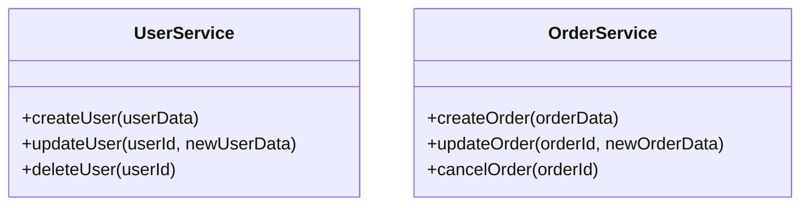
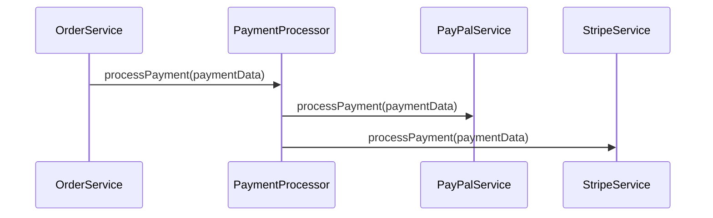

## 1.3. Principles of Microservices Design

In the realm of software architecture, microservices have emerged as a powerful paradigm, enabling organizations to build scalable, flexible, and maintainable systems. At the heart of this architecture are several key principles that guide the design and implementation of microservices. In this section, we will explore these principles in detail, providing clear explanations, illustrative pseudocode examples, and visual aids to enhance understanding.

### Single Responsibility Principle

The Single Responsibility Principle (SRP) is a fundamental concept in software design, advocating that a service should have only one reason to change. This principle ensures that each microservice is focused on a specific functionality, making it easier to understand, develop, and maintain.

#### Designing Services with Focused Functionality

To adhere to the SRP, we must identify and encapsulate distinct business capabilities within individual services. This involves analyzing the business domain and decomposing it into smaller, manageable units.

**Pseudocode Example:**

```pseudocode
// Define a microservice for user management
service UserService {
    function createUser(userData) {
        // Logic to create a new user
    }

    function updateUser(userId, newUserData) {
        // Logic to update existing user information
    }

    function deleteUser(userId) {
        // Logic to delete a user
    }
}

// Define a separate microservice for order processing
service OrderService {
    function createOrder(orderData) {
        // Logic to create a new order
    }

    function updateOrder(orderId, newOrderData) {
        // Logic to update existing order information
    }

    function cancelOrder(orderId) {
        // Logic to cancel an order
    }
}
```

In this example, the `UserService` is responsible solely for user-related operations, while the `OrderService` handles order-related tasks. This separation ensures that changes in user management do not affect order processing, adhering to the SRP.

#### Advantages and Challenges

**Advantages:**

- **Clarity and Simplicity:** Services with a single responsibility are easier to understand and manage.
- **Improved Maintainability:** Changes in one service do not impact others, reducing the risk of unintended side effects.
- **Enhanced Testability:** Focused services allow for more targeted and effective testing.

**Challenges:**

- **Granularity Balance:** Determining the right level of granularity can be challenging. Too fine-grained services may lead to increased complexity and communication overhead.
- **Domain Understanding:** Requires a deep understanding of the business domain to identify appropriate service boundaries.

### Loose Coupling and High Cohesion

Loose coupling and high cohesion are essential principles in microservices design, promoting independence and modularity. These principles ensure that services can evolve independently and interact with minimal dependencies.

#### Minimizing Dependencies

Loose coupling minimizes the dependencies between services, allowing them to change and scale independently. This is achieved through well-defined interfaces and communication protocols.

**Pseudocode Example:**

```pseudocode
// Define an interface for payment processing
interface PaymentProcessor {
    function processPayment(paymentData)
}

// Implement the interface in a specific payment service
service PayPalService implements PaymentProcessor {
    function processPayment(paymentData) {
        // Logic to process payment using PayPal
    }
}

// Another implementation of the payment processor
service StripeService implements PaymentProcessor {
    function processPayment(paymentData) {
        // Logic to process payment using Stripe
    }
}

// Order service uses the payment processor interface
service OrderService {
    function completeOrder(orderId, paymentData, PaymentProcessor processor) {
        // Logic to complete the order
        processor.processPayment(paymentData)
    }
}
```

In this example, the `OrderService` interacts with the `PaymentProcessor` interface, allowing it to use different payment services without being tightly coupled to any specific implementation.

#### Benefits for Scalability and Maintainability

**Benefits:**

- **Scalability:** Services can be scaled independently based on demand, optimizing resource usage.
- **Flexibility:** New services or changes to existing ones can be introduced without disrupting the entire system.
- **Resilience:** Failures in one service do not cascade to others, enhancing system stability.

**Challenges:**

- **Communication Overhead:** Increased number of services may lead to higher communication costs and complexity.
- **Data Consistency:** Ensuring data consistency across loosely coupled services can be challenging.

### Continuous Delivery and Deployment

Continuous delivery and deployment are practices that enable frequent and reliable software releases. In a microservices architecture, these practices are crucial for maintaining agility and responsiveness to change.

#### Enabling Frequent Updates and Releases

Continuous delivery involves automating the build, test, and deployment processes, allowing for rapid and reliable releases.

**Pseudocode Example:**

```pseudocode
// Define a CI/CD pipeline for a microservice
pipeline MicroservicePipeline {
    stage('Build') {
        // Compile and build the service
        execute buildService()
    }

    stage('Test') {
        // Run unit and integration tests
        execute runTests()
    }

    stage('Deploy') {
        // Deploy the service to the staging environment
        execute deployToStaging()
    }

    stage('Release') {
        // Release the service to production
        execute releaseToProduction()
    }
}
```

This pseudocode outlines a simple CI/CD pipeline, automating the steps from building to releasing a microservice.

#### Automating Deployment Pipelines

**Benefits:**

- **Reduced Time to Market:** Faster release cycles enable quicker delivery of new features and bug fixes.
- **Improved Quality:** Automated testing ensures that only high-quality code is deployed.
- **Increased Reliability:** Consistent and repeatable deployment processes reduce the risk of errors.

**Challenges:**

- **Complexity:** Setting up and maintaining CI/CD pipelines can be complex, requiring significant effort and expertise.
- **Cultural Shift:** Organizations may need to adopt a DevOps culture, emphasizing collaboration between development and operations teams.

### Decentralized Governance

Decentralized governance empowers teams to make independent decisions about technology choices, fostering innovation and agility.

#### Allowing Teams Autonomy in Technology Choices

In a decentralized governance model, teams have the freedom to choose the tools and technologies that best suit their needs, within certain guidelines.

**Pseudocode Example:**

```pseudocode
// Define a governance policy for technology choices
policy TechnologyChoicePolicy {
    // Allow teams to choose programming languages
    allow languages = ['Java', 'Python', 'Go']

    // Allow teams to choose databases
    allow databases = ['PostgreSQL', 'MongoDB', 'DynamoDB']

    // Require security and compliance checks
    require securityChecks()
    require complianceChecks()
}

// Team A chooses Java and PostgreSQL
team TeamA {
    language = 'Java'
    database = 'PostgreSQL'
}

// Team B chooses Python and MongoDB
team TeamB {
    language = 'Python'
    database = 'MongoDB'
}
```

This pseudocode illustrates a governance policy that provides teams with flexibility while ensuring compliance with organizational standards.

#### Benefits and Challenges

**Benefits:**

- **Innovation:** Teams can experiment with new technologies and approaches, driving innovation.
- **Responsiveness:** Teams can quickly adapt to changing requirements and market conditions.
- **Ownership:** Teams take ownership of their services, leading to higher quality and accountability.

**Challenges:**

- **Consistency:** Ensuring consistency across services can be challenging when teams use different technologies.
- **Integration:** Integrating services built with diverse technologies may require additional effort.

### Visualizing Microservices Principles

To better understand the principles of microservices design, let's visualize the interactions and relationships between services using Mermaid.js diagrams.

#### Visualizing Service Responsibilities



This diagram illustrates the responsibilities of the `UserService` and `OrderService`, highlighting the separation of concerns.

#### Visualizing Loose Coupling



This sequence diagram shows how the `OrderService` interacts with the `PaymentProcessor` interface, demonstrating loose coupling.

### Try It Yourself

To deepen your understanding of these principles, try modifying the pseudocode examples:

- **Experiment with SRP:** Create additional services for different business functions, such as inventory management or customer support.
- **Explore Loose Coupling:** Implement a new payment service and integrate it with the existing `OrderService`.
- **Enhance CI/CD Pipelines:** Add additional stages to the pipeline, such as security scanning or performance testing.
- **Customize Governance Policies:** Define your own technology choice policies and apply them to hypothetical teams.

### Knowledge Check

Before we conclude, let's reinforce your understanding with a few questions:

- What are the key benefits of adhering to the Single Responsibility Principle?
- How does loose coupling enhance the scalability and maintainability of microservices?
- What are the main components of a CI/CD pipeline?
- How does decentralized governance contribute to innovation and agility?

### Embrace the Journey

Remember, mastering microservices design is a journey. As you continue to explore and apply these principles, you'll gain deeper insights and build more robust systems. Keep experimenting, stay curious, and enjoy the process!

## Quiz Time!



### What is the main goal of the Single Responsibility Principle in microservices design?

- [x] To ensure each service has a focused functionality
- [ ] To allow services to use multiple databases
- [ ] To enable services to communicate synchronously
- [ ] To centralize governance decisions

> **Explanation:** The Single Responsibility Principle aims to ensure that each service is focused on a specific functionality, making it easier to manage and maintain.

### How does loose coupling benefit microservices architecture?

- [x] It allows services to evolve independently
- [ ] It increases the number of dependencies
- [ ] It centralizes data storage
- [ ] It requires synchronous communication

> **Explanation:** Loose coupling allows services to evolve independently by minimizing dependencies, enhancing flexibility and scalability.

### What is a key component of a CI/CD pipeline?

- [x] Automated testing
- [ ] Manual deployment
- [ ] Centralized database
- [ ] Synchronous messaging

> **Explanation:** Automated testing is a key component of a CI/CD pipeline, ensuring that only high-quality code is deployed.

### What is the benefit of decentralized governance in microservices?

- [x] It fosters innovation by allowing teams to choose their technologies
- [ ] It centralizes decision-making
- [ ] It requires all teams to use the same tools
- [ ] It limits the autonomy of development teams

> **Explanation:** Decentralized governance fosters innovation by allowing teams to choose the technologies that best suit their needs.

### Which principle emphasizes the separation of business capabilities into distinct services?

- [x] Single Responsibility Principle
- [ ] Continuous Delivery
- [ ] Decentralized Governance
- [ ] Loose Coupling

> **Explanation:** The Single Responsibility Principle emphasizes the separation of business capabilities into distinct services, ensuring focused functionality.

### What challenge is associated with loose coupling in microservices?

- [x] Communication overhead
- [ ] Increased centralization
- [ ] Reduced flexibility
- [ ] Limited scalability

> **Explanation:** Loose coupling can lead to communication overhead due to the increased number of interactions between services.

### How does continuous delivery benefit software development?

- [x] It reduces time to market
- [ ] It centralizes data storage
- [ ] It limits the frequency of releases
- [ ] It requires manual testing

> **Explanation:** Continuous delivery reduces time to market by enabling faster and more reliable software releases.

### What is a challenge of decentralized governance?

- [x] Ensuring consistency across services
- [ ] Limiting innovation
- [ ] Centralizing decision-making
- [ ] Reducing team autonomy

> **Explanation:** Ensuring consistency across services can be challenging when teams use different technologies in a decentralized governance model.

### What is the purpose of a CI/CD pipeline?

- [x] To automate the build, test, and deployment processes
- [ ] To centralize data storage
- [ ] To limit the frequency of releases
- [ ] To require manual testing

> **Explanation:** A CI/CD pipeline automates the build, test, and deployment processes, enabling rapid and reliable software releases.

### True or False: Decentralized governance limits the autonomy of development teams.

- [ ] True
- [x] False

> **Explanation:** False. Decentralized governance enhances the autonomy of development teams by allowing them to make independent technology choices.


