## 1.4. Overview of Microservices Design Patterns

Microservices architecture is a powerful approach to building scalable and maintainable software systems. However, it comes with its own set of challenges. To address these challenges, developers can leverage a variety of design patterns. This guide provides a comprehensive overview of microservices design patterns, categorized into decomposition, communication, data management, security, and observability patterns. We will explore each category, providing clear explanations, pseudocode examples, and visual diagrams to enhance understanding.

### Purpose and Scope

Microservices design patterns serve as reusable solutions to common problems encountered in microservices architecture. They help developers design systems that are scalable, resilient, and easy to maintain. By understanding and applying these patterns, you can effectively address architectural challenges such as service decomposition, inter-service communication, data consistency, security, and system observability.

### Categories of Microservices Patterns

#### Decomposition Patterns

Decomposition patterns focus on breaking down a monolithic application into smaller, independent services. This section will cover the following patterns:

1. **Decompose by Business Capability**
2. **Decompose by Subdomain (Domain-Driven Design)**
3. **Strangler Fig Pattern**

#### Communication Patterns

Communication patterns address how services interact with each other. This section will cover:

1. **API Gateway Pattern**
2. **Service Mesh Pattern**
3. **Circuit Breaker Pattern**
4. **Event-Driven Communication**
5. **Saga Pattern**
6. **Message Broker Pattern**

#### Data Management Patterns

Data management patterns focus on handling data across distributed services. This section will cover:

1. **Database per Service Pattern**
2. **Shared Database Pattern**
3. **Event Sourcing Pattern**
4. **CQRS (Command Query Responsibility Segregation) Pattern**
5. **Data Replication and Synchronization**
6. **Polyglot Persistence**

#### Security Patterns

Security patterns ensure that microservices are secure from unauthorized access and data breaches. This section will cover:

1. **Authentication and Authorization**
2. **Service-to-Service Security**
3. **Security in Data Storage**
4. **Threat Modeling and Monitoring**

#### Observability Patterns

Observability patterns help in monitoring and understanding the behavior of microservices. This section will cover:

1. **Monitoring and Logging**
2. **Distributed Tracing**
3. **Health Checks and Circuit Breakers**
4. **Logging Patterns**

### How to Use This Guide

This guide is structured to provide a deep understanding of each design pattern. Each pattern is introduced with its intent, key participants, applicability, and design considerations. Pseudocode examples are provided to illustrate how the pattern can be implemented. Diagrams are included to visually represent complex interactions and system designs. 

To make the most of this guide, follow these steps:

1. **Start with the Basics**: Begin with the decomposition patterns to understand how to break down a monolithic application into microservices.
2. **Explore Communication Patterns**: Learn how services can communicate effectively and resiliently.
3. **Understand Data Management**: Discover how to manage data across distributed services while ensuring consistency and integrity.
4. **Secure Your Services**: Implement security patterns to protect your microservices from threats.
5. **Enhance Observability**: Use observability patterns to monitor and troubleshoot your microservices architecture.

Let's dive into each category and explore the design patterns in detail.

---

### Decomposition Patterns

#### 1. Decompose by Business Capability

**Intent**: Align microservices with business capabilities to ensure that each service has a clear and focused responsibility.

**Key Participants**:
- Business Analysts
- Domain Experts
- Developers

**Applicability**: Use this pattern when you want to ensure that your microservices architecture closely aligns with the business structure and goals.

**Design Considerations**:
- Ensure that each service encapsulates a distinct business capability.
- Avoid creating services that are too granular, leading to increased complexity.

**Pseudocode Example**:

```pseudocode
// Define a service for each business capability
Service OrderManagement {
    Function createOrder(orderDetails) {
        // Logic to create an order
    }
    Function cancelOrder(orderId) {
        // Logic to cancel an order
    }
}

Service InventoryManagement {
    Function updateStock(productId, quantity) {
        // Logic to update stock levels
    }
    Function checkStock(productId) {
        // Logic to check stock availability
    }
}
```

**Diagram**:

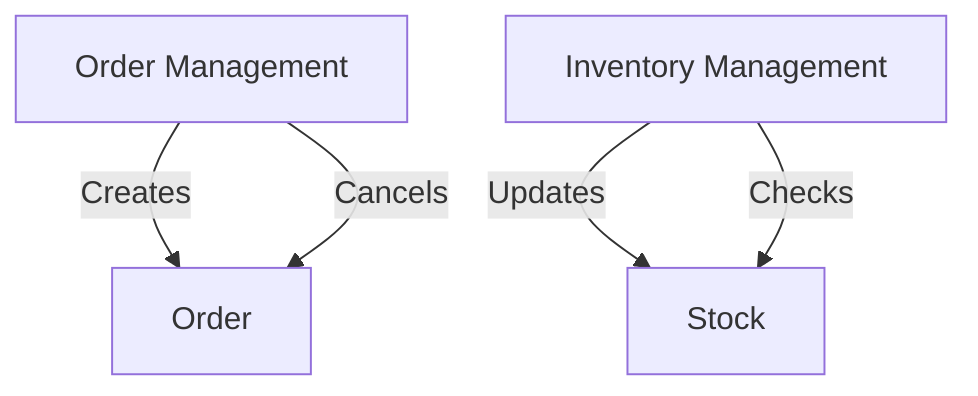

**Programming Language Specifics**: While the pseudocode is language-agnostic, consider using language features that support modularization and encapsulation, such as classes or modules.

**Differences and Similarities**: This pattern is similar to the decomposition by subdomain pattern but focuses more on aligning with business capabilities rather than domain boundaries.

#### 2. Decompose by Subdomain (Domain-Driven Design)

**Intent**: Use domain-driven design (DDD) principles to define service boundaries based on subdomains.

**Key Participants**:
- Domain Experts
- Developers

**Applicability**: Use this pattern when you want to leverage DDD to inform your microservices architecture.

**Design Considerations**:
- Identify bounded contexts and define services around them.
- Use ubiquitous language to ensure clear communication between domain experts and developers.

**Pseudocode Example**:

```pseudocode
// Define a service for each subdomain
Service CustomerContext {
    Function addCustomer(customerDetails) {
        // Logic to add a customer
    }
    Function getCustomer(customerId) {
        // Logic to retrieve customer information
    }
}

Service BillingContext {
    Function generateInvoice(orderId) {
        // Logic to generate an invoice
    }
    Function processPayment(paymentDetails) {
        // Logic to process payment
    }
}
```

**Diagram**:

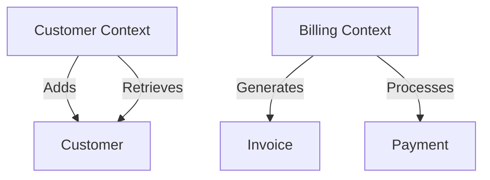

**Programming Language Specifics**: Use language constructs that support encapsulation and separation of concerns, such as namespaces or packages.

**Differences and Similarities**: This pattern is similar to the decomposition by business capability pattern but focuses on domain boundaries rather than business capabilities.

#### 3. Strangler Fig Pattern

**Intent**: Incrementally migrate a monolithic application to microservices by gradually replacing parts of the monolith with new services.

**Key Participants**:
- Developers
- Architects

**Applicability**: Use this pattern when you need to migrate a legacy system to microservices without disrupting existing functionality.

**Design Considerations**:
- Identify parts of the monolith that can be easily extracted as services.
- Use feature toggles to switch between the monolith and new services.

**Pseudocode Example**:

```pseudocode
// Strangler Fig Pattern implementation
Function migrateFeature(featureName) {
    If (featureName is in monolith) {
        // Redirect to new microservice
        redirectToMicroservice(featureName)
    } else {
        // Use existing monolith feature
        useMonolithFeature(featureName)
    }
}
```

**Diagram**:

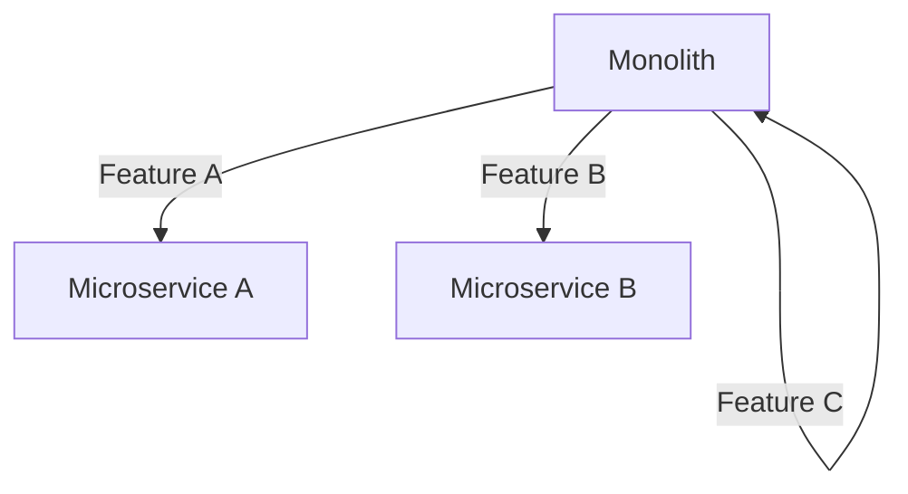

**Programming Language Specifics**: Use language features that support conditional logic and redirection, such as if-else statements and function calls.

**Differences and Similarities**: This pattern is unique in its focus on incremental migration, unlike other decomposition patterns that start with a clean slate.

---

### Communication Patterns

#### 1. API Gateway Pattern

**Intent**: Provide a single entry point for clients to interact with multiple microservices.

**Key Participants**:
- API Gateway
- Microservices

**Applicability**: Use this pattern when you need to manage client interactions with multiple services.

**Design Considerations**:
- Implement routing, authentication, and protocol translation in the gateway.
- Ensure the gateway is scalable and resilient.

**Pseudocode Example**:

```pseudocode
// API Gateway implementation
Service APIGateway {
    Function routeRequest(request) {
        If (request is for Service A) {
            forwardToServiceA(request)
        } else if (request is for Service B) {
            forwardToServiceB(request)
        }
    }
}
```

**Diagram**:

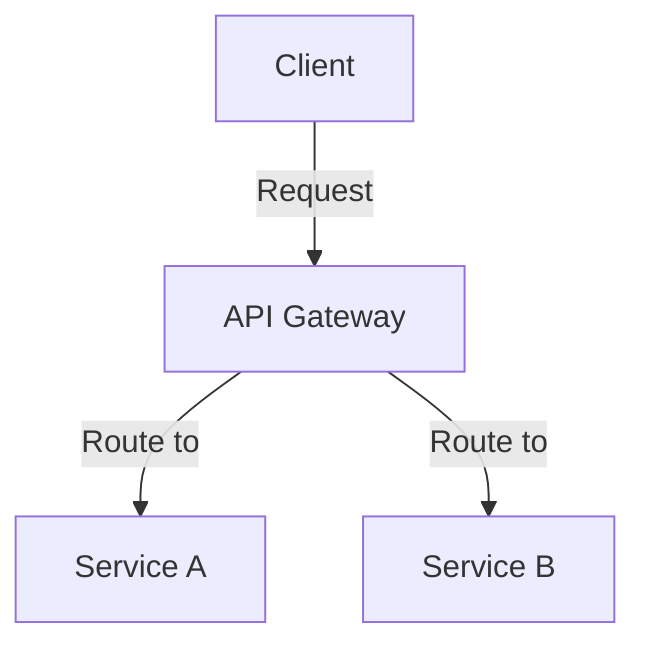

**Programming Language Specifics**: Use language features that support networking and HTTP request handling, such as libraries for web servers.

**Differences and Similarities**: This pattern is similar to the service mesh pattern but focuses on client-to-service interactions rather than service-to-service communication.

#### 2. Service Mesh Pattern

**Intent**: Manage service-to-service communication using a dedicated infrastructure layer.

**Key Participants**:
- Service Mesh
- Microservices

**Applicability**: Use this pattern when you need to manage complex service-to-service interactions.

**Design Considerations**:
- Implement features like load balancing, encryption, and observability in the mesh.
- Ensure the mesh is scalable and does not introduce significant latency.

**Pseudocode Example**:

```pseudocode
// Service Mesh implementation
ServiceMesh {
    Function manageTraffic(serviceRequest) {
        // Logic for load balancing and routing
        routeToService(serviceRequest)
    }
    Function secureCommunication(serviceRequest) {
        // Logic for encryption and authentication
        encryptRequest(serviceRequest)
    }
}
```

**Diagram**:

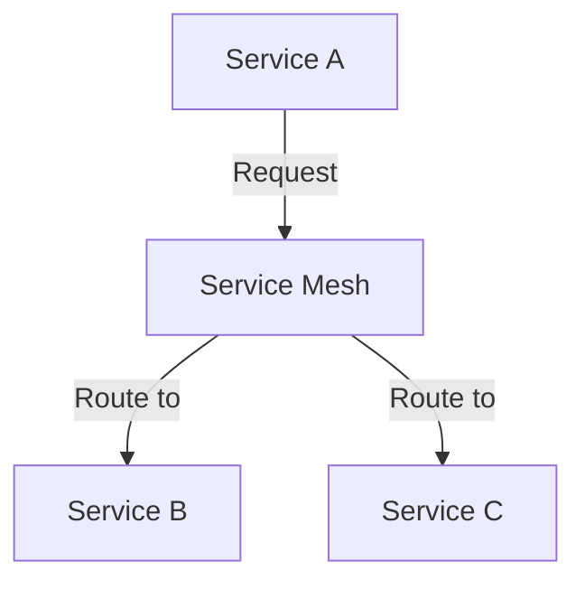

**Programming Language Specifics**: Use language features that support networking and security, such as libraries for encryption and load balancing.

**Differences and Similarities**: This pattern is similar to the API gateway pattern but focuses on service-to-service communication rather than client-to-service interactions.

#### 3. Circuit Breaker Pattern

**Intent**: Protect services from cascading failures by preventing requests to failing services.

**Key Participants**:
- Circuit Breaker
- Microservices

**Applicability**: Use this pattern when you need to ensure system resilience in the face of service failures.

**Design Considerations**:
- Implement states and transitions for the circuit breaker (closed, open, half-open).
- Ensure the circuit breaker is configurable and can be adjusted based on system needs.

**Pseudocode Example**:

```pseudocode
// Circuit Breaker implementation
CircuitBreaker {
    State state = CLOSED

    Function callService(serviceRequest) {
        If (state is CLOSED) {
            Try {
                // Attempt to call the service
                response = callService(serviceRequest)
                resetFailures()
            } Catch (Exception e) {
                recordFailure()
                If (failures exceed threshold) {
                    state = OPEN
                }
            }
        } else if (state is OPEN) {
            // Return fallback response
            returnFallbackResponse()
        } else if (state is HALF_OPEN) {
            // Attempt limited requests
            testService()
        }
    }
}
```

**Diagram**:

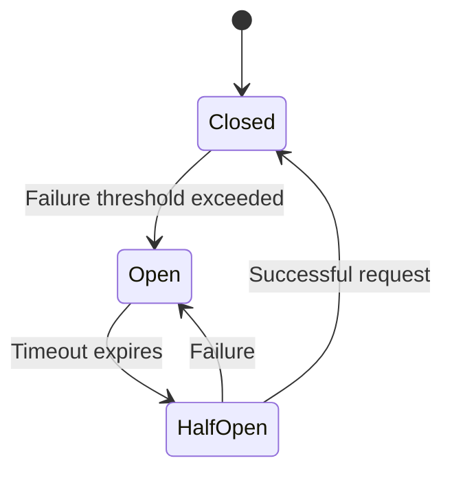

**Programming Language Specifics**: Use language features that support exception handling and state management, such as try-catch blocks and state machines.

**Differences and Similarities**: This pattern is unique in its focus on failure prevention, unlike other communication patterns that focus on routing and interaction.

#### 4. Event-Driven Communication

**Intent**: Decouple services by using events to trigger actions across services.

**Key Participants**:
- Event Producers
- Event Consumers
- Event Bus

**Applicability**: Use this pattern when you need to decouple services and enable asynchronous communication.

**Design Considerations**:
- Implement event producers and consumers with clear contracts.
- Ensure the event bus is reliable and can handle high volumes of events.

**Pseudocode Example**:

```pseudocode
// Event-Driven Communication implementation
EventBus {
    Function publishEvent(event) {
        // Logic to publish event to consumers
        notifyConsumers(event)
    }
}

Service OrderService {
    Function placeOrder(orderDetails) {
        // Logic to place an order
        publishEvent(orderPlacedEvent)
    }
}

Service InventoryService {
    Function onOrderPlaced(orderPlacedEvent) {
        // Logic to update inventory
        updateInventory(orderPlacedEvent)
    }
}
```

**Diagram**:

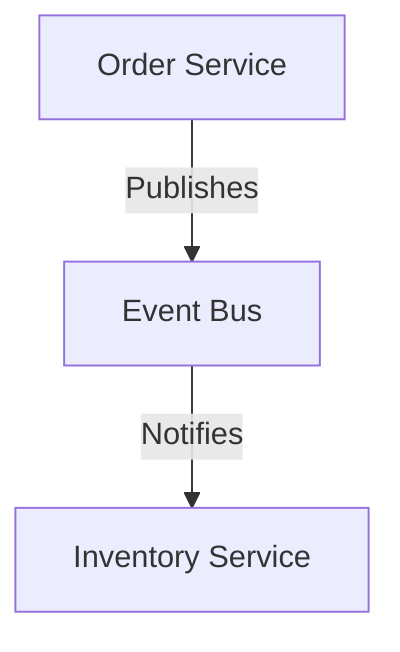

**Programming Language Specifics**: Use language features that support event handling and messaging, such as libraries for message queues and event buses.

**Differences and Similarities**: This pattern is similar to the message broker pattern but focuses on event-driven interactions rather than message-based communication.

#### 5. Saga Pattern

**Intent**: Manage distributed transactions by coordinating a series of local transactions across services.

**Key Participants**:
- Saga Coordinator
- Microservices

**Applicability**: Use this pattern when you need to ensure data consistency across multiple services.

**Design Considerations**:
- Implement choreography or orchestration for saga coordination.
- Ensure compensating transactions are defined for each local transaction.

**Pseudocode Example**:

```pseudocode
// Saga Pattern implementation
SagaCoordinator {
    Function startSaga(sagaRequest) {
        // Logic to start and coordinate saga
        executeLocalTransaction1(sagaRequest)
        executeLocalTransaction2(sagaRequest)
        // Handle compensating transactions if needed
    }
}

Service PaymentService {
    Function executeLocalTransaction1(sagaRequest) {
        // Logic for local transaction
    }
}

Service ShippingService {
    Function executeLocalTransaction2(sagaRequest) {
        // Logic for local transaction
    }
}
```

**Diagram**:

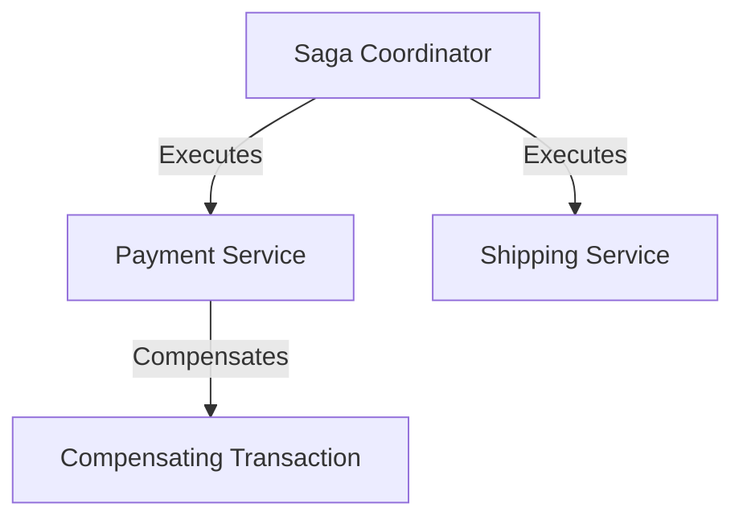

**Programming Language Specifics**: Use language features that support transaction management and coordination, such as libraries for distributed transactions.

**Differences and Similarities**: This pattern is similar to the event-driven communication pattern but focuses on transaction coordination rather than event propagation.

#### 6. Message Broker Pattern

**Intent**: Facilitate asynchronous communication between services using a message broker.

**Key Participants**:
- Message Broker
- Producers
- Consumers

**Applicability**: Use this pattern when you need to enable asynchronous communication between services.

**Design Considerations**:
- Implement message producers and consumers with clear contracts.
- Ensure the message broker is reliable and can handle high volumes of messages.

**Pseudocode Example**:

```pseudocode
// Message Broker implementation
MessageBroker {
    Function sendMessage(message) {
        // Logic to send message to consumers
        deliverMessage(message)
    }
}

Service NotificationService {
    Function onMessageReceived(message) {
        // Logic to process message
        processNotification(message)
    }
}
```

**Diagram**:

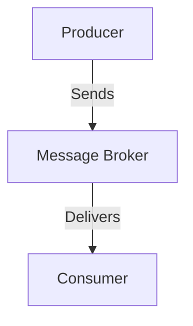

**Programming Language Specifics**: Use language features that support messaging and communication, such as libraries for message queues and brokers.

**Differences and Similarities**: This pattern is similar to the event-driven communication pattern but focuses on message-based interactions rather than event-driven interactions.

---

### Data Management Patterns

#### 1. Database per Service Pattern

**Intent**: Ensure each service has its own database to maintain data encapsulation and independence.

**Key Participants**:
- Microservices
- Databases

**Applicability**: Use this pattern when you need to ensure data encapsulation and independent scaling of services.

**Design Considerations**:
- Ensure each service has its own database schema.
- Implement data synchronization mechanisms if needed.

**Pseudocode Example**:

```pseudocode
// Database per Service implementation
Service OrderService {
    Database orderDB

    Function createOrder(orderDetails) {
        // Logic to create an order in orderDB
    }
}

Service CustomerService {
    Database customerDB

    Function addCustomer(customerDetails) {
        // Logic to add a customer in customerDB
    }
}
```

**Diagram**:

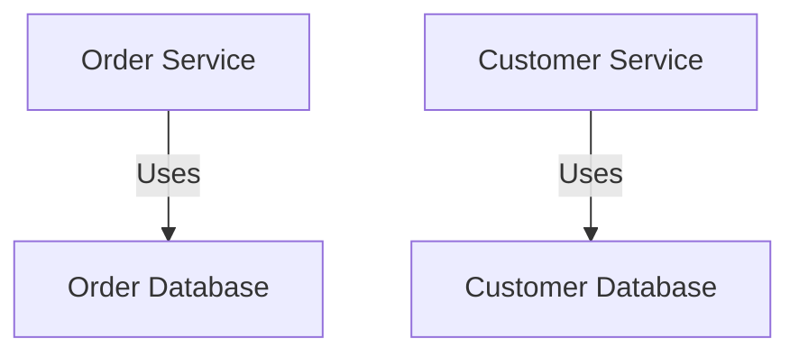

**Programming Language Specifics**: Use language features that support database interactions, such as libraries for database connections and queries.

**Differences and Similarities**: This pattern is unique in its focus on data encapsulation, unlike other data management patterns that focus on data sharing and synchronization.

#### 2. Shared Database Pattern

**Intent**: Allow multiple services to share a single database when data encapsulation is not practical.

**Key Participants**:
- Microservices
- Shared Database

**Applicability**: Use this pattern when data encapsulation is not feasible due to business or technical constraints.

**Design Considerations**:
- Ensure clear data ownership and access controls.
- Implement mechanisms to prevent data conflicts.

**Pseudocode Example**:

```pseudocode
// Shared Database implementation
Service OrderService {
    SharedDatabase sharedDB

    Function createOrder(orderDetails) {
        // Logic to create an order in sharedDB
    }
}

Service InventoryService {
    SharedDatabase sharedDB

    Function updateStock(productId, quantity) {
        // Logic to update stock in sharedDB
    }
}
```

**Diagram**:

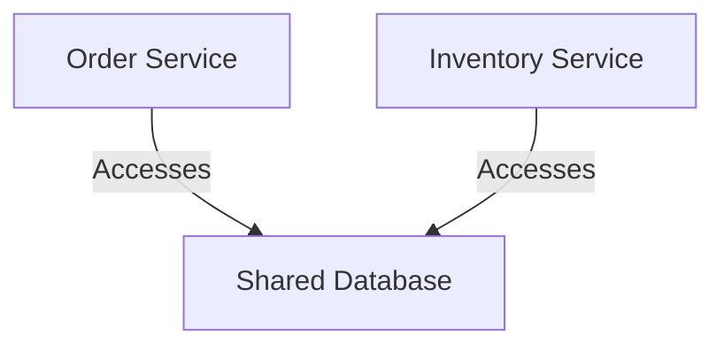

**Programming Language Specifics**: Use language features that support database interactions, such as libraries for database connections and queries.

**Differences and Similarities**: This pattern is similar to the database per service pattern but focuses on data sharing rather than encapsulation.

#### 3. Event Sourcing Pattern

**Intent**: Capture state changes as a sequence of events to build application state.

**Key Participants**:
- Event Store
- Microservices

**Applicability**: Use this pattern when you need to ensure auditability and temporal queries.

**Design Considerations**:
- Implement an event store to capture and store events.
- Ensure events are immutable and can be replayed to rebuild state.

**Pseudocode Example**:

```pseudocode
// Event Sourcing implementation
EventStore {
    Function storeEvent(event) {
        // Logic to store event
    }
    Function replayEvents() {
        // Logic to replay events and rebuild state
    }
}

Service OrderService {
    Function placeOrder(orderDetails) {
        // Logic to place an order
        storeEvent(orderPlacedEvent)
    }
}
```

**Diagram**:

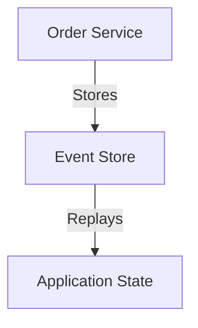

**Programming Language Specifics**: Use language features that support event handling and storage, such as libraries for event stores and message queues.

**Differences and Similarities**: This pattern is similar to the CQRS pattern but focuses on event storage rather than command-query separation.

#### 4. CQRS (Command Query Responsibility Segregation) Pattern

**Intent**: Separate read and write models to optimize for different workloads.

**Key Participants**:
- Command Model
- Query Model
- Microservices

**Applicability**: Use this pattern when you need to optimize for different read and write workloads.

**Design Considerations**:
- Implement separate models for commands and queries.
- Ensure data consistency between the models.

**Pseudocode Example**:

```pseudocode
// CQRS implementation
Service OrderService {
    CommandModel commandModel
    QueryModel queryModel

    Function placeOrder(orderDetails) {
        // Logic to place an order using commandModel
    }

    Function getOrder(orderId) {
        // Logic to retrieve order using queryModel
    }
}
```

**Diagram**:

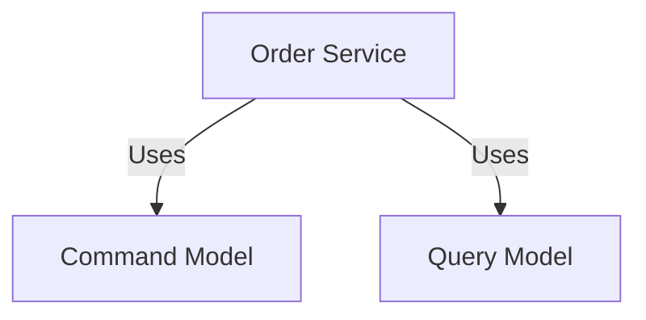

**Programming Language Specifics**: Use language features that support model separation, such as classes or modules.

**Differences and Similarities**: This pattern is similar to the event sourcing pattern but focuses on model separation rather than event storage.

#### 5. Data Replication and Synchronization

**Intent**: Ensure data consistency across distributed services through replication and synchronization.

**Key Participants**:
- Microservices
- Databases

**Applicability**: Use this pattern when you need to ensure data consistency across distributed services.

**Design Considerations**:
- Implement data replication and synchronization mechanisms.
- Ensure conflict resolution strategies are in place.

**Pseudocode Example**:

```pseudocode
// Data Replication and Synchronization implementation
Service OrderService {
    Database orderDB

    Function replicateData() {
        // Logic to replicate data to other services
    }
}

Service InventoryService {
    Database inventoryDB

    Function synchronizeData() {
        // Logic to synchronize data with other services
    }
}
```

**Diagram**:

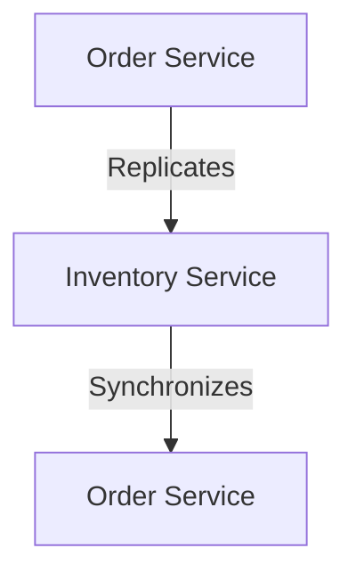

**Programming Language Specifics**: Use language features that support data replication and synchronization, such as libraries for database replication and messaging.

**Differences and Similarities**: This pattern is similar to the database per service pattern but focuses on data consistency rather than encapsulation.

#### 6. Polyglot Persistence

**Intent**: Use multiple data storage technologies to optimize for different data needs.

**Key Participants**:
- Microservices
- Databases

**Applicability**: Use this pattern when you need to optimize for different data storage needs.

**Design Considerations**:
- Implement interfaces for different data storage technologies.
- Ensure data consistency across different storage systems.

**Pseudocode Example**:

```pseudocode
// Polyglot Persistence implementation
Service OrderService {
    SQLDatabase sqlDB
    NoSQLDatabase noSQLDB

    Function storeOrder(orderDetails) {
        // Logic to store order in sqlDB
    }

    Function storeOrderMetadata(metadata) {
        // Logic to store metadata in noSQLDB
    }
}
```

**Diagram**:

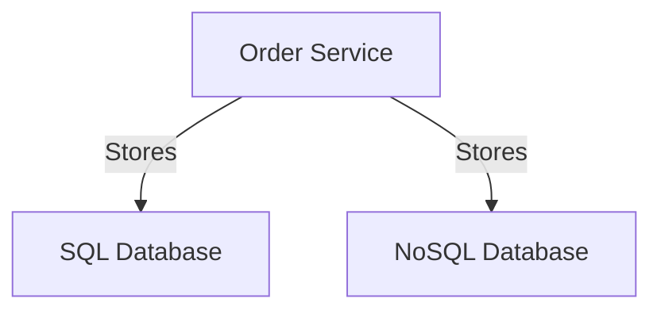

**Programming Language Specifics**: Use language features that support database interactions, such as libraries for SQL and NoSQL databases.

**Differences and Similarities**: This pattern is unique in its focus on using multiple storage technologies, unlike other data management patterns that focus on a single storage solution.

---

### Security Patterns

#### 1. Authentication and Authorization

**Intent**: Secure microservices by implementing authentication and authorization mechanisms.

**Key Participants**:
- API Gateway
- Microservices

**Applicability**: Use this pattern when you need to secure access to microservices.

**Design Considerations**:
- Implement authentication and authorization at the gateway.
- Use standard protocols like OAuth2 and OpenID Connect.

**Pseudocode Example**:

```pseudocode
// Authentication and Authorization implementation
Service APIGateway {
    Function authenticateRequest(request) {
        // Logic to authenticate request
        validateToken(request.token)
    }

    Function authorizeRequest(request) {
        // Logic to authorize request
        checkPermissions(request.user)
    }
}
```

**Diagram**:

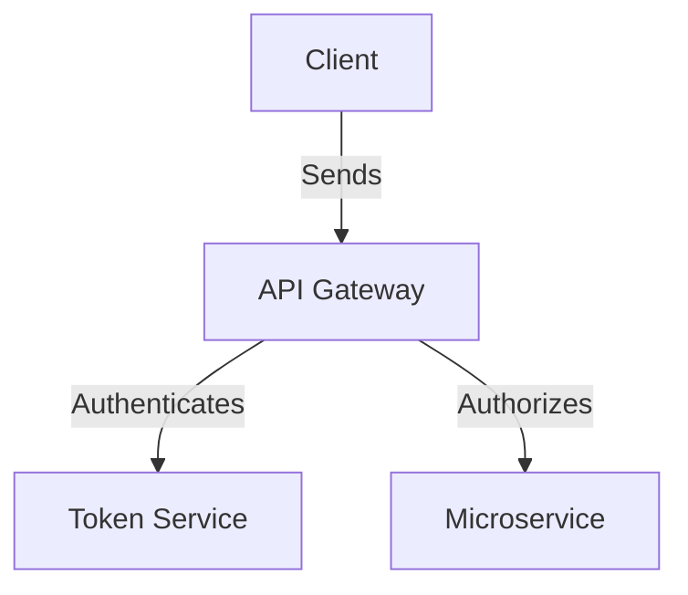

**Programming Language Specifics**: Use language features that support authentication and authorization, such as libraries for token validation and permission checks.

**Differences and Similarities**: This pattern is similar to the service-to-service security pattern but focuses on client-to-service interactions rather than service-to-service communication.

#### 2. Service-to-Service Security

**Intent**: Secure internal communications between microservices.

**Key Participants**:
- Microservices
- Security Infrastructure

**Applicability**: Use this pattern when you need to secure internal service-to-service communication.

**Design Considerations**:
- Implement mutual TLS for encryption.
- Use API keys and tokens for authentication.

**Pseudocode Example**:

```pseudocode
// Service-to-Service Security implementation
Service OrderService {
    Function secureCommunication(request) {
        // Logic to secure communication
        encryptRequest(request)
        validateServiceToken(request.token)
    }
}
```

**Diagram**:

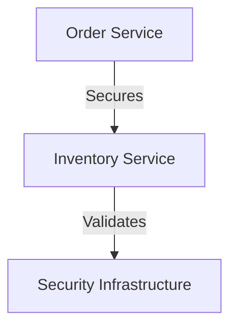

**Programming Language Specifics**: Use language features that support encryption and authentication, such as libraries for TLS and token validation.

**Differences and Similarities**: This pattern is similar to the authentication and authorization pattern but focuses on service-to-service interactions rather than client-to-service communication.

#### 3. Security in Data Storage

**Intent**: Protect stored data from unauthorized access and breaches.

**Key Participants**:
- Microservices
- Databases

**Applicability**: Use this pattern when you need to secure data storage.

**Design Considerations**:
- Implement encryption at rest for stored data.
- Ensure compliance with regulations like GDPR.

**Pseudocode Example**:

```pseudocode
// Security in Data Storage implementation
Service OrderService {
    Database orderDB

    Function storeSecureData(data) {
        // Logic to encrypt and store data
        encryptData(data)
        saveToDatabase(data)
    }
}
```

**Diagram**:

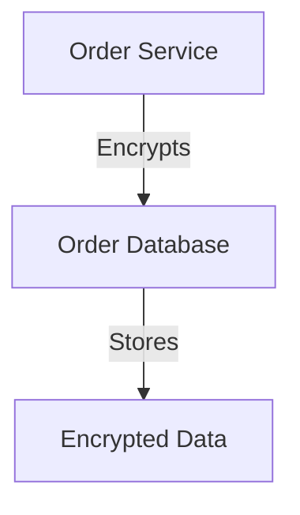

**Programming Language Specifics**: Use language features that support encryption and data storage, such as libraries for cryptography and database interactions.

**Differences and Similarities**: This pattern is unique in its focus on data storage security, unlike other security patterns that focus on communication and access control.

#### 4. Threat Modeling and Monitoring

**Intent**: Identify vulnerabilities and monitor microservices for security threats.

**Key Participants**:
- Security Analysts
- Microservices

**Applicability**: Use this pattern when you need to assess and monitor security risks.

**Design Considerations**:
- Implement threat modeling to identify vulnerabilities.
- Use monitoring tools to detect and respond to threats.

**Pseudocode Example**:

```pseudocode
// Threat Modeling and Monitoring implementation
Service SecurityService {
    Function identifyThreats(service) {
        // Logic to identify threats
        analyzeService(service)
    }

    Function monitorService(service) {
        // Logic to monitor service
        detectAnomalies(service)
    }
}
```

**Diagram**:

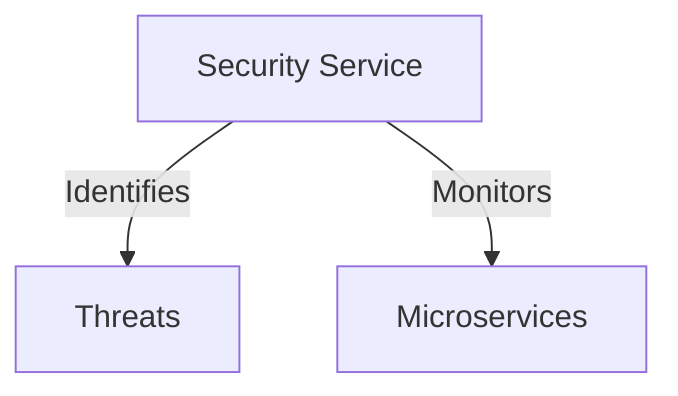

**Programming Language Specifics**: Use language features that support threat analysis and monitoring, such as libraries for security analysis and logging.

**Differences and Similarities**: This pattern is unique in its focus on threat identification and monitoring, unlike other security patterns that focus on access control and encryption.

---

### Observability Patterns

#### 1. Monitoring and Logging

**Intent**: Aggregate logs and metrics from microservices to monitor system behavior.

**Key Participants**:
- Monitoring Tools
- Microservices

**Applicability**: Use this pattern when you need to monitor and troubleshoot microservices.

**Design Considerations**:
- Implement centralized logging and metrics collection.
- Use tools like ELK stack for log aggregation and analysis.

**Pseudocode Example**:

```pseudocode
// Monitoring and Logging implementation
Service MonitoringService {
    Function collectMetrics(service) {
        // Logic to collect metrics
        gatherMetrics(service)
    }

    Function aggregateLogs(service) {
        // Logic to aggregate logs
        collectLogs(service)
    }
}
```

**Diagram**:

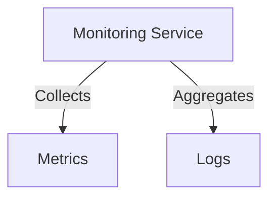

**Programming Language Specifics**: Use language features that support logging and metrics collection, such as libraries for logging and monitoring.

**Differences and Similarities**: This pattern is similar to the distributed tracing pattern but focuses on logs and metrics rather than request traces.

#### 2. Distributed Tracing

**Intent**: Trace requests across microservices to understand system behavior.

**Key Participants**:
- Tracing Tools
- Microservices

**Applicability**: Use this pattern when you need to trace requests and understand system interactions.

**Design Considerations**:
- Implement trace contexts to propagate identifiers through calls.
- Use tools like Jaeger or Zipkin for tracing.

**Pseudocode Example**:

```pseudocode
// Distributed Tracing implementation
Service TracingService {
    Function traceRequest(request) {
        // Logic to trace request
        propagateTraceContext(request)
    }
}
```

**Diagram**:

```mermaid
graph TD;
    A[Tracing Service] -->|Traces| B[Request Path]
    B -->|Propagates| C[Trace Context]
```

**Programming Language Specifics**: Use language features that support tracing and context propagation, such as libraries for distributed tracing.

**Differences and Similarities**: This pattern is similar to the monitoring and logging pattern but focuses on request traces rather than logs and metrics.

#### 3. Health Checks and Circuit Breakers

**Intent**: Monitor service health and prevent failures from affecting the system.

**Key Participants**:
- Health Check Tools
- Microservices

**Applicability**: Use this pattern when you need to ensure service health and resilience.

**Design Considerations**:
- Implement health checks to monitor service status.
- Use circuit breakers to prevent cascading failures.

**Pseudocode Example**:

```pseudocode
// Health Checks and Circuit Breakers implementation
Service HealthCheckService {
    Function checkHealth(service) {
        // Logic to check service health
        performHealthCheck(service)
    }

    Function applyCircuitBreaker(service) {
        // Logic to apply circuit breaker
        monitorFailures(service)
    }
}
```

**Diagram**:

```mermaid
graph TD;
    A[Health Check Service] -->|Checks| B[Service Health]
    A -->|Applies| C[Circuit Breaker]
```

**Programming Language Specifics**: Use language features that support health checks and failure monitoring, such as libraries for health checks and circuit breakers.

**Differences and Similarities**: This pattern is similar to the monitoring and logging pattern but focuses on health and resilience rather than logs and metrics.

#### 4. Logging Patterns

**Intent**: Use structured logging to ensure consistent log formats and enable analysis.

**Key Participants**:
- Logging Tools
- Microservices

**Applicability**: Use this pattern when you need to ensure consistent log formats and enable analysis.

**Design Considerations**:
- Implement structured logging with consistent formats.
- Use tools like ELK stack for log aggregation and analysis.

**Pseudocode Example**:

```pseudocode
// Logging Patterns implementation
Service LoggingService {
    Function logEvent(event) {
        // Logic to log event
        formatLog(event)
        storeLog(event)
    }
}
```

**Diagram**:

```mermaid
graph TD;
    A[Logging Service] -->|Formats| B[Log Event]
    A -->|Stores| C[Log Database]
```

**Programming Language Specifics**: Use language features that support logging and formatting, such as libraries for structured logging.

**Differences and Similarities**: This pattern is similar to the monitoring and logging pattern but focuses on log formats rather than metrics and traces.

---

## Quiz Time!



### What is the primary intent of decomposition patterns in microservices?

- [x] To break down a monolithic application into smaller, independent services.
- [ ] To manage service-to-service communication.
- [ ] To ensure data consistency across services.
- [ ] To secure microservices from unauthorized access.

> **Explanation:** Decomposition patterns focus on breaking down a monolithic application into smaller, independent services to ensure scalability and maintainability.

### Which pattern provides a single entry point for clients to interact with multiple microservices?

- [x] API Gateway Pattern
- [ ] Service Mesh Pattern
- [ ] Circuit Breaker Pattern
- [ ] Saga Pattern

> **Explanation:** The API Gateway Pattern provides a single entry point for clients to interact with multiple microservices, managing client interactions.

### What is the key benefit of using the Database per Service pattern?

- [x] Data encapsulation and independent scaling of services.
- [ ] Shared access to a single database.
- [ ] Centralized data management.
- [ ] Simplified data synchronization.

> **Explanation:** The Database per Service pattern ensures data encapsulation and allows each service to scale independently, avoiding tight coupling.

### Which pattern focuses on capturing state changes as a sequence of events?

- [x] Event Sourcing Pattern
- [ ] CQRS Pattern
- [ ] Saga Pattern
- [ ] Message Broker Pattern

> **Explanation:** The Event Sourcing Pattern captures state changes as a sequence of events, allowing for auditability and temporal queries.

### What is the primary purpose of the Circuit Breaker Pattern?

- [x] To protect services from cascading failures.
- [ ] To manage client interactions with services.
- [ ] To ensure data consistency across services.
- [ ] To secure microservices from unauthorized access.

> **Explanation:** The Circuit Breaker Pattern protects services from cascading failures by preventing requests to failing services.

### Which pattern is used to manage distributed transactions across services?

- [x] Saga Pattern
- [ ] Event-Driven Communication
- [ ] Message Broker Pattern
- [ ] Service Mesh Pattern

> **Explanation:** The Saga Pattern manages distributed transactions by coordinating a series of local transactions across services.

### What is the main focus of the Service Mesh Pattern?

- [x] Managing service-to-service communication.
- [ ] Providing a single entry point for clients.
- [ ] Capturing state changes as events.
- [ ] Ensuring data encapsulation.

> **Explanation:** The Service Mesh Pattern focuses on managing complex service-to-service interactions, providing features like load balancing and encryption.

### Which pattern involves using multiple data storage technologies?

- [x] Polyglot Persistence
- [ ] Database per Service Pattern
- [ ] Shared Database Pattern
- [ ] Event Sourcing Pattern

> **Explanation:** Polyglot Persistence involves using multiple data storage technologies to optimize for different data needs.

### What is the primary intent of observability patterns?

- [x] To monitor and understand the behavior of microservices.
- [ ] To secure microservices from unauthorized access.
- [ ] To manage distributed transactions.
- [ ] To ensure data consistency across services.

> **Explanation:** Observability patterns help in monitoring and understanding the behavior of microservices, enabling troubleshooting and performance analysis.

### True or False: The Strangler Fig Pattern is used for incremental migration from a monolith to microservices.

- [x] True
- [ ] False

> **Explanation:** The Strangler Fig Pattern is indeed used for incremental migration from a monolithic application to microservices, allowing for gradual replacement.


