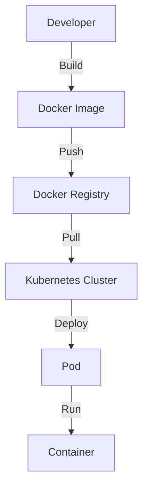

## 10.1. Containerization

Containerization has revolutionized the way we develop, deploy, and manage applications, especially in the realm of microservices. By encapsulating applications and their dependencies into containers, we achieve a consistent and portable environment that can run anywhere. In this section, we will delve into the core concepts of containerization, focusing on Docker for packaging applications and Kubernetes for orchestrating containers at scale.

### Introduction to Containerization

Containerization is a lightweight form of virtualization that allows developers to package applications and their dependencies into a single, self-sufficient unit called a container. Unlike traditional virtual machines, containers share the host system's kernel, making them more efficient in terms of resource usage.

#### Key Benefits of Containerization

- **Portability:** Containers can run consistently across different environments, from a developer's laptop to a production server.
- **Isolation:** Each container operates independently, ensuring that applications do not interfere with each other.
- **Scalability:** Containers can be easily scaled up or down to meet demand.
- **Efficiency:** Containers use fewer resources than virtual machines, as they share the host operating system's kernel.

### Using Docker for Packaging

Docker is the most popular platform for containerization, providing tools to create, deploy, and run applications in containers. Let's explore how Docker standardizes environments and simplifies application deployment.

#### Docker Basics

Docker uses a client-server architecture, where the Docker client communicates with the Docker daemon to build, run, and manage containers.

- **Docker Images:** Immutable templates that define the contents of a container. Images are built from a Dockerfile, which specifies the application's environment and dependencies.
- **Docker Containers:** Instances of Docker images that run as isolated processes on the host system.
- **Docker Registry:** A repository for storing and distributing Docker images. Docker Hub is the default public registry.

#### Creating a Docker Image

To create a Docker image, we write a Dockerfile that describes the application's environment. Here's a simple example:

```pseudocode
FROM python:3.8-slim

WORKDIR /app

COPY . /app

RUN pip install --no-cache-dir -r requirements.txt

EXPOSE 80

ENV NAME World

CMD ["python", "app.py"]
```

**Explanation:**

- **FROM:** Specifies the base image to use.
- **WORKDIR:** Sets the working directory inside the container.
- **COPY:** Copies files from the host to the container.
- **RUN:** Executes commands during the image build process.
- **EXPOSE:** Informs Docker that the container listens on the specified network ports.
- **CMD:** Specifies the command to run when the container starts.

#### Building and Running a Docker Container

Once the Dockerfile is ready, we can build and run the Docker container:

```bash
docker build -t my-python-app .

docker run -p 4000:80 my-python-app
```

**Explanation:**

- **docker build:** Creates a Docker image from the Dockerfile.
- **docker run:** Starts a container from the specified image, mapping port 4000 on the host to port 80 in the container.

### Container Orchestration with Kubernetes

While Docker is excellent for packaging applications, managing containers at scale requires a robust orchestration platform. Kubernetes is the leading container orchestration tool, providing automated deployment, scaling, and management of containerized applications.

#### Key Concepts in Kubernetes

- **Cluster:** A set of nodes (machines) that run containerized applications.
- **Node:** A single machine in a Kubernetes cluster, which can be a physical or virtual machine.
- **Pod:** The smallest deployable unit in Kubernetes, consisting of one or more containers.
- **Service:** An abstraction that defines a logical set of Pods and a policy to access them.
- **Deployment:** A Kubernetes resource that manages the deployment and scaling of Pods.

#### Deploying Applications with Kubernetes

To deploy an application in Kubernetes, we define resources in YAML files. Here's an example of a simple deployment:

```yaml
apiVersion: apps/v1
kind: Deployment
metadata:
  name: my-python-app
spec:
  replicas: 3
  selector:
    matchLabels:
      app: my-python-app
  template:
    metadata:
      labels:
        app: my-python-app
    spec:
      containers:
      - name: my-python-app
        image: my-python-app:latest
        ports:
        - containerPort: 80
```

**Explanation:**

- **apiVersion:** Specifies the API version for the resource.
- **kind:** Defines the type of resource (e.g., Deployment).
- **metadata:** Contains metadata about the resource, such as its name.
- **spec:** Describes the desired state of the resource.
- **replicas:** Specifies the number of Pod replicas to run.
- **selector:** Defines how to identify Pods managed by the Deployment.
- **template:** Describes the Pods to be created.

#### Managing Containers with Kubernetes

Kubernetes provides powerful tools for managing containers, including:

- **Scaling:** Automatically adjust the number of running Pods based on demand.
- **Rolling Updates:** Gradually update Pods with new versions of an application without downtime.
- **Self-Healing:** Automatically restart failed Pods and reschedule them on healthy nodes.

### Visualizing Containerization with Docker and Kubernetes

To better understand the interaction between Docker and Kubernetes, let's visualize the architecture using a Mermaid.js diagram.



**Diagram Explanation:**

- **Developer:** Builds a Docker image from the application code.
- **Docker Image:** The built image is pushed to a Docker registry.
- **Docker Registry:** Stores and distributes Docker images.
- **Kubernetes Cluster:** Pulls the image from the registry and deploys it as a Pod.
- **Pod:** Runs the containerized application.

### Try It Yourself

To solidify your understanding of containerization, try modifying the Dockerfile and Kubernetes YAML file:

- **Dockerfile:** Change the base image to a different version of Python and rebuild the image.
- **Kubernetes YAML:** Increase the number of replicas in the Deployment and observe the changes in the cluster.

### Knowledge Check

Before we conclude, let's review some key takeaways:

- **Docker** is used for packaging applications into containers, providing a consistent environment across different platforms.
- **Kubernetes** manages containerized applications at scale, offering features like automated deployment, scaling, and self-healing.
- **Containers** are lightweight, portable, and efficient, making them ideal for microservices architectures.

### References and Further Reading

For more information on Docker and Kubernetes, check out the following resources:

- [Docker Documentation](https://docs.docker.com/)
- [Kubernetes Documentation](https://kubernetes.io/docs/)
- [Docker Hub](https://hub.docker.com/)
- [Kubernetes Tutorials](https://kubernetes.io/docs/tutorials/)

## Quiz Time!



### What is the primary benefit of using containers in microservices?

- [x] Portability across different environments
- [ ] Increased security
- [ ] Reduced development time
- [ ] Enhanced user interface

> **Explanation:** Containers provide a consistent environment that can run across different platforms, making applications portable.

### Which tool is most commonly used for container orchestration?

- [ ] Docker
- [x] Kubernetes
- [ ] Jenkins
- [ ] Ansible

> **Explanation:** Kubernetes is the leading tool for orchestrating containers, providing automated deployment, scaling, and management.

### In a Dockerfile, what does the `CMD` instruction specify?

- [ ] The base image to use
- [ ] The working directory
- [x] The command to run when the container starts
- [ ] The network ports to expose

> **Explanation:** The `CMD` instruction specifies the command that runs when the container starts.

### What is a Pod in Kubernetes?

- [x] The smallest deployable unit consisting of one or more containers
- [ ] A single container
- [ ] A virtual machine
- [ ] A Docker image

> **Explanation:** A Pod is the smallest deployable unit in Kubernetes, which can contain one or more containers.

### How does Kubernetes ensure high availability of applications?

- [x] By automatically restarting failed Pods
- [ ] By using virtual machines
- [ ] By increasing the number of containers
- [ ] By reducing resource usage

> **Explanation:** Kubernetes automatically restarts failed Pods and reschedules them on healthy nodes to ensure high availability.

### What is the role of a Docker Registry?

- [ ] To build Docker images
- [x] To store and distribute Docker images
- [ ] To run Docker containers
- [ ] To manage Kubernetes clusters

> **Explanation:** A Docker Registry is used to store and distribute Docker images.

### What does the `EXPOSE` instruction in a Dockerfile do?

- [ ] Sets the working directory
- [ ] Installs dependencies
- [x] Informs Docker of the network ports the container listens on
- [ ] Copies files into the container

> **Explanation:** The `EXPOSE` instruction informs Docker of the network ports the container listens on.

### What is the purpose of a Deployment in Kubernetes?

- [ ] To define a logical set of Pods
- [x] To manage the deployment and scaling of Pods
- [ ] To store container images
- [ ] To provide a user interface

> **Explanation:** A Deployment manages the deployment and scaling of Pods in Kubernetes.

### Which command is used to build a Docker image?

- [x] `docker build`
- [ ] `docker run`
- [ ] `docker push`
- [ ] `docker pull`

> **Explanation:** The `docker build` command is used to create a Docker image from a Dockerfile.

### True or False: Containers share the host system's kernel.

- [x] True
- [ ] False

> **Explanation:** Containers are lightweight because they share the host system's kernel, unlike virtual machines which require a separate operating system.



Remember, containerization is a powerful tool in the microservices toolkit. By mastering Docker and Kubernetes, you can build scalable, portable, and efficient applications that meet the demands of modern software development. Keep experimenting, stay curious, and enjoy the journey!
