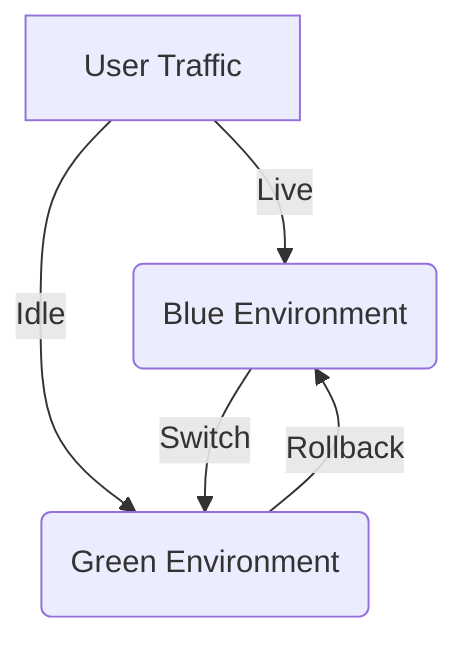
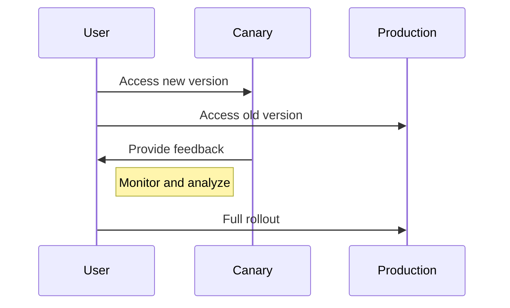
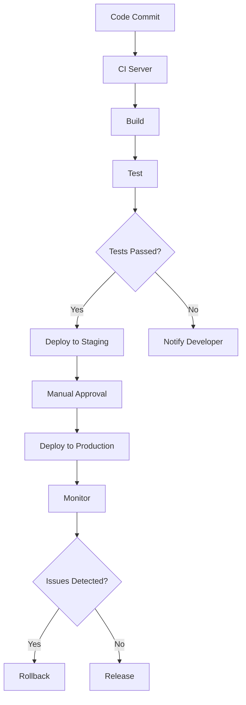

## 10.2. Continuous Integration and Continuous Deployment

In the fast-paced world of software development, Continuous Integration (CI) and Continuous Deployment (CD) have become essential practices for delivering high-quality software efficiently. These practices are particularly crucial in a microservices architecture, where the complexity of managing multiple services can quickly become overwhelming. In this section, we will delve into the principles of CI/CD, explore how they streamline release processes, and examine deployment strategies like Blue-Green and Canary Deployments to minimize downtime and risk.

### Understanding Continuous Integration and Continuous Deployment

#### Continuous Integration (CI)

Continuous Integration is a development practice where developers integrate code into a shared repository frequently, ideally several times a day. Each integration is verified by an automated build and test process, allowing teams to detect problems early.

**Key Principles of CI:**

1. **Frequent Commits:** Encourage developers to commit code changes frequently to the main branch.
2. **Automated Builds:** Ensure that every commit triggers an automated build process.
3. **Automated Testing:** Run a suite of automated tests to verify the integrity of the codebase.
4. **Immediate Feedback:** Provide developers with immediate feedback on the build and test results.

#### Continuous Deployment (CD)

Continuous Deployment extends the principles of CI by automatically deploying every change that passes the automated tests to production. This practice ensures that software can be released to users at any time, reducing the time between development and deployment.

**Key Principles of CD:**

1. **Automated Deployment Pipelines:** Implement pipelines that automate the deployment process.
2. **Environment Consistency:** Ensure that all environments (development, testing, production) are consistent.
3. **Rollback Mechanisms:** Provide mechanisms to quickly roll back changes if issues are detected.
4. **Monitoring and Logging:** Continuously monitor deployed applications and log relevant data for analysis.

### Automating Builds and Deployments

Automating the build and deployment processes is at the heart of CI/CD. By automating these processes, teams can reduce manual errors, increase deployment speed, and ensure consistency across environments.

#### Setting Up a CI/CD Pipeline

A CI/CD pipeline is a series of automated processes that enable the continuous delivery of software. Let's explore the typical stages of a CI/CD pipeline:

1. **Source Stage:** The pipeline is triggered by a code change in the version control system.
2. **Build Stage:** The code is compiled, and dependencies are resolved.
3. **Test Stage:** Automated tests are executed to validate the code.
4. **Deploy Stage:** The application is deployed to a staging environment for further testing.
5. **Release Stage:** The application is deployed to production.

```pseudocode
pipeline {
    agent any
    stages {
        stage('Source') {
            steps {
                // Checkout code from version control
                checkout scm
            }
        }
        stage('Build') {
            steps {
                // Compile code and resolve dependencies
                sh 'build_script.sh'
            }
        }
        stage('Test') {
            steps {
                // Run automated tests
                sh 'test_script.sh'
            }
        }
        stage('Deploy') {
            steps {
                // Deploy to staging environment
                sh 'deploy_staging.sh'
            }
        }
        stage('Release') {
            steps {
                // Deploy to production
                sh 'deploy_production.sh'
            }
        }
    }
}
```

**Try It Yourself:** Modify the `build_script.sh` to include additional build steps, such as code linting or static analysis, to enhance code quality.

### Streamlining Release Processes

Streamlining release processes involves reducing the complexity and time required to release new software versions. This can be achieved through automation, standardization, and the use of deployment strategies that minimize risk.

#### Benefits of Streamlined Release Processes

- **Faster Time-to-Market:** Quickly deliver new features and bug fixes to users.
- **Reduced Risk:** Automated testing and deployment reduce the likelihood of errors.
- **Improved Collaboration:** Teams can focus on development rather than manual deployment tasks.

### Deployment Strategies: Blue-Green and Canary Deployments

Deployment strategies are crucial for minimizing downtime and risk during software releases. Two popular strategies are Blue-Green and Canary Deployments.

#### Blue-Green Deployment

Blue-Green Deployment is a strategy that involves maintaining two identical production environments, referred to as Blue and Green. At any given time, one environment is live, while the other is idle. This approach allows for seamless transitions between software versions.

**Steps in Blue-Green Deployment:**

1. **Prepare the Green Environment:** Deploy the new version of the application to the idle environment (Green).
2. **Test the Green Environment:** Conduct thorough testing to ensure the new version is functioning correctly.
3. **Switch Traffic:** Redirect user traffic from the Blue environment to the Green environment.
4. **Monitor and Rollback:** Monitor the new version for issues. If problems arise, switch back to the Blue environment.



**Advantages of Blue-Green Deployment:**

- **Zero Downtime:** Users experience no downtime during deployment.
- **Easy Rollback:** Quickly revert to the previous version if issues occur.

#### Canary Deployment

Canary Deployment is a strategy that involves gradually rolling out a new version of the application to a small subset of users before a full-scale release. This approach allows teams to gather feedback and detect issues early.

**Steps in Canary Deployment:**

1. **Deploy Canary Version:** Release the new version to a small percentage of users.
2. **Monitor Performance:** Collect data and monitor the canary version for issues.
3. **Gradual Rollout:** Gradually increase the percentage of users receiving the new version.
4. **Full Release:** Once confidence is gained, release the new version to all users.



**Advantages of Canary Deployment:**

- **Reduced Risk:** Limit exposure to potential issues by controlling the rollout.
- **Feedback Loop:** Gather user feedback and make adjustments before full release.

### Visualizing CI/CD Workflow

To better understand the CI/CD workflow, let's visualize the process using a flowchart. This diagram illustrates the stages of a typical CI/CD pipeline and the interactions between different components.



### Key Considerations for CI/CD in Microservices

Implementing CI/CD in a microservices architecture presents unique challenges and considerations:

1. **Service Dependencies:** Ensure that changes in one service do not negatively impact others.
2. **Versioning:** Manage versioning of services to maintain compatibility.
3. **Security:** Secure the CI/CD pipeline to prevent unauthorized access.
4. **Scalability:** Design pipelines that can handle the scale of multiple services.

### Knowledge Check

Before we conclude, let's reinforce our understanding with a few questions:

- What are the key principles of Continuous Integration?
- How does Blue-Green Deployment minimize downtime?
- What are the advantages of Canary Deployment?

### Embrace the Journey

Remember, mastering CI/CD is a journey. As you continue to implement these practices, you'll discover new ways to optimize your processes and deliver software more efficiently. Keep experimenting, stay curious, and enjoy the journey!

### References and Further Reading

- [Continuous Integration on Wikipedia](https://en.wikipedia.org/wiki/Continuous_integration)
- [Continuous Deployment on Wikipedia](https://en.wikipedia.org/wiki/Continuous_deployment)
- [Jenkins CI/CD Documentation](https://www.jenkins.io/doc/)
- [Kubernetes Blue-Green Deployments](https://kubernetes.io/docs/concepts/services-networking/service/)

## Quiz Time!



### What is the primary goal of Continuous Integration?

- [x] To integrate code changes frequently and detect problems early
- [ ] To deploy code changes directly to production
- [ ] To automate the rollback process
- [ ] To manage version control

> **Explanation:** Continuous Integration focuses on integrating code changes frequently and verifying them through automated builds and tests to detect problems early.

### Which deployment strategy involves maintaining two identical production environments?

- [x] Blue-Green Deployment
- [ ] Canary Deployment
- [ ] Rolling Deployment
- [ ] A/B Testing

> **Explanation:** Blue-Green Deployment involves maintaining two identical environments, allowing for seamless transitions between software versions.

### What is the main advantage of Canary Deployment?

- [x] Reduced risk by controlling the rollout
- [ ] Zero downtime during deployment
- [ ] Immediate rollback capability
- [ ] Simplified version control

> **Explanation:** Canary Deployment reduces risk by gradually rolling out the new version to a small subset of users, allowing for early detection of issues.

### In a CI/CD pipeline, what is the purpose of the Test stage?

- [x] To run automated tests and validate the code
- [ ] To compile the code and resolve dependencies
- [ ] To deploy the application to production
- [ ] To notify developers of code changes

> **Explanation:** The Test stage in a CI/CD pipeline runs automated tests to validate the code and ensure it meets quality standards.

### What is a key benefit of automating builds and deployments?

- [x] Faster deployment speed and reduced manual errors
- [ ] Increased complexity in the deployment process
- [ ] Greater reliance on manual testing
- [ ] Longer release cycles

> **Explanation:** Automating builds and deployments increases deployment speed and reduces manual errors, streamlining the release process.

### How does Blue-Green Deployment handle rollback?

- [x] By switching back to the previous environment
- [ ] By gradually rolling back changes
- [ ] By deploying a new version immediately
- [ ] By notifying users of the rollback

> **Explanation:** Blue-Green Deployment handles rollback by switching back to the previous environment, ensuring a quick and seamless transition.

### What is the role of monitoring in Continuous Deployment?

- [x] To continuously monitor deployed applications and log relevant data
- [ ] To automate the build process
- [ ] To manage version control
- [ ] To compile code and resolve dependencies

> **Explanation:** Monitoring in Continuous Deployment involves continuously observing deployed applications and logging data for analysis to ensure smooth operation.

### Which stage in a CI/CD pipeline involves deploying the application to a staging environment?

- [x] Deploy Stage
- [ ] Source Stage
- [ ] Build Stage
- [ ] Test Stage

> **Explanation:** The Deploy Stage in a CI/CD pipeline involves deploying the application to a staging environment for further testing.

### What is a key consideration when implementing CI/CD in microservices?

- [x] Ensuring service dependencies do not negatively impact others
- [ ] Simplifying the version control process
- [ ] Reducing the number of automated tests
- [ ] Increasing manual deployment tasks

> **Explanation:** A key consideration in CI/CD for microservices is ensuring that changes in one service do not negatively impact others, maintaining system stability.

### True or False: Continuous Deployment automatically deploys every change that passes automated tests to production.

- [x] True
- [ ] False

> **Explanation:** Continuous Deployment automatically deploys every change that passes automated tests to production, ensuring rapid delivery of software updates.


