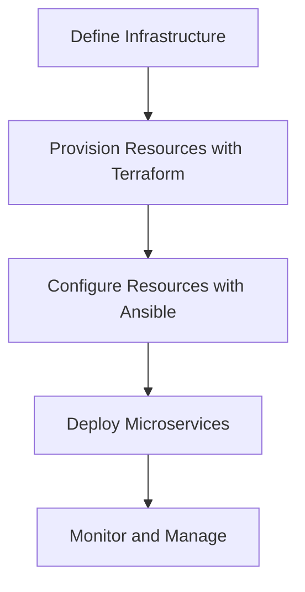

## 10.3. Infrastructure as Code

Infrastructure as Code (IaC) is a pivotal concept in modern software development, especially in the realm of microservices architecture. It allows developers and operations teams to manage and provision infrastructure through code, enabling automation, consistency, and reproducibility. In this section, we will delve into the principles of IaC, explore popular tools like Terraform and Ansible, and illustrate how these tools can be used to automate the deployment of microservices.

### Understanding Infrastructure as Code

Infrastructure as Code is the practice of managing and provisioning computing infrastructure through machine-readable definition files, rather than physical hardware configuration or interactive configuration tools. This approach brings several advantages:

- **Consistency**: By defining infrastructure in code, you ensure that environments are consistent across development, testing, and production.
- **Reproducibility**: Code can be versioned, shared, and reused, making it easier to reproduce environments.
- **Automation**: Infrastructure can be automatically provisioned and managed, reducing manual effort and human error.
- **Scalability**: IaC supports the dynamic scaling of resources, which is crucial for microservices that need to handle varying loads.

### Key Concepts of Infrastructure as Code

#### Declarative vs. Imperative Approaches

- **Declarative**: You specify the desired state of the infrastructure, and the IaC tool figures out how to achieve that state. Terraform is an example of a declarative tool.
- **Imperative**: You specify the exact steps needed to achieve the desired state. Ansible can be used in an imperative manner.

#### Version Control

Treat your infrastructure code like application code. Use version control systems (VCS) such as Git to track changes, collaborate with team members, and roll back to previous versions if needed.

#### Idempotency

Idempotency ensures that applying the same configuration multiple times results in the same state. This is crucial for maintaining consistency across environments.

### Tools for Infrastructure as Code

#### Terraform

Terraform is a popular open-source tool for building, changing, and versioning infrastructure safely and efficiently. It uses a declarative configuration language called HashiCorp Configuration Language (HCL).

- **Provider Plugins**: Terraform supports a wide range of cloud providers and services through plugins.
- **State Management**: Terraform keeps track of the current state of your infrastructure, allowing it to determine what changes need to be made.
- **Modules**: Reusable configurations that can be shared across projects.

**Example: Provisioning a Virtual Machine with Terraform**

```pseudocode
provider "aws" {
  region = "us-west-2"
}

resource "aws_instance" "web" {
  ami           = "ami-0c55b159cbfafe1f0"
  instance_type = "t2.micro"

  tags = {
    Name = "WebServer"
  }
}
```

In this example, we define an AWS provider and a resource for an EC2 instance. The configuration is declarative, specifying the desired state of the infrastructure.

#### Ansible

Ansible is an open-source automation tool that can be used for configuration management, application deployment, and task automation. It uses a simple, human-readable language called YAML.

- **Playbooks**: Define a series of tasks to be executed on remote hosts.
- **Inventory**: A list of hosts to manage.
- **Modules**: Predefined units of work that Ansible can execute.

**Example: Configuring a Web Server with Ansible**

```pseudocode
- name: Configure web server
  hosts: webservers
  tasks:
    - name: Install Nginx
      apt:
        name: nginx
        state: present

    - name: Start Nginx service
      service:
        name: nginx
        state: started
```

This playbook installs and starts the Nginx web server on a group of hosts defined in the inventory.

### Benefits of Infrastructure as Code

#### Consistency

IaC ensures that all environments are configured consistently, reducing the chances of configuration drift. This is particularly important in microservices architectures, where services are deployed across multiple environments.

#### Reproducibility

With IaC, you can easily reproduce environments by applying the same code. This is useful for scaling applications, disaster recovery, and testing.

#### Speed and Efficiency

Automating infrastructure provisioning and management speeds up deployment processes and reduces manual errors. This allows teams to focus on developing features rather than managing infrastructure.

#### Collaboration

IaC enables teams to collaborate more effectively by treating infrastructure as code. Changes can be reviewed, tested, and approved just like application code.

### Implementing Infrastructure as Code in Microservices

#### Designing Infrastructure for Microservices

When designing infrastructure for microservices, consider the following:

- **Service Isolation**: Each microservice should have its own isolated environment to prevent interference.
- **Scalability**: Design infrastructure to scale horizontally, adding more instances as needed.
- **Resilience**: Implement redundancy and failover mechanisms to ensure high availability.

#### Using Terraform for Microservices

Terraform can be used to provision and manage the infrastructure required for microservices, such as virtual machines, containers, and networking components.

**Example: Deploying a Microservice with Terraform**

```pseudocode
provider "aws" {
  region = "us-west-2"
}

resource "aws_ecs_cluster" "microservices" {
  name = "microservices-cluster"
}

resource "aws_ecs_service" "web" {
  name            = "web-service"
  cluster         = aws_ecs_cluster.microservices.id
  task_definition = aws_ecs_task_definition.web.arn
  desired_count   = 3
}
```

In this example, we create an ECS cluster and deploy a web service with a desired count of three instances.

#### Using Ansible for Configuration Management

Ansible can be used to configure and manage the software and settings on the infrastructure provisioned by Terraform.

**Example: Configuring a Microservice with Ansible**

```pseudocode
- name: Configure microservice
  hosts: microservices
  tasks:
    - name: Install Docker
      apt:
        name: docker.io
        state: present

    - name: Deploy microservice container
      docker_container:
        name: my_microservice
        image: my_microservice_image
        state: started
```

This playbook installs Docker and deploys a microservice container on the hosts.

### Visualizing Infrastructure as Code

To better understand how IaC works in practice, let's visualize the process of deploying a microservice using Terraform and Ansible.



**Diagram Description**: This flowchart illustrates the process of deploying microservices using Infrastructure as Code. It starts with defining the infrastructure, provisioning resources with Terraform, configuring resources with Ansible, deploying microservices, and finally monitoring and managing the deployed services.

### Best Practices for Infrastructure as Code

#### Use Version Control

Always use version control for your infrastructure code. This allows you to track changes, collaborate with team members, and roll back to previous versions if needed.

#### Modularize Your Code

Break down your infrastructure code into reusable modules. This makes it easier to manage and reduces duplication.

#### Test Your Infrastructure Code

Just like application code, infrastructure code should be tested. Use tools like Terratest or Molecule to write tests for your IaC.

#### Document Your Code

Provide clear documentation for your infrastructure code. This helps new team members understand the setup and makes it easier to maintain.

### Challenges and Considerations

#### Complexity

Managing infrastructure as code can become complex, especially in large-scale microservices architectures. It's important to keep your code organized and modular.

#### Security

Ensure that sensitive information, such as API keys and passwords, is not hardcoded in your infrastructure code. Use tools like HashiCorp Vault to manage secrets securely.

#### Tooling

Choosing the right tools for your needs is crucial. Consider factors such as the size of your team, the complexity of your infrastructure, and your existing technology stack.

### Try It Yourself

To get hands-on experience with Infrastructure as Code, try the following exercises:

1. **Create a Simple Terraform Configuration**: Define a basic infrastructure setup using Terraform, such as a virtual machine or a container.

2. **Write an Ansible Playbook**: Create a playbook to configure a web server on the infrastructure provisioned by Terraform.

3. **Experiment with Modules**: Break down your Terraform configuration into modules and reuse them across different projects.

4. **Test Your Code**: Use a testing framework to write tests for your Terraform and Ansible code.

### Knowledge Check

- What are the benefits of using Infrastructure as Code in microservices architecture?
- How does Terraform differ from Ansible in terms of approach?
- Why is version control important for infrastructure code?
- What are some best practices for managing infrastructure as code?

### Conclusion

Infrastructure as Code is a powerful approach to managing and provisioning infrastructure in microservices architecture. By automating infrastructure tasks, teams can achieve consistency, reproducibility, and efficiency. Tools like Terraform and Ansible provide the flexibility and power needed to manage complex infrastructure setups. As you continue to explore IaC, remember to follow best practices, test your code, and keep security in mind.

## Quiz Time!



### What is Infrastructure as Code (IaC)?

- [x] Managing infrastructure through code
- [ ] Configuring hardware manually
- [ ] Using physical configuration tools
- [ ] None of the above

> **Explanation:** Infrastructure as Code involves managing and provisioning infrastructure through machine-readable definition files.

### Which tool is an example of a declarative IaC tool?

- [x] Terraform
- [ ] Ansible
- [ ] Chef
- [ ] Puppet

> **Explanation:** Terraform is a declarative tool where you specify the desired state of the infrastructure.

### What is a key benefit of using Infrastructure as Code?

- [x] Consistency across environments
- [ ] Increased manual effort
- [ ] Higher risk of human error
- [ ] Reduced automation

> **Explanation:** IaC ensures consistent environments, reducing manual errors and increasing automation.

### What does idempotency mean in the context of IaC?

- [x] Applying the same configuration results in the same state
- [ ] Infrastructure changes every time code is applied
- [ ] Code cannot be reused
- [ ] None of the above

> **Explanation:** Idempotency ensures that applying the same configuration multiple times results in the same state.

### Which of the following is a benefit of using version control for infrastructure code?

- [x] Tracking changes and collaboration
- [ ] Increased complexity
- [ ] Reduced reproducibility
- [ ] None of the above

> **Explanation:** Version control allows tracking changes, collaboration, and rollback to previous versions.

### What is a playbook in Ansible?

- [x] A series of tasks to be executed on remote hosts
- [ ] A list of hosts to manage
- [ ] A predefined unit of work
- [ ] None of the above

> **Explanation:** Ansible playbooks define a series of tasks to be executed on remote hosts.

### How does Terraform manage the current state of infrastructure?

- [x] Through state management
- [ ] By manual configuration
- [ ] Using physical tools
- [ ] None of the above

> **Explanation:** Terraform keeps track of the current state of infrastructure through state management.

### What is a module in Terraform?

- [x] Reusable configurations
- [ ] A list of hosts
- [ ] A series of tasks
- [ ] None of the above

> **Explanation:** Modules in Terraform are reusable configurations that can be shared across projects.

### Why is testing infrastructure code important?

- [x] To ensure reliability and correctness
- [ ] To increase complexity
- [ ] To reduce automation
- [ ] None of the above

> **Explanation:** Testing infrastructure code ensures reliability and correctness, similar to application code.

### True or False: Infrastructure as Code can help with disaster recovery.

- [x] True
- [ ] False

> **Explanation:** IaC allows for easy reproduction of environments, aiding in disaster recovery.



Remember, this is just the beginning. As you progress, you'll build more complex and interactive infrastructure setups. Keep experimenting, stay curious, and enjoy the journey!
