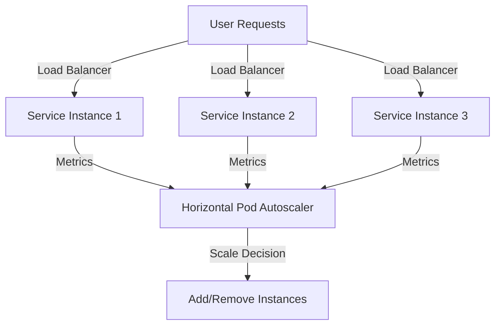
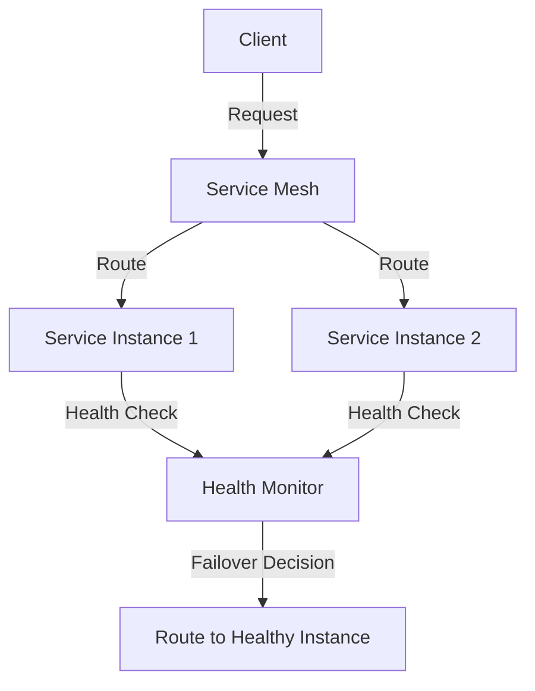

## 10.4. Scaling and Resilience

In the world of microservices, scaling and resilience are two critical aspects that ensure your applications can handle varying loads and recover from failures gracefully. This section delves into the strategies and patterns that help achieve these goals, providing you with the knowledge to build robust and scalable microservices architectures.

### Auto-Scaling Strategies

Auto-scaling is the ability of a system to automatically adjust the number of active instances of a service in response to changes in demand. This ensures that resources are used efficiently, costs are minimized, and performance remains optimal.

#### Understanding Auto-Scaling

Auto-scaling involves monitoring the system's performance and dynamically adjusting resources based on predefined metrics. This can include CPU usage, memory consumption, request latency, or custom metrics relevant to your application.

**Key Concepts:**

- **Horizontal Scaling:** Adding more instances of a service to distribute the load.
- **Vertical Scaling:** Increasing the resources (CPU, RAM) of existing instances.
- **Elasticity:** The ability to scale up or down as needed.

#### Implementing Auto-Scaling

To implement auto-scaling, you need to define policies that dictate when and how scaling should occur. These policies are based on metrics collected from the system.

**Example Pseudocode for Auto-Scaling:**

```pseudocode
function monitorMetrics():
    while true:
        metrics = collectMetrics()
        if metrics.cpuUsage > 80%:
            scaleOut()
        elif metrics.cpuUsage < 20%:
            scaleIn()
        sleep(60 seconds)

function scaleOut():
    newInstance = createNewServiceInstance()
    addInstanceToLoadBalancer(newInstance)

function scaleIn():
    instance = selectInstanceForTermination()
    removeInstanceFromLoadBalancer(instance)
    terminateInstance(instance)
```

**Explanation:**

- **monitorMetrics:** Continuously collects system metrics and decides whether to scale out or in.
- **scaleOut:** Creates a new service instance and adds it to the load balancer.
- **scaleIn:** Selects an instance for termination, removes it from the load balancer, and terminates it.

#### Tools and Technologies

Several tools and platforms can help automate the scaling process:

- **Kubernetes:** Provides built-in auto-scaling capabilities through Horizontal Pod Autoscaler (HPA).
- **AWS Auto Scaling:** Automatically adjusts the number of EC2 instances based on demand.
- **Azure Autoscale:** Offers auto-scaling for Azure services.

**Visualizing Auto-Scaling with Kubernetes:**



**Diagram Explanation:**

- User requests are distributed across multiple service instances by a load balancer.
- The Horizontal Pod Autoscaler monitors metrics from each instance and makes scaling decisions.

#### Best Practices for Auto-Scaling

- **Define Clear Metrics:** Choose metrics that accurately reflect your application's performance and load.
- **Set Appropriate Thresholds:** Avoid frequent scaling by setting thresholds that prevent unnecessary scaling actions.
- **Test Scaling Policies:** Simulate load to test and refine your scaling policies.

### Fault Tolerance

Fault tolerance is the ability of a system to continue operating properly in the event of a failure of some of its components. Designing for fault tolerance ensures high availability and reliability.

#### Understanding Fault Tolerance

Fault tolerance involves anticipating potential failures and implementing strategies to mitigate their impact. This can include redundancy, failover mechanisms, and error handling.

**Key Concepts:**

- **Redundancy:** Having multiple instances or copies of a component to ensure availability.
- **Failover:** Automatically switching to a backup component when a failure occurs.
- **Graceful Degradation:** Maintaining partial functionality when full functionality is not possible.

#### Implementing Fault Tolerance

To implement fault tolerance, you need to identify critical components and design strategies to handle their failures.

**Example Pseudocode for Fault Tolerance:**

```pseudocode
function handleRequest(request):
    try:
        response = processRequest(request)
    except ServiceUnavailableException:
        response = fallbackResponse()
    return response

function processRequest(request):
    serviceInstance = selectHealthyInstance()
    return serviceInstance.execute(request)

function selectHealthyInstance():
    for instance in serviceInstances:
        if instance.isHealthy():
            return instance
    throw ServiceUnavailableException()

function fallbackResponse():
    return "Service is temporarily unavailable. Please try again later."
```

**Explanation:**

- **handleRequest:** Attempts to process a request and provides a fallback response if the service is unavailable.
- **processRequest:** Selects a healthy service instance to handle the request.
- **selectHealthyInstance:** Iterates through service instances to find a healthy one.

#### Tools and Technologies

Several tools and frameworks can help implement fault tolerance:

- **Hystrix:** A latency and fault tolerance library designed to isolate points of access to remote systems.
- **Istio:** Provides service mesh capabilities, including fault tolerance features like retries and circuit breaking.

**Visualizing Fault Tolerance with a Service Mesh:**



**Diagram Explanation:**

- The service mesh routes client requests to service instances.
- A health monitor checks the health of each instance and makes failover decisions.

#### Best Practices for Fault Tolerance

- **Implement Health Checks:** Regularly check the health of service instances to detect failures early.
- **Use Circuit Breakers:** Prevent cascading failures by stopping requests to failing services.
- **Design for Graceful Degradation:** Ensure your application can continue to provide some functionality even when parts of it fail.

### Try It Yourself

To deepen your understanding of scaling and resilience, try modifying the pseudocode examples to:

- Implement custom metrics for auto-scaling based on your application's specific needs.
- Add logging to the fault tolerance pseudocode to track failures and fallback responses.
- Experiment with different thresholds and policies to see how they affect scaling behavior.

### Knowledge Check

- What are the key differences between horizontal and vertical scaling?
- How does a service mesh contribute to fault tolerance?
- Why is it important to set appropriate thresholds for auto-scaling?

### Conclusion

Scaling and resilience are fundamental to building robust microservices architectures. By implementing auto-scaling strategies and designing for fault tolerance, you can ensure your applications remain performant and reliable under varying loads and failure conditions. Remember, this is just the beginning. As you progress, you'll build more complex and resilient systems. Keep experimenting, stay curious, and enjoy the journey!

## Quiz Time!



### What is the primary goal of auto-scaling in microservices?

- [x] To automatically adjust the number of service instances based on demand
- [ ] To manually configure the number of service instances
- [ ] To increase the resources of existing instances
- [ ] To decrease the resources of existing instances

> **Explanation:** Auto-scaling aims to automatically adjust the number of service instances in response to demand changes, ensuring efficient resource usage and optimal performance.

### Which tool provides built-in auto-scaling capabilities for Kubernetes?

- [x] Horizontal Pod Autoscaler (HPA)
- [ ] AWS Auto Scaling
- [ ] Azure Autoscale
- [ ] Docker Swarm

> **Explanation:** Kubernetes uses the Horizontal Pod Autoscaler (HPA) to provide built-in auto-scaling capabilities based on metrics like CPU usage.

### What is the purpose of a circuit breaker in fault tolerance?

- [x] To prevent cascading failures by stopping requests to failing services
- [ ] To increase the number of service instances
- [ ] To decrease the number of service instances
- [ ] To manually configure service instances

> **Explanation:** A circuit breaker prevents cascading failures by stopping requests to services that are failing, allowing the system to recover.

### What is the difference between horizontal and vertical scaling?

- [x] Horizontal scaling adds more instances, while vertical scaling increases resources of existing instances
- [ ] Horizontal scaling increases resources of existing instances, while vertical scaling adds more instances
- [ ] Both horizontal and vertical scaling add more instances
- [ ] Both horizontal and vertical scaling increase resources of existing instances

> **Explanation:** Horizontal scaling involves adding more instances to distribute the load, while vertical scaling increases the resources of existing instances.

### Which of the following is a benefit of using a service mesh for fault tolerance?

- [x] It provides features like retries and circuit breaking
- [ ] It increases the number of service instances
- [ ] It decreases the number of service instances
- [ ] It manually configures service instances

> **Explanation:** A service mesh provides features like retries and circuit breaking, which enhance fault tolerance by managing service-to-service communication.

### What is the role of redundancy in fault tolerance?

- [x] To ensure availability by having multiple instances or copies of a component
- [ ] To decrease the number of service instances
- [ ] To manually configure service instances
- [ ] To increase the resources of existing instances

> **Explanation:** Redundancy ensures availability by having multiple instances or copies of a component, allowing the system to continue operating even if one component fails.

### How does graceful degradation contribute to fault tolerance?

- [x] By maintaining partial functionality when full functionality is not possible
- [ ] By increasing the number of service instances
- [ ] By decreasing the number of service instances
- [ ] By manually configuring service instances

> **Explanation:** Graceful degradation maintains partial functionality when full functionality is not possible, ensuring the system continues to provide some level of service.

### What is the benefit of using health checks in fault tolerance?

- [x] To detect failures early by regularly checking the health of service instances
- [ ] To increase the number of service instances
- [ ] To decrease the number of service instances
- [ ] To manually configure service instances

> **Explanation:** Health checks detect failures early by regularly checking the health of service instances, allowing the system to respond to issues promptly.

### What is the purpose of setting appropriate thresholds for auto-scaling?

- [x] To prevent unnecessary scaling actions and ensure efficient resource usage
- [ ] To increase the number of service instances
- [ ] To decrease the number of service instances
- [ ] To manually configure service instances

> **Explanation:** Setting appropriate thresholds for auto-scaling prevents unnecessary scaling actions, ensuring efficient resource usage and optimal performance.

### True or False: Vertical scaling involves adding more instances to distribute the load.

- [ ] True
- [x] False

> **Explanation:** False. Vertical scaling involves increasing the resources (CPU, RAM) of existing instances, not adding more instances.


