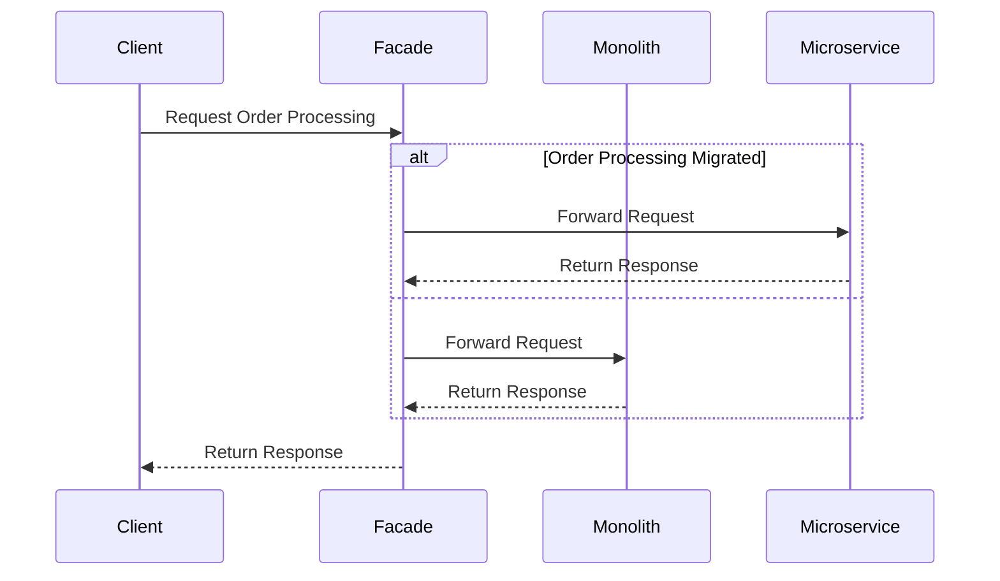

## 11.1. Migrating from Monolith to Microservices

The transition from a monolithic architecture to a microservices-based system is a significant undertaking that involves both cultural and technical challenges. This process requires careful planning, execution, and a deep understanding of the principles and patterns that guide microservices architecture. In this section, we will explore the challenges faced during this migration, the strategies employed to overcome them, and how the Strangler Fig pattern can be effectively used to facilitate a smooth transition.

### Understanding the Monolith

Before diving into the migration process, it's essential to understand what constitutes a monolithic architecture. A monolith is a single, unified codebase where all components of an application are tightly coupled. This architecture can be advantageous in the early stages of development due to its simplicity and ease of deployment. However, as the application grows, several challenges arise:

- **Scalability Issues**: Scaling a monolithic application often involves duplicating the entire system, which can be inefficient and costly.
- **Limited Flexibility**: Changes to one part of the system can impact the entire application, making it difficult to introduce new features or technologies.
- **Deployment Bottlenecks**: A single codebase means that even minor updates require redeploying the entire application, increasing the risk of downtime.
- **Technical Debt**: Over time, the codebase can become unwieldy, with tightly coupled components leading to increased complexity and maintenance challenges.

### Challenges Faced in Migration

Migrating from a monolith to microservices is not without its hurdles. These challenges can be broadly categorized into cultural and technical aspects:

#### Cultural Challenges

1. **Organizational Resistance**: Shifting to microservices often requires a change in mindset and processes. Teams accustomed to working in a monolithic environment may resist the change due to fear of the unknown or perceived complexity.

2. **Skill Gaps**: Microservices demand a different set of skills, including expertise in distributed systems, DevOps practices, and cloud-native technologies. Bridging this skill gap can be a significant challenge.

3. **Communication Overhead**: As teams become more autonomous, ensuring effective communication and collaboration across services becomes crucial. This requires a cultural shift towards more agile and cross-functional teams.

#### Technical Challenges

1. **Service Identification and Decomposition**: Determining the right boundaries for services is critical. Poorly defined services can lead to increased complexity and interdependencies.

2. **Data Management**: In a monolithic system, data is often centralized. Transitioning to microservices requires careful consideration of data ownership, consistency, and synchronization across services.

3. **Infrastructure and Deployment**: Microservices necessitate a robust infrastructure capable of handling distributed systems, including service discovery, load balancing, and fault tolerance.

4. **Security and Compliance**: Ensuring security across multiple services and maintaining compliance with industry standards can be more complex in a microservices architecture.

### Strategies for Migration

To address these challenges, several strategies can be employed. One of the most effective is the Strangler Fig pattern, which allows for incremental migration.

#### The Strangler Fig Pattern

The Strangler Fig pattern is inspired by the way a strangler fig plant grows around a tree, eventually replacing it. In the context of software architecture, this pattern involves gradually replacing parts of a monolithic system with microservices until the monolith is entirely replaced.

**Steps to Implement the Strangler Fig Pattern:**

1. **Identify Candidate Features**: Begin by identifying features or components of the monolith that can be isolated and developed as independent services.

2. **Create a Facade**: Implement a facade that routes requests to either the monolith or the new microservices. This allows for seamless integration and transition.

3. **Incremental Replacement**: Gradually replace parts of the monolith with microservices, ensuring that each new service is fully functional and integrated before moving on to the next.

4. **Monitor and Optimize**: Continuously monitor the performance and interactions of the new services, optimizing as necessary to ensure scalability and reliability.

5. **Decommission the Monolith**: Once all components have been successfully migrated, the monolith can be decommissioned.

#### Pseudocode Example: Implementing the Strangler Fig Pattern

Let's illustrate the Strangler Fig pattern with a pseudocode example. Suppose we have a monolithic e-commerce application, and we want to migrate the order processing component to a microservice.

```pseudocode
// Step 1: Identify Candidate Feature
// Feature: Order Processing

// Step 2: Create a Facade
function processOrder(request) {
    if (isMigratedFeature("orderProcessing")) {
        return callMicroservice("OrderService", request);
    } else {
        return callMonolith("processOrder", request);
    }
}

// Step 3: Incremental Replacement
function callMicroservice(serviceName, request) {
    // Logic to call the microservice
    return sendRequestToService(serviceName, request);
}

function callMonolith(functionName, request) {
    // Logic to call the monolithic function
    return executeMonolithFunction(functionName, request);
}

// Step 4: Monitor and Optimize
function monitorServices() {
    // Logic to monitor service performance
    logServiceMetrics();
    optimizeServiceInteractions();
}

// Step 5: Decommission the Monolith
function decommissionMonolith() {
    // Logic to safely decommission the monolith
    archiveMonolithData();
    shutdownMonolithServices();
}
```

### Visualizing the Migration Process

To better understand the migration process, let's visualize it using a sequence diagram. This diagram illustrates the interaction between the facade, monolith, and microservices during the migration.



### Key Considerations for a Successful Migration

1. **Start Small**: Begin with non-critical components to minimize risk and gain experience with microservices.

2. **Automate Testing and Deployment**: Implement continuous integration and continuous deployment (CI/CD) pipelines to automate testing and deployment processes.

3. **Invest in Monitoring and Logging**: Establish robust monitoring and logging practices to gain visibility into service interactions and performance.

4. **Ensure Data Consistency**: Use patterns like Event Sourcing and CQRS to manage data consistency across services.

5. **Foster a DevOps Culture**: Encourage collaboration between development and operations teams to streamline processes and improve efficiency.

### Try It Yourself

To gain hands-on experience with the Strangler Fig pattern, try modifying the pseudocode example to include additional features or services. Experiment with different routing logic in the facade or implement additional monitoring and optimization techniques.

### Knowledge Check

- **What are the main challenges of migrating from a monolith to microservices?**
- **How does the Strangler Fig pattern facilitate incremental migration?**
- **What are some key considerations for a successful migration?**

### Conclusion

Migrating from a monolithic architecture to microservices is a complex but rewarding journey. By understanding the challenges and employing strategies like the Strangler Fig pattern, organizations can achieve greater scalability, flexibility, and resilience in their systems. Remember, this is just the beginning. As you progress, you'll build more complex and interactive systems. Keep experimenting, stay curious, and enjoy the journey!

## Quiz Time!



### What is a monolithic architecture?

- [x] A single, unified codebase where all components are tightly coupled.
- [ ] A distributed system with loosely coupled services.
- [ ] A cloud-native architecture with serverless functions.
- [ ] An architecture that uses microservices for each feature.

> **Explanation:** A monolithic architecture is characterized by a single, unified codebase where all components are tightly coupled.

### What is one of the main challenges of a monolithic architecture?

- [x] Scalability issues due to tightly coupled components.
- [ ] Easy deployment and maintenance.
- [ ] High flexibility in introducing new features.
- [ ] Low complexity and technical debt.

> **Explanation:** Monolithic architectures often face scalability issues because all components are tightly coupled, making it difficult to scale individual parts.

### What is the Strangler Fig pattern inspired by?

- [x] The growth of a strangler fig plant around a tree.
- [ ] The migration of birds during winter.
- [ ] The lifecycle of a butterfly.
- [ ] The process of photosynthesis in plants.

> **Explanation:** The Strangler Fig pattern is inspired by the way a strangler fig plant grows around a tree, eventually replacing it.

### What is the first step in implementing the Strangler Fig pattern?

- [x] Identify candidate features for migration.
- [ ] Decommission the monolith.
- [ ] Create a facade.
- [ ] Monitor and optimize services.

> **Explanation:** The first step in implementing the Strangler Fig pattern is to identify candidate features or components of the monolith that can be isolated and developed as independent services.

### What is the role of a facade in the Strangler Fig pattern?

- [x] To route requests to either the monolith or the new microservices.
- [ ] To decommission the monolith.
- [ ] To monitor service performance.
- [ ] To manage data consistency across services.

> **Explanation:** The facade acts as an intermediary that routes requests to either the monolith or the new microservices, allowing for seamless integration and transition.

### What is a key consideration for a successful migration to microservices?

- [x] Start with non-critical components to minimize risk.
- [ ] Migrate all components at once for efficiency.
- [ ] Avoid using CI/CD pipelines.
- [ ] Ignore data consistency issues.

> **Explanation:** Starting with non-critical components helps minimize risk and gain experience with microservices, making the migration process smoother.

### How can data consistency be managed across microservices?

- [x] Using patterns like Event Sourcing and CQRS.
- [ ] Centralizing all data in a single database.
- [ ] Ignoring data consistency issues.
- [ ] Using a shared database for all services.

> **Explanation:** Patterns like Event Sourcing and CQRS help manage data consistency across microservices by separating write and read models and capturing state changes as events.

### What is a cultural challenge in migrating to microservices?

- [x] Organizational resistance to change.
- [ ] Easy communication and collaboration.
- [ ] High skill levels in distributed systems.
- [ ] Low communication overhead.

> **Explanation:** Organizational resistance to change is a cultural challenge, as teams accustomed to working in a monolithic environment may resist the shift to microservices.

### What is a technical challenge in migrating to microservices?

- [x] Service identification and decomposition.
- [ ] Easy data management and synchronization.
- [ ] Simple infrastructure and deployment.
- [ ] Low security and compliance requirements.

> **Explanation:** Service identification and decomposition is a technical challenge, as determining the right boundaries for services is critical to avoid increased complexity and interdependencies.

### True or False: The Strangler Fig pattern involves replacing the entire monolith at once.

- [ ] True
- [x] False

> **Explanation:** False. The Strangler Fig pattern involves gradually replacing parts of the monolith with microservices until the monolith is entirely replaced.


