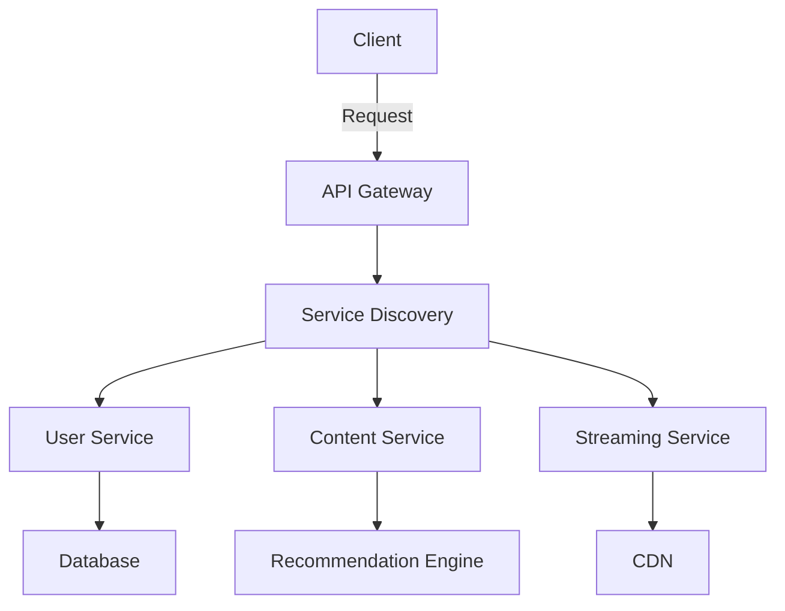
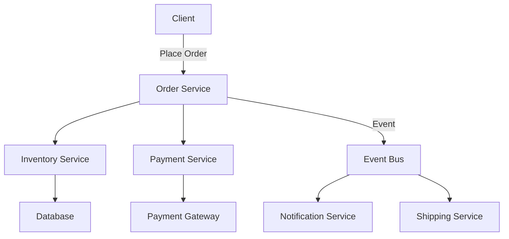

## 11.2. Implementing Microservices at Scale

In the rapidly evolving landscape of software development, microservices architecture has emerged as a powerful paradigm for building scalable, flexible, and resilient systems. This section delves into the implementation of microservices at scale, drawing insights from the success stories of industry giants like Netflix and Amazon. We will explore the key takeaways that have enabled these companies to achieve organizational alignment and technological innovation, providing a roadmap for others looking to embark on a similar journey.

### Success Stories: Netflix and Amazon

#### Netflix: Revolutionizing Streaming with Microservices

Netflix, a pioneer in the streaming industry, is often cited as a quintessential example of successful microservices implementation. The company's journey from a monolithic architecture to a microservices-based system is a testament to the transformative power of this architectural style.

**Key Drivers for Transition:**

- **Scalability Needs:** With a rapidly growing user base, Netflix needed a system that could scale horizontally to handle millions of concurrent users.
- **Resilience Requirements:** Ensuring high availability and fault tolerance was critical to maintaining uninterrupted service.
- **Development Agility:** Netflix aimed to accelerate its development cycles to quickly deliver new features and improvements.

**Microservices Implementation:**

Netflix's microservices architecture is characterized by the decomposition of its monolithic application into hundreds of independent services. Each service is responsible for a specific business capability, such as user authentication, content recommendation, or video streaming.

**Key Components:**

- **API Gateway:** Acts as a single entry point for client requests, routing them to the appropriate microservices.
- **Service Discovery:** Utilizes tools like Eureka to dynamically locate service instances.
- **Circuit Breaker Pattern:** Implements resilience patterns using Hystrix to prevent cascading failures.

**Pseudocode Example:**

```pseudocode
// Pseudocode for a simple API Gateway routing logic
function routeRequest(request):
    service = serviceDiscovery.findService(request.endpoint)
    if circuitBreaker.isOpen(service):
        return "Service Unavailable"
    else:
        return service.handleRequest(request)
```

**Visualizing Netflix's Microservices Architecture:**



**Outcomes:**

- **Improved Scalability:** Netflix can now effortlessly scale its services to accommodate peak traffic.
- **Enhanced Resilience:** The system can gracefully handle failures without affecting the overall user experience.
- **Faster Development:** Teams can independently develop, test, and deploy services, leading to rapid innovation.

#### Amazon: Scaling E-commerce with Microservices

Amazon, a global leader in e-commerce, has successfully leveraged microservices to support its vast and complex operations. The transition to microservices was driven by the need to support a diverse range of products and services while maintaining high performance and reliability.

**Key Drivers for Transition:**

- **Complexity Management:** Amazon's monolithic architecture was becoming increasingly difficult to manage as the company expanded its offerings.
- **Performance Optimization:** The need to deliver fast and reliable service to millions of customers worldwide.
- **Innovation Enablement:** Facilitating experimentation and innovation across different business units.

**Microservices Implementation:**

Amazon's microservices architecture involves breaking down its monolithic application into a network of loosely coupled services. Each service is designed to handle a specific aspect of the e-commerce platform, such as inventory management, order processing, or payment handling.

**Key Components:**

- **Service-Oriented Architecture (SOA):** Utilizes a service-oriented approach to design and implement microservices.
- **Event-Driven Architecture:** Employs messaging systems like Amazon SQS to enable asynchronous communication between services.
- **Data Management Patterns:** Implements a database-per-service pattern to ensure data encapsulation and autonomy.

**Pseudocode Example:**

```pseudocode
// Pseudocode for an event-driven order processing service
function processOrder(order):
    inventoryService = serviceDiscovery.findService("Inventory")
    paymentService = serviceDiscovery.findService("Payment")
    
    if inventoryService.checkAvailability(order.items):
        paymentService.processPayment(order.paymentDetails)
        eventBus.publish("OrderProcessed", order)
    else:
        eventBus.publish("OrderFailed", order)
```

**Visualizing Amazon's Microservices Architecture:**



**Outcomes:**

- **Scalability and Flexibility:** Amazon can scale its services independently to meet varying demands.
- **Improved Performance:** The system can handle high volumes of transactions with minimal latency.
- **Innovation and Experimentation:** Teams can experiment with new features and services without impacting the core system.

### Key Takeaways for Implementing Microservices at Scale

#### Organizational Alignment

Implementing microservices at scale requires more than just technological changes; it necessitates a shift in organizational culture and processes. Here are some key takeaways for achieving organizational alignment:

- **Cross-Functional Teams:** Encourage collaboration between developers, operations, and business stakeholders to foster a shared understanding of goals and priorities.
- **Decentralized Governance:** Empower teams to make decisions about technology choices and service design, promoting autonomy and innovation.
- **Continuous Learning:** Invest in training and development to equip teams with the skills needed to design, build, and manage microservices.

#### Technological Innovations

To successfully implement microservices at scale, organizations must embrace technological innovations that support scalability, resilience, and agility. Key considerations include:

- **Infrastructure as Code:** Use tools like Terraform or Ansible to automate the provisioning and management of infrastructure, ensuring consistency and reproducibility.
- **Containerization and Orchestration:** Leverage Docker and Kubernetes to package and deploy services, enabling efficient resource utilization and scaling.
- **Observability and Monitoring:** Implement comprehensive monitoring and logging solutions to gain visibility into service performance and quickly identify issues.

#### Design Considerations

When designing microservices at scale, it's essential to consider the following:

- **Service Boundaries:** Clearly define service boundaries to ensure each service has a single responsibility and can be independently developed and deployed.
- **Data Management:** Choose appropriate data management patterns, such as database-per-service or event sourcing, to ensure data consistency and integrity.
- **Communication Patterns:** Select suitable communication patterns, such as synchronous RESTful APIs or asynchronous messaging, based on the needs of each service.

### Conclusion

Implementing microservices at scale is a complex but rewarding endeavor that can lead to significant improvements in scalability, resilience, and agility. By learning from the success stories of companies like Netflix and Amazon, organizations can gain valuable insights into the strategies and practices that drive successful microservices adoption. Remember, this is just the beginning. As you progress, you'll build more complex and interactive systems. Keep experimenting, stay curious, and enjoy the journey!

## Quiz Time!



### What was one of the key drivers for Netflix's transition to microservices?

- [x] Scalability needs
- [ ] Cost reduction
- [ ] Simplifying architecture
- [ ] Reducing team size

> **Explanation:** Netflix needed a system that could scale horizontally to handle millions of concurrent users, which was a key driver for their transition to microservices.

### Which pattern does Netflix use to prevent cascading failures?

- [x] Circuit Breaker Pattern
- [ ] Singleton Pattern
- [ ] Observer Pattern
- [ ] Factory Pattern

> **Explanation:** Netflix implements the Circuit Breaker Pattern using Hystrix to prevent cascading failures in its microservices architecture.

### What is the role of an API Gateway in Netflix's architecture?

- [x] Acts as a single entry point for client requests
- [ ] Manages database connections
- [ ] Handles user authentication
- [ ] Processes payments

> **Explanation:** The API Gateway acts as a single entry point for client requests, routing them to the appropriate microservices.

### What messaging system does Amazon use to enable asynchronous communication between services?

- [x] Amazon SQS
- [ ] RabbitMQ
- [ ] Kafka
- [ ] ZeroMQ

> **Explanation:** Amazon employs messaging systems like Amazon SQS to enable asynchronous communication between services.

### Which data management pattern does Amazon implement to ensure data encapsulation and autonomy?

- [x] Database-per-service pattern
- [ ] Shared database pattern
- [ ] Centralized database pattern
- [ ] In-memory database pattern

> **Explanation:** Amazon implements a database-per-service pattern to ensure data encapsulation and autonomy for each microservice.

### What is a key benefit of using Infrastructure as Code?

- [x] Ensures consistency and reproducibility
- [ ] Reduces hardware costs
- [ ] Simplifies user interfaces
- [ ] Increases team size

> **Explanation:** Infrastructure as Code ensures consistency and reproducibility by automating the provisioning and management of infrastructure.

### What is one of the outcomes of Netflix's microservices implementation?

- [x] Improved scalability
- [ ] Reduced development time
- [ ] Increased team size
- [ ] Simplified architecture

> **Explanation:** Netflix's microservices implementation resulted in improved scalability, allowing the company to handle peak traffic more efficiently.

### What is a key consideration when designing microservices at scale?

- [x] Clearly define service boundaries
- [ ] Use a single database for all services
- [ ] Centralize all decision-making
- [ ] Minimize team autonomy

> **Explanation:** Clearly defining service boundaries ensures each service has a single responsibility and can be independently developed and deployed.

### What is one of the technological innovations that support microservices scalability?

- [x] Containerization and Orchestration
- [ ] Manual server configuration
- [ ] Centralized logging
- [ ] Monolithic architecture

> **Explanation:** Containerization and orchestration, using tools like Docker and Kubernetes, support microservices scalability by enabling efficient resource utilization and scaling.

### True or False: Implementing microservices at scale requires only technological changes.

- [ ] True
- [x] False

> **Explanation:** Implementing microservices at scale requires both technological changes and a shift in organizational culture and processes.


