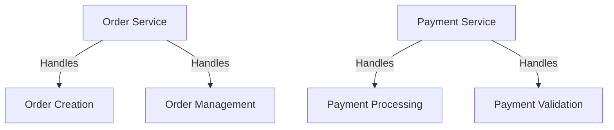
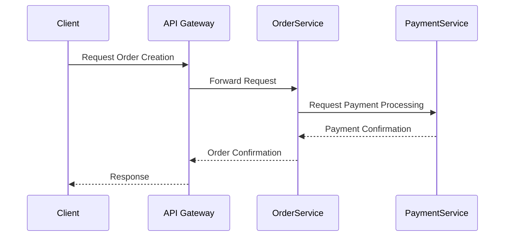

## 11.3. Lessons Learned

The journey of adopting microservices architecture is filled with both triumphs and challenges. As organizations transition from monolithic systems to microservices, they encounter a myriad of lessons that shape their understanding and approach. In this section, we will delve into the best practices that have emerged from real-world implementations and the common pitfalls that teams should strive to avoid. By learning from these experiences, we can better navigate the complexities of microservices and harness their full potential.

### Best Practices Applied

#### 1. Embrace Domain-Driven Design (DDD)

**Explain the Importance of DDD:**

Domain-Driven Design (DDD) is a crucial approach when designing microservices. It emphasizes the alignment of software architecture with business domains, ensuring that each service is focused on a specific business capability. This alignment fosters clear service boundaries and enhances communication between technical and business teams.

**Provide a Pseudocode Example:**

```pseudocode
// Define a bounded context for the Order domain
class OrderService {
    // Aggregate root for Order
    class Order {
        id: UUID
        customerId: UUID
        items: List<Item>
        status: OrderStatus

        // Method to add an item to the order
        function addItem(item: Item) {
            items.add(item)
        }

        // Method to change the order status
        function changeStatus(newStatus: OrderStatus) {
            status = newStatus
        }
    }
}

// Define a bounded context for the Customer domain
class CustomerService {
    // Aggregate root for Customer
    class Customer {
        id: UUID
        name: String
        email: String

        // Method to update customer information
        function updateInfo(newName: String, newEmail: String) {
            name = newName
            email = newEmail
        }
    }
}
```

**Highlight Key Lines:**

- The `OrderService` and `CustomerService` classes represent separate bounded contexts, each managing its own domain logic.
- The `Order` and `Customer` classes serve as aggregate roots, encapsulating related entities and operations.

**Design Considerations:**

- Ensure that each microservice aligns with a specific business domain to maintain clear boundaries and responsibilities.
- Use ubiquitous language within each bounded context to facilitate communication between developers and domain experts.

#### 2. Prioritize Loose Coupling and High Cohesion

**Explain the Concepts:**

Loose coupling and high cohesion are fundamental principles in microservices architecture. Loose coupling minimizes dependencies between services, allowing them to evolve independently. High cohesion ensures that a service's responsibilities are closely related, enhancing maintainability and scalability.

**Provide a Pseudocode Example:**

```pseudocode
// Define a loosely coupled service for payment processing
class PaymentService {
    // Method to process payment
    function processPayment(orderId: UUID, amount: Decimal) {
        // Logic to process payment
        // Notify OrderService of payment completion
        EventBus.publish("OrderPaymentCompleted", orderId)
    }
}

// Define a loosely coupled service for order management
class OrderService {
    // Method to handle payment completion event
    function onPaymentCompleted(orderId: UUID) {
        // Logic to update order status
        updateOrderStatus(orderId, "Paid")
    }
}
```

**Highlight Key Lines:**

- The `PaymentService` and `OrderService` communicate via an event bus, reducing direct dependencies.
- The `processPayment` method in `PaymentService` publishes an event to notify `OrderService` of payment completion.

**Design Considerations:**

- Use asynchronous communication patterns, such as event-driven architecture, to achieve loose coupling between services.
- Ensure that each service has a well-defined, cohesive set of responsibilities to enhance maintainability.

#### 3. Implement Robust Monitoring and Observability

**Explain the Importance:**

Monitoring and observability are critical for maintaining the health and performance of microservices. They provide insights into service behavior, enabling teams to detect and resolve issues proactively.

**Provide a Pseudocode Example:**

```pseudocode
// Define a monitoring service
class MonitoringService {
    // Method to collect metrics
    function collectMetrics(serviceName: String, metricType: String, value: Number) {
        // Logic to collect and store metrics
        MetricsStore.save(serviceName, metricType, value)
    }

    // Method to log events
    function logEvent(serviceName: String, eventType: String, message: String) {
        // Logic to log events
        EventLog.save(serviceName, eventType, message)
    }
}

// Define a service with integrated monitoring
class InventoryService {
    // Method to update inventory
    function updateInventory(productId: UUID, quantity: Number) {
        // Logic to update inventory
        MonitoringService.collectMetrics("InventoryService", "InventoryUpdate", quantity)
        MonitoringService.logEvent("InventoryService", "InventoryUpdate", "Updated inventory for product " + productId)
    }
}
```

**Highlight Key Lines:**

- The `MonitoringService` collects metrics and logs events for various services.
- The `InventoryService` integrates monitoring by collecting metrics and logging events during inventory updates.

**Design Considerations:**

- Implement centralized logging and metrics collection to gain visibility into service performance and behavior.
- Use distributed tracing to track requests across multiple services and identify bottlenecks.

#### 4. Foster a DevOps Culture

**Explain the Importance:**

A DevOps culture is essential for successful microservices adoption. It promotes collaboration between development and operations teams, enabling faster delivery and more reliable deployments.

**Provide a Pseudocode Example:**

```pseudocode
// Define a CI/CD pipeline
class CICDPipeline {
    // Method to build and test a service
    function buildAndTest(serviceName: String) {
        // Logic to build and test the service
        BuildSystem.build(serviceName)
        TestSystem.runTests(serviceName)
    }

    // Method to deploy a service
    function deploy(serviceName: String, environment: String) {
        // Logic to deploy the service
        DeploymentSystem.deploy(serviceName, environment)
    }
}

// Define a service with integrated CI/CD
class UserService {
    // Method to trigger CI/CD pipeline
    function triggerCICD() {
        // Logic to trigger CI/CD pipeline
        CICDPipeline.buildAndTest("UserService")
        CICDPipeline.deploy("UserService", "Production")
    }
}
```

**Highlight Key Lines:**

- The `CICDPipeline` class defines methods for building, testing, and deploying services.
- The `UserService` integrates CI/CD by triggering the pipeline for build, test, and deployment.

**Design Considerations:**

- Automate build, test, and deployment processes to ensure consistent and reliable releases.
- Encourage cross-functional teams to collaborate and share responsibility for service delivery.

#### 5. Design for Failure and Resilience

**Explain the Importance:**

Microservices must be designed to handle failures gracefully. Resilience patterns, such as circuit breakers and retries, help prevent cascading failures and ensure service availability.

**Provide a Pseudocode Example:**

```pseudocode
// Define a circuit breaker for a service
class CircuitBreaker {
    state: String = "Closed"
    failureCount: Number = 0
    threshold: Number = 3

    // Method to execute a service call
    function execute(serviceCall: Function) {
        if (state == "Open") {
            throw new Error("Circuit is open")
        }

        try {
            serviceCall()
            reset()
        } catch (error) {
            failureCount++
            if (failureCount >= threshold) {
                state = "Open"
            }
            throw error
        }
    }

    // Method to reset the circuit breaker
    function reset() {
        state = "Closed"
        failureCount = 0
    }
}

// Define a service with integrated circuit breaker
class PaymentService {
    circuitBreaker: CircuitBreaker = new CircuitBreaker()

    // Method to process payment with circuit breaker
    function processPayment(orderId: UUID, amount: Decimal) {
        circuitBreaker.execute(() => {
            // Logic to process payment
        })
    }
}
```

**Highlight Key Lines:**

- The `CircuitBreaker` class manages the state and execution of service calls, preventing failures from propagating.
- The `PaymentService` integrates the circuit breaker to handle payment processing failures.

**Design Considerations:**

- Implement resilience patterns, such as circuit breakers and retries, to handle service failures gracefully.
- Design services to be fault-tolerant and capable of recovering from failures.

### Common Pitfalls

#### 1. Over-Engineering and Premature Optimization

**Explain the Pitfall:**

One common mistake in microservices adoption is over-engineering and premature optimization. Teams may be tempted to create overly complex architectures and optimize for scalability before it's necessary, leading to increased complexity and maintenance overhead.

**Provide a Pseudocode Example:**

```pseudocode
// Overly complex service with unnecessary layers
class ComplexService {
    // Method to perform a simple operation
    function performOperation(data: String) {
        // Unnecessary layers and abstractions
        Layer1.process(data)
        Layer2.transform(data)
        Layer3.execute(data)
    }
}
```

**Highlight Key Lines:**

- The `ComplexService` class demonstrates unnecessary layers and abstractions, complicating a simple operation.

**Design Considerations:**

- Focus on simplicity and clarity in service design, avoiding unnecessary complexity.
- Optimize for scalability and performance only when there is a clear need.

#### 2. Ignoring Data Consistency and Transactions

**Explain the Pitfall:**

Data consistency and transactions are challenging in microservices due to distributed data management. Ignoring these challenges can lead to data integrity issues and inconsistent states.

**Provide a Pseudocode Example:**

```pseudocode
// Service with potential data consistency issues
class OrderService {
    // Method to create an order
    function createOrder(orderData: OrderData) {
        // Logic to create order
        Database.save(orderData)

        // Notify InventoryService to reserve stock
        EventBus.publish("ReserveStock", orderData.items)
    }
}

// Service with potential data consistency issues
class InventoryService {
    // Method to reserve stock
    function reserveStock(items: List<Item>) {
        // Logic to reserve stock
        Database.reserve(items)
    }
}
```

**Highlight Key Lines:**

- The `OrderService` and `InventoryService` demonstrate potential data consistency issues due to asynchronous communication.

**Design Considerations:**

- Use patterns like Saga and CQRS to manage distributed transactions and ensure data consistency.
- Embrace eventual consistency and design services to handle temporary inconsistencies.

#### 3. Neglecting Security and Access Control

**Explain the Pitfall:**

Security is often overlooked in microservices, leading to vulnerabilities and unauthorized access. Proper authentication, authorization, and encryption are essential to protect services and data.

**Provide a Pseudocode Example:**

```pseudocode
// Service with inadequate security measures
class UserService {
    // Method to authenticate user
    function authenticate(username: String, password: String) {
        // Logic to authenticate user
        if (Database.verifyCredentials(username, password)) {
            return generateToken(username)
        }
        throw new Error("Invalid credentials")
    }

    // Method to generate token
    function generateToken(username: String) {
        // Logic to generate token
        return TokenService.createToken(username)
    }
}
```

**Highlight Key Lines:**

- The `UserService` demonstrates basic authentication logic without proper security measures.

**Design Considerations:**

- Implement robust authentication and authorization mechanisms, such as OAuth2 and JWT.
- Encrypt sensitive data both in transit and at rest to protect against unauthorized access.

#### 4. Underestimating the Complexity of Service Communication

**Explain the Pitfall:**

Service communication in microservices can become complex, especially with asynchronous messaging and distributed systems. Underestimating this complexity can lead to performance bottlenecks and reliability issues.

**Provide a Pseudocode Example:**

```pseudocode
// Service with complex communication logic
class NotificationService {
    // Method to send notifications
    function sendNotification(userId: UUID, message: String) {
        // Logic to send notification
        MessageQueue.send("NotificationQueue", userId, message)
    }
}

// Service with complex communication logic
class MessageQueue {
    // Method to send message
    function send(queueName: String, userId: UUID, message: String) {
        // Logic to send message
        // Potential performance bottleneck
        Network.send(queueName, userId, message)
    }
}
```

**Highlight Key Lines:**

- The `NotificationService` and `MessageQueue` demonstrate potential performance bottlenecks due to complex communication logic.

**Design Considerations:**

- Use service mesh and API gateways to manage service-to-service communication and reduce complexity.
- Implement circuit breakers and retries to handle communication failures gracefully.

#### 5. Failing to Establish Clear Service Boundaries

**Explain the Pitfall:**

Unclear service boundaries can lead to tightly coupled services and hinder scalability. It's essential to define clear boundaries based on business capabilities and domain logic.

**Provide a Pseudocode Example:**

```pseudocode
// Service with unclear boundaries
class MixedService {
    // Method to handle order and payment logic
    function handleOrderAndPayment(orderData: OrderData, paymentData: PaymentData) {
        // Logic to handle order
        OrderService.createOrder(orderData)

        // Logic to handle payment
        PaymentService.processPayment(paymentData)
    }
}
```

**Highlight Key Lines:**

- The `MixedService` class demonstrates unclear boundaries by combining order and payment logic.

**Design Considerations:**

- Use domain-driven design to define clear service boundaries based on business capabilities.
- Avoid combining unrelated responsibilities within a single service.

### Visualizing Lessons Learned

To better understand the lessons learned in microservices adoption, let's visualize some of the key concepts using Mermaid.js diagrams.

#### Visualizing Service Boundaries



**Description:**

This diagram illustrates clear service boundaries, with the `Order Service` handling order-related logic and the `Payment Service` handling payment-related logic.

#### Visualizing Service Communication



**Description:**

This sequence diagram visualizes the communication flow between services, highlighting the role of the API Gateway in managing client interactions.

### Knowledge Check

To reinforce your understanding of the lessons learned in microservices adoption, consider the following questions:

1. What is the role of domain-driven design in defining service boundaries?
2. How can loose coupling and high cohesion benefit microservices architecture?
3. Why is monitoring and observability crucial for microservices?
4. What are the key components of a DevOps culture in microservices?
5. How can resilience patterns like circuit breakers enhance service reliability?

### Embrace the Journey

Remember, the journey of adopting microservices is an ongoing process of learning and improvement. By embracing best practices and avoiding common pitfalls, we can build resilient, scalable, and maintainable systems. Keep experimenting, stay curious, and enjoy the journey!

## Quiz Time!



### What is the primary benefit of using Domain-Driven Design (DDD) in microservices?

- [x] Aligning software architecture with business domains
- [ ] Reducing the number of services
- [ ] Increasing the complexity of the system
- [ ] Simplifying data management

> **Explanation:** Domain-Driven Design (DDD) helps align software architecture with business domains, ensuring that each service is focused on a specific business capability.

### How does loose coupling benefit microservices architecture?

- [x] Allows services to evolve independently
- [ ] Increases dependencies between services
- [ ] Reduces the need for monitoring
- [ ] Simplifies data consistency

> **Explanation:** Loose coupling minimizes dependencies between services, allowing them to evolve independently and enhancing maintainability.

### Why is monitoring and observability important in microservices?

- [x] Provides insights into service behavior
- [ ] Eliminates the need for testing
- [ ] Reduces the number of services
- [ ] Simplifies service communication

> **Explanation:** Monitoring and observability provide insights into service behavior, enabling teams to detect and resolve issues proactively.

### What is a key component of a DevOps culture in microservices?

- [x] Collaboration between development and operations teams
- [ ] Increasing the number of services
- [ ] Reducing the need for automation
- [ ] Simplifying data management

> **Explanation:** A DevOps culture promotes collaboration between development and operations teams, enabling faster delivery and more reliable deployments.

### How do resilience patterns like circuit breakers enhance service reliability?

- [x] Prevent cascading failures
- [ ] Increase the number of services
- [ ] Simplify data consistency
- [ ] Reduce the need for monitoring

> **Explanation:** Resilience patterns like circuit breakers help prevent cascading failures and ensure service availability.

### What is a common pitfall in microservices adoption?

- [x] Over-engineering and premature optimization
- [ ] Simplifying service communication
- [ ] Reducing the number of services
- [ ] Increasing data consistency

> **Explanation:** Over-engineering and premature optimization can lead to increased complexity and maintenance overhead.

### How can data consistency be managed in microservices?

- [x] Using patterns like Saga and CQRS
- [ ] Ignoring distributed transactions
- [ ] Increasing the number of services
- [ ] Simplifying service communication

> **Explanation:** Patterns like Saga and CQRS help manage distributed transactions and ensure data consistency.

### Why is security important in microservices?

- [x] Protects services and data from unauthorized access
- [ ] Reduces the number of services
- [ ] Simplifies service communication
- [ ] Increases dependencies between services

> **Explanation:** Security is essential to protect services and data from vulnerabilities and unauthorized access.

### What is a potential performance bottleneck in service communication?

- [x] Complex communication logic
- [ ] Simplifying data consistency
- [ ] Reducing the number of services
- [ ] Increasing dependencies between services

> **Explanation:** Complex communication logic can lead to performance bottlenecks and reliability issues.

### True or False: Clear service boundaries are essential for scalable microservices.

- [x] True
- [ ] False

> **Explanation:** Clear service boundaries are essential for scalable microservices, as they help define responsibilities and reduce coupling.




