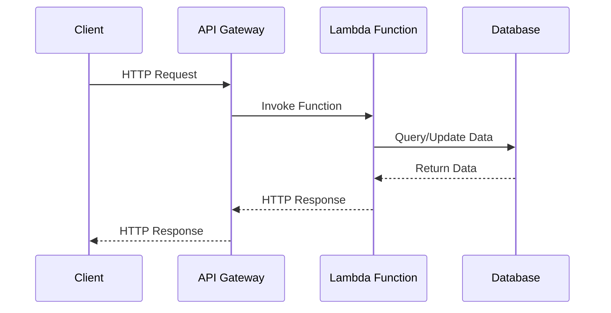

## 12.1. Serverless Microservices

In the ever-evolving landscape of software architecture, serverless computing has emerged as a powerful paradigm that complements the microservices architecture. By leveraging Functions as a Service (FaaS) platforms like AWS Lambda and Azure Functions, developers can build scalable, cost-effective, and flexible applications. This section delves into the integration of serverless architecture with microservices, exploring its benefits, challenges, and practical implementations.

### Introduction to Serverless Architecture

Serverless architecture is a cloud computing execution model where the cloud provider dynamically manages the allocation and provisioning of servers. Despite its name, serverless does not mean the absence of servers. Instead, it abstracts server management away from developers, allowing them to focus on writing code.

#### Key Characteristics of Serverless Architecture

- **Event-Driven Execution**: Functions are triggered by events, such as HTTP requests, database changes, or message queue events.
- **Automatic Scaling**: Functions automatically scale up or down based on demand, ensuring efficient resource utilization.
- **Pay-as-You-Go Pricing**: Costs are incurred only for the actual execution time of functions, leading to potential cost savings.
- **Statelessness**: Functions are inherently stateless, promoting modularity and reusability.

### Leveraging Functions as a Service (FaaS)

Functions as a Service (FaaS) is a serverless computing model that allows developers to deploy individual functions in the cloud. These functions are executed in response to specific events, providing a highly scalable and efficient way to build applications.

#### Popular FaaS Platforms

- **AWS Lambda**: A widely-used FaaS platform that integrates seamlessly with other AWS services.
- **Azure Functions**: Microsoft's FaaS offering, known for its integration with Azure's ecosystem.
- **Google Cloud Functions**: Google's serverless platform, offering robust support for event-driven applications.

### Benefits of Serverless Microservices

Integrating serverless architecture with microservices offers several advantages:

#### Cost Efficiency

- **Reduced Operational Costs**: With serverless, you only pay for the compute time you consume, eliminating the need for provisioning and maintaining servers.
- **Optimized Resource Utilization**: Automatic scaling ensures that resources are used efficiently, reducing waste.

#### Scalability and Flexibility

- **Automatic Scaling**: Serverless functions scale automatically based on demand, ensuring that applications can handle varying workloads without manual intervention.
- **Rapid Deployment**: Functions can be deployed quickly, allowing for faster iteration and experimentation.

#### Simplified Operations

- **Reduced Infrastructure Management**: Developers can focus on writing code, as the cloud provider handles server management and scaling.
- **Built-in High Availability**: Serverless platforms offer inherent fault tolerance and redundancy, ensuring high availability.

### Challenges of Serverless Microservices

While serverless architecture offers numerous benefits, it also presents certain challenges:

#### Complexity in Debugging and Monitoring

- **Limited Debugging Tools**: Traditional debugging tools may not work effectively with serverless functions, requiring new approaches.
- **Complex Monitoring**: Monitoring distributed serverless applications can be challenging due to the ephemeral nature of functions.

#### Cold Start Latency

- **Cold Starts**: Serverless functions may experience latency during initial invocation, known as cold starts, which can impact performance.

#### Vendor Lock-In

- **Platform Dependency**: Relying on a specific FaaS provider can lead to vendor lock-in, making it difficult to switch providers or move to a different architecture.

### Implementing Serverless Microservices

To effectively implement serverless microservices, it's essential to understand the architectural principles and best practices involved.

#### Architectural Principles

- **Event-Driven Design**: Design your application to respond to events, leveraging the event-driven nature of serverless functions.
- **Decoupled Components**: Ensure that functions are loosely coupled, promoting modularity and reusability.
- **Statelessness**: Design functions to be stateless, using external storage solutions for state management.

#### Best Practices

- **Optimize Cold Starts**: Use techniques such as keeping functions warm or reducing function size to minimize cold start latency.
- **Implement Monitoring and Logging**: Use cloud-native monitoring tools to gain insights into function performance and troubleshoot issues.
- **Manage Dependencies**: Use dependency management tools to ensure that functions have access to the necessary libraries and packages.

### Pseudocode Example: Serverless Microservice with AWS Lambda

Let's explore a simple example of a serverless microservice using AWS Lambda. This example demonstrates a function that processes an HTTP request and interacts with a database.

```pseudocode
// Define the Lambda function handler
function handleRequest(event, context) {
    // Parse the HTTP request
    request = parseHTTPRequest(event)

    // Perform business logic
    if request.method == "GET" {
        // Fetch data from the database
        data = fetchDataFromDatabase(request.queryParameters)
        // Return the response
        return createHTTPResponse(200, data)
    } else if request.method == "POST" {
        // Save data to the database
        saveDataToDatabase(request.body)
        // Return success response
        return createHTTPResponse(201, "Data saved successfully")
    } else {
        // Return method not allowed response
        return createHTTPResponse(405, "Method not allowed")
    }
}

// Function to parse HTTP request
function parseHTTPRequest(event) {
    // Extract HTTP method and parameters from the event
    method = event.httpMethod
    queryParameters = event.queryStringParameters
    body = event.body
    return { method, queryParameters, body }
}

// Function to create HTTP response
function createHTTPResponse(statusCode, body) {
    return {
        statusCode: statusCode,
        body: JSON.stringify(body)
    }
}

// Function to fetch data from the database
function fetchDataFromDatabase(queryParameters) {
    // Simulate database query
    return { "data": "Sample data based on query parameters" }
}

// Function to save data to the database
function saveDataToDatabase(data) {
    // Simulate saving data to the database
    console.log("Data saved:", data)
}
```

### Visualizing Serverless Microservices Architecture

To better understand the architecture of serverless microservices, let's visualize the interaction between different components using a sequence diagram.



**Diagram Description**: This sequence diagram illustrates the flow of an HTTP request from a client to an API Gateway, which invokes a Lambda function. The function interacts with a database to fetch or update data and returns the response to the client via the API Gateway.

### Try It Yourself

To gain hands-on experience with serverless microservices, try modifying the pseudocode example provided above. Experiment with different HTTP methods, add new business logic, or integrate additional services like message queues or external APIs.

### Knowledge Check

- **What are the key characteristics of serverless architecture?**
- **How does serverless architecture complement microservices?**
- **What are the benefits and challenges of using serverless microservices?**
- **How can you optimize cold start latency in serverless functions?**

### Conclusion

Serverless microservices offer a compelling approach to building scalable, cost-effective, and flexible applications. By leveraging FaaS platforms like AWS Lambda and Azure Functions, developers can focus on writing code without worrying about server management. However, it's essential to be aware of the challenges and best practices associated with serverless architecture to maximize its benefits.

### Further Reading

- [AWS Lambda Documentation](https://docs.aws.amazon.com/lambda/latest/dg/welcome.html)
- [Azure Functions Documentation](https://docs.microsoft.com/en-us/azure/azure-functions/)
- [Google Cloud Functions Documentation](https://cloud.google.com/functions/docs)

## Quiz Time!



### What is a key characteristic of serverless architecture?

- [x] Event-Driven Execution
- [ ] Manual Scaling
- [ ] High Server Management
- [ ] Fixed Pricing

> **Explanation:** Serverless architecture is characterized by event-driven execution, where functions are triggered by specific events.

### Which of the following is a benefit of serverless microservices?

- [x] Cost Efficiency
- [ ] Increased Server Management
- [ ] Vendor Lock-In
- [ ] High Debugging Complexity

> **Explanation:** Serverless microservices offer cost efficiency as you only pay for the compute time you consume.

### What is a challenge associated with serverless microservices?

- [x] Cold Start Latency
- [ ] Automatic Scaling
- [ ] Reduced Operational Costs
- [ ] Simplified Operations

> **Explanation:** Cold start latency is a challenge in serverless microservices, where functions may experience latency during initial invocation.

### How can you optimize cold start latency in serverless functions?

- [x] Keep Functions Warm
- [ ] Increase Function Size
- [ ] Use Manual Scaling
- [ ] Disable Monitoring

> **Explanation:** Keeping functions warm is a technique to optimize cold start latency in serverless functions.

### What is the role of an API Gateway in serverless architecture?

- [x] Centralized Entry Point for Client Requests
- [ ] Database Management
- [ ] Function Execution
- [ ] Monitoring and Logging

> **Explanation:** An API Gateway serves as a centralized entry point for client requests in serverless architecture.

### Which platform is not a FaaS provider?

- [ ] AWS Lambda
- [ ] Azure Functions
- [ ] Google Cloud Functions
- [x] Docker Swarm

> **Explanation:** Docker Swarm is not a FaaS provider; it is a container orchestration tool.

### What is a common use case for serverless functions?

- [x] Event-Driven Applications
- [ ] Long-Running Batch Jobs
- [ ] Manual Server Management
- [ ] Fixed Resource Allocation

> **Explanation:** Serverless functions are commonly used in event-driven applications due to their ability to respond to specific events.

### Which of the following is a best practice for implementing serverless microservices?

- [x] Implement Monitoring and Logging
- [ ] Use Large Function Sizes
- [ ] Avoid Dependency Management
- [ ] Manual Scaling

> **Explanation:** Implementing monitoring and logging is a best practice for gaining insights into function performance and troubleshooting issues.

### What is a potential drawback of relying on a specific FaaS provider?

- [x] Vendor Lock-In
- [ ] Cost Efficiency
- [ ] Automatic Scaling
- [ ] Simplified Operations

> **Explanation:** Relying on a specific FaaS provider can lead to vendor lock-in, making it difficult to switch providers or move to a different architecture.

### True or False: Serverless functions are inherently stateful.

- [ ] True
- [x] False

> **Explanation:** Serverless functions are inherently stateless, promoting modularity and reusability.


