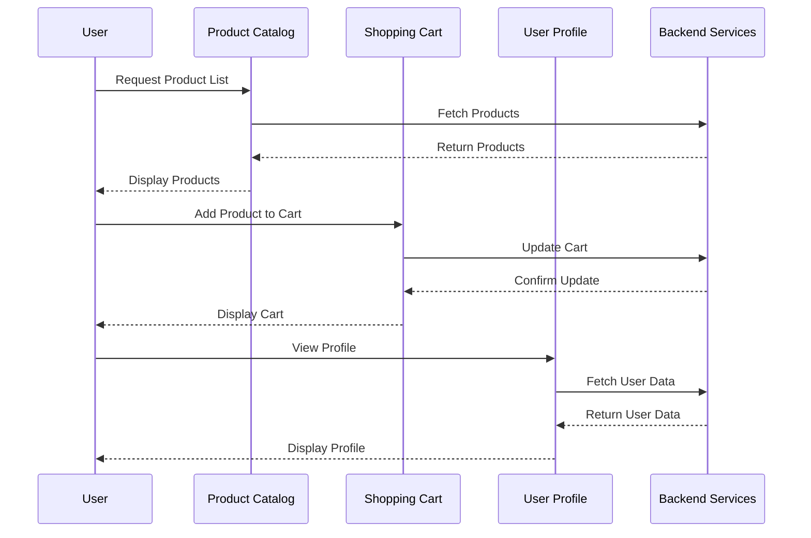

## 12.2. Micro Frontends

In the ever-evolving landscape of web development, the concept of micro frontends has emerged as a powerful paradigm, extending the principles of microservices to the frontend. As applications grow in complexity and scale, the need for modular, scalable, and maintainable architectures becomes paramount. Micro frontends offer a solution by breaking down the user interface into smaller, manageable modules, each owned by independent teams, allowing for parallel development and deployment. In this section, we will delve into the intricacies of micro frontends, exploring their implementation strategies, benefits, challenges, and best practices.

### Introduction to Micro Frontends

Micro frontends are an architectural style where the frontend is composed of semi-independent fragments, each developed and maintained by different teams. This approach mirrors the microservices architecture on the backend, where services are decoupled and independently deployable. By adopting micro frontends, organizations can achieve greater agility, allowing teams to work autonomously and deliver features faster.

#### Key Concepts

- **Modularity**: Just as microservices break down backend functionality into discrete services, micro frontends decompose the user interface into smaller, self-contained units.
- **Team Autonomy**: Each micro frontend is developed by a dedicated team, enabling parallel development and reducing dependencies.
- **Independent Deployment**: Micro frontends can be deployed independently, allowing for faster release cycles and minimizing the risk of large-scale failures.
- **Technology Agnosticism**: Teams can choose the most suitable technologies for their micro frontend, fostering innovation and flexibility.

### Extending Microservices Principles to the Frontend

The transition from monolithic frontends to micro frontends involves applying microservices principles to the user interface. This shift requires a change in mindset and architecture, focusing on modularity, scalability, and team autonomy.

#### Breaking Down the User Interface into Modules

To implement micro frontends, the user interface must be decomposed into smaller, manageable modules. Each module represents a distinct feature or functionality, such as a shopping cart, user profile, or search bar. These modules are developed and maintained independently, allowing teams to iterate and innovate without impacting the entire application.

**Example: Decomposing an E-commerce Application**

Consider an e-commerce application with the following features:

- Product Catalog
- Shopping Cart
- User Profile
- Order History

In a micro frontend architecture, each of these features would be a separate module, developed by different teams. This decomposition enables teams to focus on their specific domain, improving productivity and reducing the risk of conflicts.

#### Implementation Strategies

Implementing micro frontends requires careful planning and consideration of various strategies to ensure seamless integration with backend services and a cohesive user experience.

##### 1. **Module Federation**

Module federation is a technique that allows different modules to be loaded and executed at runtime. This approach enables teams to build and deploy their micro frontends independently, without worrying about version conflicts or dependencies.

**Pseudocode Example: Module Federation**

```pseudocode
// Define a module federation configuration
moduleFederationConfig = {
  name: "productCatalog",
  filename: "remoteEntry.js",
  exposes: {
    "./ProductList": "./src/ProductList",
  },
  shared: ["react", "react-dom"]
}

// Load the remote module at runtime
loadRemoteModule("productCatalog", "./ProductList")
  .then(ProductList => {
    render(ProductList, document.getElementById("app"))
  })
  .catch(error => {
    console.error("Error loading module:", error)
  })
```

In this example, the `ProductList` component is exposed as a remote module, allowing it to be loaded dynamically at runtime. This approach ensures that each micro frontend can be developed and deployed independently.

##### 2. **Web Components**

Web components provide a standardized way to create reusable UI elements. By encapsulating functionality and styles, web components can be used to build micro frontends that are framework-agnostic and easily integrable.

**Pseudocode Example: Web Component**

```pseudocode
// Define a custom element for the shopping cart
class ShoppingCart extends HTMLElement {
  constructor() {
    super()
    this.attachShadow({ mode: "open" })
    this.shadowRoot.innerHTML = `
      <style>
        /* Styles for the shopping cart */
      </style>
      <div>
        <h2>Shopping Cart</h2>
        <ul id="cart-items"></ul>
      </div>
    `
  }

  // Method to add an item to the cart
  addItem(item) {
    const cartItems = this.shadowRoot.getElementById("cart-items")
    const listItem = document.createElement("li")
    listItem.textContent = item.name
    cartItems.appendChild(listItem)
  }
}

// Register the custom element
customElements.define("shopping-cart", ShoppingCart)
```

In this example, the `ShoppingCart` component is defined as a web component, encapsulating its functionality and styles. This approach allows the component to be used across different parts of the application without conflicts.

##### 3. **iFrames**

iFrames can be used to embed micro frontends within a parent application. This approach provides strong isolation between modules, preventing CSS and JavaScript conflicts. However, it may introduce challenges related to communication and performance.

**Pseudocode Example: iFrame Integration**

```pseudocode
// Create an iframe for the user profile module
const userProfileIframe = document.createElement("iframe")
userProfileIframe.src = "https://user-profile.example.com"
userProfileIframe.style.width = "100%"
userProfileIframe.style.height = "600px"

// Append the iframe to the main application
document.getElementById("app").appendChild(userProfileIframe)

// Communicate with the iframe using postMessage
window.addEventListener("message", event => {
  if (event.origin === "https://user-profile.example.com") {
    console.log("Message from user profile:", event.data)
  }
})
```

In this example, the user profile module is embedded within an iframe, providing isolation from the parent application. Communication between the parent and the iframe is achieved using the `postMessage` API.

### Integrating with Backend Services

Micro frontends must seamlessly integrate with backend services to provide a cohesive user experience. This integration involves managing data flow, ensuring consistency, and handling authentication and authorization.

#### Data Flow Management

Managing data flow between micro frontends and backend services is crucial for maintaining consistency and performance. Each micro frontend should be responsible for fetching and managing its own data, reducing dependencies and improving scalability.

**Pseudocode Example: Data Fetching**

```pseudocode
// Fetch product data from the backend service
fetch("https://api.example.com/products")
  .then(response => response.json())
  .then(data => {
    renderProductList(data)
  })
  .catch(error => {
    console.error("Error fetching product data:", error)
  })

// Function to render the product list
function renderProductList(products) {
  const productList = document.getElementById("product-list")
  products.forEach(product => {
    const listItem = document.createElement("li")
    listItem.textContent = product.name
    productList.appendChild(listItem)
  })
}
```

In this example, the product catalog micro frontend fetches data from a backend service and renders it on the page. This approach ensures that each micro frontend is responsible for its own data, reducing dependencies and improving scalability.

#### Authentication and Authorization

Ensuring secure access to backend services is essential for protecting sensitive data and maintaining user privacy. Micro frontends must implement robust authentication and authorization mechanisms to verify user identity and permissions.

**Pseudocode Example: Authentication**

```pseudocode
// Authenticate the user using OAuth2
function authenticateUser() {
  const authUrl = "https://auth.example.com/oauth2/authorize"
  const clientId = "your-client-id"
  const redirectUri = "https://your-app.example.com/callback"

  // Redirect the user to the authentication server
  window.location.href = `${authUrl}?client_id=${clientId}&redirect_uri=${redirectUri}&response_type=token`
}

// Handle the authentication callback
function handleAuthCallback() {
  const hash = window.location.hash
  const token = new URLSearchParams(hash.substring(1)).get("access_token")

  if (token) {
    console.log("User authenticated with token:", token)
    // Store the token and proceed with the application
  } else {
    console.error("Authentication failed")
  }
}

// Call the authentication function on page load
window.onload = authenticateUser
```

In this example, the micro frontend uses OAuth2 to authenticate the user, redirecting them to an authentication server and handling the callback to retrieve the access token. This approach ensures secure access to backend services and protects sensitive data.

### Visualizing Micro Frontends Architecture

To better understand the architecture of micro frontends, let's visualize the interaction between different modules and backend services using a sequence diagram.



**Diagram Description**: This sequence diagram illustrates the interaction between the user and various micro frontends, such as the product catalog, shopping cart, and user profile. Each micro frontend communicates with backend services to fetch and update data, ensuring a seamless user experience.

### Benefits of Micro Frontends

Adopting a micro frontend architecture offers several benefits, including:

- **Scalability**: By decomposing the frontend into smaller modules, organizations can scale individual components independently, improving performance and resource utilization.
- **Flexibility**: Teams can choose the most suitable technologies for their micro frontends, fostering innovation and adaptability.
- **Faster Development**: Parallel development and independent deployment enable teams to deliver features faster, reducing time-to-market.
- **Improved Maintainability**: Modular architecture simplifies codebase management, making it easier to update and maintain individual components.

### Challenges and Considerations

While micro frontends offer numerous advantages, they also present challenges that must be addressed:

- **Complexity**: Managing multiple modules and ensuring seamless integration can increase complexity, requiring robust tooling and processes.
- **Performance**: Loading multiple micro frontends can impact performance, necessitating optimization techniques such as lazy loading and caching.
- **Consistency**: Ensuring a consistent user experience across different micro frontends requires careful coordination and shared design guidelines.
- **Security**: Implementing secure communication and data handling is crucial to protect sensitive information and maintain user trust.

### Best Practices for Implementing Micro Frontends

To successfully implement micro frontends, consider the following best practices:

- **Define Clear Boundaries**: Clearly define the boundaries and responsibilities of each micro frontend to avoid overlap and conflicts.
- **Establish Shared Standards**: Develop shared design guidelines and coding standards to ensure consistency and cohesion across micro frontends.
- **Implement Robust Testing**: Use automated testing to verify the functionality and integration of each micro frontend, ensuring a reliable user experience.
- **Optimize Performance**: Implement performance optimization techniques, such as lazy loading, caching, and code splitting, to minimize load times and improve responsiveness.
- **Foster Collaboration**: Encourage collaboration and communication between teams to ensure alignment and address challenges effectively.

### Try It Yourself

To gain hands-on experience with micro frontends, try implementing a simple application using the concepts and strategies discussed in this section. Experiment with different approaches, such as module federation, web components, and iFrames, to understand their benefits and trade-offs. Consider integrating your micro frontends with a mock backend service to simulate real-world scenarios and test your implementation.

### Conclusion

Micro frontends represent a significant shift in frontend architecture, offering a modular, scalable, and flexible approach to building modern web applications. By extending microservices principles to the frontend, organizations can achieve greater agility, enabling teams to work autonomously and deliver features faster. While challenges exist, careful planning and adherence to best practices can help overcome these obstacles, ensuring a successful implementation.

Remember, this is just the beginning. As you progress, you'll build more complex and interactive applications. Keep experimenting, stay curious, and enjoy the journey!

## Quiz Time!



### What is the primary goal of micro frontends?

- [x] To decompose the user interface into smaller, manageable modules
- [ ] To centralize frontend development in a single team
- [ ] To eliminate the need for backend services
- [ ] To use a single technology stack for all frontend components

> **Explanation:** The primary goal of micro frontends is to decompose the user interface into smaller, manageable modules, allowing for parallel development and deployment by independent teams.

### Which of the following is a key benefit of micro frontends?

- [x] Scalability
- [ ] Increased complexity
- [ ] Reduced performance
- [ ] Centralized control

> **Explanation:** Scalability is a key benefit of micro frontends, as it allows individual components to be scaled independently, improving performance and resource utilization.

### What is module federation in the context of micro frontends?

- [x] A technique that allows different modules to be loaded and executed at runtime
- [ ] A method for centralizing frontend development
- [ ] A strategy for eliminating backend dependencies
- [ ] A way to enforce a single technology stack

> **Explanation:** Module federation is a technique that allows different modules to be loaded and executed at runtime, enabling independent development and deployment of micro frontends.

### How do web components contribute to micro frontends?

- [x] By providing a standardized way to create reusable UI elements
- [ ] By centralizing all frontend logic in a single component
- [ ] By eliminating the need for backend services
- [ ] By enforcing a single technology stack

> **Explanation:** Web components provide a standardized way to create reusable UI elements, allowing for framework-agnostic and easily integrable micro frontends.

### What is a potential challenge of using iFrames for micro frontends?

- [x] Communication and performance issues
- [ ] Lack of isolation between modules
- [ ] Inability to use different technologies
- [ ] Centralized deployment

> **Explanation:** iFrames can introduce communication and performance issues, as they provide strong isolation between modules but may complicate data exchange and impact load times.

### Which strategy involves encapsulating functionality and styles in a reusable UI element?

- [x] Web Components
- [ ] Module Federation
- [ ] iFrames
- [ ] Shared Libraries

> **Explanation:** Web components involve encapsulating functionality and styles in a reusable UI element, allowing for framework-agnostic integration in micro frontends.

### What is a key consideration when integrating micro frontends with backend services?

- [x] Managing data flow and ensuring consistency
- [ ] Centralizing all data handling in a single module
- [ ] Eliminating the need for authentication
- [ ] Using a single backend service for all modules

> **Explanation:** Managing data flow and ensuring consistency is a key consideration when integrating micro frontends with backend services, as each module should be responsible for its own data.

### What is the role of authentication in micro frontends?

- [x] To ensure secure access to backend services
- [ ] To eliminate the need for user verification
- [ ] To centralize all user data in a single module
- [ ] To enforce a single technology stack

> **Explanation:** Authentication ensures secure access to backend services, protecting sensitive data and maintaining user privacy in micro frontends.

### Which of the following is a best practice for implementing micro frontends?

- [x] Define clear boundaries and responsibilities for each module
- [ ] Centralize all frontend logic in a single team
- [ ] Use a single technology stack for all components
- [ ] Eliminate testing to speed up development

> **Explanation:** Defining clear boundaries and responsibilities for each module is a best practice for implementing micro frontends, ensuring modularity and reducing conflicts.

### True or False: Micro frontends allow teams to choose the most suitable technologies for their modules.

- [x] True
- [ ] False

> **Explanation:** True. Micro frontends allow teams to choose the most suitable technologies for their modules, fostering innovation and flexibility.




