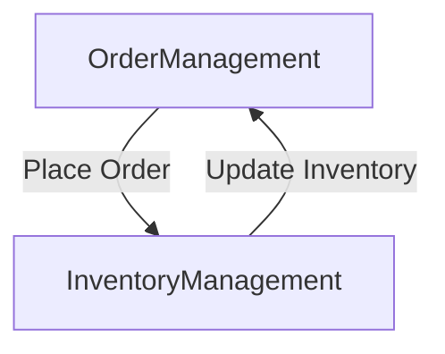

## 12.3. Domain-Driven Design in Microservices

Domain-Driven Design (DDD) is a powerful approach to software development that emphasizes collaboration between technical and domain experts to create a shared understanding of the problem space. When applied to microservices, DDD helps in aligning services with domain models, ensuring that each service is focused on a specific business capability. This section will delve into the principles of DDD, particularly focusing on bounded contexts and their role in defining clear service boundaries.

### Applying DDD Principles

#### Understanding Domain-Driven Design

Domain-Driven Design is a set of principles and practices aimed at creating software that reflects complex business domains. At its core, DDD encourages developers to model software based on the real-world processes and structures of the business it serves. This involves close collaboration with domain experts to ensure that the software accurately represents the business logic and rules.

**Key Concepts of DDD:**

1. **Ubiquitous Language:** A common language shared by developers and domain experts, used to describe the domain model and ensure clear communication.
2. **Entities and Value Objects:** Entities are objects with a distinct identity, while value objects are immutable and defined by their attributes.
3. **Aggregates:** A cluster of domain objects that can be treated as a single unit, with a root entity that controls access to its components.
4. **Repositories:** Mechanisms for retrieving and storing aggregates.
5. **Services:** Operations that do not naturally fit within an entity or value object.

#### Aligning Services with Domain Models

In a microservices architecture, aligning services with domain models means designing each service around a specific business capability or domain concept. This alignment ensures that services are cohesive and focused, reducing complexity and improving maintainability.

**Steps to Align Services with Domain Models:**

1. **Identify Core Domains:** Work with domain experts to identify the core domains and subdomains of the business.
2. **Define Bounded Contexts:** Establish clear boundaries for each domain, ensuring that each context has its own model and language.
3. **Design Aggregates and Entities:** Within each bounded context, define the aggregates and entities that represent the business logic.
4. **Implement Repositories and Services:** Create repositories for data access and services for business operations, ensuring they align with the domain model.

### Bounded Contexts

#### Defining Clear Service Boundaries

Bounded contexts are a central concept in DDD, providing a way to define clear boundaries for each domain model. In a microservices architecture, bounded contexts help in determining the boundaries of each service, ensuring that each service is responsible for a specific part of the domain.

**Characteristics of Bounded Contexts:**

- **Isolation:** Each bounded context has its own model and language, isolated from other contexts.
- **Consistency:** Within a bounded context, the model is consistent and coherent, reflecting the business rules and logic.
- **Integration:** Bounded contexts interact with each other through well-defined interfaces, ensuring loose coupling.

#### Implementing Bounded Contexts in Microservices

To implement bounded contexts in a microservices architecture, follow these steps:

1. **Identify Context Boundaries:** Work with domain experts to identify the boundaries of each context, based on business capabilities and processes.
2. **Define Context Maps:** Create context maps to visualize the relationships and interactions between different contexts.
3. **Design Service Interfaces:** Define clear interfaces for each service, ensuring that they align with the bounded context.
4. **Implement Context Integration:** Use integration patterns such as event-driven communication or API gateways to manage interactions between contexts.

### Pseudocode Examples

To illustrate the application of DDD principles in microservices, let's consider a simple example of an e-commerce platform. We'll focus on two bounded contexts: Order Management and Inventory Management.

#### Order Management Context

```pseudocode
// Entity: Order
class Order {
    id: UUID
    customerId: UUID
    items: List<OrderItem>
    status: OrderStatus

    // Method to add an item to the order
    function addItem(productId: UUID, quantity: int) {
        // Business logic to add item
    }

    // Method to change order status
    function changeStatus(newStatus: OrderStatus) {
        // Business logic to change status
    }
}

// Value Object: OrderItem
class OrderItem {
    productId: UUID
    quantity: int
    price: float
}

// Repository: OrderRepository
interface OrderRepository {
    function save(order: Order)
    function findById(orderId: UUID): Order
}

// Service: OrderService
class OrderService {
    orderRepository: OrderRepository

    // Method to place an order
    function placeOrder(order: Order) {
        // Business logic to place order
        orderRepository.save(order)
    }
}
```

#### Inventory Management Context

```pseudocode
// Entity: InventoryItem
class InventoryItem {
    productId: UUID
    quantity: int

    // Method to adjust inventory quantity
    function adjustQuantity(amount: int) {
        // Business logic to adjust quantity
    }
}

// Repository: InventoryRepository
interface InventoryRepository {
    function save(item: InventoryItem)
    function findByProductId(productId: UUID): InventoryItem
}

// Service: InventoryService
class InventoryService {
    inventoryRepository: InventoryRepository

    // Method to update inventory
    function updateInventory(productId: UUID, amount: int) {
        // Business logic to update inventory
        item = inventoryRepository.findByProductId(productId)
        item.adjustQuantity(amount)
        inventoryRepository.save(item)
    }
}
```

### Visualizing Bounded Contexts

To better understand the relationships between bounded contexts, let's visualize the interactions between the Order Management and Inventory Management contexts using a context map.



**Caption:** This context map illustrates the interaction between the Order Management and Inventory Management contexts. The Order Management context places orders, while the Inventory Management context updates inventory levels.

### Design Considerations

When applying DDD to microservices, consider the following design considerations:

- **Granularity:** Determine the appropriate level of granularity for each service, balancing between too coarse and too fine-grained services.
- **Consistency:** Ensure that each bounded context maintains consistency within its domain, even if it means eventual consistency across contexts.
- **Integration:** Choose the right integration patterns to manage interactions between services, such as event-driven communication or API gateways.

### Programming Language Specifics

While the principles of DDD are language-agnostic, certain programming languages offer features that can facilitate the implementation of DDD concepts. For example, languages with strong type systems, such as Scala or Kotlin, can help in modeling domain entities and value objects more effectively.

### Differences and Similarities

DDD is often compared to other architectural approaches, such as Service-Oriented Architecture (SOA) or Event-Driven Architecture (EDA). While there are similarities, such as the focus on modularity and loose coupling, DDD emphasizes the alignment of software models with business domains, which is not always the primary focus of other approaches.

### Try It Yourself

To deepen your understanding of DDD in microservices, try modifying the pseudocode examples provided. For instance, you could:

- Add new entities or value objects to the Order Management context.
- Implement additional business logic in the Inventory Management context.
- Create a new bounded context, such as Customer Management, and define its interactions with existing contexts.

### Knowledge Check

Before moving on, let's review some key concepts:

- What is the role of bounded contexts in DDD?
- How do aggregates help in modeling domain logic?
- What are some common integration patterns for microservices?

### Embrace the Journey

Remember, applying DDD to microservices is a journey that requires collaboration, experimentation, and continuous learning. As you progress, you'll gain a deeper understanding of how to design software that truly reflects the complexities of the business domain. Keep exploring, stay curious, and enjoy the process!

## Quiz Time!



### What is a key concept of Domain-Driven Design?

- [x] Ubiquitous Language
- [ ] Monolithic Architecture
- [ ] Stateless Services
- [ ] Continuous Integration

> **Explanation:** Ubiquitous Language is a core concept in DDD, ensuring clear communication between developers and domain experts.

### What is a bounded context in DDD?

- [x] A boundary within which a particular model is defined and applicable
- [ ] A shared database across multiple services
- [ ] A centralized service for handling all business logic
- [ ] A method for scaling services horizontally

> **Explanation:** A bounded context defines the boundaries within which a specific domain model is valid and consistent.

### How do aggregates function in DDD?

- [x] They group related entities and value objects into a single unit
- [ ] They serve as a centralized database for all services
- [ ] They are used to scale services horizontally
- [ ] They define the user interface of an application

> **Explanation:** Aggregates are clusters of domain objects that can be treated as a single unit, ensuring consistency and encapsulation.

### What is the purpose of a repository in DDD?

- [x] To provide an abstraction for data access and storage
- [ ] To handle user authentication and authorization
- [ ] To manage service-to-service communication
- [ ] To define the user interface of an application

> **Explanation:** Repositories abstract the details of data access and storage, allowing the domain model to remain focused on business logic.

### Which integration pattern is commonly used in microservices?

- [x] Event-Driven Communication
- [ ] Monolithic Integration
- [ ] Centralized Database
- [ ] Stateless Services

> **Explanation:** Event-driven communication is a common pattern in microservices, facilitating loose coupling and asynchronous interactions.

### What is the role of a service in DDD?

- [x] To perform operations that do not naturally fit within an entity or value object
- [ ] To store and retrieve data from a database
- [ ] To define the user interface of an application
- [ ] To manage network communication between services

> **Explanation:** Services in DDD perform operations that are not naturally part of an entity or value object, focusing on business logic.

### What is the benefit of using bounded contexts?

- [x] They help in defining clear service boundaries and maintaining consistency
- [ ] They allow for centralized data storage across services
- [ ] They enable horizontal scaling of services
- [ ] They simplify user authentication and authorization

> **Explanation:** Bounded contexts help in defining clear service boundaries, ensuring that each context maintains its own model and consistency.

### How can DDD improve microservices architecture?

- [x] By aligning services with business domains and reducing complexity
- [ ] By centralizing all business logic in a single service
- [ ] By using a shared database for all services
- [ ] By focusing solely on technical implementation

> **Explanation:** DDD aligns services with business domains, reducing complexity and improving maintainability in microservices architecture.

### What is a common challenge when applying DDD to microservices?

- [x] Determining the appropriate level of granularity for services
- [ ] Ensuring all services share the same database
- [ ] Centralizing all business logic in a single service
- [ ] Avoiding the use of repositories

> **Explanation:** One common challenge is determining the right level of granularity for services, balancing between too coarse and too fine-grained.

### True or False: DDD principles are language-specific and cannot be applied universally.

- [ ] True
- [x] False

> **Explanation:** DDD principles are language-agnostic and can be applied across different programming languages and architectures.


