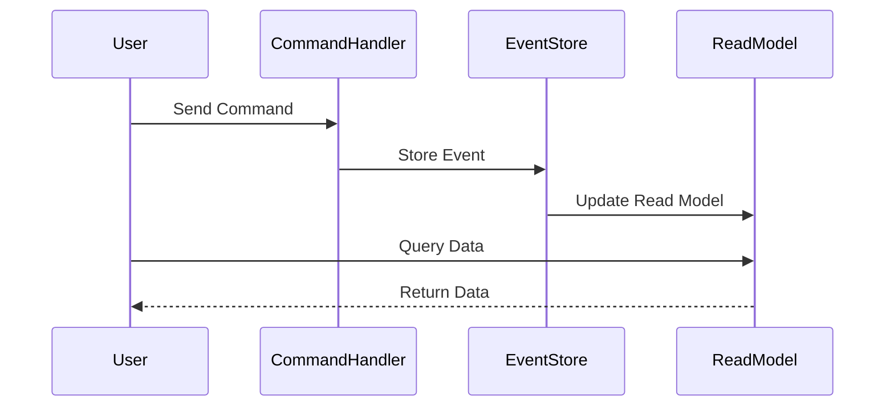
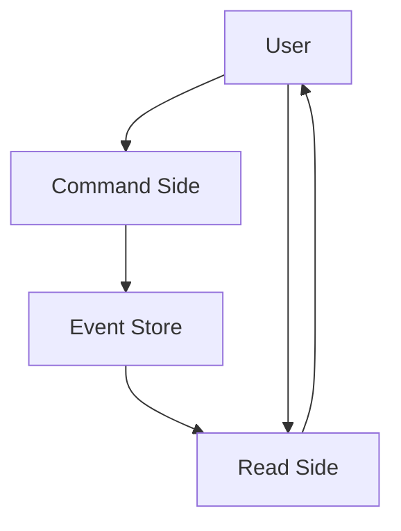

## 12.4. Event Sourcing and CQRS in Depth

In this section, we delve into the advanced concepts of Event Sourcing and Command Query Responsibility Segregation (CQRS) within the realm of microservices architecture. These patterns are crucial for handling complex business logic and ensuring scalability and resilience in distributed systems. Let's explore these concepts, their implementations, and the performance considerations involved.

### Introduction to Event Sourcing and CQRS

Event Sourcing and CQRS are architectural patterns that address challenges in data management and system design. They are particularly useful in microservices architectures where data consistency, scalability, and complex business logic are paramount.

#### Event Sourcing

**Event Sourcing** is a pattern where state changes in a system are captured as a sequence of events. Instead of storing the current state, the system records every change as an event. This approach provides a complete audit trail and allows for reconstructing past states.

#### CQRS (Command Query Responsibility Segregation)

**CQRS** is a pattern that separates the read and write operations of a system. By dividing the responsibilities, CQRS optimizes performance and scalability, allowing for different models to handle queries and commands.

### Key Concepts and Benefits

#### Event Sourcing

- **Auditability**: Every state change is recorded, providing a complete history.
- **Temporal Queries**: Ability to reconstruct past states and understand system evolution.
- **Decoupling**: Events can be consumed by multiple services, promoting loose coupling.

#### CQRS

- **Performance Optimization**: Separate models for reading and writing can be optimized independently.
- **Scalability**: Read and write workloads can be scaled separately.
- **Complex Business Logic**: Supports complex domain logic by separating concerns.

### Implementing Event Sourcing

To implement Event Sourcing, we need to focus on capturing events, storing them, and reconstructing state from these events.

#### Capturing Events

Events are captured whenever a state change occurs. Each event should contain enough information to describe the change.

```pseudocode
// Define an event structure
Event {
  id: UUID
  type: String
  timestamp: DateTime
  data: Map<String, Any>
}

// Capture an event
function captureEvent(eventType, eventData) {
  event = Event(
    id = generateUUID(),
    type = eventType,
    timestamp = getCurrentTime(),
    data = eventData
  )
  storeEvent(event)
}
```

#### Storing Events

Events are stored in an event store, which can be a database or a specialized event storage system.

```pseudocode
// Store an event in the event store
function storeEvent(event) {
  eventStore.save(event)
}
```

#### Reconstructing State

To reconstruct the current state, replay the events from the event store.

```pseudocode
// Reconstruct state from events
function reconstructState(entityId) {
  events = eventStore.getEventsForEntity(entityId)
  state = initialState()
  for event in events {
    state = applyEvent(state, event)
  }
  return state
}

// Apply an event to the current state
function applyEvent(state, event) {
  switch event.type {
    case "Created":
      state = createState(event.data)
    case "Updated":
      state = updateState(state, event.data)
    // Handle other event types
  }
  return state
}
```

### Implementing CQRS

CQRS involves separating the command and query sides of the system.

#### Command Side

The command side handles all write operations. It processes commands and generates events.

```pseudocode
// Command handler
function handleCommand(command) {
  switch command.type {
    case "Create":
      event = createEvent(command.data)
      captureEvent("Created", event)
    case "Update":
      event = updateEvent(command.data)
      captureEvent("Updated", event)
    // Handle other command types
  }
}
```

#### Query Side

The query side handles read operations. It uses a read model optimized for queries.

```pseudocode
// Query handler
function handleQuery(query) {
  switch query.type {
    case "GetById":
      return readModel.getById(query.id)
    case "GetAll":
      return readModel.getAll()
    // Handle other query types
  }
}
```

### Advanced Implementations

#### Handling Complex Business Logic

Event Sourcing and CQRS can handle complex business logic by decoupling the concerns of state changes and queries. This separation allows for more sophisticated processing and validation.

- **Event Processing**: Implement complex logic in event handlers.
- **Command Validation**: Ensure commands meet business rules before processing.

#### Performance Considerations

Scaling event stores and read models is crucial for performance.

- **Event Store Scaling**: Use distributed databases or specialized event stores to handle large volumes of events.
- **Read Model Optimization**: Optimize read models for specific queries to improve performance.

### Visualizing Event Sourcing and CQRS

Let's visualize the flow of events and commands in a microservices architecture using Mermaid.js diagrams.

#### Event Sourcing Flow



#### CQRS Architecture



### Try It Yourself

Experiment with the pseudocode examples by modifying the event types and command handling logic. Consider adding new event types or commands to see how the system adapts.

### References and Links

For further reading, explore the following resources:

- [Martin Fowler on Event Sourcing](https://martinfowler.com/eaaDev/EventSourcing.html)
- [CQRS Documentation](https://docs.microsoft.com/en-us/azure/architecture/patterns/cqrs)

### Knowledge Check

- What are the benefits of using Event Sourcing?
- How does CQRS improve system performance?
- What are the challenges of implementing these patterns?

### Embrace the Journey

Remember, mastering Event Sourcing and CQRS is a journey. Keep experimenting, stay curious, and enjoy the process of building robust microservices architectures.

### Summary

In this section, we've explored the advanced concepts of Event Sourcing and CQRS, their implementations, and performance considerations. These patterns are powerful tools for handling complex business logic and ensuring scalability in microservices architectures.

## Quiz Time!



### What is the primary benefit of Event Sourcing?

- [x] Complete audit trail of state changes
- [ ] Simplified data model
- [ ] Faster read operations
- [ ] Reduced storage requirements

> **Explanation:** Event Sourcing provides a complete audit trail by recording every state change as an event.

### How does CQRS optimize performance?

- [x] By separating read and write models
- [ ] By using a single database for all operations
- [ ] By reducing the number of services
- [ ] By simplifying the data model

> **Explanation:** CQRS optimizes performance by separating the read and write models, allowing each to be optimized independently.

### Which of the following is a challenge of Event Sourcing?

- [x] Complexity in reconstructing state
- [ ] Lack of auditability
- [ ] Inability to handle large data volumes
- [ ] Difficulty in scaling read models

> **Explanation:** Reconstructing state from a sequence of events can be complex, especially as the number of events grows.

### What does CQRS stand for?

- [x] Command Query Responsibility Segregation
- [ ] Command Query Resource Segmentation
- [ ] Centralized Query Resource System
- [ ] Command Queue Resource Segmentation

> **Explanation:** CQRS stands for Command Query Responsibility Segregation, a pattern that separates read and write operations.

### In Event Sourcing, what is stored instead of the current state?

- [x] A sequence of events
- [ ] The final state
- [ ] A snapshot of the state
- [ ] A summary of changes

> **Explanation:** Event Sourcing stores a sequence of events that represent state changes, rather than the current state itself.

### What is a key advantage of using CQRS?

- [x] Independent scaling of read and write workloads
- [ ] Simplified data model
- [ ] Reduced number of services
- [ ] Faster write operations

> **Explanation:** CQRS allows for independent scaling of read and write workloads, optimizing performance.

### How can Event Sourcing handle complex business logic?

- [x] By implementing logic in event handlers
- [ ] By simplifying the data model
- [ ] By reducing the number of events
- [ ] By using a single database

> **Explanation:** Complex business logic can be implemented in event handlers, allowing for sophisticated processing.

### What is a potential performance consideration for Event Sourcing?

- [x] Scaling the event store
- [ ] Reducing the number of events
- [ ] Simplifying the data model
- [ ] Using a single database

> **Explanation:** Scaling the event store is crucial for handling large volumes of events efficiently.

### Which pattern separates read and write operations?

- [x] CQRS
- [ ] Event Sourcing
- [ ] Singleton
- [ ] Observer

> **Explanation:** CQRS separates read and write operations, allowing each to be optimized independently.

### True or False: Event Sourcing and CQRS are only applicable to microservices architectures.

- [ ] True
- [x] False

> **Explanation:** While Event Sourcing and CQRS are beneficial in microservices architectures, they can be applied to other architectural styles as well.


