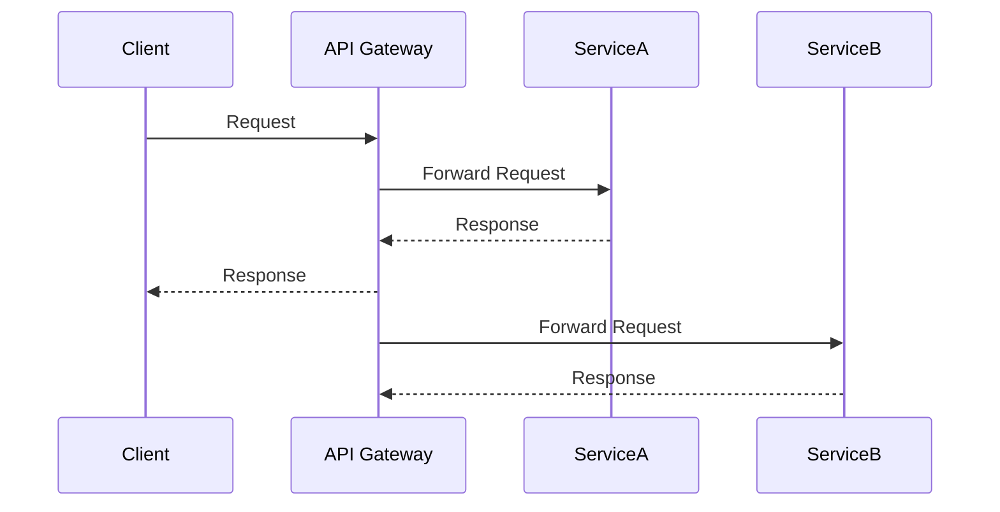

## 13.1. Recap of Key Concepts

In this section, we will synthesize the key concepts and architectural patterns that have been discussed throughout the guide. This recap aims to consolidate your understanding of microservices design patterns and assess your readiness to apply these concepts in real-world scenarios. Let's reflect on the main points and learning outcomes from our journey through microservices architecture.

### Summarizing Main Points

#### Introduction to Microservices Architecture

**Microservices Defined:** Microservices architecture is a design approach where a single application is composed of multiple loosely coupled and independently deployable services. Each service is designed to perform a specific business function and communicates with other services through well-defined APIs.

**Evolution:** The transition from monolithic architectures to microservices has been driven by the need for scalability, flexibility, and faster development cycles. This evolution has been marked by the adoption of Service-Oriented Architecture (SOA) principles and the refinement of these principles into the microservices paradigm.

**Benefits and Challenges:** While microservices offer numerous advantages such as scalability and flexibility, they also introduce challenges like increased complexity, data consistency issues, and operational overhead.

#### Comparing Monolithic and Microservices Architectures

**Monolithic vs. Microservices:** Monolithic architectures are characterized by a single, unified codebase, which can lead to tight coupling and scalability issues. In contrast, microservices promote decoupling and modularity, allowing for independent scaling and deployment.

**When to Use Microservices:** Organizations should assess their readiness and application needs before adopting microservices. Factors such as team maturity, project complexity, and scalability requirements should be considered.

#### Principles of Microservices Design

**Single Responsibility Principle:** Each microservice should have a focused functionality, adhering to the single responsibility principle. This ensures that services are easier to maintain and evolve over time.

**Loose Coupling and High Cohesion:** Microservices should minimize dependencies between services while ensuring that each service is cohesive and focused on a specific task.

**Continuous Delivery and Deployment:** Microservices architecture supports frequent updates and releases through continuous delivery and deployment practices.

**Decentralized Governance:** Teams should have the autonomy to choose the best technologies and tools for their services, promoting innovation and flexibility.

#### Overview of Microservices Design Patterns

**Categories of Patterns:** Microservices design patterns can be categorized into decomposition patterns, communication patterns, data management patterns, security patterns, and observability patterns. Each category addresses specific architectural challenges and provides solutions to common problems.

### Reflecting on Learning Outcomes

#### Service Decomposition Strategies

**Decompose by Business Capability:** Aligning services with business functions ensures that each service is focused on delivering specific business value.

**Decompose by Subdomain:** Using Domain-Driven Design (DDD) to inform service boundaries helps in defining clear and meaningful service boundaries.

**Strangler Fig Pattern:** This pattern allows for the incremental migration from monolithic systems to microservices, reducing risk and complexity.

#### Communication in Microservices

**Synchronous and Asynchronous Communication:** Understanding the trade-offs between synchronous communication (e.g., RESTful APIs) and asynchronous communication (e.g., messaging systems) is crucial for designing resilient microservices.

**Service Discovery:** Implementing service discovery mechanisms ensures that services can dynamically locate and communicate with each other.

**Circuit Breakers and Resilience:** Circuit breakers help in handling failures gracefully, preventing cascading failures across services.

#### Data Management in Microservices

**Database Per Service Pattern:** This pattern ensures data encapsulation and independence, allowing each service to manage its own data.

**Event Sourcing and CQRS:** These patterns provide powerful mechanisms for managing state and separating read and write models, respectively.

#### Testing Microservices

**Unit, Integration, and Contract Testing:** Testing strategies should cover individual service logic, inter-service interactions, and service agreements to ensure reliability and consistency.

#### Deployment Strategies

**Containers and Orchestration:** Using Docker and Kubernetes for containerization and orchestration simplifies deployment and scaling of microservices.

**Continuous Integration/Continuous Deployment (CI/CD):** Automating build, test, and deployment processes is essential for maintaining agility and speed in microservices development.

#### Pseudocode Conventions

**Syntax Rules for Pseudocode:** Consistent syntax and conventions in pseudocode examples help in clearly illustrating microservices concepts and interactions.

### Code Examples

Let's revisit some key concepts with pseudocode examples to reinforce our understanding.

#### Single Responsibility Principle

```pseudocode
// Define a microservice for user authentication
service UserAuthenticationService {
    function authenticateUser(credentials) {
        // Validate user credentials
        if (isValid(credentials)) {
            return generateToken(credentials.userId)
        } else {
            return "Authentication Failed"
        }
    }
}
```

**Explanation:** This pseudocode demonstrates a microservice focused solely on user authentication, adhering to the single responsibility principle.

#### Circuit Breaker Pattern

```pseudocode
// Circuit breaker implementation
class CircuitBreaker {
    state = "CLOSED"
    failureCount = 0
    threshold = 5

    function callService(service) {
        if (state == "OPEN") {
            return "Service Unavailable"
        }

        try {
            response = service.call()
            reset()
            return response
        } catch (Exception e) {
            failureCount++
            if (failureCount >= threshold) {
                state = "OPEN"
            }
            return "Service Failed"
        }
    }

    function reset() {
        state = "CLOSED"
        failureCount = 0
    }
}
```

**Explanation:** This pseudocode illustrates a basic circuit breaker implementation, protecting services from cascading failures.

### Visualizing Microservices Architecture

To further solidify our understanding, let's visualize some key concepts using diagrams.

#### Diagram: Microservices Communication Flow



**Description:** This sequence diagram illustrates the communication flow between a client, an API gateway, and two microservices (ServiceA and ServiceB).

### Knowledge Check

Let's test your understanding of the key concepts covered in this guide.

#### Quiz Time!



### What is the primary benefit of using microservices architecture?

- [x] Scalability and flexibility
- [ ] Reduced complexity
- [ ] Simplified data management
- [ ] Centralized governance

> **Explanation:** Microservices architecture provides scalability and flexibility by allowing independent deployment and scaling of services.

### Which pattern is used for incremental migration from monolithic systems?

- [ ] Circuit Breaker
- [x] Strangler Fig
- [ ] API Gateway
- [ ] Service Mesh

> **Explanation:** The Strangler Fig pattern allows for gradual replacement of monolithic systems with microservices.

### What is the purpose of the Circuit Breaker pattern?

- [x] To prevent cascading failures
- [ ] To manage service discovery
- [ ] To handle data consistency
- [ ] To automate deployments

> **Explanation:** The Circuit Breaker pattern prevents cascading failures by stopping requests to a failing service.

### Which communication method is typically used for decoupling services?

- [ ] Synchronous communication
- [x] Asynchronous communication
- [ ] Direct database access
- [ ] Shared memory

> **Explanation:** Asynchronous communication, such as messaging systems, is used to decouple services.

### What is the main advantage of the Database Per Service pattern?

- [x] Data encapsulation and independence
- [ ] Simplified data sharing
- [ ] Centralized data management
- [ ] Reduced storage costs

> **Explanation:** The Database Per Service pattern ensures data encapsulation and independence, allowing each service to manage its own data.

### What is the role of an API Gateway in microservices architecture?

- [x] To manage client interactions
- [ ] To store service data
- [ ] To perform data analytics
- [ ] To deploy services

> **Explanation:** An API Gateway manages client interactions by routing requests to appropriate services.

### Which testing strategy focuses on verifying inter-service interactions?

- [ ] Unit Testing
- [x] Integration Testing
- [ ] Contract Testing
- [ ] End-to-End Testing

> **Explanation:** Integration Testing focuses on verifying interactions between services.

### What is the benefit of using containers in microservices?

- [x] Standardized environments
- [ ] Reduced code complexity
- [ ] Centralized logging
- [ ] Simplified testing

> **Explanation:** Containers provide standardized environments, making deployment and scaling easier.

### Which pattern separates read and write models in microservices?

- [ ] Event Sourcing
- [x] CQRS
- [ ] Service Mesh
- [ ] API Gateway

> **Explanation:** CQRS (Command Query Responsibility Segregation) separates read and write models to optimize for different workloads.

### True or False: Microservices architecture requires centralized governance.

- [ ] True
- [x] False

> **Explanation:** Microservices architecture promotes decentralized governance, allowing teams autonomy in technology choices.



### Embrace the Journey

Remember, this is just the beginning. As you progress, you'll build more complex and interactive microservices systems. Keep experimenting, stay curious, and enjoy the journey!
