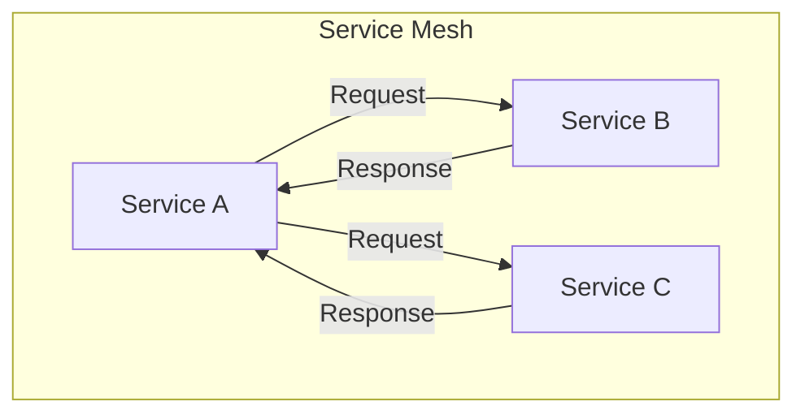
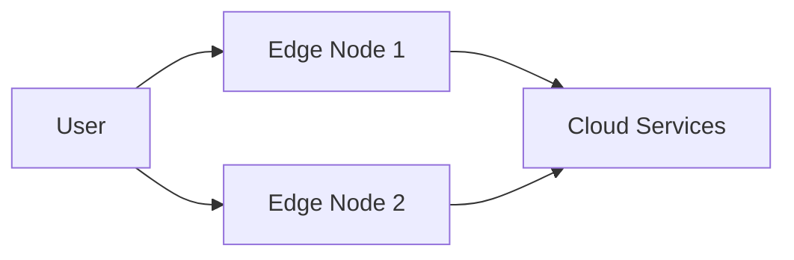
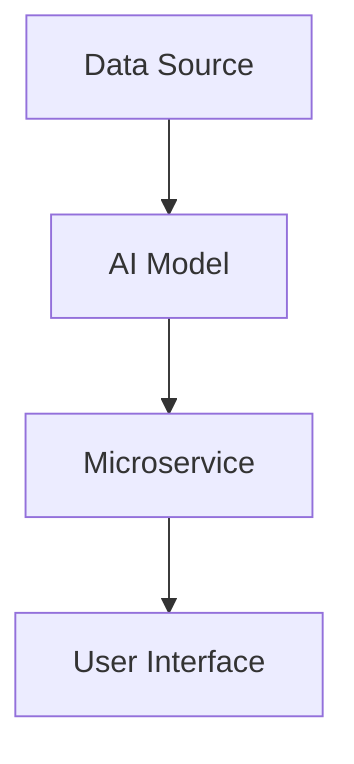

## 13.2. The Future of Microservices Architecture

As we delve into the future of microservices architecture, it's crucial to understand the emerging trends that are shaping this landscape. The evolution of microservices is being driven by technological advancements and the ever-increasing demands for scalability, flexibility, and efficiency. In this section, we will explore key trends such as service meshes, edge computing, and AI integration, and discuss the importance of continuous learning to stay ahead in this dynamic field.

### Emerging Trends

#### Service Meshes

Service meshes are gaining traction as a powerful solution for managing the complexities of microservices communication. They provide a dedicated infrastructure layer that handles service-to-service communication, offering features like load balancing, service discovery, and security.

**Key Features of Service Meshes:**

- **Traffic Management:** Service meshes enable fine-grained control over traffic routing, allowing for canary releases and A/B testing.
- **Security:** They provide end-to-end encryption and authentication between services, enhancing security.
- **Observability:** Service meshes offer built-in observability features, such as tracing and metrics, to monitor service interactions.

**Mermaid Diagram: Visualizing Service Mesh Architecture**



**Pseudocode Example: Implementing a Service Mesh**

```pseudocode
// Define a service mesh configuration
serviceMeshConfig {
    enableTrafficManagement: true,
    enableSecurity: true,
    enableObservability: true
}

// Function to handle service communication
function handleRequest(request) {
    if serviceMeshConfig.enableSecurity {
        authenticateRequest(request)
    }
    routeRequest(request)
    if serviceMeshConfig.enableObservability {
        logRequest(request)
    }
    return response
}
```

**Try It Yourself:**

- Modify the pseudocode to add custom logging for specific services.
- Experiment with different traffic management strategies.

#### Edge Computing

Edge computing is transforming how microservices are deployed and managed by bringing computation closer to data sources. This reduces latency and bandwidth usage, making it ideal for applications requiring real-time processing.

**Benefits of Edge Computing:**

- **Reduced Latency:** By processing data closer to the source, edge computing minimizes latency.
- **Improved Bandwidth Efficiency:** It reduces the need to transfer large volumes of data to centralized data centers.
- **Enhanced Privacy and Security:** Data can be processed locally, reducing exposure to potential breaches.

**Mermaid Diagram: Edge Computing in Microservices**



**Pseudocode Example: Deploying Microservices at the Edge**

```pseudocode
// Define edge node configuration
edgeNodeConfig {
    location: "Local",
    resources: "High",
    securityLevel: "Enhanced"
}

// Function to deploy microservice
function deployMicroservice(service, edgeNodeConfig) {
    if edgeNodeConfig.resources == "High" {
        deploy(service, edgeNodeConfig.location)
    }
    return deploymentStatus
}
```

**Try It Yourself:**

- Adjust the edge node configuration to simulate different deployment scenarios.
- Explore how changes in resource allocation affect deployment success.

#### AI Integration

Artificial Intelligence (AI) is increasingly being integrated into microservices to enhance decision-making and automate processes. AI can be used to analyze data, predict trends, and optimize resource allocation.

**Applications of AI in Microservices:**

- **Predictive Analytics:** AI models can predict user behavior and system demands, enabling proactive scaling.
- **Automated Decision-Making:** AI can automate complex decision-making processes, reducing human intervention.
- **Enhanced User Experience:** AI-driven personalization can improve user engagement and satisfaction.

**Mermaid Diagram: AI Integration in Microservices**



**Pseudocode Example: Integrating AI with Microservices**

```pseudocode
// Define AI model configuration
aiModelConfig {
    modelType: "Neural Network",
    trainingData: "User Data",
    predictionAccuracy: 95%
}

// Function to integrate AI model with microservice
function integrateAIModel(service, aiModelConfig) {
    if aiModelConfig.predictionAccuracy > 90% {
        service.useAIModel(aiModelConfig)
    }
    return integrationStatus
}
```

**Try It Yourself:**

- Experiment with different AI model configurations to see how they impact service performance.
- Test the integration with various types of microservices.

### Staying Current

In the rapidly evolving field of microservices architecture, staying current is essential. Continuous learning and adaptation are key to leveraging new technologies and methodologies effectively.

**Strategies for Continuous Learning:**

- **Engage with Online Communities:** Participate in forums and discussion groups to exchange knowledge and experiences.
- **Attend Conferences and Workshops:** Stay updated on the latest trends and innovations by attending industry events.
- **Pursue Certifications:** Enhance your skills and credentials by obtaining relevant certifications in microservices and related technologies.

**Knowledge Check:**

- What are the key benefits of using service meshes in microservices architecture?
- How does edge computing improve the performance of microservices?
- In what ways can AI integration enhance microservices functionality?

**Summary:**

As we look to the future of microservices architecture, it's clear that emerging trends like service meshes, edge computing, and AI integration will play a significant role in shaping the landscape. By staying informed and continuously learning, we can harness these advancements to build more efficient, scalable, and intelligent systems.

**Embrace the Journey:**

Remember, this is just the beginning. As you progress, you'll encounter new challenges and opportunities in the world of microservices. Keep experimenting, stay curious, and enjoy the journey!

## Quiz Time!



### What is a primary benefit of using service meshes in microservices architecture?

- [x] Enhanced security and observability
- [ ] Reduced development time
- [ ] Simplified codebase
- [ ] Increased hardware requirements

> **Explanation:** Service meshes provide enhanced security and observability by managing service-to-service communication.

### How does edge computing benefit microservices?

- [x] Reduces latency and bandwidth usage
- [ ] Increases centralization
- [ ] Simplifies data processing
- [ ] Decreases security

> **Explanation:** Edge computing reduces latency and bandwidth usage by processing data closer to the source.

### What role does AI play in microservices?

- [x] Enhances decision-making and automates processes
- [ ] Simplifies service deployment
- [ ] Reduces the need for databases
- [ ] Increases manual intervention

> **Explanation:** AI enhances decision-making and automates processes, improving microservices efficiency.

### Which of the following is a feature of service meshes?

- [x] Traffic management
- [ ] Data storage
- [ ] User authentication
- [ ] Code compilation

> **Explanation:** Service meshes offer traffic management as a key feature, allowing for fine-grained control over service communication.

### What is a key advantage of integrating AI with microservices?

- [x] Predictive analytics and automated decision-making
- [ ] Simplified user interfaces
- [ ] Reduced server costs
- [ ] Increased manual oversight

> **Explanation:** AI integration provides predictive analytics and automated decision-making, enhancing microservices functionality.

### Why is continuous learning important in microservices architecture?

- [x] To stay updated with emerging trends and technologies
- [ ] To reduce the need for documentation
- [ ] To simplify code maintenance
- [ ] To increase hardware requirements

> **Explanation:** Continuous learning is crucial to stay updated with emerging trends and technologies in microservices architecture.

### What is a common application of AI in microservices?

- [x] Predictive analytics
- [ ] Data storage
- [ ] User authentication
- [ ] Code compilation

> **Explanation:** AI is commonly used for predictive analytics in microservices, enabling proactive scaling and optimization.

### How does edge computing enhance privacy and security?

- [x] By processing data locally
- [ ] By centralizing data storage
- [ ] By simplifying encryption
- [ ] By increasing data transfer

> **Explanation:** Edge computing enhances privacy and security by processing data locally, reducing exposure to potential breaches.

### What is a benefit of attending conferences and workshops for microservices professionals?

- [x] Staying updated on the latest trends and innovations
- [ ] Reducing the need for online resources
- [ ] Simplifying code maintenance
- [ ] Increasing hardware requirements

> **Explanation:** Attending conferences and workshops helps professionals stay updated on the latest trends and innovations in microservices.

### True or False: AI integration in microservices reduces the need for human intervention.

- [x] True
- [ ] False

> **Explanation:** AI integration automates processes and enhances decision-making, reducing the need for human intervention.


