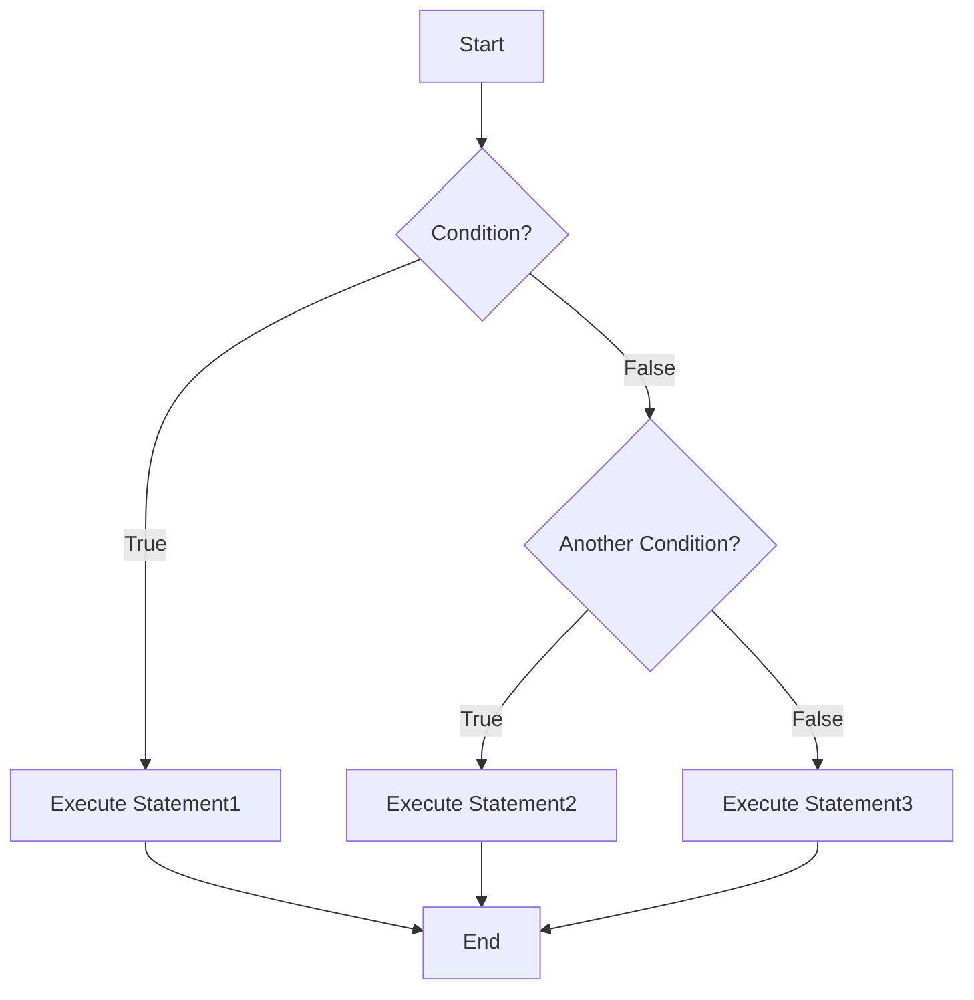
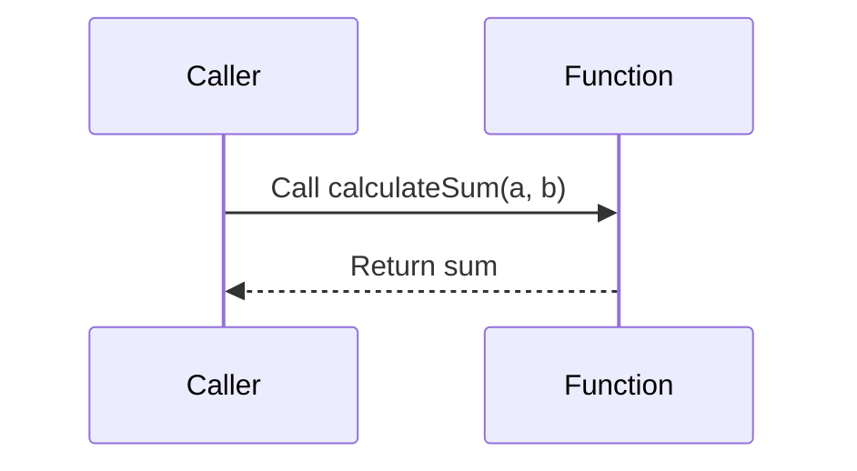

## A.1. Pseudocode Style Guide

In the world of software architecture, particularly in the realm of microservices, pseudocode serves as a crucial tool for illustrating complex interactions and system designs. This guide aims to provide a comprehensive overview of the syntax rules and conventions used in pseudocode, ensuring clarity and consistency across examples. By adhering to these standards, developers can effectively communicate design patterns and architectural principles without being tied to a specific programming language.

### Introduction to Pseudocode

Pseudocode is a high-level description of an algorithm or a system's logic that uses the structural conventions of programming languages but is intended for human reading rather than machine reading. It is language-agnostic, meaning it can be understood by developers regardless of their programming language expertise. Pseudocode is particularly useful in the context of microservices, where complex systems are broken down into smaller, independent services.

### Syntax Rules and Conventions

To ensure that pseudocode is both readable and useful, it is essential to follow certain syntax rules and conventions. These guidelines help maintain consistency and clarity, making it easier for developers to understand and implement the described logic.

#### 1. Structure and Formatting

- **Indentation**: Use consistent indentation to denote blocks of code. This helps in visually distinguishing different levels of logic, such as loops and conditional statements.

- **Capitalization**: Use uppercase for keywords such as IF, ELSE, WHILE, FOR, and RETURN to differentiate them from variables and functions.

- **Comments**: Include comments to explain complex logic or important steps. Comments should be concise and relevant.

- **Line Breaks**: Use line breaks to separate logical sections of code, enhancing readability.

#### 2. Variable Naming

- **Descriptive Names**: Use descriptive names for variables and functions to convey their purpose. Avoid single-letter names unless used in a loop.

- **Consistency**: Maintain consistency in naming conventions, such as camelCase or snake_case, throughout the pseudocode.

#### 3. Control Structures

- **Conditional Statements**: Use IF, ELSE IF, and ELSE for conditional logic. Ensure that each condition is clearly stated.

- **Loops**: Use FOR and WHILE loops for iteration. Clearly define the loop's start, end, and increment conditions.

#### 4. Data Structures

- **Arrays and Lists**: Use arrays or lists to represent collections of data. Clearly define the structure and purpose of each collection.

- **Dictionaries and Maps**: Use dictionaries or maps for key-value pairs. Ensure that keys are unique and descriptive.

#### 5. Functions and Procedures

- **Function Definition**: Clearly define the purpose and parameters of each function. Use RETURN to specify the output.

- **Modularity**: Break down complex logic into smaller, reusable functions or procedures.

### Common Constructs

Pseudocode often includes common constructs that are language-agnostic, allowing developers to focus on the logic rather than syntax. Below are some of the most frequently used constructs in pseudocode.

#### Conditional Statements

Conditional statements control the flow of execution based on certain conditions.

```pseudocode
IF condition THEN
    // Execute this block if condition is true
    statement1
ELSE IF another_condition THEN
    // Execute this block if another_condition is true
    statement2
ELSE
    // Execute this block if no conditions are true
    statement3
END IF
```

#### Loops

Loops are used to repeat a block of code multiple times.

```pseudocode
FOR i = 0 TO n DO
    // Execute this block n times
    statement
END FOR

WHILE condition DO
    // Execute this block while condition is true
    statement
END WHILE
```

#### Functions

Functions encapsulate a block of code that performs a specific task.

```pseudocode
FUNCTION calculateSum(a, b)
    RETURN a + b
END FUNCTION
```

#### Data Structures

Data structures organize and store data efficiently.

```pseudocode
ARRAY numbers = [1, 2, 3, 4, 5]

DICTIONARY person = {
    "name": "John",
    "age": 30
}
```

### Visualizing Pseudocode

To enhance understanding, it is often helpful to visualize pseudocode using diagrams. Below are examples of how to represent pseudocode concepts visually.

#### Flowchart for Conditional Statements



**Caption**: This flowchart illustrates the flow of a conditional statement with multiple branches.

#### Sequence Diagram for Function Calls



**Caption**: This sequence diagram shows the interaction between a caller and a function, highlighting the function call and return.

### Try It Yourself

To deepen your understanding of pseudocode, try modifying the examples provided. For instance, change the conditions in the conditional statement or add additional logic to the function. Experimenting with pseudocode will help you grasp the underlying logic and improve your problem-solving skills.

### References and Links

For further reading on pseudocode and its applications in software design, consider exploring the following resources:

- [MDN Web Docs](https://developer.mozilla.org/en-US/docs/Web/JavaScript/Guide/Control_flow_and_error_handling)
- [W3Schools](https://www.w3schools.com/js/js_if_else.asp)

### Knowledge Check

To reinforce your learning, consider the following questions:

1. What is the purpose of using pseudocode in software design?
2. How does pseudocode differ from actual programming languages?
3. Why is it important to use consistent naming conventions in pseudocode?

### Embrace the Journey

Remember, mastering pseudocode is just the beginning of your journey in software design. As you progress, you'll encounter more complex systems and design patterns. Keep experimenting, stay curious, and enjoy the journey!

### Summary

In this guide, we've explored the essential syntax rules and conventions for writing pseudocode, along with common constructs and visualization techniques. By adhering to these guidelines, you can effectively communicate complex logic and design patterns in a language-agnostic manner.

## Quiz Time!



### What is the primary purpose of pseudocode?

- [x] To describe algorithms in a human-readable format
- [ ] To execute code on a computer
- [ ] To replace programming languages
- [ ] To compile into machine code

> **Explanation:** Pseudocode is used to describe algorithms in a way that is easy for humans to understand, without being tied to a specific programming language.

### Which of the following is a key feature of pseudocode?

- [x] Language-agnostic
- [ ] Requires compilation
- [ ] Machine-readable
- [ ] Syntax-specific

> **Explanation:** Pseudocode is language-agnostic, meaning it is not tied to any specific programming language syntax.

### What is the benefit of using descriptive variable names in pseudocode?

- [x] Improves readability and understanding
- [ ] Increases execution speed
- [ ] Reduces memory usage
- [ ] Enhances security

> **Explanation:** Descriptive variable names make pseudocode easier to read and understand, conveying the purpose of each variable.

### How should keywords like IF and ELSE be formatted in pseudocode?

- [x] Uppercase
- [ ] Lowercase
- [ ] CamelCase
- [ ] Snake_case

> **Explanation:** Keywords like IF and ELSE are typically written in uppercase to distinguish them from variables and functions.

### What is the purpose of indentation in pseudocode?

- [x] To denote blocks of code
- [ ] To increase execution speed
- [ ] To reduce memory usage
- [ ] To enhance security

> **Explanation:** Indentation is used to visually separate blocks of code, making the structure of the pseudocode clear.

### Which of the following is a common construct in pseudocode?

- [x] Conditional statements
- [ ] Machine code
- [ ] Binary trees
- [ ] Hexadecimal numbers

> **Explanation:** Conditional statements are a common construct in pseudocode, used to control the flow of execution.

### What is a key advantage of using pseudocode in microservices design?

- [x] It allows for clear communication of complex interactions
- [ ] It can be directly executed by microservices
- [ ] It replaces the need for documentation
- [ ] It compiles into microservices code

> **Explanation:** Pseudocode allows for clear communication of complex interactions and system designs in microservices.

### How can pseudocode be visualized to enhance understanding?

- [x] Using diagrams like flowcharts and sequence diagrams
- [ ] By compiling it into executable code
- [ ] By converting it into binary
- [ ] By encrypting it

> **Explanation:** Visualizing pseudocode with diagrams like flowcharts and sequence diagrams can enhance understanding of the logic.

### What is the role of comments in pseudocode?

- [x] To explain complex logic or important steps
- [ ] To increase execution speed
- [ ] To reduce memory usage
- [ ] To enhance security

> **Explanation:** Comments in pseudocode are used to explain complex logic or important steps, aiding in understanding.

### True or False: Pseudocode is intended for machine reading.

- [ ] True
- [x] False

> **Explanation:** Pseudocode is intended for human reading, not machine reading, as it is a high-level description of logic.


