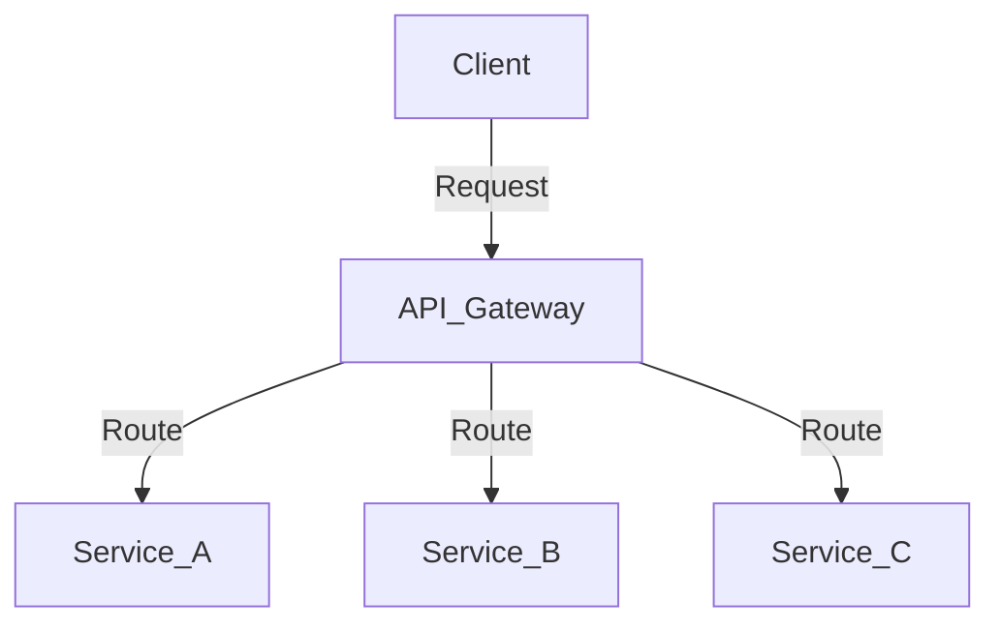
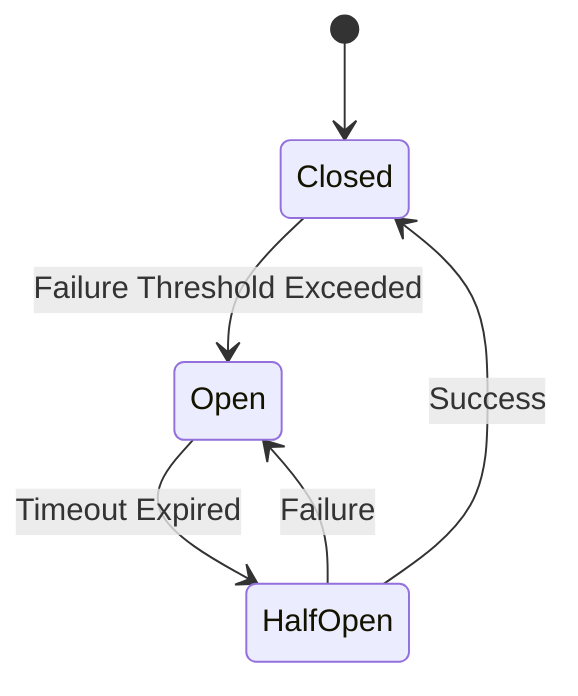

## A.2. Glossary of Terms

Welcome to the glossary section of our guide on Microservices Design Patterns. This glossary is designed to clarify the terminology used throughout the guide, providing definitions for key concepts, acronyms, and industry-specific language. Whether you're a seasoned developer or new to microservices, this glossary will serve as a valuable reference to enhance your understanding of the architectural principles and patterns discussed in this guide.

### Definitions of Key Concepts

#### Microservices
**Definition:** A software architectural style that structures an application as a collection of loosely coupled services, each implementing a specific business capability. Microservices are independently deployable and scalable.

#### Monolithic Architecture
**Definition:** A traditional software architecture where all components of an application are tightly integrated and run as a single unit. This contrasts with microservices, which are modular and decoupled.

#### Service-Oriented Architecture (SOA)
**Definition:** An architectural pattern where services are provided to other components by application components, through a communication protocol over a network. SOA is a precursor to microservices architecture.

#### Domain-Driven Design (DDD)
**Definition:** A design approach that focuses on modeling software to match a domain's complexity, using a common language and bounded contexts to define service boundaries.

#### Bounded Context
**Definition:** A central pattern in DDD that defines the boundaries within which a particular model is applicable. It helps in maintaining a clear separation between different parts of a system.

#### Event-Driven Architecture
**Definition:** A software architecture paradigm promoting the production, detection, consumption of, and reaction to events. It is often used in microservices to enable asynchronous communication.

#### API Gateway
**Definition:** A server that acts as an entry point for all client requests, routing them to the appropriate microservices. It can handle cross-cutting concerns like authentication, logging, and rate limiting.

#### Service Mesh
**Definition:** A dedicated infrastructure layer for managing service-to-service communication, often using sidecar proxies to handle load balancing, encryption, and observability.

#### Circuit Breaker
**Definition:** A design pattern used to detect failures and encapsulate the logic of preventing a failure from constantly recurring during maintenance, temporary external system failure, or unexpected system difficulties.

#### Saga Pattern
**Definition:** A pattern for managing distributed transactions in microservices, coordinating a series of local transactions to ensure data consistency across services.

#### CQRS (Command Query Responsibility Segregation)
**Definition:** A pattern that separates the read and write operations of a data store, optimizing for different workloads and improving scalability.

#### Event Sourcing
**Definition:** A pattern where state changes are stored as a sequence of events, allowing the reconstruction of past states and providing a reliable audit trail.

#### Polyglot Persistence
**Definition:** The practice of using multiple data storage technologies, chosen based on the specific needs of each service, to achieve optimal performance and scalability.

#### Continuous Integration/Continuous Deployment (CI/CD)
**Definition:** A set of practices that enable development teams to deliver code changes more frequently and reliably, automating the build, test, and deployment processes.

#### Infrastructure as Code (IaC)
**Definition:** The process of managing and provisioning computing infrastructure through machine-readable definition files, rather than physical hardware configuration or interactive configuration tools.

#### Containerization
**Definition:** A lightweight form of virtualization that packages an application and its dependencies into a container, ensuring consistency across environments.

#### Kubernetes
**Definition:** An open-source platform for automating the deployment, scaling, and management of containerized applications.

#### Docker
**Definition:** A platform for developing, shipping, and running applications in containers, providing a consistent environment for development and production.

#### OAuth2
**Definition:** An open standard for access delegation, commonly used as a way to grant websites or applications limited access to user information without exposing passwords.

#### OpenID Connect
**Definition:** An identity layer on top of OAuth2, providing authentication as well as authorization, allowing clients to verify the identity of an end-user.

#### Mutual TLS (mTLS)
**Definition:** A method of mutual authentication where both the client and server authenticate each other using certificates, ensuring secure communication.

#### ELK Stack
**Definition:** A collection of three open-source products: Elasticsearch, Logstash, and Kibana, used for searching, analyzing, and visualizing log data in real-time.

#### Jaeger
**Definition:** An open-source, end-to-end distributed tracing system used for monitoring and troubleshooting transactions in complex distributed systems.

#### Zipkin
**Definition:** A distributed tracing system that helps gather timing data needed to troubleshoot latency problems in microservice architectures.

#### GDPR (General Data Protection Regulation)
**Definition:** A regulation in EU law on data protection and privacy in the European Union and the European Economic Area, also addressing the transfer of personal data outside the EU and EEA areas.

#### Strangler Fig Pattern
**Definition:** A pattern for incrementally migrating a legacy system to a new system by gradually replacing parts of the old system with new services.

#### Blue-Green Deployment
**Definition:** A deployment strategy that reduces downtime and risk by running two identical production environments, one active (blue) and one idle (green), allowing for seamless transitions.

#### Canary Deployment
**Definition:** A deployment strategy that releases a new version of an application to a small subset of users to test the changes before rolling out to the entire user base.

#### Fault Tolerance
**Definition:** The ability of a system to continue operating properly in the event of the failure of some of its components.

#### Auto-Scaling
**Definition:** The process of automatically adjusting the number of active servers or instances based on the current load and demand.

#### Load Balancing
**Definition:** The process of distributing network or application traffic across multiple servers to ensure no single server becomes overwhelmed.

#### Observability
**Definition:** The ability to measure the internal states of a system by examining its outputs, crucial for maintaining the health and performance of microservices.

#### Health Check
**Definition:** A mechanism to determine if a service is functioning correctly, often used to trigger automated recovery processes.

#### Structured Logging
**Definition:** A logging practice where log messages are captured in a structured format, such as JSON, making them easier to search and analyze.

#### Message Broker
**Definition:** A software intermediary that facilitates communication between services by translating messages between formal messaging protocols.

#### Publish-Subscribe Pattern
**Definition:** A messaging pattern where messages are sent by publishers and received by subscribers, allowing for decoupled communication.

#### Message Queue
**Definition:** A form of asynchronous service-to-service communication used in serverless and microservices architectures, where messages are queued until they are processed.

#### Choreography
**Definition:** A coordination mechanism in microservices where each service works independently and communicates through events, without a central controller.

#### Orchestration
**Definition:** A coordination mechanism where a central controller manages the interactions between services, ensuring a defined sequence of operations.

#### API Keys
**Definition:** A simple encrypted string that identifies an application without any principal. They are often used to authenticate requests to APIs.

#### Token
**Definition:** A piece of data that represents the authorization to access resources, often used in authentication and authorization processes.

#### Encryption at Rest
**Definition:** The practice of encrypting data stored on disk to protect it from unauthorized access.

#### Compliance
**Definition:** Adherence to laws, regulations, guidelines, and specifications relevant to business processes.

#### Threat Modeling
**Definition:** A process for identifying and assessing potential security threats to a system, helping to prioritize security measures.

#### Intrusion Detection System (IDS)
**Definition:** A device or software application that monitors a network or systems for malicious activity or policy violations.

#### Cross-Functional Teams
**Definition:** Teams composed of members with different functional expertise working towards a common goal, often used in DevOps to enhance collaboration.

#### DevOps
**Definition:** A set of practices that combines software development (Dev) and IT operations (Ops) to shorten the development lifecycle and provide continuous delivery.

#### Serverless
**Definition:** A cloud-computing execution model where the cloud provider dynamically manages the allocation of machine resources, allowing developers to focus on code without managing servers.

#### Micro Frontends
**Definition:** An architectural style where the frontend is decomposed into individual, semi-independent "micro" applications, each owned by different teams.

#### Edge Computing
**Definition:** A distributed computing paradigm that brings computation and data storage closer to the location where it is needed, improving response times and saving bandwidth.

#### AI Integration
**Definition:** The incorporation of artificial intelligence technologies into software systems to enhance capabilities such as data analysis, decision-making, and automation.

### Acronyms and Abbreviations

- **API**: Application Programming Interface
- **CI/CD**: Continuous Integration/Continuous Deployment
- **CQRS**: Command Query Responsibility Segregation
- **DDD**: Domain-Driven Design
- **ELK**: Elasticsearch, Logstash, Kibana
- **GDPR**: General Data Protection Regulation
- **IaC**: Infrastructure as Code
- **IDS**: Intrusion Detection System
- **mTLS**: Mutual Transport Layer Security
- **SOA**: Service-Oriented Architecture

### Try It Yourself

To deepen your understanding of these terms, try creating pseudocode examples for some of the patterns discussed. For instance, you can write pseudocode for a simple API Gateway or a Circuit Breaker. Experiment with different scenarios and see how these patterns can be applied in various contexts.

### Visualizing Microservices Concepts

To better understand the relationships between these concepts, let's visualize a few key patterns using Mermaid.js diagrams.

#### Visualizing the API Gateway Pattern

*Description:* This diagram illustrates how an API Gateway acts as a centralized entry point for client requests, routing them to the appropriate microservices.

#### Visualizing the Circuit Breaker Pattern

*Description:* This state diagram shows the transitions between the states of a Circuit Breaker: Closed, Open, and Half-Open, helping to prevent cascading failures in a microservices architecture.

### Knowledge Check

Reflect on the glossary terms and consider how they apply to your current projects. Can you identify areas where these patterns could improve your architecture? Discuss with your team and explore potential implementations.

## Quiz Time!



### What is the primary purpose of an API Gateway in microservices architecture?

- [x] To act as a centralized entry point for client requests
- [ ] To store data for microservices
- [ ] To manage service-to-service communication
- [ ] To handle distributed transactions

> **Explanation:** An API Gateway serves as a centralized entry point for client requests, routing them to the appropriate microservices.

### Which pattern is used to manage distributed transactions in microservices?

- [ ] API Gateway
- [ ] Circuit Breaker
- [x] Saga Pattern
- [ ] Service Mesh

> **Explanation:** The Saga Pattern is used to manage distributed transactions by coordinating a series of local transactions to ensure data consistency across services.

### What does CQRS stand for?

- [ ] Command Query Responsibility System
- [x] Command Query Responsibility Segregation
- [ ] Command Queue Response Segregation
- [ ] Central Query Response System

> **Explanation:** CQRS stands for Command Query Responsibility Segregation, a pattern that separates read and write operations of a data store.

### What is the primary benefit of using containers in microservices?

- [ ] To increase the complexity of deployment
- [x] To ensure consistency across environments
- [ ] To replace virtual machines
- [ ] To eliminate the need for orchestration

> **Explanation:** Containers ensure consistency across environments by packaging an application and its dependencies into a single unit.

### Which of the following is NOT a feature of a Service Mesh?

- [ ] Load balancing
- [ ] Encryption
- [ ] Observability
- [x] Data storage

> **Explanation:** A Service Mesh manages service-to-service communication, including load balancing, encryption, and observability, but not data storage.

### What is the role of a Message Broker in microservices?

- [ ] To store data for microservices
- [x] To facilitate communication between services
- [ ] To manage service-to-service communication
- [ ] To handle distributed transactions

> **Explanation:** A Message Broker facilitates communication between services by translating messages between formal messaging protocols.

### What is the primary goal of Infrastructure as Code (IaC)?

- [ ] To increase manual configuration
- [ ] To eliminate the need for cloud services
- [x] To manage infrastructure through machine-readable definition files
- [ ] To replace DevOps practices

> **Explanation:** Infrastructure as Code (IaC) manages infrastructure through machine-readable definition files, ensuring consistency and reproducibility.

### Which deployment strategy involves running two identical production environments?

- [x] Blue-Green Deployment
- [ ] Canary Deployment
- [ ] Rolling Deployment
- [ ] Shadow Deployment

> **Explanation:** Blue-Green Deployment involves running two identical production environments, one active and one idle, allowing for seamless transitions.

### What is the purpose of a Health Check in microservices?

- [ ] To encrypt data at rest
- [ ] To manage service-to-service communication
- [x] To determine if a service is functioning correctly
- [ ] To handle distributed transactions

> **Explanation:** A Health Check determines if a service is functioning correctly, often used to trigger automated recovery processes.

### True or False: Event Sourcing stores state changes as a sequence of events.

- [x] True
- [ ] False

> **Explanation:** Event Sourcing stores state changes as a sequence of events, allowing the reconstruction of past states and providing a reliable audit trail.



Remember, this glossary is just the beginning. As you progress in your journey with microservices, continue to explore and deepen your understanding of these concepts. Stay curious, keep experimenting, and enjoy the journey!
