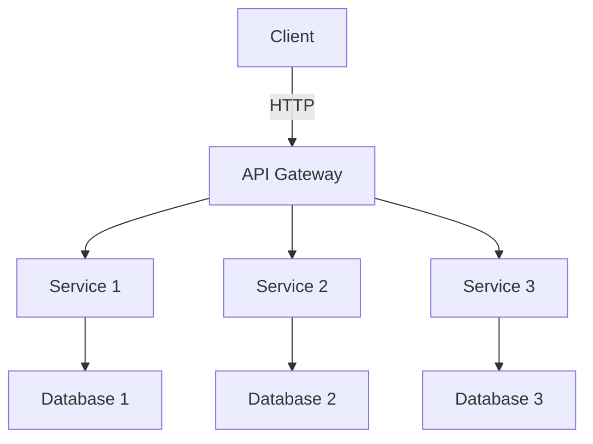
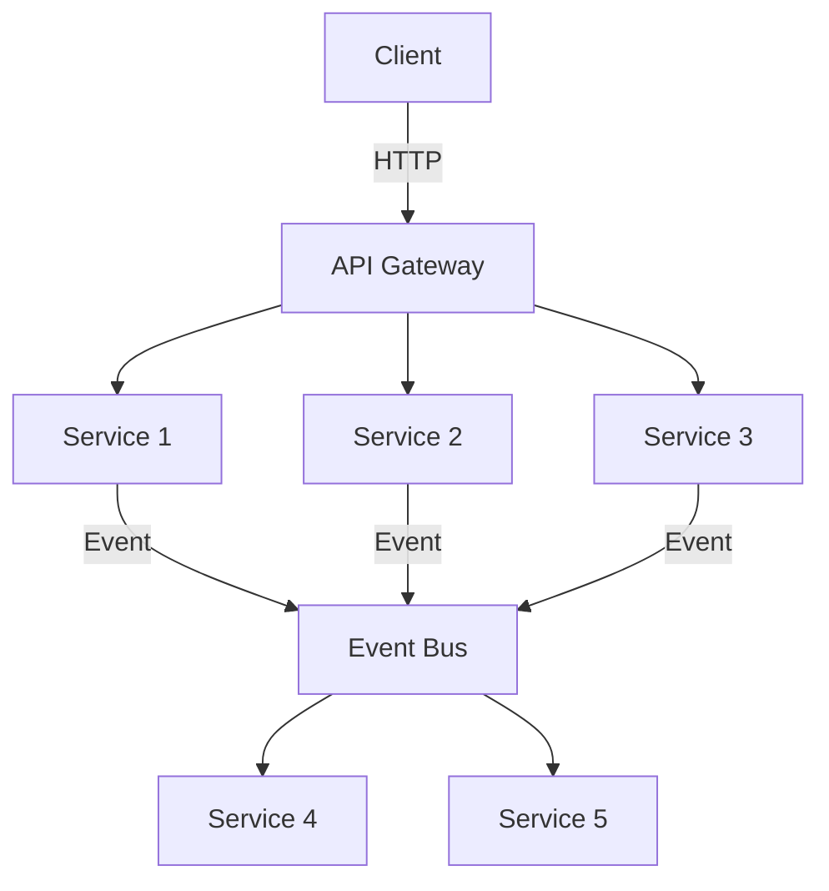
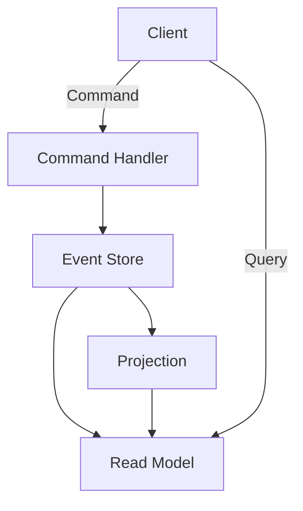
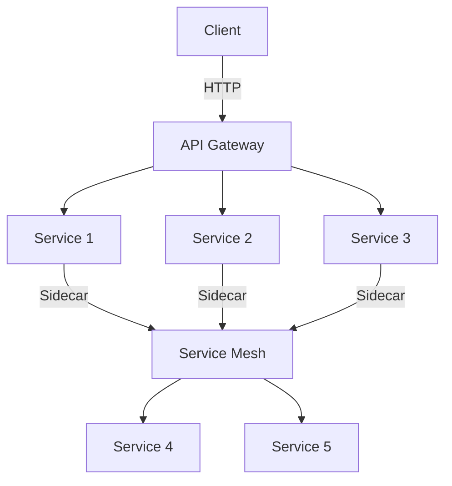
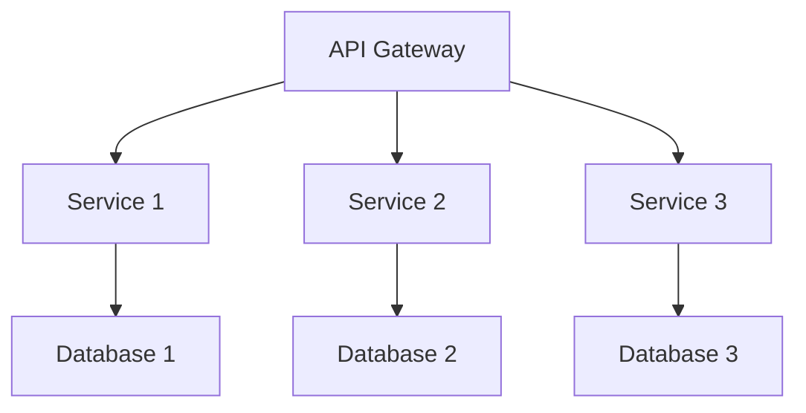
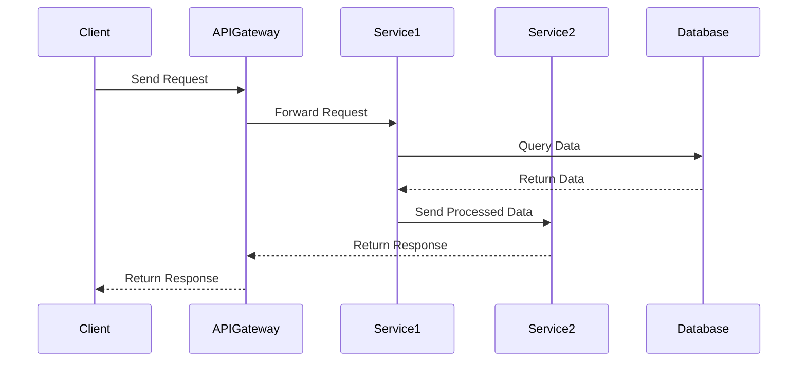
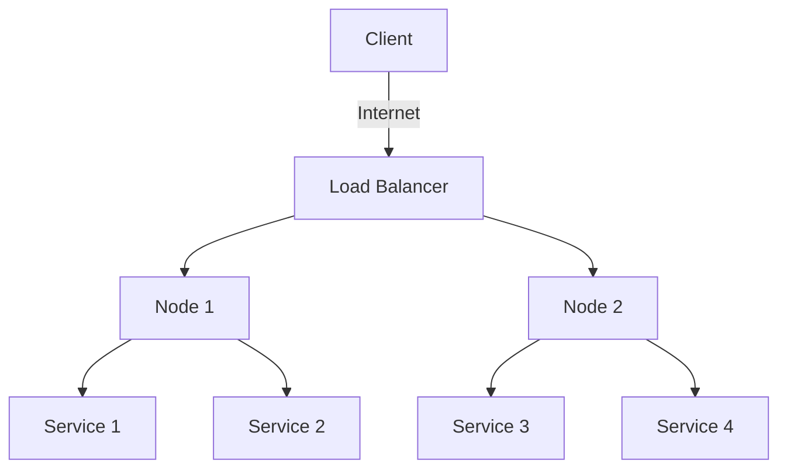

## A.4. Reference Architectures

In the world of software development, microservices architecture has emerged as a powerful paradigm for building scalable, flexible, and maintainable systems. However, designing and implementing microservices can be complex, requiring careful consideration of various architectural patterns and principles. This section provides a comprehensive guide to microservices reference architectures, offering templates, diagrams, and sample code to help you navigate the intricacies of microservices design.

### Introduction to Reference Architectures

Reference architectures serve as blueprints for designing and implementing microservices-based systems. They provide a high-level overview of the system's structure, highlighting key components, interactions, and design patterns. By leveraging reference architectures, developers can accelerate the development process, ensure consistency, and avoid common pitfalls.

#### Key Concepts

- **Modularity**: Microservices are designed as independent, self-contained units that can be developed, deployed, and scaled independently.
- **Scalability**: Microservices architectures are inherently scalable, allowing individual services to be scaled based on demand.
- **Resilience**: By isolating failures within individual services, microservices architectures enhance system resilience.
- **Flexibility**: Microservices enable teams to choose the best technologies and tools for each service, promoting innovation and adaptability.

### Common Microservices Reference Architectures

Let's explore some common microservices reference architectures, each tailored to specific use cases and requirements.

#### 1. Basic Microservices Architecture

The basic microservices architecture is a simple yet effective design pattern for small to medium-sized applications. It consists of a set of loosely coupled services, each responsible for a specific business capability.

**Diagram: Basic Microservices Architecture**



**Key Participants**

- **API Gateway**: Acts as a single entry point for client requests, routing them to the appropriate services.
- **Services**: Independent units responsible for specific business capabilities.
- **Databases**: Each service has its own database, ensuring data encapsulation and independence.

**Sample Code Snippet**

```pseudocode
// API Gateway
function handleRequest(request):
    service = routeToService(request)
    response = service.processRequest(request)
    return response

// Service 1
class Service1:
    function processRequest(request):
        data = queryDatabase(request)
        return processData(data)

// Database Interaction
function queryDatabase(request):
    // Query the database specific to Service 1
    return database.query(request)
```

**Design Considerations**

- **When to Use**: Suitable for small to medium-sized applications with well-defined business capabilities.
- **Considerations**: Ensure proper service boundaries and data encapsulation to avoid tight coupling.

#### 2. Event-Driven Microservices Architecture

The event-driven microservices architecture is ideal for applications that require real-time data processing and asynchronous communication. It leverages events to decouple services and enable reactive interactions.

**Diagram: Event-Driven Microservices Architecture**



**Key Participants**

- **Event Bus**: Facilitates communication between services by publishing and subscribing to events.
- **Services**: React to events and perform actions based on the event data.

**Sample Code Snippet**

```pseudocode
// Event Publisher
class Service1:
    function processRequest(request):
        event = createEvent(request)
        eventBus.publish(event)

// Event Subscriber
class Service4:
    function onEvent(event):
        processEvent(event)

// Event Bus
class EventBus:
    function publish(event):
        // Notify all subscribers
        for subscriber in subscribers:
            subscriber.onEvent(event)
```

**Design Considerations**

- **When to Use**: Ideal for applications requiring real-time data processing and asynchronous communication.
- **Considerations**: Ensure proper event schema design and handling of event ordering and duplication.

#### 3. CQRS and Event Sourcing Architecture

CQRS (Command Query Responsibility Segregation) and Event Sourcing are powerful patterns for building complex, data-intensive applications. This architecture separates the read and write models and captures all changes as a sequence of events.

**Diagram: CQRS and Event Sourcing Architecture**



**Key Participants**

- **Command Handler**: Processes commands and updates the event store.
- **Event Store**: Stores all changes as a sequence of events.
- **Read Model**: Provides a denormalized view of the data for querying.

**Sample Code Snippet**

```pseudocode
// Command Handler
class CommandHandler:
    function handleCommand(command):
        event = createEvent(command)
        eventStore.append(event)

// Event Store
class EventStore:
    function append(event):
        // Append event to the store
        events.append(event)

// Read Model
class ReadModel:
    function query(query):
        // Query the denormalized view
        return denormalizedData.query(query)
```

**Design Considerations**

- **When to Use**: Suitable for complex, data-intensive applications requiring auditability and temporal queries.
- **Considerations**: Ensure proper event schema design and handling of eventual consistency.

#### 4. Service Mesh Architecture

The service mesh architecture is designed for managing service-to-service communication in complex microservices environments. It provides features like load balancing, encryption, and observability.

**Diagram: Service Mesh Architecture**



**Key Participants**

- **Service Mesh**: Manages service-to-service communication, providing features like load balancing and encryption.
- **Sidecar Proxies**: Deployed alongside each service to handle communication.

**Sample Code Snippet**

```pseudocode
// Service Communication
class Service1:
    function callService2():
        response = sidecarProxy.sendRequest(service2Endpoint)
        return response

// Sidecar Proxy
class SidecarProxy:
    function sendRequest(endpoint):
        // Handle communication with the service mesh
        return serviceMesh.sendRequest(endpoint)
```

**Design Considerations**

- **When to Use**: Suitable for complex microservices environments requiring advanced communication features.
- **Considerations**: Ensure proper configuration of sidecar proxies and service mesh components.

### Visualizing Microservices Architectures

Visual aids play a crucial role in understanding microservices architectures. Let's explore some common diagrams used to represent microservices architectures.

#### 1. Component Diagram

A component diagram provides a high-level view of the system's components and their interactions. It highlights the key services, databases, and communication channels.

**Diagram: Component Diagram**



#### 2. Sequence Diagram

A sequence diagram illustrates the flow of messages between services in a specific use case. It helps visualize the interactions and dependencies between services.

**Diagram: Sequence Diagram**



#### 3. Deployment Diagram

A deployment diagram shows the physical deployment of services and infrastructure components. It highlights the distribution of services across different nodes and environments.

**Diagram: Deployment Diagram**



### Sample Code for Common Patterns

Let's explore some sample code snippets for common microservices patterns.

#### 1. API Gateway Pattern

The API Gateway pattern provides a single entry point for client requests, routing them to the appropriate services.

**Sample Code Snippet**

```pseudocode
// API Gateway
class APIGateway:
    function handleRequest(request):
        service = routeToService(request)
        response = service.processRequest(request)
        return response

// Routing Logic
function routeToService(request):
    if request.path == "/service1":
        return Service1()
    elif request.path == "/service2":
        return Service2()
    else:
        return Service3()
```

#### 2. Circuit Breaker Pattern

The Circuit Breaker pattern prevents cascading failures by monitoring service health and breaking the circuit when failures occur.

**Sample Code Snippet**

```pseudocode
// Circuit Breaker
class CircuitBreaker:
    state = "CLOSED"
    failureCount = 0

    function callService(service):
        if state == "OPEN":
            return "Service Unavailable"
        try:
            response = service.call()
            reset()
            return response
        except:
            recordFailure()
            if failureCount > threshold:
                openCircuit()
            return "Service Unavailable"

    function reset():
        state = "CLOSED"
        failureCount = 0

    function recordFailure():
        failureCount += 1

    function openCircuit():
        state = "OPEN"
```

### Try It Yourself

To deepen your understanding of microservices architectures, try modifying the sample code snippets to implement additional features or handle edge cases. Experiment with different configurations and observe how they affect the system's behavior.

### Knowledge Check

- What are the key components of a basic microservices architecture?
- How does the event-driven architecture enhance system resilience?
- What are the benefits of using CQRS and Event Sourcing in data-intensive applications?
- How does the service mesh architecture manage service-to-service communication?

### Conclusion

Microservices reference architectures provide valuable guidance for designing and implementing scalable, flexible, and maintainable systems. By leveraging these architectures, developers can accelerate the development process, ensure consistency, and avoid common pitfalls. Remember, this is just the beginning. As you progress, you'll build more complex and interactive systems. Keep experimenting, stay curious, and enjoy the journey!

## Quiz Time!



### What is a key benefit of using microservices architecture?

- [x] Scalability
- [ ] Monolithic design
- [ ] Tight coupling
- [ ] Single point of failure

> **Explanation:** Microservices architecture enhances scalability by allowing individual services to be scaled independently based on demand.

### Which component acts as a single entry point for client requests in a microservices architecture?

- [x] API Gateway
- [ ] Service Mesh
- [ ] Event Bus
- [ ] Circuit Breaker

> **Explanation:** The API Gateway acts as a single entry point for client requests, routing them to the appropriate services.

### What is the primary purpose of the Event Bus in an event-driven microservices architecture?

- [x] Facilitating communication between services
- [ ] Storing data
- [ ] Managing service-to-service communication
- [ ] Handling failures

> **Explanation:** The Event Bus facilitates communication between services by publishing and subscribing to events.

### In CQRS and Event Sourcing architecture, what does the Read Model provide?

- [x] A denormalized view of the data for querying
- [ ] A sequence of events
- [ ] A command handler
- [ ] A service mesh

> **Explanation:** The Read Model provides a denormalized view of the data for querying, separating it from the write model.

### What is a key feature of the Service Mesh architecture?

- [x] Managing service-to-service communication
- [ ] Acting as a single entry point for client requests
- [ ] Capturing state changes as events
- [ ] Separating read and write models

> **Explanation:** The Service Mesh architecture manages service-to-service communication, providing features like load balancing and encryption.

### Which diagram provides a high-level view of the system's components and their interactions?

- [x] Component Diagram
- [ ] Sequence Diagram
- [ ] Deployment Diagram
- [ ] Class Diagram

> **Explanation:** A Component Diagram provides a high-level view of the system's components and their interactions.

### What does a Sequence Diagram illustrate in microservices architecture?

- [x] The flow of messages between services
- [ ] The physical deployment of services
- [ ] The system's components and their interactions
- [ ] The state changes of a service

> **Explanation:** A Sequence Diagram illustrates the flow of messages between services in a specific use case.

### What is the primary role of the Circuit Breaker pattern?

- [x] Preventing cascading failures
- [ ] Managing service-to-service communication
- [ ] Acting as a single entry point for client requests
- [ ] Capturing state changes as events

> **Explanation:** The Circuit Breaker pattern prevents cascading failures by monitoring service health and breaking the circuit when failures occur.

### What is a key consideration when using the Event-Driven Microservices Architecture?

- [x] Handling event ordering and duplication
- [ ] Ensuring tight coupling between services
- [ ] Using a single database for all services
- [ ] Avoiding asynchronous communication

> **Explanation:** When using the Event-Driven Microservices Architecture, it's important to handle event ordering and duplication to ensure data consistency.

### True or False: Microservices architectures are inherently scalable.

- [x] True
- [ ] False

> **Explanation:** True. Microservices architectures are inherently scalable, allowing individual services to be scaled based on demand.


