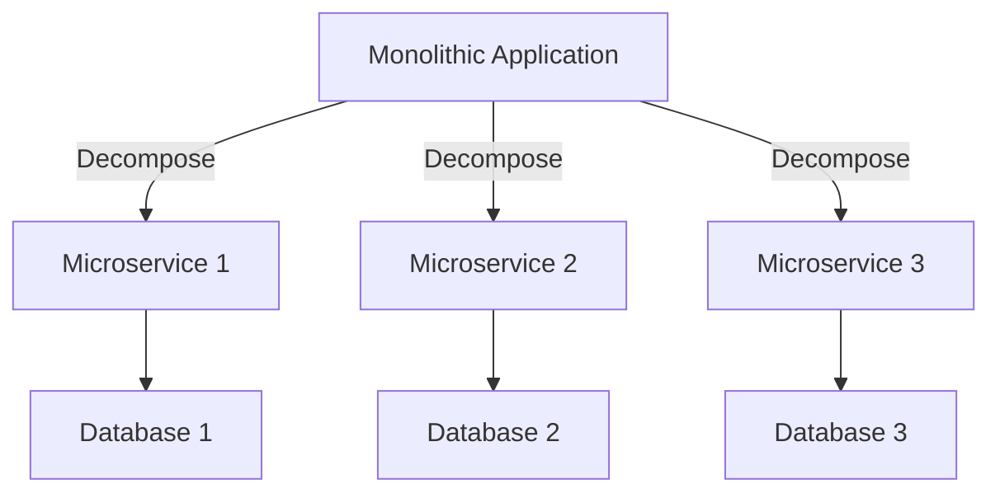
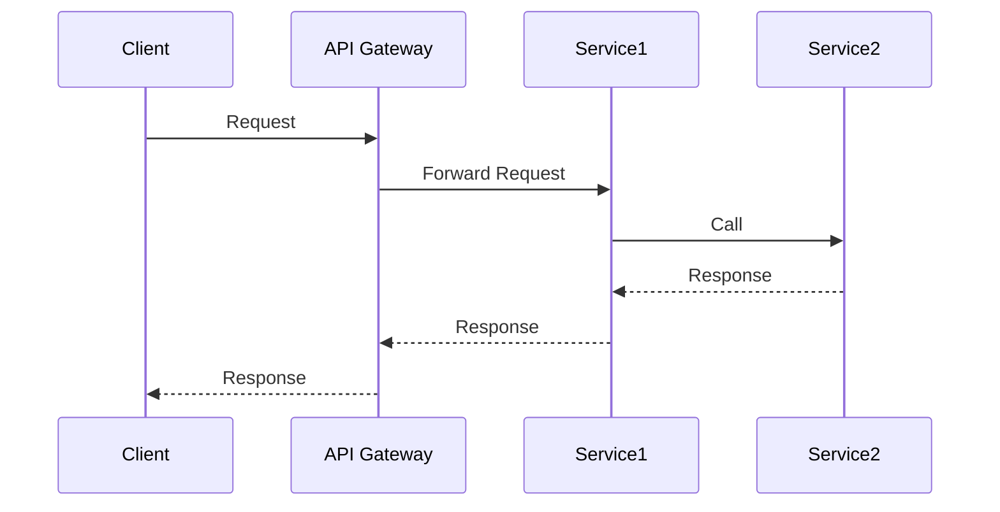
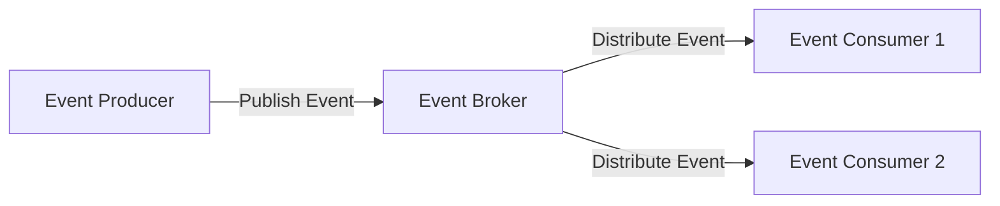

## A.5. Bibliography and Further Reading

In the ever-evolving landscape of software architecture, microservices have emerged as a pivotal paradigm, offering scalability, flexibility, and resilience. To master the art of designing and implementing microservices, it is crucial to delve into a wealth of resources that provide both theoretical insights and practical guidance. This section compiles a comprehensive list of recommended books, articles, online tutorials, and videos that will enhance your understanding of microservices design patterns and architectural principles.

### Recommended Books and Articles

#### Books

1. **"Building Microservices: Designing Fine-Grained Systems" by Sam Newman**
   - **Overview:** This book is a seminal work in the field of microservices, providing a thorough introduction to the principles and practices of building microservices architectures. Newman covers topics such as service decomposition, communication patterns, and deployment strategies, making it an essential read for anyone looking to implement microservices.
   - **Key Takeaways:** Understand the importance of designing services around business capabilities, learn about the trade-offs involved in microservices architecture, and explore real-world examples of successful microservices implementations.

2. **"Microservices Patterns: With Examples in Java" by Chris Richardson**
   - **Overview:** Richardson's book delves into the patterns and best practices for building microservices, with a focus on Java. It covers a wide range of topics, including service decomposition, inter-service communication, and data management patterns.
   - **Key Takeaways:** Gain insights into the challenges of microservices architecture, learn how to apply design patterns to solve common problems, and explore code examples that illustrate key concepts.

3. **"Domain-Driven Design: Tackling Complexity in the Heart of Software" by Eric Evans**
   - **Overview:** While not exclusively about microservices, this book is a foundational text for understanding domain-driven design (DDD), which is a crucial approach for defining service boundaries in microservices architectures.
   - **Key Takeaways:** Learn how to model complex domains, understand the importance of ubiquitous language, and explore the concept of bounded contexts.

4. **"The Art of Scalability: Scalable Web Architecture, Processes, and Organizations for the Modern Enterprise" by Martin L. Abbott and Michael T. Fisher**
   - **Overview:** This book provides a comprehensive guide to building scalable systems, with a focus on both technical and organizational aspects. It covers topics such as scaling teams, processes, and architectures, making it relevant for microservices practitioners.
   - **Key Takeaways:** Understand the principles of scalability, learn how to design systems that can handle increased load, and explore case studies of successful scalable architectures.

5. **"Designing Data-Intensive Applications: The Big Ideas Behind Reliable, Scalable, and Maintainable Systems" by Martin Kleppmann**
   - **Overview:** Kleppmann's book explores the principles of designing data-intensive applications, with a focus on reliability, scalability, and maintainability. It covers topics such as data modeling, storage, and processing, making it relevant for microservices architectures.
   - **Key Takeaways:** Learn about the trade-offs involved in data management, understand the importance of consistency and availability, and explore patterns for building robust data systems.

#### Articles

1. **"Microservices: A Definition of This New Architectural Term" by James Lewis and Martin Fowler**
   - **Overview:** This article provides a concise definition of microservices architecture, exploring its key characteristics and benefits. It is a great starting point for anyone new to the concept of microservices.
   - **Key Takeaways:** Understand the core principles of microservices, learn about the benefits and challenges of this architectural style, and explore examples of successful microservices implementations.

2. **"The Twelve-Factor App" by Heroku**
   - **Overview:** This article outlines a set of best practices for building modern, cloud-native applications, which are highly relevant for microservices architectures. It covers topics such as codebase management, configuration, and scaling.
   - **Key Takeaways:** Learn how to build applications that are easy to deploy and scale, understand the importance of separating configuration from code, and explore strategies for managing dependencies.

3. **"Microservices vs. Service-Oriented Architecture" by Mark Richards**
   - **Overview:** This article explores the differences between microservices and service-oriented architecture (SOA), highlighting the key distinctions and similarities between the two approaches.
   - **Key Takeaways:** Understand the evolution of service-oriented architectures, learn about the benefits and challenges of each approach, and explore real-world examples of successful implementations.

4. **"The Reactive Manifesto" by Jonas Bonér, Dave Farley, Roland Kuhn, and Martin Thompson**
   - **Overview:** This manifesto outlines the principles of reactive systems, which are highly relevant for building resilient and scalable microservices architectures. It covers topics such as responsiveness, resilience, and elasticity.
   - **Key Takeaways:** Learn about the principles of reactive systems, understand the importance of building systems that can respond to changes in demand, and explore strategies for achieving resilience and scalability.

5. **"The CAP Theorem" by Eric Brewer**
   - **Overview:** This article explores the CAP theorem, which is a fundamental concept in distributed systems design. It covers the trade-offs between consistency, availability, and partition tolerance, making it relevant for microservices architectures.
   - **Key Takeaways:** Understand the implications of the CAP theorem for distributed systems, learn about the trade-offs involved in achieving consistency and availability, and explore strategies for managing partition tolerance.

### Online Tutorials and Videos

#### Tutorials

1. **"Microservices with Spring Boot and Spring Cloud" by Java Brains**
   - **Overview:** This tutorial series provides a comprehensive introduction to building microservices with Spring Boot and Spring Cloud. It covers topics such as service discovery, configuration management, and circuit breakers.
   - **Key Takeaways:** Learn how to build microservices using popular Java frameworks, understand the importance of service discovery and configuration management, and explore strategies for achieving resilience and scalability.

2. **"Building Microservices with Node.js" by Academind**
   - **Overview:** This tutorial series explores the process of building microservices with Node.js, covering topics such as service decomposition, inter-service communication, and data management.
   - **Key Takeaways:** Gain insights into the challenges of building microservices with Node.js, learn how to apply design patterns to solve common problems, and explore code examples that illustrate key concepts.

3. **"Microservices Architecture on AWS" by AWS Training and Certification**
   - **Overview:** This tutorial series provides an introduction to building microservices architectures on AWS, covering topics such as containerization, orchestration, and monitoring.
   - **Key Takeaways:** Learn how to leverage AWS services to build scalable and resilient microservices architectures, understand the importance of containerization and orchestration, and explore strategies for monitoring and managing microservices.

4. **"Introduction to Kubernetes" by Kubernetes.io**
   - **Overview:** This tutorial series provides a comprehensive introduction to Kubernetes, covering topics such as container orchestration, scaling, and deployment strategies.
   - **Key Takeaways:** Learn how to use Kubernetes to manage containerized applications, understand the importance of orchestration and scaling, and explore strategies for deploying and managing microservices.

5. **"Event-Driven Microservices with Kafka" by Confluent**
   - **Overview:** This tutorial series explores the process of building event-driven microservices with Kafka, covering topics such as event sourcing, stream processing, and data integration.
   - **Key Takeaways:** Learn how to build event-driven microservices using Kafka, understand the importance of event sourcing and stream processing, and explore strategies for integrating data across microservices.

#### Videos

1. **"Microservices: The Journey So Far and the Road Ahead" by Martin Fowler**
   - **Overview:** In this video, Martin Fowler explores the evolution of microservices architecture, highlighting the key trends and challenges facing the industry today.
   - **Key Takeaways:** Understand the history and evolution of microservices, learn about the benefits and challenges of this architectural style, and explore the future of microservices architecture.

2. **"The Art of Microservices" by Sam Newman**
   - **Overview:** In this video, Sam Newman provides an overview of the principles and practices of building microservices architectures, with a focus on service decomposition and communication patterns.
   - **Key Takeaways:** Learn how to design microservices architectures that are scalable and resilient, understand the importance of service decomposition and communication patterns, and explore real-world examples of successful implementations.

3. **"Building Scalable Microservices with Kubernetes" by Kelsey Hightower**
   - **Overview:** In this video, Kelsey Hightower explores the process of building scalable microservices with Kubernetes, covering topics such as container orchestration, scaling, and deployment strategies.
   - **Key Takeaways:** Learn how to use Kubernetes to manage containerized applications, understand the importance of orchestration and scaling, and explore strategies for deploying and managing microservices.

4. **"Event-Driven Microservices: Patterns and Best Practices" by Ben Stopford**
   - **Overview:** In this video, Ben Stopford explores the patterns and best practices for building event-driven microservices, with a focus on Kafka and stream processing.
   - **Key Takeaways:** Learn how to build event-driven microservices using Kafka, understand the importance of event sourcing and stream processing, and explore strategies for integrating data across microservices.

5. **"Microservices Security: Challenges and Solutions" by Prabath Siriwardena**
   - **Overview:** In this video, Prabath Siriwardena explores the challenges and solutions for securing microservices architectures, covering topics such as authentication, authorization, and data protection.
   - **Key Takeaways:** Learn about the security challenges facing microservices architectures, understand the importance of authentication and authorization, and explore strategies for protecting data in microservices environments.

### Visualizing Microservices Concepts

To enhance your understanding of microservices design patterns and architectural principles, it is beneficial to visualize complex concepts using diagrams and charts. Below are some examples of how to represent key microservices concepts using Hugo-compatible Mermaid.js diagrams.

#### Visualizing Service Decomposition

**Description:** This diagram illustrates the process of decomposing a monolithic application into multiple microservices, each with its own database.

#### Visualizing Inter-Service Communication

**Description:** This sequence diagram demonstrates the flow of communication between a client, an API gateway, and two microservices.

#### Visualizing Event-Driven Architecture

**Description:** This diagram represents an event-driven architecture where an event producer publishes events to an event broker, which then distributes them to multiple event consumers.

### References and Links

To further deepen your understanding of microservices design patterns and architectural principles, consider exploring the following external resources:

- [Microservices.io](https://microservices.io/): A comprehensive resource on microservices architecture, including patterns, principles, and best practices.
- [Martin Fowler's Blog](https://martinfowler.com/): A wealth of articles and insights on software architecture, including microservices.
- [AWS Microservices](https://aws.amazon.com/microservices/): Explore AWS's resources and services for building microservices architectures.
- [Spring Cloud](https://spring.io/projects/spring-cloud): Learn about Spring Cloud's tools and frameworks for building microservices with Java.
- [Kubernetes Documentation](https://kubernetes.io/docs/): Official documentation for Kubernetes, a powerful tool for managing containerized applications.

### Knowledge Check

To reinforce your understanding of microservices design patterns and architectural principles, consider the following questions and challenges:

1. **Explain the key differences between monolithic and microservices architectures.**
2. **Describe the benefits and challenges of using an API gateway in a microservices architecture.**
3. **Provide an example of a real-world application that successfully implemented microservices.**
4. **Discuss the importance of service decomposition in microservices architecture.**
5. **Explain the role of event-driven architecture in building scalable microservices.**

### Embrace the Journey

Remember, mastering microservices design patterns and architectural principles is a journey that requires continuous learning and practice. As you explore the resources and concepts outlined in this section, keep experimenting, stay curious, and enjoy the process of building scalable and resilient software systems.

## Quiz Time!



### What is the primary benefit of using microservices architecture?

- [x] Scalability and flexibility
- [ ] Simplicity and ease of development
- [ ] Reduced operational overhead
- [ ] Centralized data management

> **Explanation:** Microservices architecture offers scalability and flexibility by allowing independent deployment and scaling of services.

### Which book is considered a foundational text for understanding domain-driven design?

- [x] "Domain-Driven Design: Tackling Complexity in the Heart of Software" by Eric Evans
- [ ] "Building Microservices: Designing Fine-Grained Systems" by Sam Newman
- [ ] "Microservices Patterns: With Examples in Java" by Chris Richardson
- [ ] "The Art of Scalability" by Martin L. Abbott and Michael T. Fisher

> **Explanation:** Eric Evans' book is a foundational text for understanding domain-driven design, which is crucial for defining service boundaries in microservices.

### What is the purpose of an API gateway in a microservices architecture?

- [x] To manage client interactions and route requests to appropriate services
- [ ] To store data for all microservices
- [ ] To handle authentication and authorization for all services
- [ ] To provide a user interface for microservices

> **Explanation:** An API gateway manages client interactions and routes requests to the appropriate microservices, often handling cross-cutting concerns like authentication.

### Which of the following is a key principle of reactive systems?

- [x] Responsiveness
- [ ] Centralization
- [ ] Monolithic design
- [ ] Synchronous communication

> **Explanation:** Responsiveness is a key principle of reactive systems, which are designed to handle changes in demand and maintain performance.

### What does the CAP theorem address in distributed systems?

- [x] Consistency, availability, and partition tolerance
- [ ] Scalability, flexibility, and simplicity
- [ ] Security, performance, and reliability
- [ ] Data integrity, redundancy, and efficiency

> **Explanation:** The CAP theorem addresses the trade-offs between consistency, availability, and partition tolerance in distributed systems.

### Which tool is commonly used for container orchestration in microservices architectures?

- [x] Kubernetes
- [ ] Docker
- [ ] Jenkins
- [ ] Terraform

> **Explanation:** Kubernetes is a popular tool for container orchestration, managing the deployment, scaling, and operation of containerized applications.

### What is the main advantage of using event-driven architecture in microservices?

- [x] Decoupling services and enabling asynchronous communication
- [ ] Simplifying data management
- [ ] Centralizing service logic
- [ ] Reducing the need for service discovery

> **Explanation:** Event-driven architecture decouples services and enables asynchronous communication, allowing for more scalable and resilient systems.

### Which of the following is a common challenge in microservices architecture?

- [x] Data consistency
- [ ] Centralized control
- [ ] Simplified deployment
- [ ] Reduced complexity

> **Explanation:** Data consistency is a common challenge in microservices architecture due to the distributed nature of services and databases.

### What is the role of a message broker in microservices?

- [x] To facilitate asynchronous communication between services
- [ ] To store data for all microservices
- [ ] To provide a user interface for microservices
- [ ] To manage service discovery

> **Explanation:** A message broker facilitates asynchronous communication between services, often using patterns like publish-subscribe or message queues.

### True or False: Microservices architecture is always the best choice for every application.

- [x] False
- [ ] True

> **Explanation:** Microservices architecture is not always the best choice for every application. It is important to assess organizational readiness and application needs before adopting this approach.


