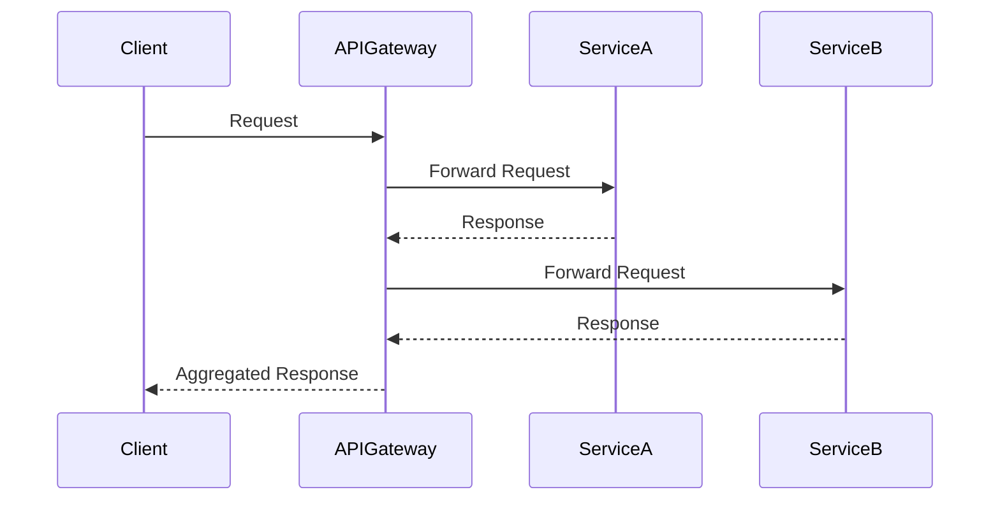
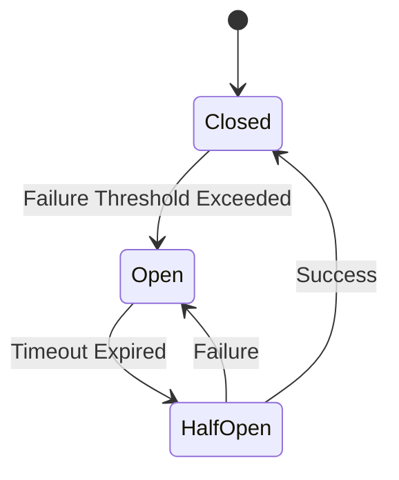

## A.7. Common Interview Questions

In the competitive world of software development, mastering microservices architecture is a valuable skill. As organizations increasingly adopt microservices for their scalability and flexibility, understanding the design patterns and architectural principles that underpin this approach becomes crucial. This guide aims to equip you with the knowledge and confidence to tackle common interview questions related to microservices, offering sample questions, model answers, and insights into what employers seek in candidates.

### Preparing for Technical Interviews

Technical interviews often test not only your knowledge of microservices but also your ability to apply that knowledge in real-world scenarios. Here, we will explore a range of questions that you might encounter, along with strategies for answering them effectively.

#### Sample Questions and Model Answers

**1. What are Microservices, and how do they differ from Monolithic Architecture?**

**Model Answer:**  
Microservices are a software architectural style that structures an application as a collection of loosely coupled services, each implementing a specific business capability. Unlike monolithic architecture, where all components are tightly integrated into a single application, microservices allow for independent deployment, scaling, and development of services. This decoupling enhances flexibility and scalability but introduces complexity in terms of service communication and data management.

**2. Explain the Single Responsibility Principle in the context of Microservices.**

**Model Answer:**  
The Single Responsibility Principle (SRP) in microservices dictates that each service should have a single responsibility or function. This principle ensures that services are focused and cohesive, making them easier to maintain and scale. By adhering to SRP, teams can develop, test, and deploy services independently, reducing the risk of changes affecting unrelated functionalities.

**3. How do you handle data consistency in a microservices architecture?**

**Model Answer:**  
Data consistency in microservices can be challenging due to the distributed nature of services. Techniques such as eventual consistency, the Saga pattern, and event sourcing are commonly used. Eventual consistency allows services to update asynchronously, while the Saga pattern manages distributed transactions through a series of compensating actions. Event sourcing captures state changes as events, enabling reconstruction of the application state.

**4. Describe the API Gateway pattern and its role in microservices.**

**Model Answer:**  
An API Gateway acts as a single entry point for client requests in a microservices architecture. It handles tasks such as request routing, authentication, rate limiting, and protocol translation. By centralizing these functions, the API Gateway simplifies client interactions and reduces the complexity of managing multiple service endpoints.

**5. What is the Circuit Breaker pattern, and why is it important?**

**Model Answer:**  
The Circuit Breaker pattern is a design pattern used to prevent cascading failures in a microservices architecture. It monitors service calls and, upon detecting failures, opens the circuit to stop further calls to the failing service. This allows the system to recover and maintain overall stability. The pattern includes states such as closed, open, and half-open to manage the flow of requests.

**6. How do you ensure security in a microservices architecture?**

**Model Answer:**  
Security in microservices involves multiple layers, including authentication, authorization, and encryption. Implementing OAuth2 and OpenID Connect for identity management, using mutual TLS for service-to-service communication, and encrypting data at rest are essential practices. Additionally, threat modeling and continuous monitoring help identify and mitigate vulnerabilities.

**7. What are the benefits and challenges of using containers in microservices?**

**Model Answer:**  
Containers provide a lightweight and consistent environment for deploying microservices, enabling easy scaling and isolation. They facilitate continuous integration and deployment (CI/CD) by ensuring that services run consistently across different environments. However, managing container orchestration and ensuring security across multiple containers can be challenging.

**8. Explain the concept of eventual consistency and its applicability in microservices.**

**Model Answer:**  
Eventual consistency is a consistency model used in distributed systems where updates to a database are propagated asynchronously. In microservices, this model is applicable when immediate consistency is not required, allowing services to operate independently and update their state over time. This approach improves system availability and performance but requires careful handling of stale data and conflict resolution.

**9. How do you implement service discovery in a microservices architecture?**

**Model Answer:**  
Service discovery is the process of automatically detecting and locating service instances in a microservices architecture. It can be implemented using tools like Consul, Eureka, or Kubernetes, which maintain a registry of available services and their locations. Clients can query this registry to find and connect to the appropriate service instances dynamically.

**10. What is the role of DevOps in microservices, and how does it support continuous delivery?**

**Model Answer:**  
DevOps plays a crucial role in microservices by fostering a culture of collaboration between development and operations teams. It supports continuous delivery through practices such as infrastructure as code, automated testing, and deployment pipelines. These practices enable frequent and reliable releases, allowing teams to respond quickly to changes and deliver value to users.

### Insights into Industry Expectations

Employers seek candidates who not only understand microservices architecture but can also demonstrate practical experience and problem-solving skills. Here are some key attributes that organizations look for:

- **Technical Proficiency:** A strong grasp of microservices design patterns, principles, and tools is essential. Candidates should be able to articulate the benefits and challenges of microservices and provide examples of their application.

- **Problem-Solving Skills:** Employers value candidates who can analyze complex problems, propose effective solutions, and adapt to changing requirements. Demonstrating experience with real-world scenarios and challenges is crucial.

- **Collaboration and Communication:** Microservices development often involves cross-functional teams. Effective communication and collaboration skills are vital for working with diverse stakeholders and ensuring alignment on goals and priorities.

- **Continuous Learning:** The field of microservices is constantly evolving. Employers appreciate candidates who stay current with emerging trends, tools, and best practices, and who are committed to continuous learning and improvement.

- **Cultural Fit:** Organizations look for candidates who align with their values and culture. Demonstrating a willingness to embrace new ideas, take initiative, and contribute to a positive team environment is important.

### Try It Yourself

To deepen your understanding of microservices, consider experimenting with the following exercises:

- **Design a Microservices Architecture:** Create a simple application using microservices. Identify the services, define their responsibilities, and implement communication patterns such as RESTful APIs or message queues.

- **Implement a Circuit Breaker:** Develop a service that uses the Circuit Breaker pattern to handle failures. Test the service under different conditions to observe how the circuit breaker responds.

- **Explore Event Sourcing:** Build a small application that uses event sourcing to manage state changes. Experiment with querying the event store to reconstruct the application state.

- **Set Up a CI/CD Pipeline:** Configure a continuous integration and deployment pipeline for a microservices application. Automate the build, test, and deployment processes to streamline releases.

### Visualizing Microservices Concepts

To aid your understanding, let's visualize some key microservices concepts using Mermaid.js diagrams.

#### Visualizing Service Communication

**Description:** This sequence diagram illustrates how a client interacts with multiple services through an API Gateway, highlighting the flow of requests and responses.

#### Visualizing the Circuit Breaker Pattern

**Description:** This state diagram represents the Circuit Breaker pattern, showing the transitions between closed, open, and half-open states based on service call outcomes.

### Knowledge Check

To reinforce your learning, consider these questions:

- How would you design a microservices architecture for a large-scale e-commerce platform?
- What strategies would you use to ensure data consistency across distributed services?
- How can you optimize the performance of a microservices application?

### Embrace the Journey

Remember, mastering microservices is a journey. As you progress, you'll encounter new challenges and opportunities to apply your skills. Stay curious, keep experimenting, and enjoy the process of continuous learning and growth.

## Quiz Time!



### What is the primary benefit of using microservices over a monolithic architecture?

- [x] Scalability and flexibility
- [ ] Simplicity and ease of deployment
- [ ] Reduced development time
- [ ] Lower operational costs

> **Explanation:** Microservices offer scalability and flexibility by allowing independent deployment and scaling of services, unlike monolithic architectures.

### Which pattern is used to manage distributed transactions in microservices?

- [ ] API Gateway
- [ ] Circuit Breaker
- [x] Saga
- [ ] Service Mesh

> **Explanation:** The Saga pattern is used to manage distributed transactions by coordinating a series of compensating actions across services.

### What is the role of an API Gateway in a microservices architecture?

- [x] Centralized entry point for client requests
- [ ] Data storage management
- [ ] Service-to-service communication
- [ ] Monitoring and logging

> **Explanation:** An API Gateway acts as a centralized entry point for client requests, handling tasks like routing, authentication, and protocol translation.

### How does the Circuit Breaker pattern enhance system stability?

- [x] By preventing cascading failures
- [ ] By improving data consistency
- [ ] By reducing latency
- [ ] By simplifying service communication

> **Explanation:** The Circuit Breaker pattern enhances system stability by preventing cascading failures when a service becomes unresponsive.

### What is eventual consistency in microservices?

- [x] A consistency model where updates are propagated asynchronously
- [ ] A method for immediate data synchronization
- [ ] A technique for reducing latency
- [ ] A strategy for load balancing

> **Explanation:** Eventual consistency is a model where updates are propagated asynchronously, allowing services to operate independently.

### Which tool is commonly used for service discovery in microservices?

- [ ] Docker
- [ ] Jenkins
- [x] Consul
- [ ] Grafana

> **Explanation:** Consul is a tool commonly used for service discovery, maintaining a registry of available services and their locations.

### What is the primary challenge of using containers in microservices?

- [ ] Lack of scalability
- [x] Managing container orchestration
- [ ] Inconsistent environments
- [ ] Limited security features

> **Explanation:** Managing container orchestration and ensuring security across multiple containers are primary challenges in microservices.

### How does DevOps support continuous delivery in microservices?

- [x] By automating testing and deployment pipelines
- [ ] By reducing the need for collaboration
- [ ] By simplifying service communication
- [ ] By eliminating the need for infrastructure management

> **Explanation:** DevOps supports continuous delivery by automating testing and deployment pipelines, enabling frequent and reliable releases.

### What is the purpose of using OAuth2 in microservices?

- [x] To manage identity and access control
- [ ] To improve data consistency
- [ ] To enhance service communication
- [ ] To reduce latency

> **Explanation:** OAuth2 is used in microservices to manage identity and access control, providing secure authentication and authorization.

### True or False: Microservices architecture is always the best choice for every application.

- [ ] True
- [x] False

> **Explanation:** False. Microservices architecture is not always the best choice; it depends on the application's requirements, complexity, and scalability needs.



---

This comprehensive guide to common microservices interview questions aims to prepare you for success in your technical interviews. By understanding the core concepts, design patterns, and industry expectations, you'll be well-equipped to demonstrate your expertise and secure your next role in the exciting field of microservices architecture.
