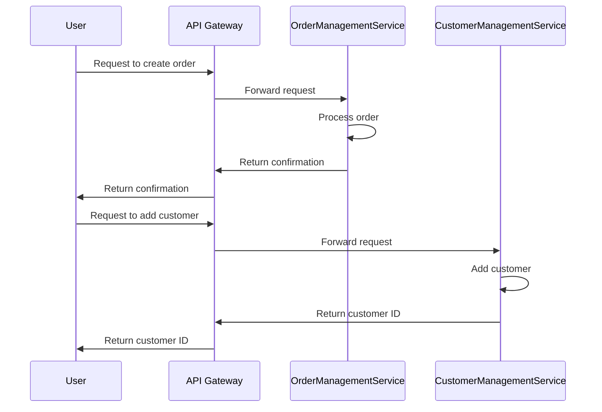

## 2.1. Service Decomposition Strategies

In the realm of microservices architecture, service decomposition is a fundamental concept that dictates how we break down a monolithic application into smaller, manageable, and independently deployable services. This section delves into various strategies for decomposing services, including decomposition by business capability, subdomain (using Domain-Driven Design), and the Strangler Fig pattern. Each strategy is accompanied by pseudocode examples to illustrate the concepts.

### Decompose by Business Capability

**Intent:** Align services with distinct business functions to ensure that each service encapsulates a specific business capability.

**Key Participants:**
- Business Analysts
- Software Architects
- Development Teams

**Applicability:** Use this strategy when you want to ensure that your microservices architecture reflects the organizational structure and business processes.

**Design Considerations:** 
- Identify core business capabilities.
- Ensure each service has a single responsibility.
- Avoid overlapping responsibilities between services.

#### Understanding Business Capabilities

Business capabilities represent the core functions that a business performs to achieve its objectives. By aligning microservices with these capabilities, we create a system that mirrors the business structure, making it easier to manage and evolve.

#### Steps to Decompose by Business Capability

1. **Identify Business Capabilities:** Work with business stakeholders to identify the key capabilities that drive the organization.
2. **Define Service Boundaries:** Establish clear boundaries for each service based on these capabilities.
3. **Design APIs:** Create APIs that expose the functionality of each service.
4. **Implement Services:** Develop the services, ensuring they are independent and loosely coupled.

#### Pseudocode Example

```pseudocode
// Define a service for the "Order Management" capability
service OrderManagementService {
    // API to create a new order
    function createOrder(orderDetails) {
        // Validate order details
        validate(orderDetails)
        // Save order to database
        saveToDatabase(orderDetails)
        // Return confirmation
        return confirmation
    }

    // API to update an existing order
    function updateOrder(orderId, updatedDetails) {
        // Fetch order from database
        order = fetchFromDatabase(orderId)
        // Update order details
        order.update(updatedDetails)
        // Save changes
        saveToDatabase(order)
        // Return updated order
        return order
    }
}
```

### Decompose by Subdomain (Domain-Driven Design)

**Intent:** Use Domain-Driven Design (DDD) to inform service boundaries by aligning them with subdomains within the business domain.

**Key Participants:**
- Domain Experts
- Software Architects
- Development Teams

**Applicability:** Ideal for complex domains where understanding and modeling the domain is crucial for success.

**Design Considerations:**
- Identify subdomains and bounded contexts.
- Use ubiquitous language to ensure clear communication.
- Define aggregates and entities within each subdomain.

#### Domain-Driven Design Concepts

Domain-Driven Design emphasizes the importance of understanding the business domain and using that understanding to inform the design of the software. It introduces concepts such as subdomains, bounded contexts, and ubiquitous language.

#### Steps to Decompose by Subdomain

1. **Identify Subdomains:** Break down the business domain into smaller, more manageable subdomains.
2. **Define Bounded Contexts:** Establish clear boundaries for each subdomain.
3. **Model the Domain:** Use domain models to represent the business logic within each subdomain.
4. **Design Services:** Create services that encapsulate the functionality of each subdomain.

#### Pseudocode Example

```pseudocode
// Define a service for the "Customer Management" subdomain
service CustomerManagementService {
    // API to add a new customer
    function addCustomer(customerDetails) {
        // Validate customer details
        validate(customerDetails)
        // Create customer entity
        customer = new Customer(customerDetails)
        // Save customer to database
        saveToDatabase(customer)
        // Return customer ID
        return customer.id
    }

    // API to retrieve customer information
    function getCustomer(customerId) {
        // Fetch customer from database
        customer = fetchFromDatabase(customerId)
        // Return customer details
        return customer.details
    }
}
```

### Strangler Fig Pattern

**Intent:** Incrementally migrate from a monolithic architecture to microservices by gradually replacing parts of the monolith with new services.

**Key Participants:**
- Software Architects
- Development Teams
- Operations Teams

**Applicability:** Use this pattern when you need to migrate an existing monolithic application to a microservices architecture without disrupting the entire system.

**Design Considerations:**
- Identify components to be replaced.
- Implement new services alongside the monolith.
- Gradually route traffic to new services.

#### Understanding the Strangler Fig Pattern

The Strangler Fig pattern is inspired by the way a strangler fig plant grows around a tree, eventually replacing it. Similarly, this pattern involves incrementally replacing parts of a monolithic application with microservices until the monolith is completely replaced.

#### Steps to Implement the Strangler Fig Pattern

1. **Identify Components:** Determine which parts of the monolith can be replaced with microservices.
2. **Develop New Services:** Implement new services that replicate the functionality of the identified components.
3. **Route Traffic:** Gradually route traffic from the monolith to the new services.
4. **Decommission Monolith:** Once all components are replaced, decommission the monolith.

#### Pseudocode Example

```pseudocode
// Monolith function to be replaced
function processOrder(orderDetails) {
    // Existing monolith logic
    // ...
}

// New microservice for order processing
service OrderProcessingService {
    // API to process order
    function processOrder(orderDetails) {
        // New service logic
        validate(orderDetails)
        processPayment(orderDetails)
        updateInventory(orderDetails)
        // Return confirmation
        return confirmation
    }
}

// Routing logic
function routeOrderProcessing(orderDetails) {
    if (useNewService) {
        // Route to new microservice
        return OrderProcessingService.processOrder(orderDetails)
    } else {
        // Use existing monolith
        return processOrder(orderDetails)
    }
}
```

### Visualizing Service Decomposition

To better understand how these strategies work, let's visualize the decomposition process using a sequence diagram.



### Try It Yourself

Now that we've explored these strategies, try implementing them in your own projects. Consider the following modifications:

- **Experiment with Different Boundaries:** Try decomposing services by different criteria, such as technical capabilities or user roles.
- **Implement Additional APIs:** Add more APIs to the services to handle different operations.
- **Simulate Traffic Routing:** Create a simple routing mechanism to switch between monolith and microservices.

### Knowledge Check

Before we move on, let's summarize the key takeaways:

- **Business Capability Decomposition:** Aligns services with business functions, ensuring each service has a single responsibility.
- **Subdomain Decomposition (DDD):** Uses Domain-Driven Design to inform service boundaries, focusing on subdomains and bounded contexts.
- **Strangler Fig Pattern:** Facilitates incremental migration from monoliths to microservices, minimizing disruption.

### Embrace the Journey

Remember, service decomposition is an iterative process. As you gain more insights into your domain and business needs, you may need to adjust your service boundaries. Keep experimenting, stay curious, and enjoy the journey of building robust microservices architectures.

## Quiz Time!



### What is the primary goal of decomposing services by business capability?

- [x] To align services with distinct business functions
- [ ] To reduce the number of services
- [ ] To increase the complexity of the system
- [ ] To ensure all services use the same technology stack

> **Explanation:** Decomposing by business capability ensures that each service encapsulates a specific business function, aligning the architecture with the organizational structure.

### Which concept is central to Domain-Driven Design?

- [x] Bounded Contexts
- [ ] Centralized Databases
- [ ] Monolithic Architecture
- [ ] Synchronous Communication

> **Explanation:** Bounded contexts are a core concept in Domain-Driven Design, helping to define clear boundaries for each subdomain.

### What is the Strangler Fig pattern inspired by?

- [x] The growth of a strangler fig plant
- [ ] The lifecycle of a butterfly
- [ ] The migration of birds
- [ ] The construction of a skyscraper

> **Explanation:** The Strangler Fig pattern is inspired by the way a strangler fig plant grows around a tree, eventually replacing it.

### What is a key benefit of using the Strangler Fig pattern?

- [x] Incremental migration from monoliths to microservices
- [ ] Immediate replacement of the entire system
- [ ] Centralized control over all services
- [ ] Increased complexity of the system

> **Explanation:** The Strangler Fig pattern allows for incremental migration, minimizing disruption to the existing system.

### In the pseudocode example for business capability decomposition, what is the purpose of the `createOrder` function?

- [x] To create a new order and return confirmation
- [ ] To delete an existing order
- [ ] To update customer details
- [ ] To process payments

> **Explanation:** The `createOrder` function is responsible for creating a new order and returning confirmation.

### What is the role of the API Gateway in the sequence diagram?

- [x] To forward requests to the appropriate service
- [ ] To store data in a centralized database
- [ ] To perform all business logic
- [ ] To manage user authentication

> **Explanation:** The API Gateway forwards requests to the appropriate service, acting as an intermediary between the user and the services.

### How does the Strangler Fig pattern handle traffic routing?

- [x] By gradually routing traffic from the monolith to new services
- [ ] By immediately switching all traffic to new services
- [ ] By maintaining all traffic within the monolith
- [ ] By using a centralized database for routing

> **Explanation:** The Strangler Fig pattern gradually routes traffic from the monolith to new services, allowing for a smooth transition.

### What is a key challenge when decomposing services by subdomain?

- [x] Defining clear boundaries for each subdomain
- [ ] Ensuring all services use the same programming language
- [ ] Centralizing all data storage
- [ ] Increasing the number of services

> **Explanation:** Defining clear boundaries for each subdomain is crucial to ensure that services are well-defined and manageable.

### Which strategy is best suited for complex domains?

- [x] Decomposition by Subdomain (DDD)
- [ ] Decomposition by Technology Stack
- [ ] Decomposition by User Interface
- [ ] Decomposition by Database Schema

> **Explanation:** Decomposition by Subdomain (DDD) is ideal for complex domains where understanding and modeling the domain is crucial.

### True or False: The Strangler Fig pattern requires immediate decommissioning of the monolith.

- [ ] True
- [x] False

> **Explanation:** The Strangler Fig pattern allows for gradual decommissioning of the monolith, ensuring a smooth transition to microservices.


