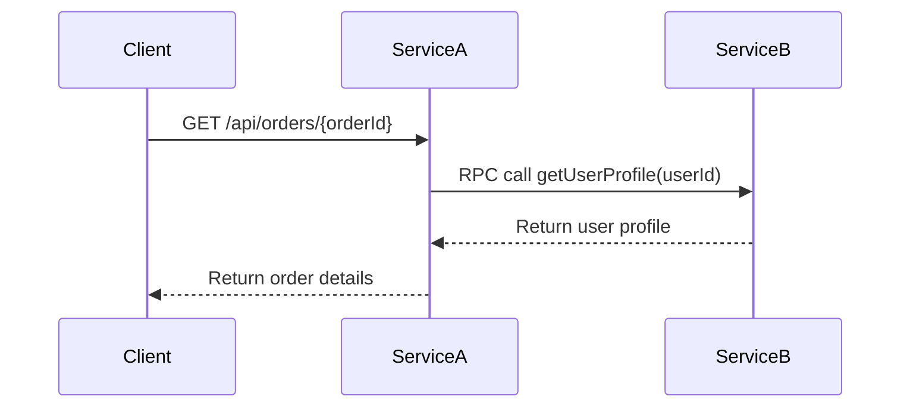
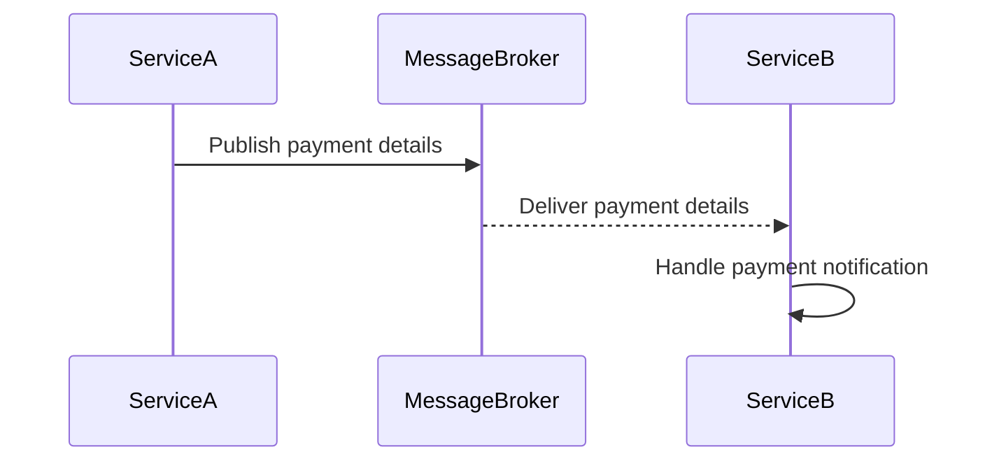
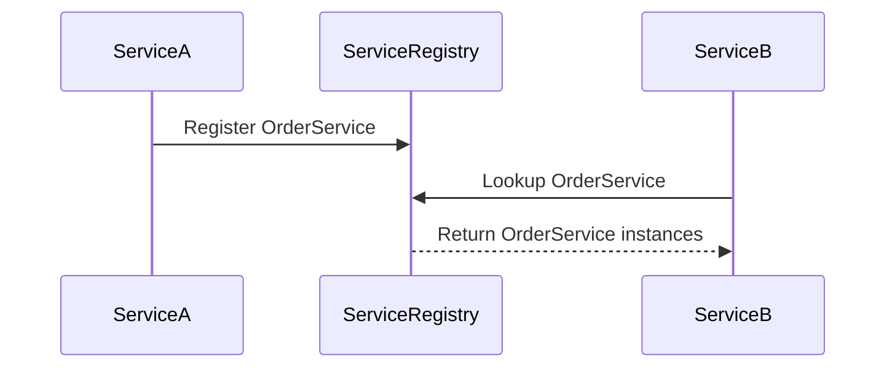
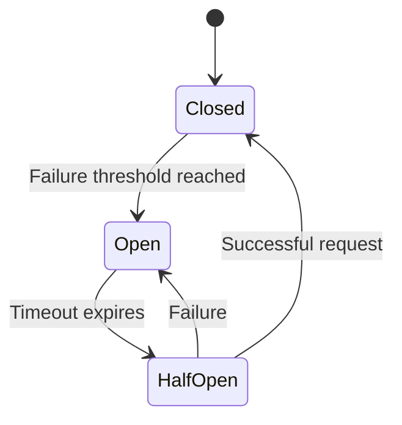

## 2.2. Communication in Microservices

In the realm of microservices architecture, communication is a cornerstone that determines the efficiency and reliability of the entire system. As we delve into this section, we will explore the various communication patterns that facilitate interaction between microservices. We will cover both synchronous and asynchronous communication, service discovery mechanisms, and strategies for resilience, such as circuit breakers. Let's embark on this journey to understand how microservices communicate effectively.

### Synchronous Communication

Synchronous communication in microservices involves direct interaction between services, where a request is sent, and a response is expected within a certain timeframe. This pattern is commonly implemented using RESTful APIs and Remote Procedure Calls (RPC).

#### RESTful APIs

RESTful APIs are a popular choice for synchronous communication due to their simplicity and compatibility with HTTP. They enable services to expose endpoints that other services can call to perform operations or retrieve data.

**Key Characteristics of RESTful APIs:**

- **Statelessness:** Each request from a client contains all the information needed to process the request.
- **Resource-Based:** Operations are performed on resources identified by URIs.
- **HTTP Methods:** Common methods include GET, POST, PUT, DELETE, etc.

**Pseudocode Example: RESTful API Communication**

```pseudocode
// Service A: Order Service
function getOrderDetails(orderId):
    // Construct the URL for the Order API
    url = "http://orderservice/api/orders/" + orderId
    // Make a GET request to the Order API
    response = http.get(url)
    // Return the response data
    return response.data

// Service B: Inventory Service
function updateInventory(productId, quantity):
    // Construct the URL for the Inventory API
    url = "http://inventoryservice/api/products/" + productId
    // Create the payload for the update
    payload = { "quantity": quantity }
    // Make a PUT request to update the inventory
    response = http.put(url, payload)
    // Return the response status
    return response.status
```

In this example, Service A retrieves order details using a GET request, while Service B updates inventory using a PUT request. Both services communicate synchronously, waiting for a response before proceeding.

#### Remote Procedure Calls (RPC)

RPC is another synchronous communication method where a service calls a procedure (function) hosted by another service. Unlike REST, RPC focuses on executing functions rather than manipulating resources.

**Key Characteristics of RPC:**

- **Function-Oriented:** Emphasizes calling functions or methods.
- **Protocol Flexibility:** Can use various protocols like gRPC, Thrift, etc.
- **Tight Coupling:** Often results in tighter coupling compared to REST.

**Pseudocode Example: RPC Communication**

```pseudocode
// Service A: User Service
function getUserProfile(userId):
    // Call the getUserProfile function on the Profile Service
    profile = rpc.call("ProfileService.getUserProfile", userId)
    // Return the user profile
    return profile

// Service B: Profile Service
function getUserProfile(userId):
    // Retrieve user profile from the database
    profile = database.query("SELECT * FROM profiles WHERE userId = ?", userId)
    // Return the profile data
    return profile
```

In this example, Service A calls a function on Service B to retrieve a user profile. The RPC mechanism abstracts the network communication, making it appear as a local function call.

#### Visualizing Synchronous Communication



**Diagram Description:** This sequence diagram illustrates a client making a synchronous request to Service A, which in turn makes an RPC call to Service B. The response flows back to the client, completing the synchronous interaction.

### Asynchronous Communication

Asynchronous communication allows services to interact without waiting for an immediate response. This pattern is essential for decoupling services and enhancing system resilience. Messaging systems and event-driven architectures are common implementations.

#### Messaging Systems

Messaging systems enable services to exchange messages through a broker, allowing for asynchronous communication. This pattern is ideal for scenarios where immediate responses are not required.

**Key Characteristics of Messaging Systems:**

- **Decoupling:** Services are decoupled, reducing dependencies.
- **Scalability:** Supports high throughput and scalability.
- **Reliability:** Ensures message delivery even if services are temporarily unavailable.

**Pseudocode Example: Messaging System Communication**

```pseudocode
// Service A: Payment Service
function processPayment(paymentDetails):
    // Publish payment details to the Payment Queue
    messageBroker.publish("PaymentQueue", paymentDetails)

// Service B: Notification Service
function onPaymentReceived():
    // Subscribe to the Payment Queue
    messageBroker.subscribe("PaymentQueue", handlePaymentNotification)

function handlePaymentNotification(paymentDetails):
    // Send notification based on payment details
    notificationService.send("Payment received for order " + paymentDetails.orderId)
```

In this example, Service A publishes payment details to a queue, while Service B subscribes to the queue and handles notifications asynchronously.

#### Event-Driven Architectures

Event-driven architectures leverage events to trigger actions across services. This pattern is highly effective for building reactive systems that respond to changes in real-time.

**Key Characteristics of Event-Driven Architectures:**

- **Event Producers and Consumers:** Services act as producers and consumers of events.
- **Loose Coupling:** Services are loosely coupled, enhancing flexibility.
- **Scalability:** Supports dynamic scaling based on event load.

**Pseudocode Example: Event-Driven Communication**

```pseudocode
// Service A: Order Service
function placeOrder(orderDetails):
    // Save order to the database
    database.save(orderDetails)
    // Publish an OrderPlaced event
    eventBus.publish("OrderPlaced", orderDetails)

// Service B: Shipping Service
function onOrderPlaced():
    // Subscribe to the OrderPlaced event
    eventBus.subscribe("OrderPlaced", handleOrderPlaced)

function handleOrderPlaced(orderDetails):
    // Initiate shipping process for the order
    shippingService.initiate(orderDetails)
```

In this example, Service A publishes an `OrderPlaced` event after saving an order, while Service B subscribes to the event and initiates the shipping process.

#### Visualizing Asynchronous Communication



**Diagram Description:** This sequence diagram illustrates Service A publishing a message to a broker, which then delivers the message to Service B. Service B processes the message asynchronously, demonstrating decoupled communication.

### Service Discovery

In a microservices architecture, services are often deployed across dynamic environments where instances can scale up or down. Service discovery mechanisms enable services to locate each other dynamically.

#### Key Concepts in Service Discovery

- **Service Registry:** A centralized database that maintains a list of available service instances.
- **Service Registration:** Services register themselves with the registry upon startup.
- **Service Lookup:** Services query the registry to find other services.

**Pseudocode Example: Service Discovery**

```pseudocode
// Service A: Register with Service Registry
function registerService():
    // Register service instance with the registry
    serviceRegistry.register("OrderService", instanceDetails)

// Service B: Discover Service
function discoverOrderService():
    // Query the registry for OrderService instances
    instances = serviceRegistry.lookup("OrderService")
    // Return the list of instances
    return instances
```

In this example, Service A registers itself with a service registry, while Service B queries the registry to discover available instances of the Order Service.

#### Visualizing Service Discovery



**Diagram Description:** This sequence diagram illustrates Service A registering with a service registry and Service B querying the registry to discover available instances. The registry facilitates dynamic service discovery.

### Circuit Breakers and Resilience

In distributed systems, failures are inevitable. Circuit breakers are a resilience pattern that prevents cascading failures by detecting and handling faults gracefully.

#### Key Concepts of Circuit Breakers

- **Closed State:** Requests are allowed through until a failure threshold is reached.
- **Open State:** Requests are blocked for a specified period after failures exceed the threshold.
- **Half-Open State:** A limited number of requests are allowed to test if the service has recovered.

**Pseudocode Example: Circuit Breaker Implementation**

```pseudocode
// Circuit Breaker for Service A
class CircuitBreaker:
    state = "CLOSED"
    failureCount = 0
    failureThreshold = 5
    timeout = 30 // seconds

    function callService(request):
        if state == "OPEN":
            if currentTime() - lastFailureTime > timeout:
                state = "HALF_OPEN"
            else:
                return "Service unavailable"

        response = service.call(request)

        if response.isSuccessful():
            if state == "HALF_OPEN":
                state = "CLOSED"
            failureCount = 0
            return response.data
        else:
            failureCount += 1
            if failureCount >= failureThreshold:
                state = "OPEN"
                lastFailureTime = currentTime()
            return "Service failed"
```

In this example, a circuit breaker monitors the success of service calls. If failures exceed a threshold, the circuit breaker opens, blocking further requests until the service is deemed healthy.

#### Visualizing Circuit Breakers



**Diagram Description:** This state diagram illustrates the transitions between the states of a circuit breaker. It starts in a closed state, transitions to open upon reaching a failure threshold, and tests recovery in a half-open state.

### Try It Yourself

To deepen your understanding of communication patterns in microservices, try modifying the pseudocode examples provided:

1. **RESTful API Example:** Add error handling for network failures.
2. **RPC Example:** Implement a retry mechanism for failed calls.
3. **Messaging System Example:** Introduce a delay in message processing to simulate real-world scenarios.
4. **Event-Driven Example:** Add a new service that listens to the same event and performs a different action.
5. **Service Discovery Example:** Implement a mechanism to deregister services upon shutdown.
6. **Circuit Breaker Example:** Adjust the failure threshold and observe the impact on service availability.

### Knowledge Check

- Explain the difference between synchronous and asynchronous communication in microservices.
- Describe the role of a service registry in service discovery.
- Discuss the benefits of using circuit breakers in a microservices architecture.

### Embrace the Journey

Remember, mastering communication in microservices is a journey. As you experiment with different patterns, you'll gain insights into designing resilient and scalable systems. Keep exploring, stay curious, and enjoy the process of building robust microservices architectures!

## Quiz Time!



### What is a key characteristic of RESTful APIs?

- [x] Statelessness
- [ ] Stateful interactions
- [ ] Tight coupling
- [ ] Event-driven

> **Explanation:** RESTful APIs are stateless, meaning each request contains all the information needed to process it.

### Which communication pattern is best for decoupling services?

- [ ] Synchronous communication
- [x] Asynchronous communication
- [ ] RPC
- [ ] RESTful APIs

> **Explanation:** Asynchronous communication decouples services, allowing them to operate independently.

### What is the role of a service registry?

- [x] Maintain a list of available service instances
- [ ] Execute remote procedures
- [ ] Handle synchronous requests
- [ ] Store event logs

> **Explanation:** A service registry maintains a list of available service instances for dynamic discovery.

### In a circuit breaker pattern, what does the "open" state signify?

- [ ] Requests are allowed through
- [x] Requests are blocked
- [ ] Requests are retried
- [ ] Requests are logged

> **Explanation:** In the "open" state, requests are blocked to prevent further failures.

### What is a benefit of using messaging systems in microservices?

- [x] Decoupling services
- [ ] Tight coupling
- [x] Scalability
- [ ] Immediate responses

> **Explanation:** Messaging systems decouple services and support scalability by allowing asynchronous communication.

### How does an event-driven architecture enhance scalability?

- [x] By allowing services to react to events independently
- [ ] By tightly coupling services
- [ ] By using synchronous requests
- [ ] By centralizing service logic

> **Explanation:** Event-driven architectures enhance scalability by allowing services to react to events independently.

### What is a common protocol used for RPC?

- [x] gRPC
- [ ] HTTP
- [x] Thrift
- [ ] WebSockets

> **Explanation:** gRPC and Thrift are common protocols used for RPC communication.

### Which state in a circuit breaker allows limited requests to test recovery?

- [ ] Closed
- [ ] Open
- [x] Half-Open
- [ ] Failed

> **Explanation:** The "half-open" state allows limited requests to test if the service has recovered.

### What is a key advantage of using RESTful APIs?

- [x] Resource-based operations
- [ ] Function-oriented calls
- [ ] Tight coupling
- [ ] Stateful interactions

> **Explanation:** RESTful APIs are resource-based, focusing on operations on resources identified by URIs.

### True or False: Service discovery is only necessary in static environments.

- [ ] True
- [x] False

> **Explanation:** Service discovery is crucial in dynamic environments where service instances can change frequently.


