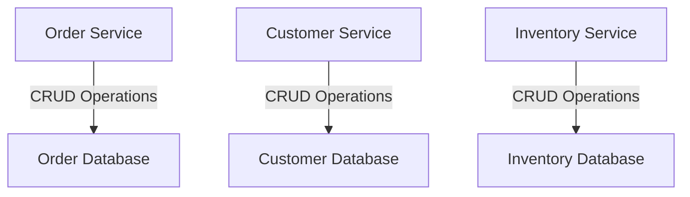
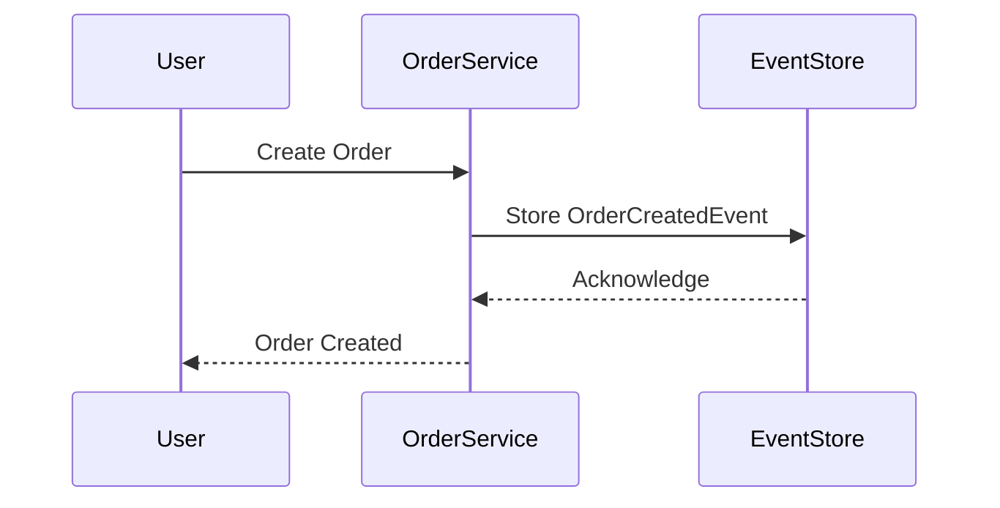
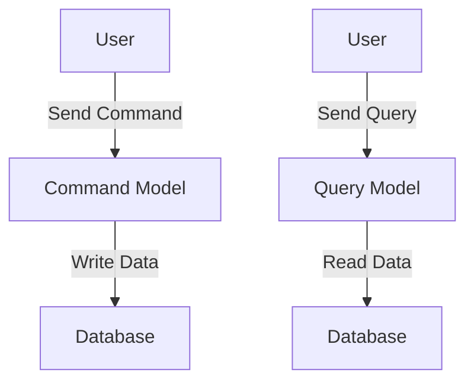

## 2.3. Data Management in Microservices

In the realm of microservices architecture, data management is a pivotal aspect that dictates the efficiency, scalability, and reliability of the system. As we transition from monolithic architectures to microservices, the way we handle data must evolve to accommodate the decentralized nature of these systems. In this section, we will delve into three fundamental data management patterns in microservices: Database Per Service, Event Sourcing, and Command Query Responsibility Segregation (CQRS). Each pattern addresses specific challenges and offers unique benefits, which we will explore in detail.

### Database Per Service Pattern

**Intent:** The Database Per Service pattern aims to encapsulate data within each microservice, ensuring that each service has its own database. This pattern promotes loose coupling and allows services to evolve independently.

#### Key Participants

- **Microservice:** A self-contained unit that performs a specific business function.
- **Database:** A dedicated data store for each microservice.

#### Applicability

- When services need to scale independently.
- When different services require different data storage technologies.
- When data encapsulation and autonomy are priorities.

#### Sample Code Snippets

```pseudocode
// Define a microservice with its own database
Microservice OrderService {
    Database orderDB

    Function createOrder(orderData) {
        // Logic to create an order
        orderDB.insert(orderData)
    }

    Function getOrder(orderId) {
        // Logic to retrieve an order
        return orderDB.query(orderId)
    }
}
```

#### Design Considerations

- **Data Consistency:** With separate databases, achieving consistency across services can be challenging. Consider using eventual consistency models.
- **Data Duplication:** Some data may need to be duplicated across services, leading to potential synchronization issues.
- **Technology Diversity:** Each service can choose the most suitable database technology, but this can increase the complexity of the system.

#### Visualizing Database Per Service Pattern



*Diagram: Each microservice has its own dedicated database, promoting data encapsulation and autonomy.*

### Event Sourcing

**Intent:** Event Sourcing is a pattern where state changes are stored as a sequence of events. Instead of storing the current state, the system records every change as an event, allowing the reconstruction of the state at any point in time.

#### Key Participants

- **Event Store:** A specialized database that stores events.
- **Event:** A record of a state change.
- **Aggregate:** A domain-driven design concept that represents a cluster of domain objects.

#### Applicability

- When auditability and traceability of changes are required.
- When the ability to reconstruct past states is necessary.
- When complex business logic needs to be captured as events.

#### Sample Code Snippets

```pseudocode
// Define an event store
EventStore orderEventStore

// Define an aggregate for order
Aggregate Order {
    List<Event> events

    Function applyEvent(event) {
        // Apply the event to the aggregate
        events.append(event)
    }

    Function getCurrentState() {
        // Reconstruct the current state from events
        state = initialState
        for event in events {
            state = apply(event, state)
        }
        return state
    }
}

// Example of storing an event
Function createOrder(orderData) {
    event = new OrderCreatedEvent(orderData)
    orderEventStore.save(event)
    order.applyEvent(event)
}
```

#### Design Considerations

- **Eventual Consistency:** Systems using event sourcing often rely on eventual consistency models.
- **Storage Requirements:** Storing all events can lead to significant storage requirements.
- **Complexity:** Reconstructing state from events can be complex and requires careful design.

#### Visualizing Event Sourcing



*Diagram: The process of creating an order involves storing an event in the event store, which can later be used to reconstruct the order's state.*

### Command Query Responsibility Segregation (CQRS)

**Intent:** CQRS is a pattern that separates the read and write operations of a system into distinct models. This separation allows for optimization of each model according to its specific needs.

#### Key Participants

- **Command Model:** Handles write operations and enforces business rules.
- **Query Model:** Handles read operations and is optimized for data retrieval.

#### Applicability

- When read and write workloads have different performance requirements.
- When complex business logic needs to be enforced during writes.
- When scalability and performance are critical.

#### Sample Code Snippets

```pseudocode
// Define a command model for order
CommandModel OrderCommandModel {
    Function createOrder(orderData) {
        // Validate and process the order
        if (isValid(orderData)) {
            saveOrder(orderData)
        }
    }
}

// Define a query model for order
QueryModel OrderQueryModel {
    Function getOrder(orderId) {
        // Retrieve order data optimized for reading
        return queryOrder(orderId)
    }
}
```

#### Design Considerations

- **Consistency:** Ensuring consistency between command and query models can be challenging.
- **Complexity:** The separation of models can increase the complexity of the system.
- **Latency:** There may be a delay between a command being processed and the query model being updated.

#### Visualizing CQRS



*Diagram: The command model handles write operations, while the query model handles read operations, each optimized for their specific tasks.*

### Try It Yourself

To deepen your understanding of these patterns, try modifying the pseudocode examples provided:

1. **Database Per Service:** Add a new microservice with its own database and implement CRUD operations.
2. **Event Sourcing:** Implement a new event type and modify the aggregate to handle it.
3. **CQRS:** Create a new query model optimized for a specific read operation.

### Knowledge Check

- Explain the benefits and challenges of the Database Per Service pattern.
- Describe how Event Sourcing can improve auditability and traceability.
- Discuss the advantages of separating read and write models in CQRS.

### Embrace the Journey

Remember, mastering data management in microservices is a journey. As you explore these patterns, you'll gain insights into their strengths and limitations. Keep experimenting, stay curious, and enjoy the process of building robust and scalable microservices architectures.

## Quiz Time!



### What is the primary benefit of the Database Per Service pattern?

- [x] Data encapsulation and service autonomy
- [ ] Reduced data duplication
- [ ] Simplified data consistency
- [ ] Centralized data management

> **Explanation:** The Database Per Service pattern ensures that each microservice has its own database, promoting data encapsulation and service autonomy.

### In Event Sourcing, what is stored instead of the current state?

- [x] A sequence of events
- [ ] The final state
- [ ] A snapshot of the state
- [ ] A log of transactions

> **Explanation:** Event Sourcing stores state changes as a sequence of events, allowing the reconstruction of the state at any point in time.

### What does CQRS stand for?

- [x] Command Query Responsibility Segregation
- [ ] Command Queue Response System
- [ ] Central Query Resource System
- [ ] Command Query Resource Segmentation

> **Explanation:** CQRS stands for Command Query Responsibility Segregation, a pattern that separates read and write operations into distinct models.

### Which pattern is best suited for systems requiring auditability and traceability?

- [x] Event Sourcing
- [ ] Database Per Service
- [ ] CQRS
- [ ] Shared Database

> **Explanation:** Event Sourcing is ideal for systems requiring auditability and traceability, as it records every state change as an event.

### What is a key challenge of the Database Per Service pattern?

- [x] Data consistency across services
- [ ] Lack of data encapsulation
- [ ] Inability to scale independently
- [ ] Centralized data management

> **Explanation:** A key challenge of the Database Per Service pattern is ensuring data consistency across services, as each service has its own database.

### How does CQRS optimize read and write operations?

- [x] By separating them into distinct models
- [ ] By using a single model for both
- [ ] By centralizing data management
- [ ] By reducing data duplication

> **Explanation:** CQRS optimizes read and write operations by separating them into distinct models, each tailored to its specific needs.

### What is a potential drawback of Event Sourcing?

- [x] Increased storage requirements
- [ ] Simplified state reconstruction
- [ ] Reduced auditability
- [ ] Centralized data management

> **Explanation:** A potential drawback of Event Sourcing is the increased storage requirements due to storing all events.

### Which pattern allows services to choose different data storage technologies?

- [x] Database Per Service
- [ ] Event Sourcing
- [ ] CQRS
- [ ] Shared Database

> **Explanation:** The Database Per Service pattern allows each service to choose the most suitable data storage technology.

### What is the role of an aggregate in Event Sourcing?

- [x] To represent a cluster of domain objects
- [ ] To store the current state
- [ ] To handle read operations
- [ ] To centralize data management

> **Explanation:** In Event Sourcing, an aggregate represents a cluster of domain objects and applies events to reconstruct the current state.

### True or False: CQRS can lead to increased system complexity.

- [x] True
- [ ] False

> **Explanation:** True. CQRS can lead to increased system complexity due to the separation of read and write models.


