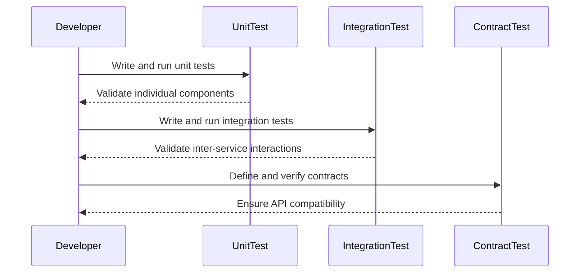

## 2.4. Testing Microservices

Testing microservices is a critical aspect of ensuring that your application is robust, reliable, and scalable. As microservices architecture involves multiple independently deployable services, testing becomes more complex compared to monolithic applications. In this section, we will delve into the various testing strategies that are essential for microservices, including unit testing, integration testing, and contract testing. We will explore how these testing methodologies help in maintaining the integrity of microservices and provide pseudocode examples to illustrate these concepts.

### Introduction to Testing Microservices

Testing in a microservices architecture involves validating the functionality, performance, and reliability of each service and their interactions. Unlike monolithic applications, where testing can be more straightforward, microservices require a more nuanced approach due to their distributed nature. The goal is to ensure that each service performs its intended function and that the system as a whole operates seamlessly.

#### Key Challenges in Testing Microservices

1. **Service Independence**: Each microservice is an independent unit, which means testing needs to ensure that changes in one service do not adversely affect others.
2. **Inter-Service Communication**: Microservices often communicate over the network, introducing potential points of failure that need to be tested.
3. **Data Consistency**: Ensuring data consistency across services can be challenging, especially when services have their own databases.
4. **Deployment Complexity**: With multiple services, deployment and testing environments can become complex, requiring robust automation.

### Unit Testing in Microservices

Unit testing focuses on testing individual components or functions of a microservice in isolation. The primary objective is to validate that each unit of the service performs as expected. Unit tests are typically written by developers and are the first line of defense against bugs.

#### Benefits of Unit Testing

- **Early Bug Detection**: Identifies issues early in the development cycle.
- **Code Quality**: Encourages better code design and modularity.
- **Documentation**: Serves as documentation for the codebase.

#### Writing Unit Tests

Unit tests should be small, fast, and independent. They should not rely on external systems such as databases or network calls. Instead, use mocking to simulate these dependencies.

```pseudocode
// Pseudocode for a simple unit test
function testCalculateTotal() {
    // Arrange
    let order = new Order();
    order.addItem(new Item("Book", 10));
    order.addItem(new Item("Pen", 2));

    // Act
    let total = order.calculateTotal();

    // Assert
    assertEqual(total, 12);
}
```

In this example, we are testing the `calculateTotal` function of an `Order` class. The test ensures that the total calculation is correct when items are added to the order.

#### Mocking Dependencies

Mocking is crucial in unit testing microservices to isolate the unit under test. By mocking external dependencies, we can focus on the logic within the service.

```pseudocode
// Pseudocode for mocking a database call
function testGetUserName() {
    // Arrange
    let userService = new UserService();
    mock(userService.database, "getUserById").returns({ id: 1, name: "Alice" });

    // Act
    let userName = userService.getUserName(1);

    // Assert
    assertEqual(userName, "Alice");
}
```

### Integration Testing in Microservices

Integration testing involves testing the interactions between different services or components. The goal is to ensure that services work together as expected.

#### Importance of Integration Testing

- **Inter-Service Communication**: Validates that services can communicate and exchange data correctly.
- **End-to-End Scenarios**: Tests real-world use cases that span multiple services.
- **Error Handling**: Ensures that services handle errors gracefully when interacting with others.

#### Writing Integration Tests

Integration tests often require a more complex setup than unit tests, as they involve multiple services and possibly external systems.

```pseudocode
// Pseudocode for an integration test
function testOrderProcessing() {
    // Arrange
    let orderService = new OrderService();
    let paymentService = new PaymentService();
    let notificationService = new NotificationService();

    // Act
    let orderId = orderService.createOrder({ items: ["Book", "Pen"] });
    let paymentResult = paymentService.processPayment(orderId, 12);
    let notificationResult = notificationService.sendConfirmation(orderId);

    // Assert
    assertTrue(paymentResult.success);
    assertTrue(notificationResult.sent);
}
```

In this example, we are testing the integration of order processing, payment, and notification services. The test ensures that an order can be created, paid for, and confirmed.

#### Handling External Dependencies

When writing integration tests, it's important to manage external dependencies, such as databases or third-party APIs. This can be done using test doubles or dedicated test environments.

### Contract Testing in Microservices

Contract testing is a technique used to ensure that services adhere to the agreed-upon API contracts. This is particularly important in microservices, where services are developed and deployed independently.

#### Why Contract Testing?

- **API Stability**: Ensures that changes to a service do not break its consumers.
- **Independent Development**: Allows teams to work independently without fear of breaking integrations.
- **Automated Verification**: Provides automated checks for API compatibility.

#### Implementing Contract Tests

Contract tests can be implemented using consumer-driven contracts, where the consumer defines the expected API behavior, and the provider must adhere to it.

```pseudocode
// Pseudocode for a contract test
function testUserServiceContract() {
    // Consumer defines the expected contract
    let expectedContract = {
        getUser: {
            request: { userId: 1 },
            response: { id: 1, name: "Alice" }
        }
    };

    // Provider verifies the contract
    let actualResponse = userService.getUser(1);
    assertEqual(actualResponse, expectedContract.getUser.response);
}
```

In this example, the consumer defines the expected response for a `getUser` API call. The provider then verifies that the actual response matches the expected contract.

### Visualizing Testing Strategies

To better understand the testing strategies in microservices, let's visualize the interactions between unit, integration, and contract testing using a sequence diagram.



This diagram illustrates the flow of testing activities, starting with unit tests, followed by integration tests, and finally contract tests.

### Best Practices for Testing Microservices

1. **Automate Tests**: Use continuous integration (CI) pipelines to automate the execution of tests.
2. **Isolate Tests**: Ensure that tests do not depend on each other and can be run independently.
3. **Use Test Doubles**: Employ mocks, stubs, and fakes to simulate external dependencies.
4. **Monitor Test Coverage**: Track test coverage to ensure that all critical paths are tested.
5. **Test in Production**: Use canary releases and feature toggles to test changes in production environments safely.

### Try It Yourself

To deepen your understanding of testing microservices, try modifying the pseudocode examples provided. For instance, add new test cases to handle edge cases or introduce additional services in the integration test example. Experiment with different mocking frameworks to see how they can simplify your unit tests.

### Knowledge Check

Before moving on, let's summarize the key takeaways:

- **Unit Testing**: Focuses on testing individual components in isolation.
- **Integration Testing**: Validates interactions between services.
- **Contract Testing**: Ensures services adhere to API contracts.

### Conclusion

Testing microservices is a complex but essential task to ensure the reliability and scalability of your application. By employing unit, integration, and contract testing strategies, you can build a robust testing framework that supports the independent development and deployment of microservices.

## Quiz Time!



### What is the primary goal of unit testing in microservices?

- [x] To test individual components in isolation
- [ ] To test the interactions between services
- [ ] To ensure API contracts are met
- [ ] To test the entire system end-to-end

> **Explanation:** Unit testing focuses on testing individual components or functions of a microservice in isolation.

### Which testing strategy is used to verify interactions between different services?

- [ ] Unit Testing
- [x] Integration Testing
- [ ] Contract Testing
- [ ] System Testing

> **Explanation:** Integration testing involves testing the interactions between different services or components.

### What is the purpose of contract testing in microservices?

- [ ] To test individual components in isolation
- [ ] To test the entire system end-to-end
- [x] To ensure services adhere to API contracts
- [ ] To test the performance of services

> **Explanation:** Contract testing ensures that services adhere to the agreed-upon API contracts.

### What is a common tool used for mocking dependencies in unit tests?

- [ ] Docker
- [ ] Kubernetes
- [x] Mocking Frameworks
- [ ] Load Balancers

> **Explanation:** Mocking frameworks are commonly used to simulate external dependencies in unit tests.

### Which of the following is a benefit of unit testing?

- [x] Early bug detection
- [ ] Validating inter-service communication
- [ ] Ensuring API compatibility
- [ ] Testing real-world use cases

> **Explanation:** Unit testing helps in early bug detection by identifying issues early in the development cycle.

### What is a key challenge in testing microservices?

- [x] Service Independence
- [ ] Lack of automation tools
- [ ] Limited test environments
- [ ] Monolithic architecture

> **Explanation:** Service independence is a key challenge in testing microservices, as each service is an independent unit.

### How can integration tests handle external dependencies?

- [ ] By ignoring them
- [ ] By using real production systems
- [x] By using test doubles or dedicated test environments
- [ ] By running tests manually

> **Explanation:** Integration tests can handle external dependencies by using test doubles or dedicated test environments.

### What is a best practice for testing microservices?

- [x] Automate Tests
- [ ] Test manually
- [ ] Ignore test coverage
- [ ] Avoid using mocks

> **Explanation:** Automating tests is a best practice for testing microservices, as it ensures consistent and efficient test execution.

### What is the role of a consumer in contract testing?

- [ ] To provide the actual API implementation
- [x] To define the expected API behavior
- [ ] To test individual components
- [ ] To deploy services

> **Explanation:** In contract testing, the consumer defines the expected API behavior, which the provider must adhere to.

### True or False: Integration testing is used to test individual components in isolation.

- [ ] True
- [x] False

> **Explanation:** Integration testing is used to verify interactions between services, not to test individual components in isolation.



Remember, this is just the beginning. As you progress, you'll build more complex and interactive microservices. Keep experimenting, stay curious, and enjoy the journey!
