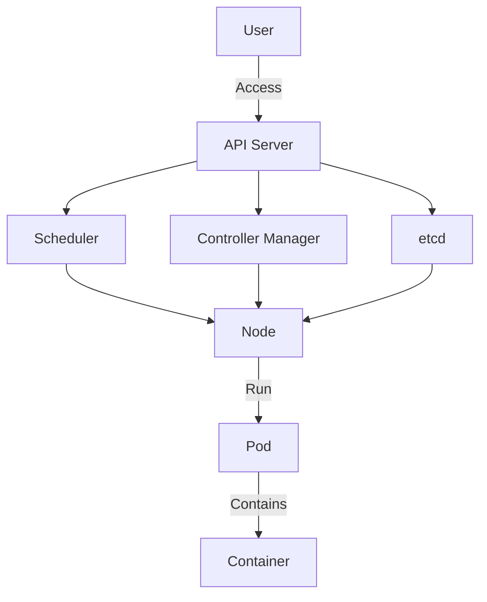
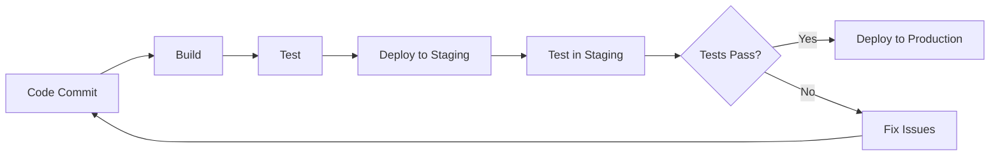

## 2.5. Deployment Strategies

In the realm of microservices, deployment strategies are crucial for ensuring that services are delivered efficiently, reliably, and at scale. This section delves into the core deployment strategies, focusing on containers and orchestration, as well as Continuous Integration and Continuous Deployment (CI/CD) pipelines. By the end of this section, you will have a comprehensive understanding of how to deploy microservices effectively using modern tools and practices.

### Containers and Orchestration

Containers have revolutionized the way we deploy applications by providing a consistent environment across development, testing, and production. Orchestration tools like Kubernetes further enhance this by managing containerized applications at scale.

#### Using Docker for Containerization

Docker is a platform that allows developers to package applications and their dependencies into a standardized unit called a container. Containers are lightweight, portable, and ensure consistency across different environments.

**Key Concepts of Docker:**

- **Images:** Immutable snapshots of a container's file system. They are built from a Dockerfile and can be shared via Docker Hub.
- **Containers:** Running instances of Docker images. They are isolated from each other and the host system.
- **Dockerfile:** A script containing a series of instructions on how to build a Docker image.

**Sample Dockerfile:**

```dockerfile
FROM python:3.8-slim

WORKDIR /app

COPY . /app

RUN pip install --no-cache-dir -r requirements.txt

EXPOSE 80

CMD ["python", "app.py"]
```

**Explanation:**

- **FROM:** Specifies the base image to use.
- **WORKDIR:** Sets the working directory inside the container.
- **COPY:** Copies files from the host to the container.
- **RUN:** Executes commands in the container.
- **EXPOSE:** Informs Docker that the container listens on the specified network ports at runtime.
- **CMD:** Provides the default command to run when the container starts.

#### Orchestrating Containers with Kubernetes

Kubernetes is an open-source platform designed to automate deploying, scaling, and operating application containers. It provides a robust framework for running distributed systems resiliently.

**Key Concepts of Kubernetes:**

- **Pods:** The smallest deployable units in Kubernetes, which can contain one or more containers.
- **Nodes:** Machines (physical or virtual) that run containerized applications.
- **Clusters:** A set of nodes managed by Kubernetes.
- **Services:** An abstraction that defines a logical set of Pods and a policy by which to access them.
- **Deployments:** A higher-level abstraction that manages Pods and ReplicaSets.

**Sample Kubernetes Deployment Configuration:**

```yaml
apiVersion: apps/v1
kind: Deployment
metadata:
  name: my-app
spec:
  replicas: 3
  selector:
    matchLabels:
      app: my-app
  template:
    metadata:
      labels:
        app: my-app
    spec:
      containers:
      - name: my-app
        image: my-app:1.0
        ports:
        - containerPort: 80
```

**Explanation:**

- **apiVersion:** Specifies the API version.
- **kind:** The type of Kubernetes object (e.g., Deployment).
- **metadata:** Contains data that helps uniquely identify the object, including a name string.
- **spec:** Describes the desired state of the object.
- **replicas:** Number of desired Pod replicas.
- **selector:** Defines how the Deployment finds which Pods to manage.
- **template:** Describes the Pods that will be created.

#### Visualizing Container Orchestration

To better understand how Kubernetes orchestrates containers, let's visualize the architecture:



**Description:** This diagram illustrates the interaction between different components in a Kubernetes cluster. The API Server is the central management entity that communicates with the Scheduler, Controller Manager, and etcd (a key-value store for configuration data). Nodes run the Pods, which contain the containers.

### Continuous Integration/Continuous Deployment (CI/CD)

CI/CD is a method to frequently deliver apps to customers by introducing automation into the stages of app development. The main concepts attributed to CI/CD are Continuous Integration, Continuous Delivery, and Continuous Deployment.

#### Continuous Integration (CI)

Continuous Integration is a development practice where developers integrate code into a shared repository frequently, preferably several times a day. Each integration can then be verified by an automated build and automated tests.

**Key Steps in CI:**

1. **Code Commit:** Developers commit code changes to a shared repository.
2. **Automated Build:** A build server automatically compiles the code.
3. **Automated Testing:** Automated tests are run to ensure code quality.
4. **Feedback:** Developers receive immediate feedback on the build status.

**Sample CI Pipeline Configuration (Pseudocode):**

```pseudocode
pipeline {
    agent any
    stages {
        stage('Build') {
            steps {
                echo 'Building...'
                sh 'make build'
            }
        }
        stage('Test') {
            steps {
                echo 'Testing...'
                sh 'make test'
            }
        }
        stage('Deploy') {
            steps {
                echo 'Deploying...'
                sh 'make deploy'
            }
        }
    }
}
```

**Explanation:**

- **pipeline:** Defines the entire CI/CD pipeline.
- **agent:** Specifies where the pipeline should run.
- **stages:** Contains a sequence of stages to be executed.
- **steps:** Defines the individual steps within a stage.

#### Continuous Deployment (CD)

Continuous Deployment is an extension of Continuous Delivery that automatically deploys every change that passes the automated tests to production. This means that on a successful build, the application is automatically deployed to production without human intervention.

**Key Steps in CD:**

1. **Automated Deployment:** Deploy the application to a staging environment.
2. **Automated Testing:** Run additional tests in the staging environment.
3. **Production Deployment:** Automatically deploy to production if tests pass.

**Sample CD Pipeline Configuration (Pseudocode):**

```pseudocode
pipeline {
    agent any
    stages {
        stage('Deploy to Staging') {
            steps {
                echo 'Deploying to Staging...'
                sh 'make deploy-staging'
            }
        }
        stage('Test in Staging') {
            steps {
                echo 'Testing in Staging...'
                sh 'make test-staging'
            }
        }
        stage('Deploy to Production') {
            steps {
                echo 'Deploying to Production...'
                sh 'make deploy-production'
            }
        }
    }
}
```

**Explanation:**

- **Deploy to Staging:** Deploys the application to a staging environment for testing.
- **Test in Staging:** Runs tests in the staging environment to ensure everything works as expected.
- **Deploy to Production:** Automatically deploys the application to production if staging tests pass.

#### Visualizing CI/CD Pipeline

To better understand the CI/CD process, let's visualize a typical pipeline:



**Description:** This diagram illustrates the flow of a CI/CD pipeline. Code changes are committed, triggering a build. If the build and tests pass, the application is deployed to a staging environment. After successful staging tests, it is deployed to production. If any step fails, issues are fixed, and the process restarts.

### Try It Yourself

To solidify your understanding, try modifying the provided pseudocode examples. For instance, add a new stage to the CI/CD pipeline that performs security checks or integrates with a different deployment tool. Experiment with different configurations in Docker and Kubernetes to see how they affect deployment.

### Knowledge Check

- **What are the benefits of using containers for microservices deployment?**
- **How does Kubernetes help in managing containerized applications?**
- **What are the key differences between Continuous Integration and Continuous Deployment?**
- **How can you ensure that your CI/CD pipeline is secure and reliable?**

### Embrace the Journey

Remember, mastering deployment strategies is a continuous journey. As you progress, you'll encounter new tools and practices that will enhance your ability to deploy microservices efficiently. Keep experimenting, stay curious, and enjoy the journey!

## Quiz Time!



### What is the primary purpose of using Docker in microservices deployment?

- [x] To package applications and their dependencies into a standardized unit
- [ ] To provide a graphical user interface for application management
- [ ] To replace Kubernetes in orchestrating containers
- [ ] To serve as a database management system

> **Explanation:** Docker is used to package applications and their dependencies into containers, ensuring consistency across environments.

### Which Kubernetes component is responsible for running Pods?

- [ ] API Server
- [ ] Scheduler
- [x] Node
- [ ] etcd

> **Explanation:** Nodes are the machines that run the Pods in a Kubernetes cluster.

### What does the `EXPOSE` command do in a Dockerfile?

- [x] Informs Docker that the container listens on the specified network ports
- [ ] Installs necessary software packages
- [ ] Copies files from the host to the container
- [ ] Sets the working directory inside the container

> **Explanation:** The `EXPOSE` command specifies which ports the container will listen on at runtime.

### What is the main goal of Continuous Integration?

- [x] To integrate code into a shared repository frequently and verify it with automated builds and tests
- [ ] To deploy applications directly to production
- [ ] To manage container orchestration
- [ ] To replace manual testing with automated testing

> **Explanation:** Continuous Integration focuses on integrating code changes frequently and verifying them through automated builds and tests.

### In a CI/CD pipeline, what happens if a test fails in the staging environment?

- [ ] The application is automatically deployed to production
- [x] The issues are fixed, and the process restarts
- [ ] The deployment process is skipped
- [ ] The application is rolled back to a previous version

> **Explanation:** If a test fails in the staging environment, issues are fixed, and the process restarts to ensure quality.

### What is a key advantage of using Kubernetes for container orchestration?

- [x] It automates deploying, scaling, and operating application containers
- [ ] It provides a built-in database management system
- [ ] It replaces the need for Docker
- [ ] It eliminates the need for CI/CD pipelines

> **Explanation:** Kubernetes automates the deployment, scaling, and operation of containerized applications, making it a powerful orchestration tool.

### How does Continuous Deployment differ from Continuous Delivery?

- [x] Continuous Deployment automatically deploys every change that passes tests to production
- [ ] Continuous Deployment requires manual approval before deploying to production
- [ ] Continuous Deployment focuses only on the testing phase
- [ ] Continuous Deployment is a subset of Continuous Integration

> **Explanation:** Continuous Deployment automatically deploys changes to production without manual intervention, unlike Continuous Delivery, which may require approval.

### What is the role of the `CMD` instruction in a Dockerfile?

- [x] Provides the default command to run when the container starts
- [ ] Sets environment variables for the container
- [ ] Copies files from the host to the container
- [ ] Installs software packages

> **Explanation:** The `CMD` instruction specifies the default command to run when the container starts.

### Which of the following is NOT a benefit of using CI/CD pipelines?

- [ ] Faster delivery of applications
- [ ] Improved code quality through automated testing
- [ ] Reduced manual intervention in deployment
- [x] Elimination of all software bugs

> **Explanation:** While CI/CD pipelines improve delivery speed and code quality, they do not eliminate all software bugs.

### True or False: Kubernetes can only be used with Docker containers.

- [ ] True
- [x] False

> **Explanation:** Kubernetes can be used with various container runtimes, not just Docker.


